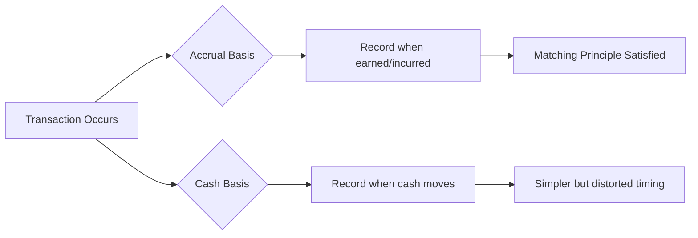
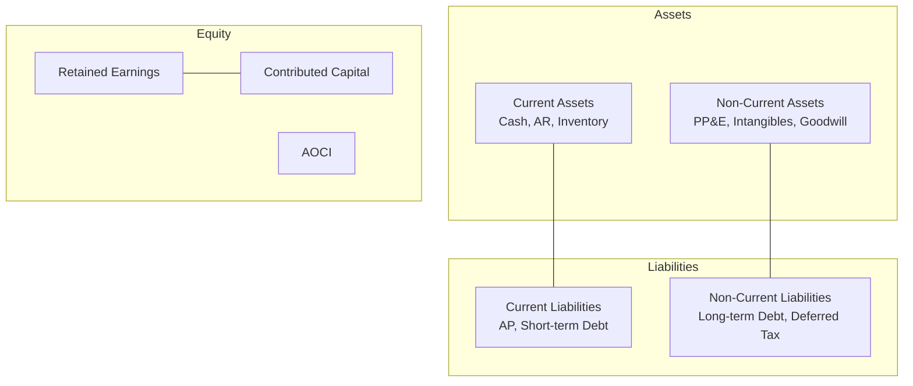
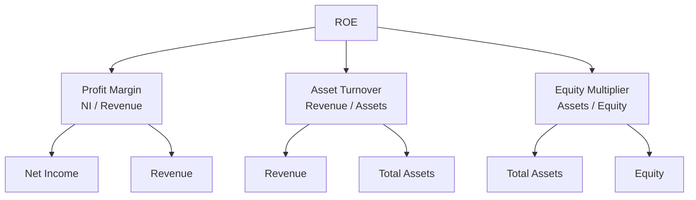

# Financial Accounting

## Part I: The Accounting Equation and Double-Entry Bookkeeping

### The Fundamental Equation

$$A = L + E$$

where $A$ = Assets, $L$ = Liabilities, $E$ = Equity (Owner's/Stockholders').

Every transaction must maintain this balance. Equity expands to:

$$A = L + \text{Contributed Capital} + \text{Retained Earnings}$$

where Retained Earnings $= \text{Beginning RE} + \text{Net Income} - \text{Dividends}$.

### Double-Entry Bookkeeping

Every transaction requires at least one debit and one credit of equal total value.

| Account Type | Debit Effect | Credit Effect |
|---|---|---|
| Assets | Increase | Decrease |
| Liabilities | Decrease | Increase |
| Equity | Decrease | Increase |
| Revenue | Decrease | Increase |
| Expenses | Increase | Decrease |

### Accrual vs Cash Basis

- **Accrual basis**: Revenue recognized when earned; expenses when incurred (GAAP/IFRS required)
- **Cash basis**: Revenue when cash received; expenses when cash paid (small businesses only)

## Part II: Financial Statements

### Income Statement (Statement of Operations)

$$\text{Revenue} - \text{COGS} = \text{Gross Profit}$$

$$\text{Gross Profit} - \text{Operating Expenses} = \text{Operating Income (EBIT)}$$

$$\text{EBIT} - \text{Interest} - \text{Taxes} = \text{Net Income}$$

Gross margin: $\text{GM} = \frac{\text{Gross Profit}}{\text{Revenue}}$

Operating margin: $\text{OM} = \frac{\text{EBIT}}{\text{Revenue}}$

Net margin: $\text{NM} = \frac{\text{Net Income}}{\text{Revenue}}$

### Balance Sheet

### Statement of Cash Flows

Three sections:
1. **Operating activities** — Cash from core business (start with NI, adjust for non-cash items and working capital changes)
2. **Investing activities** — CapEx, acquisitions, asset sales
3. **Financing activities** — Debt issuance/repayment, equity issuance/buyback, dividends

$$\Delta\text{Cash} = \text{CFO} + \text{CFI} + \text{CFF}$$

## Part III: GAAP vs IFRS

| Topic | US GAAP | IFRS |
|---|---|---|
| Framework | Rules-based | Principles-based |
| Inventory | LIFO permitted | LIFO prohibited |
| Development costs | Expensed | Capitalize if criteria met |
| Revenue | ASC 606 (5-step) | IFRS 15 (converged with ASC 606) |
| Impairment | No reversal (except held-for-sale) | Reversal allowed |

### Revenue Recognition — ASC 606 (5-Step Model)

1. Identify the contract
2. Identify performance obligations
3. Determine the transaction price
4. Allocate to performance obligations
5. Recognize revenue as obligations are satisfied

## Part IV: Depreciation

### Straight-Line

$$D = \frac{C - S}{n}$$

where $C$ = cost, $S$ = salvage value, $n$ = useful life in years.

### Double-Declining Balance

$$D_t = \frac{2}{n} \times \text{Book Value}_{t-1}$$

### MACRS (Modified Accelerated Cost Recovery System)

Used for US tax purposes. Prescribed recovery periods (3, 5, 7, 10, 15, 20 years) with fixed depreciation percentages. Half-year convention applies.

## Part V: Ratio Analysis

### Profitability Ratios

$$\text{ROE} = \frac{\text{Net Income}}{E}$$

$$\text{ROA} = \frac{\text{Net Income}}{\text{Total Assets}}$$

DuPont decomposition:

$$\text{ROE} = \underbrace{\frac{NI}{\text{Revenue}}}_{\text{Profit Margin}} \times \underbrace{\frac{\text{Revenue}}{\text{Assets}}}_{\text{Asset Turnover}} \times \underbrace{\frac{\text{Assets}}{E}}_{\text{Equity Multiplier}}$$

### Liquidity Ratios

$$\text{Current Ratio} = \frac{\text{Current Assets}}{\text{Current Liabilities}}$$

$$\text{Quick Ratio} = \frac{\text{Cash + Receivables}}{\text{Current Liabilities}}$$

### Leverage Ratios

$$\text{D/E} = \frac{\text{Total Debt}}{E}$$

$$\text{Interest Coverage} = \frac{\text{EBIT}}{\text{Interest Expense}}$$

### Efficiency Ratios

$$\text{Inventory Turnover} = \frac{\text{COGS}}{\text{Average Inventory}}$$

$$\text{Days Sales Outstanding} = \frac{\text{AR}}{\text{Revenue}/365}$$

## Part VI: Financial Statement Analysis

### Common-Size Analysis
- Vertical: each item as % of revenue (income statement) or total assets (balance sheet)
- Horizontal: year-over-year growth rates

### Quality of Earnings
- Operating cash flow vs net income ratio (should be > 1 over time)
- Accrual ratio: $\frac{NI - CFO}{\text{Average Total Assets}}$ (high = low quality)
- Watch for: channel stuffing, capitalizing operating expenses, cookie jar reserves

### Red Flags
- Revenue growing faster than receivables
- Declining cash flow despite rising income
- Frequent changes in accounting estimates
- Related-party transactions

## References

- Kieso, D.E., Weygandt, J.J., & Warfield, T.D. *Intermediate Accounting* (17th ed.). Wiley.
- Warren, C.S., Reeve, J.M., & Duchac, J.E. *Accounting* (27th ed.). Cengage.
- Horngren, C.T., Sundem, G.L., & Elliott, J.A. *Introduction to Financial Accounting* (12th ed.). Pearson.
- FASB. *Accounting Standards Codification* (ASC 606: Revenue from Contracts with Customers).
