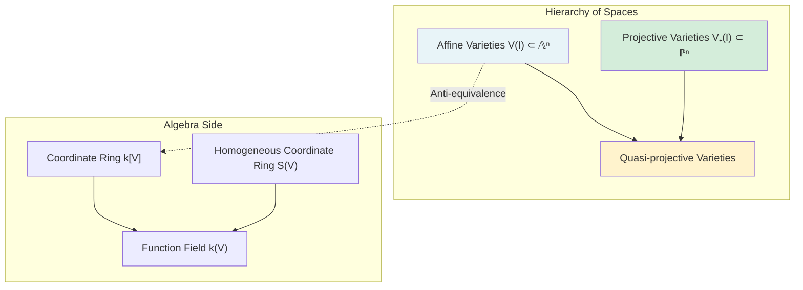
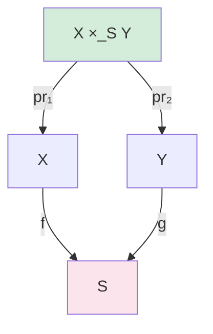

# Algebraic Geometry

Graduate course from classical affine/projective varieties through the modern language of schemes and sheaf cohomology. Assumes commutative algebra background (Noetherian rings, localization, primary decomposition).

---

## Part I: Classical Algebraic Geometry

### Week 1 — Affine Varieties

**Definition.** Let $k$ be an algebraically closed field. An *affine algebraic set* in $\mathbb{A}^n_k = k^n$ is:
$$V(S) = \{p \in \mathbb{A}^n : f(p) = 0 \; \forall f \in S\}$$
for some subset $S \subseteq k[x_1, \ldots, x_n]$. An *affine variety* is an irreducible affine algebraic set.

**Ideal-Variety Correspondence.** For $S \subseteq k[x_1, \ldots, x_n]$, define $V(S) \subseteq \mathbb{A}^n$. For $X \subseteq \mathbb{A}^n$, define:
$$I(X) = \{f \in k[x_1, \ldots, x_n] : f(p) = 0 \; \forall p \in X\}.$$

**Hilbert's Nullstellensatz.** Over an algebraically closed field $k$:
1. **Weak form:** The maximal ideals of $k[x_1, \ldots, x_n]$ are exactly $(x_1 - a_1, \ldots, x_n - a_n)$ for $(a_1, \ldots, a_n) \in k^n$.
2. **Strong form:** For any ideal $I \subseteq k[x_1, \ldots, x_n]$:
$$I(V(I)) = \sqrt{I}.$$

**Coordinate Ring.** The *coordinate ring* of $V = V(I)$ is $k[V] = k[x_1, \ldots, x_n]/I(V)$. This is a reduced finitely generated $k$-algebra, and the assignment $V \mapsto k[V]$ is a contravariant equivalence:
$$\{\text{affine varieties over } k\}^{\mathrm{op}} \simeq \{\text{reduced f.g. } k\text{-algebras}\}.$$

**Zariski Topology.** Closed sets are algebraic sets. This topology is non-Hausdorff, quasi-compact, and has the property that every descending chain of closed sets stabilizes (Noetherian).

### Week 2 — Morphisms and Dimension

**Regular Functions and Morphisms.** A *regular function* on an open $U \subseteq V$ is locally a ratio $f/g$ of polynomials with $g$ nonvanishing. A *morphism* $\varphi: V \to W$ is a continuous map that pulls back regular functions to regular functions:
$$\varphi^*: k[W] \to k[V], \quad f \mapsto f \circ \varphi.$$

**Dimension.** For an affine variety $V$:
$$\dim V = \operatorname{tr.deg}_k k(V) = \dim k[V]$$
where $k(V)$ is the function field and $\dim k[V]$ is the Krull dimension.

**Theorem.** $\dim \mathbb{A}^n = n$. Hypersurface $V(f) \subset \mathbb{A}^n$ with $f$ irreducible has $\dim V(f) = n-1$.

### Week 3 — Projective Varieties

**Projective Space.** $\mathbb{P}^n_k = (k^{n+1} \setminus \{0\})/k^*$, with homogeneous coordinates $[x_0 : \cdots : x_n]$.

**Projective Variety.** $V_+(I) \subseteq \mathbb{P}^n$ for a homogeneous ideal $I \subseteq k[x_0, \ldots, x_n]$.

**Projective Nullstellensatz.** $I(V_+(J)) = \sqrt{J}$ for homogeneous $J$, unless $V_+(J) = \emptyset$ (in which case $\sqrt{J} \supseteq (x_0, \ldots, x_n)$).

**Key properties of projective varieties:**
- Every projective variety is complete (the analogue of compactness): the projection $X \times Y \to Y$ is a closed map.
- **Bezout's Theorem.** If $C, D \subseteq \mathbb{P}^2$ are curves of degrees $m$ and $n$ with no common component, then (counting multiplicities):
$$\sum_{p \in C \cap D} i_p(C, D) = mn.$$

---

## Part II: Sheaves and Schemes

### Week 4 — Presheaves and Sheaves

**Definition.** A *presheaf* $\mathcal{F}$ on a topological space $X$ assigns to each open $U \subseteq X$ a set (group, ring, module) $\mathcal{F}(U)$ with restriction maps $\operatorname{res}_{V,U}: \mathcal{F}(V) \to \mathcal{F}(U)$ for $U \subseteq V$, satisfying $\operatorname{res}_{U,U} = \operatorname{id}$ and transitivity.

A presheaf is a *sheaf* if it additionally satisfies:
1. **Locality:** If $U = \bigcup U_i$ and $s \in \mathcal{F}(U)$ restricts to $0$ on each $U_i$, then $s = 0$.
2. **Gluing:** If $s_i \in \mathcal{F}(U_i)$ agree on overlaps ($s_i|_{U_i \cap U_j} = s_j|_{U_i \cap U_j}$), then there exists $s \in \mathcal{F}(U)$ with $s|_{U_i} = s_i$.

**Stalk.** The *stalk* of $\mathcal{F}$ at $p \in X$ is:
$$\mathcal{F}_p = \varinjlim_{U \ni p} \mathcal{F}(U).$$

**Sheafification.** Every presheaf $\mathcal{F}$ has a universal sheaf $\mathcal{F}^+$ (its *sheafification*) with a natural map $\mathcal{F} \to \mathcal{F}^+$ inducing isomorphisms on stalks.

### Week 5 — Ringed Spaces and the Structure Sheaf

**Definition.** A *ringed space* $(X, \mathcal{O}_X)$ is a topological space $X$ with a sheaf of rings $\mathcal{O}_X$. It is a *locally ringed space* if each stalk $\mathcal{O}_{X,p}$ is a local ring.

**Structure Sheaf of $\operatorname{Spec} R$.** For a commutative ring $R$:
- $\operatorname{Spec} R = \{\text{prime ideals of } R\}$ with Zariski topology (closed sets $V(I) = \{\mathfrak{p} \supseteq I\}$).
- Distinguished opens: $D(f) = \{\mathfrak{p} : f \notin \mathfrak{p}\}$ for $f \in R$.
- The structure sheaf $\mathcal{O}_{\operatorname{Spec} R}$ satisfies $\mathcal{O}(D(f)) = R_f$ (localization).
- Stalks: $\mathcal{O}_{\operatorname{Spec} R, \mathfrak{p}} = R_\mathfrak{p}$.

**Global Sections.** $\Gamma(\operatorname{Spec} R, \mathcal{O}) = R$.

### Week 6 — Schemes

**Definition.** An *affine scheme* is a locally ringed space isomorphic to $(\operatorname{Spec} R, \mathcal{O}_{\operatorname{Spec} R})$. A *scheme* is a locally ringed space $(X, \mathcal{O}_X)$ that is locally affine: every point has an open neighborhood isomorphic to an affine scheme.

**Examples:**
- $\operatorname{Spec} \mathbb{Z}$: points are $(0)$ and $(p)$ for primes $p$.
- $\operatorname{Spec} k[x]$: points are $(0)$ (generic point) and $(x-a)$ for $a \in k$.
- $\operatorname{Spec} k[x]/(x^2)$: a "fat point" — the scheme remembers nilpotent structure.
- $\mathbb{P}^n_k = \operatorname{Proj} k[x_0, \ldots, x_n]$.

**Morphisms of Schemes.** A *morphism* $(X, \mathcal{O}_X) \to (Y, \mathcal{O}_Y)$ is a continuous map $f: X \to Y$ together with a sheaf map $f^\sharp: \mathcal{O}_Y \to f_* \mathcal{O}_X$ such that the induced map on stalks is a local ring homomorphism.

**Anti-equivalence.** $\operatorname{Spec}: \{\text{commutative rings}\}^{\mathrm{op}} \xrightarrow{\sim} \{\text{affine schemes}\}$.

### Week 7 — Properties of Schemes and Morphisms

**Scheme Properties:**
- *Reduced:* $\mathcal{O}_{X,p}$ has no nilpotents for all $p$.
- *Integral:* reduced and irreducible.
- *Noetherian:* covered by finitely many $\operatorname{Spec} R_i$ with $R_i$ Noetherian.
- *Regular:* all local rings $\mathcal{O}_{X,p}$ are regular local rings.

**Morphism Properties:**
- *Finite type:* locally, $R \to R[x_1, \ldots, x_n]/I$.
- *Proper:* separated, of finite type, universally closed (analogue of compact map).
- *Smooth:* flat, finite presentation, geometrically regular fibers.
- *Etale:* smooth of relative dimension 0 (local isomorphism in algebraic setting).

### Week 8 — Fiber Products and Base Change

**Fiber Product.** The fiber product $X \times_S Y$ exists in the category of schemes. For affine schemes: $\operatorname{Spec} A \times_{\operatorname{Spec} R} \operatorname{Spec} B = \operatorname{Spec}(A \otimes_R B)$.

**Fibers.** For a morphism $f: X \to Y$ and point $y \in Y$ with residue field $k(y)$:
$$X_y = X \times_Y \operatorname{Spec} k(y) = f^{-1}(y)$$
as a scheme (not just a set).

*The fiber product is the categorical pullback in the category of schemes.*

---

## Part III: Sheaf Cohomology

### Week 9 — Quasi-coherent and Coherent Sheaves

**Definition.** An $\mathcal{O}_X$-module $\mathcal{F}$ is *quasi-coherent* if locally $\mathcal{F}|_U \cong \widetilde{M}$ for some $R$-module $M$ (where $U = \operatorname{Spec} R$). It is *coherent* if each $M$ can be taken finitely generated (and $X$ is Noetherian).

**Tilde Construction.** For an $R$-module $M$, $\widetilde{M}$ is the sheaf on $\operatorname{Spec} R$ with $\widetilde{M}(D(f)) = M_f$.

**Operations on Sheaves:**
- $\mathcal{F} \oplus \mathcal{G}$, $\mathcal{F} \otimes_{\mathcal{O}_X} \mathcal{G}$: direct sum, tensor product.
- $\mathcal{H}om_{\mathcal{O}_X}(\mathcal{F}, \mathcal{G})$: internal Hom.
- $f^*\mathcal{F}$, $f_*\mathcal{F}$: pullback and pushforward.

**On $\mathbb{P}^n$:** The *twisting sheaf* $\mathcal{O}(1)$ is the dual of the tautological bundle. $\mathcal{O}(n) = \mathcal{O}(1)^{\otimes n}$. For a coherent sheaf $\mathcal{F}$, $\mathcal{F}(n) = \mathcal{F} \otimes \mathcal{O}(n)$.

### Week 10 — Derived Functor Cohomology

**Definition.** For a sheaf $\mathcal{F}$ of abelian groups on $X$, the *sheaf cohomology* groups are the right derived functors of the global sections functor:
$$H^i(X, \mathcal{F}) = R^i \Gamma(X, \mathcal{F}).$$

Concretely: take an injective resolution $0 \to \mathcal{F} \to \mathcal{I}^0 \to \mathcal{I}^1 \to \cdots$, apply $\Gamma(X, -)$, and take cohomology:
$$H^i(X, \mathcal{F}) = H^i(\Gamma(X, \mathcal{I}^0) \to \Gamma(X, \mathcal{I}^1) \to \cdots).$$

**Key Properties:**
- $H^0(X, \mathcal{F}) = \Gamma(X, \mathcal{F})$.
- Short exact sequence $0 \to \mathcal{F}' \to \mathcal{F} \to \mathcal{F}'' \to 0$ gives long exact sequence:
$$\cdots \to H^i(X, \mathcal{F}') \to H^i(X, \mathcal{F}) \to H^i(X, \mathcal{F}'') \xrightarrow{\delta} H^{i+1}(X, \mathcal{F}') \to \cdots$$

### Week 11 — Cech Cohomology

**Cech Complex.** For an open cover $\mathcal{U} = \{U_i\}$ and a sheaf $\mathcal{F}$:
$$\check{C}^p(\mathcal{U}, \mathcal{F}) = \prod_{i_0 < \cdots < i_p} \mathcal{F}(U_{i_0} \cap \cdots \cap U_{i_p})$$
with differential $(\delta s)_{i_0 \cdots i_{p+1}} = \sum_{j=0}^{p+1} (-1)^j s_{i_0 \cdots \hat{i}_j \cdots i_{p+1}}|_{U_{i_0} \cap \cdots \cap U_{i_{p+1}}}$.

**Theorem (Leray).** If $\mathcal{U}$ is a *Leray cover* (all finite intersections $U_{i_0} \cap \cdots \cap U_{i_p}$ are acyclic for $\mathcal{F}$), then:
$$\check{H}^i(\mathcal{U}, \mathcal{F}) \cong H^i(X, \mathcal{F}).$$

**Computation on $\mathbb{P}^n$.** Using the standard affine cover $U_i = D_+(x_i)$:
$$H^i(\mathbb{P}^n_k, \mathcal{O}(d)) = \begin{cases} k[x_0, \ldots, x_n]_d & i = 0, \; d \geq 0 \\ 0 & 0 < i < n \\ k[x_0^{-1}, \ldots, x_n^{-1}]_{d} & i = n, \; d \leq -(n+1) \\ 0 & \text{otherwise} \end{cases}$$
where subscripts denote degree. In particular:
$$h^0(\mathbb{P}^n, \mathcal{O}(d)) = \binom{n+d}{n}, \quad h^n(\mathbb{P}^n, \mathcal{O}(d)) = \binom{-d-1}{n}.$$

---

## Part IV: Duality and Riemann-Roch

### Week 12 — Serre Duality

**Canonical Sheaf.** For a smooth projective variety $X$ of dimension $n$, the *canonical sheaf* (or *dualizing sheaf*) is $\omega_X = \Omega^n_{X/k} = \bigwedge^n \Omega^1_{X/k}$.

For $\mathbb{P}^n$: $\omega_{\mathbb{P}^n} = \mathcal{O}(-n-1)$.

**Serre Duality.** For a smooth projective variety $X$ of dimension $n$ over $k$ and a locally free sheaf $\mathcal{E}$:
$$H^i(X, \mathcal{E}) \cong H^{n-i}(X, \mathcal{E}^\vee \otimes \omega_X)^\vee.$$

In particular, $h^i(X, \mathcal{E}) = h^{n-i}(X, \mathcal{E}^\vee \otimes \omega_X)$.

**Euler Characteristic.** $\chi(X, \mathcal{F}) = \sum_{i=0}^n (-1)^i h^i(X, \mathcal{F})$ where $h^i = \dim_k H^i$.

### Week 13 — Riemann-Roch for Curves

**Divisors on Curves.** For a smooth projective curve $C$, a *divisor* is a formal sum $D = \sum n_p \cdot p$ ($p \in C$, $n_p \in \mathbb{Z}$, almost all zero). The *degree* is $\deg D = \sum n_p$.

**Associated Line Bundle.** $\mathcal{O}(D)$ is the sheaf of rational functions $f$ with $\operatorname{div}(f) + D \geq 0$. The space of global sections is $\ell(D) = h^0(C, \mathcal{O}(D))$.

**Riemann-Roch Theorem (Curves).** For a smooth projective curve $C$ of genus $g$ and a divisor $D$:
$$\ell(D) - \ell(K - D) = \deg D - g + 1$$
where $K$ is a canonical divisor ($\mathcal{O}(K) \cong \omega_C$, $\deg K = 2g - 2$).

**Corollaries:**
- $\ell(K) = g$ (set $D = K$).
- If $\deg D > 2g - 2$, then $\ell(D) = \deg D - g + 1$.
- If $\deg D < 0$, then $\ell(D) = 0$.

### Week 14 — Riemann-Roch for Surfaces and Beyond

**Hirzebruch-Riemann-Roch.** For a smooth projective variety $X$ of dimension $n$ and a vector bundle $\mathcal{E}$:
$$\chi(X, \mathcal{E}) = \int_X \operatorname{ch}(\mathcal{E}) \cdot \operatorname{td}(T_X)$$
where $\operatorname{ch}(\mathcal{E}) = \operatorname{rank}(\mathcal{E}) + c_1(\mathcal{E}) + \frac{1}{2}(c_1^2 - 2c_2) + \cdots$ is the *Chern character* and $\operatorname{td}(T_X) = 1 + \frac{1}{2}c_1 + \frac{1}{12}(c_1^2 + c_2) + \cdots$ is the *Todd class* of the tangent bundle.

**For Surfaces ($n = 2$).** The *Noether formula*:
$$\chi(\mathcal{O}_X) = \frac{1}{12}(K_X^2 + \chi_{\mathrm{top}}(X))$$
where $\chi_{\mathrm{top}}$ is the topological Euler characteristic.

**Grothendieck-Riemann-Roch.** For a proper morphism $f: X \to Y$ and a coherent sheaf $\mathcal{F}$:
$$\operatorname{ch}(f_! \mathcal{F}) = f_*(\operatorname{ch}(\mathcal{F}) \cdot \operatorname{td}(T_{X/Y}))$$
in the Chow ring (or cohomology ring) of $Y$, where $f_! = \sum (-1)^i R^i f_*$.

---

## Exercises

1. Compute $I(V(x^2 - y^3))$ in $k[x, y]$ and verify the Nullstellensatz.
2. Show that $\operatorname{Spec} \mathbb{Z}[i]$ is a Dedekind scheme and identify its closed points.
3. Prove that $\mathbb{P}^n$ is proper over $\operatorname{Spec} k$.
4. Compute $H^i(\mathbb{P}^2, \mathcal{O}(d))$ for all $i$ and $d$ using Cech cohomology.
5. Apply Riemann-Roch to compute $\ell(D)$ for a divisor of degree $g$ on a curve of genus $g$.

---

## References

- Hartshorne, R. *Algebraic Geometry*. Springer GTM 52, 1977.
- Vakil, R. *The Rising Sea: Foundations of Algebraic Geometry*. Draft, 2024. Available at math.stanford.edu/~vakil/216blog/.
- Shafarevich, I.R. *Basic Algebraic Geometry 1 & 2*. 3rd ed. Springer, 2013.
- Griffiths, P. & Harris, J. *Principles of Algebraic Geometry*. Wiley Classics, 1994.
- Eisenbud, D. & Harris, J. *The Geometry of Schemes*. Springer GTM 197, 2000.
- Gortz, U. & Wedhorn, T. *Algebraic Geometry I: Schemes*. 2nd ed. Springer, 2020.
- Liu, Q. *Algebraic Geometry and Arithmetic Curves*. Oxford University Press, 2002.
