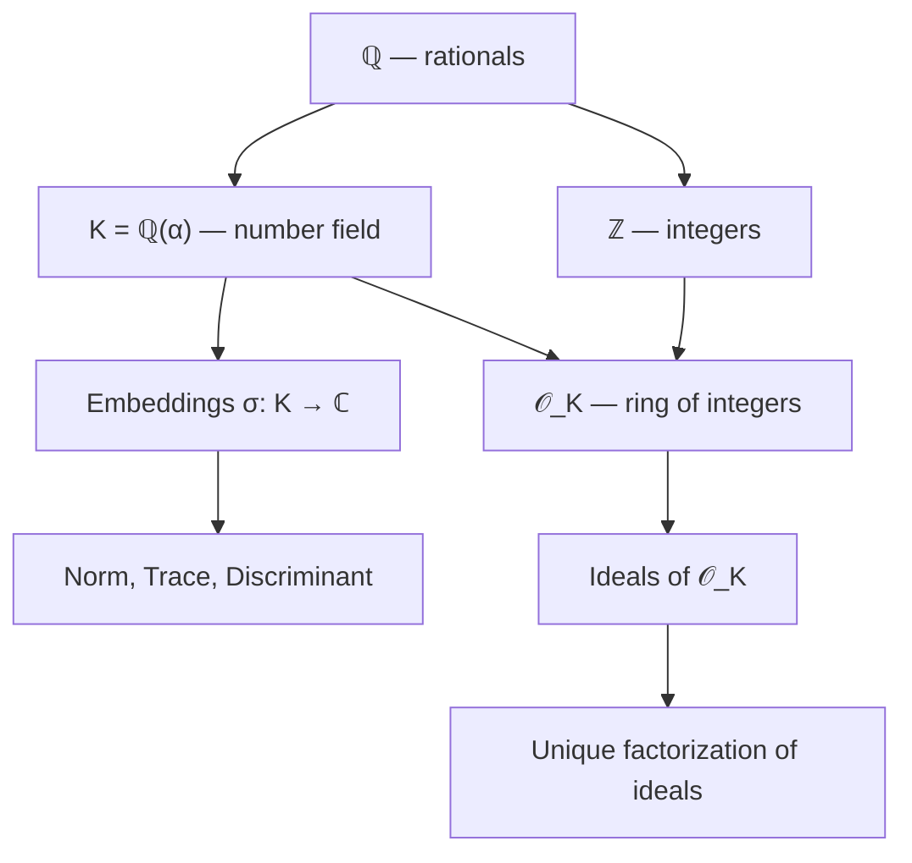
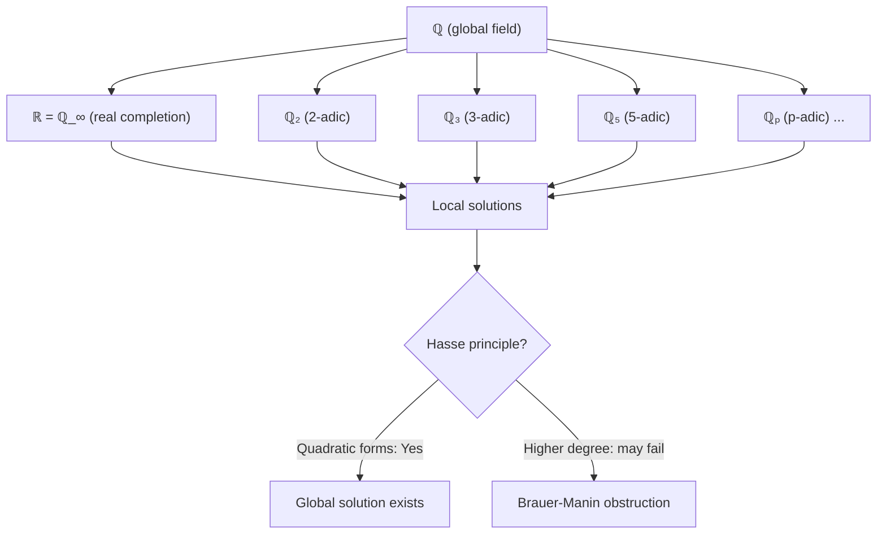
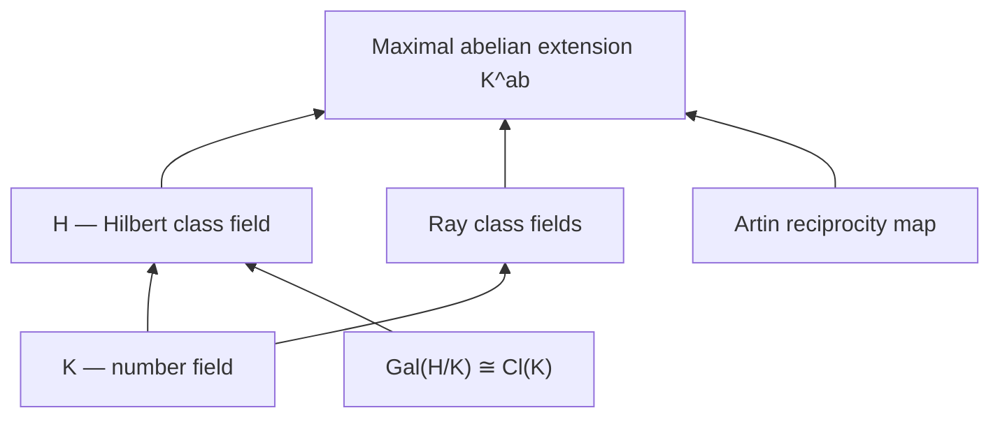

# Algebraic Number Theory

## Course Overview

The study of algebraic number fields, their rings of integers, and the factorization of ideals. Central themes include the failure and recovery of unique factorization, the finiteness of the class number, Dirichlet's unit theorem, and local-global principles via $p$-adic completions.

## References

- D.A. Marcus, *Number Fields*, 2nd ed., Springer Universitext, 2018.
- J. Neukirch, *Algebraic Number Theory*, Springer Grundlehren 322, 1999.
- P. Samuel, *Algebraic Theory of Numbers*, Dover, 2008.

---

# Part I — Number Fields and Rings of Integers

## Week 1: Algebraic Number Fields

### Basic Definitions

An **algebraic number field** (or simply **number field**) is a finite extension $K/\mathbb{Q}$. If $[K:\mathbb{Q}] = n$, then $K \cong \mathbb{Q}[x]/(f(x))$ for some irreducible polynomial $f \in \mathbb{Q}[x]$ of degree $n$.

### Quadratic Fields

For squarefree $d \in \mathbb{Z}$, the quadratic field $K = \mathbb{Q}(\sqrt{d})$ has $[K:\mathbb{Q}] = 2$. Each element has the form $a + b\sqrt{d}$ with $a, b \in \mathbb{Q}$.

### Field Embeddings

A number field $K$ of degree $n$ has $n$ embeddings $\sigma_1, \ldots, \sigma_n : K \hookrightarrow \mathbb{C}$. If $r_1$ are real and $2r_2$ are complex (occurring in conjugate pairs), then $n = r_1 + 2r_2$.

- **Norm:** $N_{K/\mathbb{Q}}(\alpha) = \prod_{i=1}^n \sigma_i(\alpha)$
- **Trace:** $\operatorname{Tr}_{K/\mathbb{Q}}(\alpha) = \sum_{i=1}^n \sigma_i(\alpha)$
- **Discriminant:** $\Delta_K = \det(\sigma_i(\omega_j))^2$ for an integral basis $\{\omega_1, \ldots, \omega_n\}$

## Week 2: Rings of Integers

### Definition

The **ring of integers** of $K$ is:

$$\mathcal{O}_K = \{\alpha \in K : \alpha \text{ is a root of a monic polynomial in } \mathbb{Z}[x]\}$$

$\mathcal{O}_K$ is a free $\mathbb{Z}$-module of rank $n = [K:\mathbb{Q}]$.

### Quadratic Integers

For $K = \mathbb{Q}(\sqrt{d})$:

$$\mathcal{O}_K = \begin{cases} \mathbb{Z}[\sqrt{d}] & \text{if } d \equiv 2, 3 \pmod{4} \\ \mathbb{Z}\left[\frac{1 + \sqrt{d}}{2}\right] & \text{if } d \equiv 1 \pmod{4} \end{cases}$$

### Failure of Unique Factorization

In $\mathbb{Z}[\sqrt{-5}]$: $6 = 2 \cdot 3 = (1 + \sqrt{-5})(1 - \sqrt{-5})$. Both are factorizations into irreducibles, but $2, 3, 1 \pm \sqrt{-5}$ are not associates. Unique factorization fails.

---

# Part II — Ideal Theory in Dedekind Domains

## Week 3: Dedekind Domains

### Definition

A **Dedekind domain** is an integral domain that is:
1. Noetherian
2. Integrally closed
3. Every nonzero prime ideal is maximal

The ring of integers $\mathcal{O}_K$ of any number field is a Dedekind domain.

### Unique Factorization of Ideals

In a Dedekind domain, every nonzero ideal $\mathfrak{a}$ factors uniquely as a product of prime ideals:

$$\mathfrak{a} = \mathfrak{p}_1^{e_1} \mathfrak{p}_2^{e_2} \cdots \mathfrak{p}_g^{e_g}$$

This recovers unique factorization at the level of ideals, even when it fails for elements.

### Fractional Ideals

A **fractional ideal** is a nonzero $\mathcal{O}_K$-submodule $\mathfrak{a}$ of $K$ such that $d\mathfrak{a} \subseteq \mathcal{O}_K$ for some $d \in \mathcal{O}_K \setminus \{0\}$. The fractional ideals form a group under multiplication; the identity is $\mathcal{O}_K$.

## Week 4: Ramification and Splitting of Primes

### Splitting Behavior

For a prime $p \in \mathbb{Z}$, the ideal $(p) = p\mathcal{O}_K$ factors as:

$$p\mathcal{O}_K = \mathfrak{p}_1^{e_1} \cdots \mathfrak{p}_g^{e_g}$$

with $\sum_{i=1}^g e_i f_i = n = [K:\mathbb{Q}]$, where $f_i = [\mathcal{O}_K/\mathfrak{p}_i : \mathbb{F}_p]$ is the **residue degree**.

| Behavior | Condition | Example in $\mathbb{Q}(\sqrt{d})$ |
|----------|-----------|-----------------------------------|
| **Splits** | $g = n$, all $e_i = 1$ | $\left(\frac{d}{p}\right) = 1$ |
| **Inert** | $g = 1$, $e = 1$, $f = n$ | $\left(\frac{d}{p}\right) = -1$ |
| **Ramifies** | Some $e_i > 1$ | $p \mid \Delta_K$ |

A prime $p$ ramifies in $K$ if and only if $p$ divides the discriminant $\Delta_K$.

### Kummer's Theorem

If $\mathcal{O}_K = \mathbb{Z}[\alpha]$ and $f(\alpha) = 0$ with $f$ monic, then to factor $p\mathcal{O}_K$, reduce $f$ modulo $p$:

$$\bar{f}(x) = \bar{g}_1(x)^{e_1} \cdots \bar{g}_r(x)^{e_r} \in \mathbb{F}_p[x]$$

Then $p\mathcal{O}_K = \mathfrak{p}_1^{e_1} \cdots \mathfrak{p}_r^{e_r}$ where $\mathfrak{p}_i = (p, g_i(\alpha))$.

---

# Part III — The Class Group and Units

## Week 5: The Ideal Class Group

### Definition

Two fractional ideals $\mathfrak{a}$ and $\mathfrak{b}$ are in the same **ideal class** if $\mathfrak{a} = (\alpha)\mathfrak{b}$ for some $\alpha \in K^*$. The set of ideal classes forms the **class group** $\operatorname{Cl}(K)$.

$$\operatorname{Cl}(K) = \frac{\text{fractional ideals of } \mathcal{O}_K}{\text{principal fractional ideals}}$$

The **class number** $h_K = |\operatorname{Cl}(K)|$. Unique factorization holds in $\mathcal{O}_K$ if and only if $h_K = 1$.

### Minkowski's Bound

Every ideal class contains an ideal $\mathfrak{a}$ with:

$$N(\mathfrak{a}) \leq M_K = \frac{n!}{n^n} \left(\frac{4}{\pi}\right)^{r_2} |\Delta_K|^{1/2}$$

To compute $\operatorname{Cl}(K)$, it suffices to consider prime ideals lying over rational primes $p \leq M_K$.

### Example: $K = \mathbb{Q}(\sqrt{-5})$

$\Delta_K = -20$, $M_K = \frac{2}{\pi}\sqrt{20} \approx 2.85$. Check $p = 2$: $(2) = (2, 1+\sqrt{-5})^2$, so $\mathfrak{p} = (2, 1+\sqrt{-5})$ is a non-principal prime ideal. Thus $h_K = 2$ and $\operatorname{Cl}(K) \cong \mathbb{Z}/2\mathbb{Z}$.

## Week 6: Dirichlet's Unit Theorem

### Statement

The unit group $\mathcal{O}_K^{\times}$ is finitely generated:

$$\mathcal{O}_K^{\times} \cong \mu_K \times \mathbb{Z}^{r_1 + r_2 - 1}$$

where $\mu_K$ is the (finite, cyclic) group of roots of unity in $K$, and $r_1 + r_2 - 1$ is the **rank** of the unit group.

### Examples

| Field | $r_1$ | $r_2$ | Rank | Units |
|-------|--------|--------|------|-------|
| $\mathbb{Q}(\sqrt{-d})$, $d > 0$ | $0$ | $1$ | $0$ | Finite (roots of unity only) |
| $\mathbb{Q}(\sqrt{d})$, $d > 0$ | $2$ | $0$ | $1$ | $\pm \epsilon^n$, $\epsilon$ fundamental unit |
| Totally real cubic | $3$ | $0$ | $2$ | Two independent fundamental units |

### The Regulator

The **regulator** $R_K$ is the volume of the fundamental domain of the unit lattice under the logarithmic embedding $\ell: \mathcal{O}_K^{\times} \to \mathbb{R}^{r_1 + r_2}$:

$$\ell(u) = (\log|\sigma_1(u)|, \ldots, \log|\sigma_{r_1}(u)|, 2\log|\sigma_{r_1+1}(u)|, \ldots)$$

The regulator appears in the **analytic class number formula**:

$$\lim_{s \to 1} (s - 1) \zeta_K(s) = \frac{2^{r_1} (2\pi)^{r_2} h_K R_K}{w_K \sqrt{|\Delta_K|}}$$

---

# Part IV — Local Fields and $p$-adic Numbers

## Week 7: $p$-adic Numbers

### The $p$-adic Valuation and Absolute Value

For $x = p^a \cdot \frac{m}{n}$ with $p \nmid mn$: $v_p(x) = a$ and $|x|_p = p^{-a}$.

The **$p$-adic numbers** $\mathbb{Q}_p$ are the completion of $\mathbb{Q}$ with respect to $|\cdot|_p$. Ostrowski's theorem: every nontrivial absolute value on $\mathbb{Q}$ is equivalent to $|\cdot|_p$ for some prime $p$ or to $|\cdot|_\infty$.

### Structure of $\mathbb{Q}_p$

$$\mathbb{Q}_p \supset \mathbb{Z}_p = \{x : |x|_p \leq 1\} \supset p\mathbb{Z}_p = \{x : |x|_p < 1\}$$

Every $x \in \mathbb{Q}_p^{\times}$ has a unique representation $x = p^a u$ where $a = v_p(x)$ and $u \in \mathbb{Z}_p^{\times}$.

### Hensel's Lemma

If $f \in \mathbb{Z}_p[x]$ and $a \in \mathbb{Z}_p$ satisfies $|f(a)|_p < |f'(a)|_p^2$, then there exists a unique root $\alpha \in \mathbb{Z}_p$ with $|\alpha - a|_p \leq |f(a)/f'(a)|_p$.

## Week 8: Local-Global Principle

### Hasse-Minkowski Theorem

A quadratic form $Q$ over $\mathbb{Q}$ has a nontrivial solution in $\mathbb{Q}$ if and only if it has a nontrivial solution in $\mathbb{R}$ and in $\mathbb{Q}_p$ for every prime $p$.

### Limitations

The Hasse principle **fails** for higher degree forms and for more general varieties. Example: the curve $3x^3 + 4y^3 + 5z^3 = 0$ has solutions in $\mathbb{R}$ and all $\mathbb{Q}_p$, but not in $\mathbb{Q}$ (Selmer, 1951).

---

# Part V — Class Field Theory (Overview)

## Week 9: Abelian Extensions and Reciprocity

### Artin Reciprocity

For an abelian extension $L/K$, the **Artin map** gives an isomorphism:

$$\operatorname{Art}: \frac{I_K^S}{N_{L/K}(I_L^S) \cdot P_{K,\mathfrak{m}}} \xrightarrow{\;\sim\;} \operatorname{Gal}(L/K)$$

where $I_K^S$ is the group of fractional ideals coprime to $S$, and $\mathfrak{m}$ is a modulus for $L/K$.

### Kronecker-Weber Theorem

Every abelian extension of $\mathbb{Q}$ is contained in a cyclotomic field $\mathbb{Q}(\zeta_n)$.

### Hilbert Class Field

The **Hilbert class field** $H$ of $K$ is the maximal unramified abelian extension. Key properties:

- $\operatorname{Gal}(H/K) \cong \operatorname{Cl}(K)$
- $[H:K] = h_K$
- Every ideal of $\mathcal{O}_K$ becomes principal in $\mathcal{O}_H$

## Week 10: Applications

### Primes Represented by Quadratic Forms

The prime $p$ (odd, not dividing $\Delta_K$) splits completely in the Hilbert class field of $\mathbb{Q}(\sqrt{d})$ if and only if $p$ is represented by the principal form of discriminant $d$.

Example: $p = x^2 + 5y^2$ if and only if $p$ splits completely in $\mathbb{Q}(\sqrt{-5}, \sqrt{-1})$.

### The Chebotarev Density Theorem

For a Galois extension $L/K$ and a conjugacy class $C \subseteq \operatorname{Gal}(L/K)$:

$$\#\{p \leq x : \operatorname{Frob}_p \in C\} \sim \frac{|C|}{|G|} \cdot \frac{x}{\log x}$$

This generalizes both Dirichlet's theorem and the splitting behavior of primes.

---

# Summary of Key Results

| Result | Statement |
|--------|-----------|
| Unique factorization of ideals | $\mathfrak{a} = \mathfrak{p}_1^{e_1} \cdots \mathfrak{p}_g^{e_g}$ in $\mathcal{O}_K$ |
| $\sum e_i f_i = n$ | Fundamental identity for prime splitting |
| Minkowski bound | Class computation via $N(\mathfrak{a}) \leq M_K$ |
| Dirichlet unit theorem | $\mathcal{O}_K^{\times} \cong \mu_K \times \mathbb{Z}^{r_1+r_2-1}$ |
| Hensel's lemma | Lift roots from $\mathbb{F}_p$ to $\mathbb{Q}_p$ |
| Artin reciprocity | $I_K / (N \cdot P_\mathfrak{m}) \cong \operatorname{Gal}(L/K)$ |
