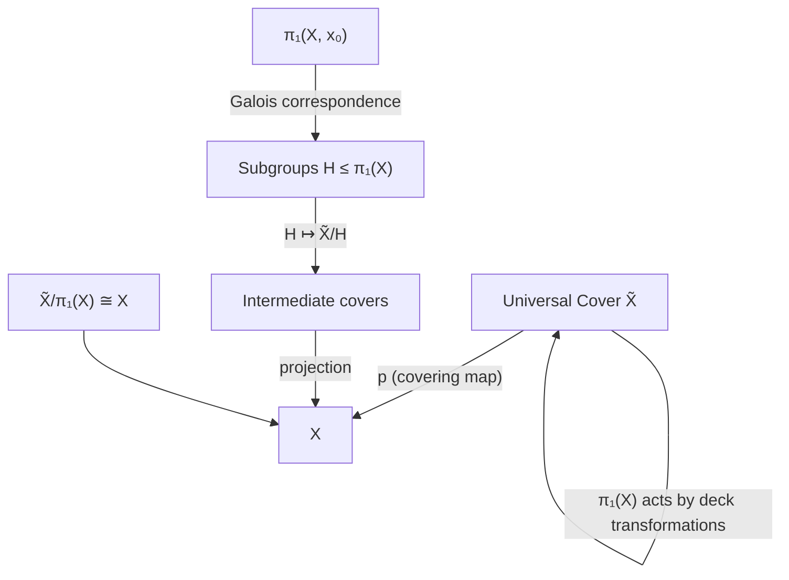
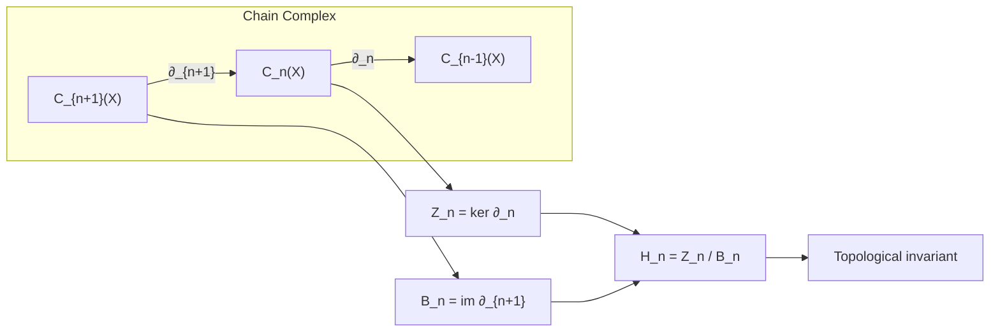
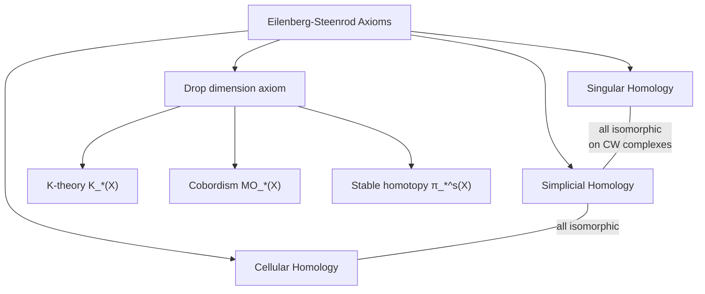

# Algebraic Topology

> Assigning algebraic objects (groups, rings, modules) to topological spaces so that continuous maps become homomorphisms — reducing topological problems to algebraic computation.

---

## Part I — The Fundamental Group

### Week 1: Homotopy and the Fundamental Group

**Homotopy.** Maps $f, g: X \to Y$ are *homotopic* ($f \simeq g$) if there exists continuous $H: X \times [0,1] \to Y$ with $H(x,0) = f(x)$, $H(x,1) = g(x)$.

**Homotopy equivalence.** $X \simeq Y$ if there exist $f: X \to Y$, $g: Y \to X$ with $g \circ f \simeq \text{id}_X$ and $f \circ g \simeq \text{id}_Y$.

**Fundamental group.** Fix basepoint $x_0 \in X$. A *loop* is a path $\gamma: [0,1] \to X$ with $\gamma(0) = \gamma(1) = x_0$. The fundamental group:
$$\pi_1(X, x_0) = \{ [\gamma] \mid \gamma \text{ is a loop at } x_0 \}$$
with concatenation of paths as the group operation:
$$[\alpha] \cdot [\beta] = [\alpha * \beta], \quad (\alpha * \beta)(t) = \begin{cases} \alpha(2t) & 0 \leq t \leq \frac{1}{2} \\ \beta(2t-1) & \frac{1}{2} \leq t \leq 1 \end{cases}$$

**Key computations:**
- $\pi_1(\mathbb{R}^n) = 0$ (contractible)
- $\pi_1(S^1) \cong \mathbb{Z}$ (via degree/lifting)
- $\pi_1(T^2) \cong \mathbb{Z} \times \mathbb{Z}$
- $\pi_1(S^n) = 0$ for $n \geq 2$

### Week 2: Covering Spaces

**Definition.** $p: \tilde{X} \to X$ is a *covering map* if every $x \in X$ has an open neighborhood $U$ such that $p^{-1}(U) = \bigsqcup_\alpha V_\alpha$ with each $V_\alpha \xrightarrow{p|_{V_\alpha}} U$ a homeomorphism.

**Lifting properties:**
- **Path lifting:** Every path in $X$ lifts uniquely given a starting point in $\tilde{X}$
- **Homotopy lifting:** Homotopies of paths lift uniquely
- **General lifting criterion:** $f: (Y, y_0) \to (X, x_0)$ lifts to $\tilde{X}$ iff $f_*(\pi_1(Y)) \subseteq p_*(\pi_1(\tilde{X}))$

**Classification.** For "nice" spaces (connected, locally path-connected, semi-locally simply connected):
$$\{\text{Covering spaces of } X\} / \text{iso} \;\longleftrightarrow\; \{\text{Subgroups of } \pi_1(X)\} / \text{conjugacy}$$

The universal cover $\tilde{X}$ corresponds to the trivial subgroup; $\pi_1(X) \cong \text{Deck}(\tilde{X}/X)$.

### Week 3: Van Kampen's Theorem

**Statement.** If $X = U_1 \cup U_2$ with $U_1, U_2, U_1 \cap U_2$ open, path-connected, and $x_0 \in U_1 \cap U_2$:
$$\pi_1(X) \cong \pi_1(U_1) *_{\pi_1(U_1 \cap U_2)} \pi_1(U_2)$$
(amalgamated free product along the images of $\pi_1(U_1 \cap U_2)$).

**Applications:**
- **Wedge sum:** $\pi_1(S^1 \vee S^1) \cong \mathbb{Z} * \mathbb{Z}$ (free group on 2 generators)
- **Surfaces:** $\pi_1(\Sigma_g) = \langle a_1, b_1, \ldots, a_g, b_g \mid [a_1,b_1]\cdots[a_g,b_g] = 1 \rangle$
- **Knot groups:** $\pi_1(S^3 \setminus K)$ computed via Wirtinger presentation

---

## Part II — Homology

### Week 4: Simplicial and Singular Homology

**Singular $n$-simplex.** A continuous map $\sigma: \Delta^n \to X$ where $\Delta^n = \{(t_0, \ldots, t_n) \mid t_i \geq 0, \sum t_i = 1\}$.

**Chain complex.** $C_n(X) = $ free abelian group on singular $n$-simplices. The boundary map:
$$\partial_n(\sigma) = \sum_{i=0}^n (-1)^i \sigma|_{[v_0, \ldots, \hat{v}_i, \ldots, v_n]}$$

The key property $\partial_{n-1} \circ \partial_n = 0$ yields the chain complex:
$$\cdots \xrightarrow{\partial_{n+1}} C_n(X) \xrightarrow{\partial_n} C_{n-1}(X) \xrightarrow{\partial_{n-1}} \cdots \xrightarrow{\partial_1} C_0(X) \xrightarrow{\partial_0} 0$$

**Homology groups:**
$$H_n(X) = \ker \partial_n / \text{im}\, \partial_{n+1} = Z_n(X) / B_n(X)$$

**Computations:**
- $H_n(\text{pt}) = \begin{cases} \mathbb{Z} & n = 0 \\ 0 & n > 0 \end{cases}$
- $H_n(S^k) \cong \begin{cases} \mathbb{Z} & n = 0 \text{ or } n = k \\ 0 & \text{otherwise} \end{cases}$
- $H_1(X) \cong \pi_1(X)^{\text{ab}}$ (abelianization of the fundamental group)

### Week 5: Exact Sequences and Excision

**Short exact sequence of chain complexes** $0 \to A_\bullet \to B_\bullet \to C_\bullet \to 0$ induces a **long exact sequence in homology**:
$$\cdots \to H_n(A) \to H_n(B) \to H_n(C) \xrightarrow{\partial_*} H_{n-1}(A) \to \cdots$$

**Relative homology.** For $A \subseteq X$:
$$H_n(X, A) = H_n(C_\bullet(X) / C_\bullet(A))$$

Long exact sequence of the pair:
$$\cdots \to H_n(A) \xrightarrow{i_*} H_n(X) \xrightarrow{j_*} H_n(X,A) \xrightarrow{\partial_*} H_{n-1}(A) \to \cdots$$

**Excision Theorem.** If $\overline{Z} \subseteq \text{Int}(A)$, then $H_n(X \setminus Z, A \setminus Z) \cong H_n(X, A)$.

### Week 6: Mayer-Vietoris Sequence

If $X = A \cup B$ with $A, B$ open (or subcomplexes of a CW complex):
$$\cdots \to H_n(A \cap B) \xrightarrow{(\iota_*, -\jmath_*)} H_n(A) \oplus H_n(B) \xrightarrow{\kappa_* + \lambda_*} H_n(X) \xrightarrow{\partial_*} H_{n-1}(A \cap B) \to \cdots$$

**Application:** Compute $H_n(S^n)$ inductively by decomposing into hemispheres.

---

## Part III — Cohomology and CW Complexes

### Week 7: CW Complexes

**Construction.** Built inductively:
1. Start with discrete set $X^0$ (0-cells)
2. Attach $n$-cells $e^n_\alpha$ via maps $\varphi_\alpha: S^{n-1} \to X^{n-1}$:
$$X^n = X^{n-1} \cup_{\varphi_\alpha} \bigsqcup_\alpha D^n_\alpha$$

**Cellular homology.** Far more efficient than singular homology:
$$H_n^{\text{CW}}(X) \cong H_n(X)$$

The cellular chain group $C_n^{\text{CW}}(X) \cong \mathbb{Z}^{(\text{number of } n\text{-cells})}$.

**Euler characteristic:**
$$\chi(X) = \sum_{n=0}^{\dim X} (-1)^n |\{n\text{-cells}\}| = \sum_{n=0}^{\infty} (-1)^n \text{rank}\, H_n(X)$$

### Week 8: Cohomology and the Cup Product

**Singular cohomology.** Dualize the chain complex with coefficients in $G$:
$$C^n(X; G) = \text{Hom}(C_n(X), G), \qquad \delta^n = \partial_{n+1}^*$$
$$H^n(X; G) = \ker \delta^n / \text{im}\, \delta^{n-1}$$

**Universal Coefficient Theorem.** There is a (split) short exact sequence:
$$0 \to \text{Ext}^1(H_{n-1}(X), G) \to H^n(X; G) \to \text{Hom}(H_n(X), G) \to 0$$

**Cup product.** $\smile: H^p(X; R) \otimes H^q(X; R) \to H^{p+q}(X; R)$ makes $H^*(X; R) = \bigoplus_n H^n(X; R)$ into a graded ring.

**Example.** $H^*(\mathbb{CP}^n; \mathbb{Z}) \cong \mathbb{Z}[\alpha] / (\alpha^{n+1})$ with $|\alpha| = 2$.

This distinguishes $\mathbb{CP}^2$ from $S^2 \vee S^4$ (same homology groups, different ring structure).

---

## Part IV — Higher Homotopy and Fibrations

### Week 9: Higher Homotopy Groups

**Definition.** $\pi_n(X, x_0) = [(S^n, *), (X, x_0)]$ — homotopy classes of based maps $S^n \to X$.

**Properties:**
- $\pi_n$ is abelian for $n \geq 2$ (Eckmann-Hilton argument)
- $\pi_n(X \times Y) \cong \pi_n(X) \times \pi_n(Y)$
- Covering space: $\pi_n(\tilde{X}) \cong \pi_n(X)$ for $n \geq 2$

**Hurewicz theorem.** If $X$ is $(n-1)$-connected ($\pi_k(X) = 0$ for $k < n$, $n \geq 2$):
$$\pi_n(X) \cong H_n(X)$$

**Hopf fibration.** $S^1 \hookrightarrow S^3 \xrightarrow{p} S^2$ shows $\pi_3(S^2) \cong \mathbb{Z}$, generated by the Hopf map $\eta$.

### Week 10: Fibrations and the Long Exact Sequence

**Fibration.** $p: E \to B$ satisfies the *homotopy lifting property* for all spaces.

**Long exact sequence of a fibration** $F \hookrightarrow E \xrightarrow{p} B$:
$$\cdots \to \pi_n(F) \to \pi_n(E) \to \pi_n(B) \xrightarrow{\partial} \pi_{n-1}(F) \to \cdots \to \pi_0(E) \to \pi_0(B)$$

**Examples:**
- Path-loop fibration: $\Omega X \hookrightarrow PX \to X$ gives $\pi_n(X) \cong \pi_{n-1}(\Omega X)$
- Hopf: $S^1 \to S^3 \to S^2$ gives exact sequence $\cdots \to \pi_n(S^1) \to \pi_n(S^3) \to \pi_n(S^2) \to \pi_{n-1}(S^1) \to \cdots$

### Week 11: Eilenberg-Steenrod Axioms

The axioms characterizing a *homology theory* $h_*$ on the category of pairs of spaces:

1. **Homotopy:** $f \simeq g \implies f_* = g_*$
2. **Exactness:** Long exact sequence of the pair $(X, A)$
3. **Excision:** Inclusion $(X \setminus Z, A \setminus Z) \hookrightarrow (X, A)$ induces isomorphism when $\overline{Z} \subseteq \text{Int}(A)$
4. **Dimension:** $h_n(\text{pt}) = 0$ for $n \neq 0$

**Uniqueness.** Any two homology theories satisfying these axioms and agreeing on a point are naturally isomorphic on CW pairs.

**Generalized homology theories** drop the dimension axiom: K-theory, cobordism, stable homotopy.

---

## Part V — Applications and Computations

### Week 12: Degree Theory and Fixed Points

**Degree of a map.** For $f: S^n \to S^n$, the induced map $f_*: H_n(S^n) \cong \mathbb{Z} \to \mathbb{Z}$ is multiplication by $\deg(f)$.

**Properties:**
- $\deg(\text{id}) = 1$, $\deg(\text{antipodal}) = (-1)^{n+1}$
- $\deg(f \circ g) = \deg(f) \cdot \deg(g)$
- $f \simeq g \iff \deg(f) = \deg(g)$ (for maps $S^n \to S^n$)

**Brouwer Fixed Point Theorem.** Every continuous $f: D^n \to D^n$ has a fixed point.

*Proof:* If $f(x) \neq x$ for all $x$, define retraction $r: D^n \to S^{n-1}$ by the ray from $f(x)$ through $x$. But $H_{n-1}(S^{n-1}) \cong \mathbb{Z} \to H_{n-1}(D^n) = 0 \to H_{n-1}(S^{n-1}) \cong \mathbb{Z}$ would be the identity — contradiction.

**Lefschetz Fixed Point Theorem.** If $\Lambda(f) = \sum_n (-1)^n \text{tr}(f_*: H_n(X;\mathbb{Q}) \to H_n(X;\mathbb{Q})) \neq 0$, then $f$ has a fixed point.

### Week 13: Poincaré Duality

For a closed oriented $n$-manifold $M$:
$$H^k(M; \mathbb{Z}) \cong H_{n-k}(M; \mathbb{Z})$$

via the cap product with the fundamental class $[M] \in H_n(M)$:
$$D: H^k(M) \xrightarrow{\frown [M]} H_{n-k}(M)$$

**Consequences:**
- $\chi(M) = 0$ for odd-dimensional closed oriented manifolds
- Intersection form on $H_n(M^{2n}; \mathbb{Z})$ — classification of 4-manifolds

---

## References

1. **Hatcher, A.** *Algebraic Topology* (2002). Cambridge University Press. Free at pi.math.cornell.edu/~hatcher/. — The modern standard text.
2. **May, J.P.** *A Concise Course in Algebraic Topology* (1999). University of Chicago Press. — Concise and categorical; best as a second pass.
3. **Spanier, E.** *Algebraic Topology* (1966, Springer reprint 1994). — Comprehensive classical reference; heavy on category theory.
