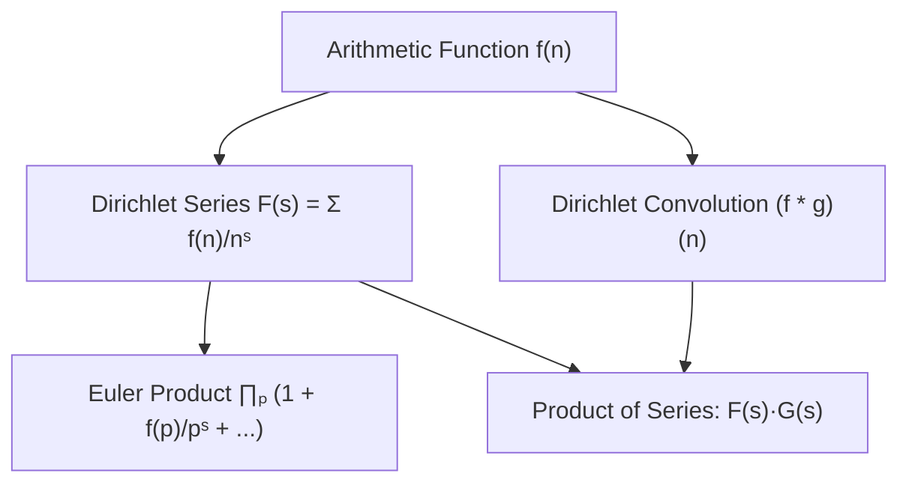
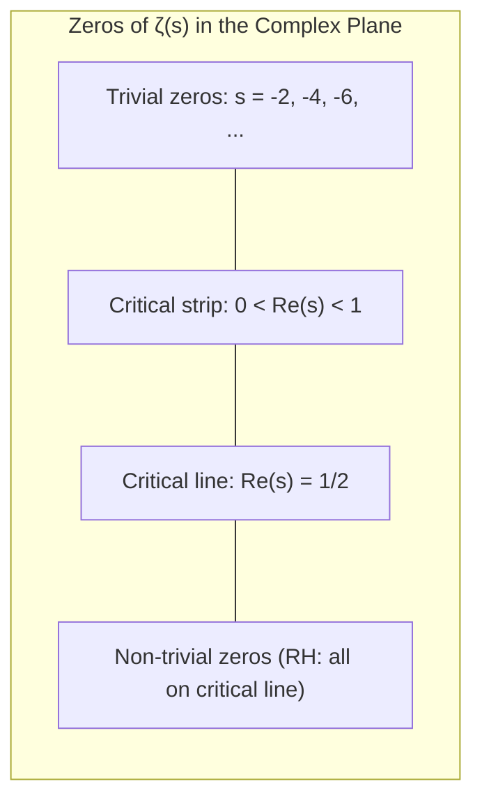
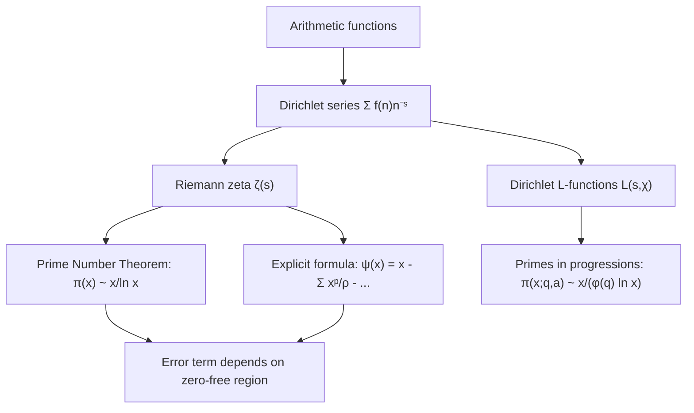

# Analytic Number Theory

## Course Overview

The application of tools from complex analysis, Fourier analysis, and asymptotic methods to problems about the distribution of primes. Central objects include the Riemann zeta function, Dirichlet L-functions, and arithmetic functions studied via Dirichlet series.

## References

- T.M. Apostol, *Introduction to Analytic Number Theory*, Springer UTM, 1976.
- H. Iwaniec & E. Kowalski, *Analytic Number Theory*, AMS Colloquium Publications vol. 53, 2004.
- H. Davenport, *Multiplicative Number Theory*, 3rd ed. (revised by H.L. Montgomery), Springer GTM 74, 2000.

---

# Part I — Arithmetic Functions and Dirichlet Series

## Week 1: Arithmetic Functions

### Multiplicative Functions

A function $f: \mathbb{Z}^+ \to \mathbb{C}$ is **multiplicative** if $f(mn) = f(m)f(n)$ whenever $\gcd(m,n) = 1$. It is **completely multiplicative** if this holds for all $m, n$.

Key examples:

| Function | Definition | Multiplicative? |
|----------|-----------|----------------|
| $\mu(n)$ | Mobius function | Yes |
| $\phi(n)$ | Euler's totient | Yes |
| $\Lambda(n)$ | von Mangoldt: $\log p$ if $n = p^k$, else $0$ | No |
| $d(n) = \tau(n)$ | Divisor count | Yes |
| $\sigma_s(n)$ | $\sum_{d \mid n} d^s$ | Yes |

### Dirichlet Convolution

The **Dirichlet convolution** of $f$ and $g$ is:

$$(f * g)(n) = \sum_{d \mid n} f(d)\, g(n/d)$$

This is commutative, associative, and has identity $\epsilon(n) = [n = 1]$. Key identities:

- $\mu * \mathbf{1} = \epsilon$ (Mobius inversion)
- $\phi * \mathbf{1} = \text{id}$
- $\Lambda * \mathbf{1} = \log$

### Summatory Functions and Asymptotic Estimates

$$\sum_{n \leq x} d(n) = x \log x + (2\gamma - 1)x + O(\sqrt{x})$$

$$\sum_{n \leq x} \phi(n) = \frac{3}{\pi^2} x^2 + O(x \log x)$$

$$\sum_{n \leq x} \frac{1}{n} = \log x + \gamma + O(1/x)$$

where $\gamma \approx 0.5772$ is the Euler-Mascheroni constant.

## Week 2: Dirichlet Series

### Definition and Convergence

A **Dirichlet series** is a series of the form:

$$F(s) = \sum_{n=1}^{\infty} \frac{a_n}{n^s}, \quad s = \sigma + it \in \mathbb{C}$$

Every Dirichlet series has an **abscissa of convergence** $\sigma_c$ and an **abscissa of absolute convergence** $\sigma_a$ with $\sigma_c \leq \sigma_a \leq \sigma_c + 1$.

### Euler Products

If $f$ is multiplicative, then for $\sigma > \sigma_a$:

$$\sum_{n=1}^{\infty} \frac{f(n)}{n^s} = \prod_{p \text{ prime}} \left(\sum_{k=0}^{\infty} \frac{f(p^k)}{p^{ks}}\right)$$

### Key Dirichlet Series

$$\sum \frac{\mu(n)}{n^s} = \frac{1}{\zeta(s)}, \qquad \sum \frac{\phi(n)}{n^s} = \frac{\zeta(s-1)}{\zeta(s)}, \qquad \sum \frac{\Lambda(n)}{n^s} = -\frac{\zeta'(s)}{\zeta(s)}$$

---

# Part II — The Riemann Zeta Function

## Week 3: Definition and Basic Properties

### The Zeta Function

The **Riemann zeta function** is defined for $\operatorname{Re}(s) > 1$ by:

$$\zeta(s) = \sum_{n=1}^{\infty} \frac{1}{n^s} = \prod_{p} \frac{1}{1 - p^{-s}}$$

The Euler product establishes the deep connection between $\zeta(s)$ and the primes.

### Analytic Continuation

$\zeta(s)$ extends to a meromorphic function on all of $\mathbb{C}$ with a single simple pole at $s = 1$ with residue $1$:

$$\zeta(s) = \frac{1}{s-1} + \gamma + O(|s - 1|)$$

### The Functional Equation

Define $\xi(s) = \frac{1}{2} s(s-1) \pi^{-s/2} \Gamma(s/2) \zeta(s)$. Then:

$$\xi(s) = \xi(1 - s)$$

Equivalently:

$$\zeta(s) = 2^s \pi^{s-1} \sin\left(\frac{\pi s}{2}\right) \Gamma(1-s)\, \zeta(1-s)$$

### Trivial and Non-trivial Zeros

- **Trivial zeros:** $s = -2, -4, -6, \ldots$ (from the $\sin$ factor).
- **Non-trivial zeros:** All lie in the **critical strip** $0 < \operatorname{Re}(s) < 1$.
- **Riemann Hypothesis (1859, unproven):** All non-trivial zeros have $\operatorname{Re}(s) = \frac{1}{2}$.

## Week 4: Special Values

$$\zeta(2) = \frac{\pi^2}{6}, \quad \zeta(4) = \frac{\pi^4}{90}, \quad \zeta(2k) = (-1)^{k+1} \frac{(2\pi)^{2k} B_{2k}}{2(2k)!}$$

where $B_{2k}$ are Bernoulli numbers. The values $\zeta(3), \zeta(5), \ldots$ remain mysterious (Apery proved $\zeta(3)$ is irrational in 1978).

---

# Part III — The Prime Number Theorem

## Week 5: Chebyshev's Estimates

### Chebyshev Functions

$$\theta(x) = \sum_{p \leq x} \log p, \qquad \psi(x) = \sum_{n \leq x} \Lambda(n) = \sum_{p^k \leq x} \log p$$

The PNT is equivalent to $\psi(x) \sim x$ (or $\theta(x) \sim x$).

### Chebyshev's Bounds (1850)

$$0.92 \frac{x}{\log x} < \pi(x) < 1.11 \frac{x}{\log x} \quad \text{for large } x$$

## Week 6: Proof of the Prime Number Theorem

### Statement

$$\pi(x) \sim \frac{x}{\ln x} \quad \text{equivalently} \quad \pi(x) \sim \operatorname{Li}(x) = \int_2^x \frac{dt}{\ln t}$$

### Key Steps (Hadamard / de la Vallee Poussin, 1896)

1. **Connect $\psi(x)$ to $\zeta(s)$** via the explicit formula relating $\psi(x)$ to zeros of $\zeta(s)$.
2. **Show $\zeta(1 + it) \neq 0$** for all real $t$. This is the crucial analytic input.
3. **Apply a Tauberian theorem** (or contour integration) to deduce $\psi(x) \sim x$.

The proof that $\zeta(1 + it) \neq 0$ uses the inequality:

$$\zeta(\sigma)^3 |\zeta(\sigma + it)|^4 |\zeta(\sigma + 2it)| \geq 1 \quad \text{for } \sigma > 1$$

which follows from $3 + 4\cos\theta + \cos 2\theta \geq 0$.

### Explicit Formula (von Mangoldt)

$$\psi_0(x) = x - \sum_{\rho} \frac{x^{\rho}}{\rho} - \frac{\zeta'(0)}{\zeta(0)} - \frac{1}{2}\log(1 - x^{-2})$$

where the sum runs over all non-trivial zeros $\rho$ of $\zeta(s)$.

## Week 7: Error Terms and Zero-Free Regions

### Classical Zero-Free Region

There exists $c > 0$ such that $\zeta(\sigma + it) \neq 0$ for:

$$\sigma > 1 - \frac{c}{\log(|t| + 2)}$$

### PNT with Error Term

$$\psi(x) = x + O\left(x \exp\left(-c\sqrt{\log x}\right)\right)$$

Under the Riemann Hypothesis:

$$\psi(x) = x + O(\sqrt{x}\, \log^2 x), \qquad \pi(x) = \operatorname{Li}(x) + O(\sqrt{x}\, \log x)$$

---

# Part IV — Dirichlet L-Functions and Primes in Progressions

## Week 8: Dirichlet Characters

A **Dirichlet character** modulo $q$ is a completely multiplicative function $\chi: \mathbb{Z} \to \mathbb{C}$ that is periodic with period $q$ and satisfies $\chi(n) = 0$ iff $\gcd(n, q) > 1$.

There are exactly $\phi(q)$ characters modulo $q$. The **principal character** $\chi_0$ satisfies $\chi_0(n) = 1$ when $\gcd(n,q) = 1$.

### Orthogonality Relations

$$\sum_{\chi \bmod q} \chi(a) \overline{\chi(b)} = \begin{cases} \phi(q) & \text{if } a \equiv b \pmod{q} \\ 0 & \text{otherwise} \end{cases}$$

## Week 9: Dirichlet's Theorem

### L-Functions

$$L(s, \chi) = \sum_{n=1}^{\infty} \frac{\chi(n)}{n^s} = \prod_p \frac{1}{1 - \chi(p) p^{-s}}$$

### Dirichlet's Theorem on Primes in Arithmetic Progressions

If $\gcd(a, q) = 1$, then there are infinitely many primes $p \equiv a \pmod{q}$. Moreover:

$$\sum_{\substack{p \leq x \\ p \equiv a \pmod{q}}} 1 \sim \frac{1}{\phi(q)} \frac{x}{\log x}$$

The key input is $L(1, \chi) \neq 0$ for all non-principal $\chi$.

## Week 10: Sieve Methods

### The Sieve of Eratosthenes

Remove multiples of primes $p \leq \sqrt{x}$ to isolate primes up to $x$.

### Brun's Sieve

Brun (1919) proved that the sum of reciprocals of **twin primes** converges:

$$\sum_{\substack{p, p+2 \\ \text{both prime}}} \left(\frac{1}{p} + \frac{1}{p+2}\right) = B \approx 1.902$$

### Selberg's Sieve

Upper bound: for a set $\mathcal{A}$ of integers up to $x$, sifted by primes up to $z$:

$$S(\mathcal{A}, z) \leq \frac{x}{\sum_{d \leq D} \mu^2(d) / \prod_{p \mid d} g(p)} + \text{error}$$

where $g(p) \approx p / (p - 1)$ measures the "density" sieved by $p$.

---

# Summary of Key Results

| Result | Statement |
|--------|-----------|
| Euler product | $\zeta(s) = \prod_p (1 - p^{-s})^{-1}$ for $\operatorname{Re}(s) > 1$ |
| Functional equation | $\xi(s) = \xi(1-s)$ |
| PNT | $\pi(x) \sim x / \ln x$ |
| Dirichlet's theorem | Infinitely many primes $\equiv a \pmod{q}$ when $\gcd(a,q)=1$ |
| Riemann Hypothesis | All non-trivial zeros of $\zeta(s)$ have $\operatorname{Re}(s) = 1/2$ |
| Brun's theorem | $\sum 1/p$ over twin primes converges |
