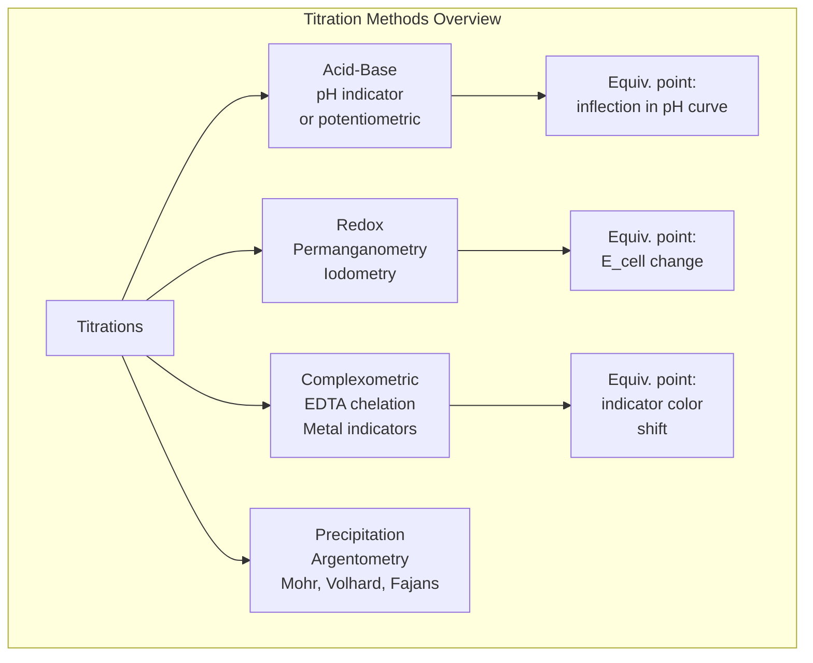
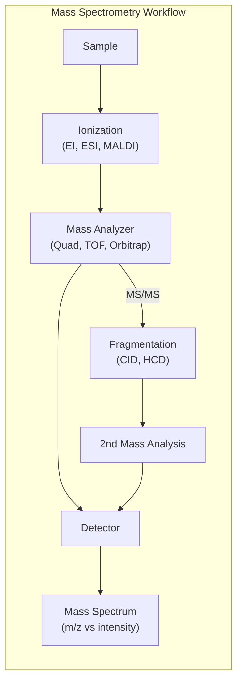
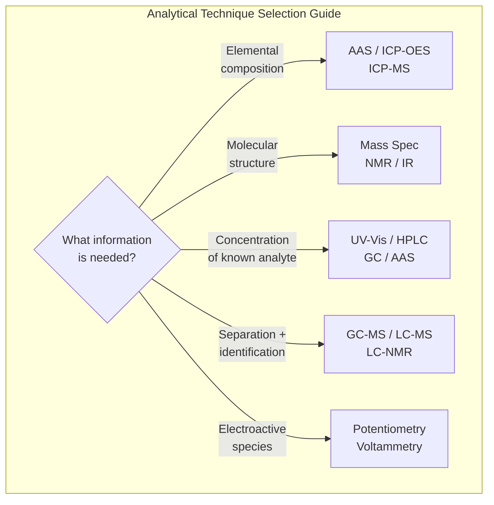

# Analytical Chemistry

> Comprehensive notes covering quantitative analysis, titrations, chromatography, mass spectrometry, electrochemistry, spectrophotometry, atomic spectroscopy, and NMR/IR as analytical tools.

**Primary Texts:**
- Skoog, D.A., West, D.M., Holler, F.J. & Crouch, S.R. *Fundamentals of Analytical Chemistry*, 10th ed. Cengage, 2022.
- Harris, D.C. *Quantitative Chemical Analysis*, 10th ed. W.H. Freeman, 2020.
- Christian, G.D., Dasgupta, P.K. & Schug, K.A. *Analytical Chemistry*, 7th ed. Wiley, 2014.

---

## Part I — Fundamentals of Quantitative Analysis

### Week 1: Accuracy, Precision, and Statistics

**Key terms:**
- **Accuracy:** closeness to true value
- **Precision:** reproducibility of measurements
- **Systematic error (bias):** consistent offset; detectable, correctable
- **Random error:** fluctuations; reducible by averaging

**Statistical measures:**

$$\bar{x} = \frac{1}{n}\sum_{i=1}^n x_i \qquad s = \sqrt{\frac{\sum(x_i - \bar{x})^2}{n-1}}$$

**Confidence interval:**

$$\mu = \bar{x} \pm \frac{t \cdot s}{\sqrt{n}}$$

where $t$ is the Student's $t$-value for a given confidence level and $n-1$ degrees of freedom.

**Significant figures and propagation of uncertainty:**
- Addition/subtraction: uncertainty in absolute terms
- Multiplication/division: uncertainty in relative (%) terms

### Week 2: Gravimetric Analysis

**Principle:** isolate analyte as a pure precipitate, dry/ignite, weigh.

**Steps:** dissolution $\rightarrow$ precipitation $\rightarrow$ digestion $\rightarrow$ filtration $\rightarrow$ washing $\rightarrow$ drying/ignition $\rightarrow$ weighing.

**Gravimetric factor:**

$$\text{GF} = \frac{M(\text{analyte})}{M(\text{precipitate})} \times \frac{\text{stoichiometric ratio}}{}$$

**Solubility product** governs precipitation completeness:

$$K_{sp} = [M^+]^m [A^-]^n$$

Common ion effect drives precipitation to completion.

---

## Part II — Titrations

### Week 3: Acid-Base Titrations

**Equivalence point:** moles acid = moles base.

**Indicators:** weak acids/bases that change color near the equivalence pH.

**Titration curve regions:**
1. Initial point: pH from analyte alone
2. Buffer region: Henderson-Hasselbalch applies
3. Equivalence point: pH from conjugate species hydrolysis
4. Post-equivalence: excess titrant determines pH

**Polyprotic acids:** multiple equivalence points. Buffer capacity greatest at each $\text{p}K_a$.

### Week 4: Redox Titrations and Complexometric Titrations

**Redox titrations:**
- Permanganometry: $\text{MnO}_4^-$ as titrant (self-indicating, purple $\rightarrow$ colorless)
- Cerimetry: $\text{Ce}^{4+}$
- Iodometry/iodimetry: $\text{I}_2/\text{S}_2\text{O}_3^{2-}$ with starch indicator

**Complexometric titrations with EDTA:**
- EDTA (Y$^{4-}$) forms 1:1 complexes with most metal ions
- Conditional formation constant: $K_f' = \alpha_{Y^{4-}} K_f$
- Indicators: Eriochrome Black T (EBT) for Ca$^{2+}$/Mg$^{2+}$, changes blue $\rightarrow$ wine red
- pH control is critical (most effective at pH 10 for divalent cations)

---

## Part III — Chromatography

### Week 5: Chromatographic Theory

**Plate theory** — column efficiency measured by theoretical plates:

$$N = 16\left(\frac{t_R}{W}\right)^2 = 5.54\left(\frac{t_R}{W_{1/2}}\right)^2$$

where $t_R$ is retention time and $W$ is baseline peak width.

**Height equivalent to a theoretical plate:**

$$H = \frac{L}{N}$$

**Van Deemter equation** (band broadening):

$$H = A + \frac{B}{u} + Cu$$

where $A$ = eddy diffusion, $B/u$ = longitudinal diffusion, $Cu$ = mass transfer resistance, $u$ = linear velocity.

**Resolution:**

$$R_s = \frac{2(t_{R2} - t_{R1})}{W_1 + W_2}$$

$R_s \geq 1.5$ for baseline separation.

**Selectivity factor:**

$$\alpha = \frac{k_2'}{k_1'} = \frac{t_{R2} - t_0}{t_{R1} - t_0}$$

### Week 6: Gas Chromatography (GC)

**Requirements:** analyte must be volatile (or derivatizable) and thermally stable.

**Components:** carrier gas (He, N$_2$, H$_2$) $\rightarrow$ injector $\rightarrow$ column $\rightarrow$ detector.

**Columns:**
- Packed columns: lower efficiency, higher capacity
- Capillary (open tubular): high efficiency ($N > 100{,}000$), low sample capacity

**Detectors:**

| Detector | Selectivity | Detection Limit |
|---|---|---|
| FID (flame ionization) | Universal organic | ~pg |
| TCD (thermal conductivity) | Universal | ~ng |
| ECD (electron capture) | Halogenated, nitro | ~fg |
| MS (mass spec) | Universal + structural | ~pg |

### Week 7: High-Performance Liquid Chromatography (HPLC)

**Modes:**
- **Normal phase:** polar stationary phase (silica), nonpolar mobile phase
- **Reversed phase (RP):** nonpolar stationary (C18, C8), polar mobile phase (water/organic)
- **Ion exchange:** charged stationary phase for ionic analytes
- **Size exclusion (SEC/GPC):** separation by molecular size

**Key parameters:**
- Capacity factor: $k' = (t_R - t_0)/t_0$
- Resolution depends on $N$, $\alpha$, and $k'$:

$$R_s = \frac{\sqrt{N}}{4} \cdot \frac{\alpha - 1}{\alpha} \cdot \frac{k_2'}{1 + k_2'}$$

**UHPLC:** sub-2$\mu$m particles, higher pressures, faster separations, better resolution.

---

## Part IV — Mass Spectrometry

### Week 8: Ionization Methods and Mass Analyzers

**Principle:** separate ions by mass-to-charge ratio ($m/z$).

**Ionization methods:**

| Method | Analyte Type | Ion Type | Notes |
|---|---|---|---|
| EI (electron ionization) | Small volatile | M$^{+\cdot}$ (radical cation) | Extensive fragmentation, library searchable |
| ESI (electrospray) | Polar, biomolecules | $[\text{M+H}]^+$, $[\text{M+nH}]^{n+}$ | Soft, multiply charged |
| MALDI | Proteins, polymers | $[\text{M+H}]^+$ | Soft, singly charged, pulsed |
| APCI | Moderately polar | $[\text{M+H}]^+$ | Complementary to ESI |
| CI (chemical ionization) | Small molecules | $[\text{M+H}]^+$ | Soft alternative to EI |

**Mass analyzers:**
- **Quadrupole:** unit resolution, fast scanning, robust
- **Time-of-flight (TOF):** high mass range, high resolution with reflectron
- **Ion trap:** MS$^n$ capability, compact
- **Orbitrap:** ultra-high resolution ($>100{,}000$), accurate mass ($<2$ ppm)
- **FT-ICR:** highest resolution, highest cost

**Tandem MS (MS/MS):** precursor ion selection $\rightarrow$ fragmentation (CID) $\rightarrow$ product ion analysis. Essential for structural elucidation and quantitation (SRM/MRM).

---

## Part V — Electrochemistry

### Week 9: Potentiometry and the Nernst Equation

**Nernst equation:**

$$E = E^\circ - \frac{RT}{nF}\ln Q$$

At $25°\text{C}$:

$$E = E^\circ - \frac{0.05916}{n}\log Q$$

where $n$ = electrons transferred, $F = 96485$ C/mol.

**Reference electrodes:**
- Standard hydrogen electrode (SHE): $E^\circ = 0.000$ V by definition
- Ag/AgCl: $E = +0.197$ V vs SHE (sat. KCl)
- Saturated calomel (SCE): $E = +0.241$ V vs SHE

**Ion-selective electrodes (ISE):**
- Glass electrode for pH: $E = \text{const} + \frac{RT}{F}\ln[H^+]$
- Fluoride ISE (LaF$_3$ crystal)
- Selectivity coefficient $k_{A,B}^{\text{pot}}$ quantifies interference

### Week 10: Voltammetry

**Cyclic voltammetry (CV):** potential swept linearly, current measured.
- Peak separation for reversible system: $\Delta E_p = E_{pa} - E_{pc} = \frac{59}{n}$ mV at 25 degC
- Randles-Sevcik equation: $i_p = 2.69 \times 10^5 n^{3/2} A D^{1/2} C v^{1/2}$

**Stripping voltammetry:** preconcentrate analyte on electrode, then strip.
- Anodic stripping (ASV): for trace metals (Pb, Cd, Zn) at ppb levels

**Amperometry:** fixed potential, measure current (e.g., Clark oxygen electrode, glucose biosensors).

---

## Part VI — Spectrophotometry and Atomic Spectroscopy

### Week 11: UV-Vis Spectrophotometry

**Beer-Lambert Law:**

$$A = \epsilon b c$$

where $A$ = absorbance, $\epsilon$ = molar absorptivity (L mol$^{-1}$ cm$^{-1}$), $b$ = path length (cm), $c$ = concentration (mol/L).

**Transmittance and absorbance:**

$$A = -\log T = -\log\frac{I}{I_0}$$

**Limitations of Beer's Law:**
- Chemical: association, dissociation, reaction with solvent
- Instrumental: polychromatic radiation, stray light
- Concentration: deviations above ~0.01 M (intermolecular interactions)

**Applications:** quantitation, kinetics (spectrophotometric rate measurements), equilibrium constant determination.

### Week 12: Atomic Spectroscopy

**Atomic absorption spectroscopy (AAS):**
- Atomization: flame (air-acetylene, N$_2$O-acetylene) or graphite furnace (GFAAS)
- Hollow cathode lamp as source (element-specific)
- Quantitation via calibration curve or standard additions
- Detection limits: flame ~ppb, GFAAS ~ppt

**Inductively coupled plasma (ICP):**
- ICP-OES (optical emission): simultaneous multi-element, ppm-ppb range
- ICP-MS: mass spectrometric detection, ppt range, isotope ratios
- Plasma temperature ~6000-10000 K

**Comparison:**

| Technique | Elements | Detection Limit | Multi-element? |
|---|---|---|---|
| Flame AAS | 1 at a time | ppb | No |
| GFAAS | 1 at a time | ppt | No |
| ICP-OES | Simultaneous | ppb | Yes |
| ICP-MS | Simultaneous | ppt | Yes |

---

## Part VII — NMR and IR as Analytical Tools

### Week 13: Quantitative NMR (qNMR)

**Principle:** NMR signal area is directly proportional to the number of nuclei.

$$\frac{n_A}{n_B} = \frac{I_A / N_A}{I_B / N_B}$$

where $I$ = integral area, $N$ = number of equivalent nuclei, $n$ = moles.

**Advantages:** non-destructive, no calibration curve needed (primary ratio method), applicable to mixtures.

**Requirements:** full relaxation ($d_1 \geq 5T_1$), no signal overlap, adequate S/N.

### Week 14: IR for Functional Group Analysis

**Fingerprint region** (600-1500 cm$^{-1}$): complex, unique to each compound.
**Functional group region** (1500-4000 cm$^{-1}$): diagnostic absorptions.

| Group | Wavenumber (cm$^{-1}$) | Intensity |
|---|---|---|
| O-H (free) | 3580-3650 | Sharp |
| O-H (H-bonded) | 3200-3550 | Broad |
| N-H | 3300-3500 | Medium |
| C-H (sp$^3$) | 2850-2960 | Strong |
| C-H (sp$^2$) | 3020-3100 | Medium |
| C-H (sp) | ~3300 | Strong |
| C=O | 1680-1750 | Strong |
| C=C (alkene) | 1620-1680 | Variable |
| C=C (aromatic) | 1450-1600 | Medium |
| C-O | 1000-1300 | Strong |
| C-N | 1020-1250 | Medium |

**ATR-FTIR:** attenuated total reflectance mode, minimal sample preparation, suitable for solids, liquids, and films.

---

## Summary and Review Checklist

- [ ] Statistical treatment: mean, std dev, confidence intervals
- [ ] Gravimetric analysis calculations
- [ ] Titration curves: acid-base, redox, EDTA
- [ ] Chromatographic theory: $N$, $H$, $R_s$, Van Deemter
- [ ] GC and HPLC: modes, detectors, column selection
- [ ] Mass spectrometry: ionization methods, analyzers, fragmentation
- [ ] Nernst equation and electrochemical cells
- [ ] Voltammetry: CV interpretation, stripping analysis
- [ ] Beer-Lambert law and UV-Vis quantitation
- [ ] Atomic spectroscopy: AAS vs ICP-OES vs ICP-MS
- [ ] qNMR and IR functional group identification
