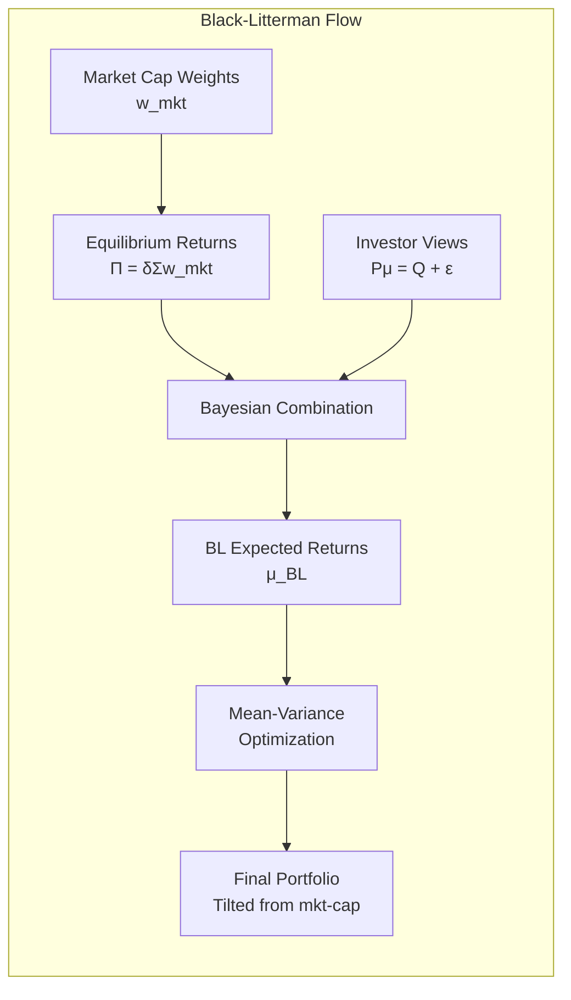
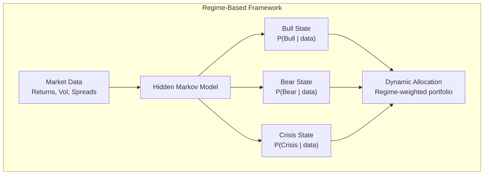

# Asset Allocation

## Part I: Strategic vs Tactical Asset Allocation

### Strategic Asset Allocation (SAA)

Long-term policy portfolio based on:
- Investment objectives and constraints (return target, risk budget, liquidity, time horizon)
- Capital market assumptions (expected returns, volatilities, correlations)
- Investor-specific factors (tax status, regulatory constraints, ESG)

Typically rebalanced to SAA weights at fixed intervals or when drift exceeds thresholds.

### Tactical Asset Allocation (TAA)

Short-to-medium term deviations from SAA to exploit perceived mispricings:
- Valuation signals (CAPE, credit spreads, term premium)
- Momentum and trend-following
- Macro regime indicators

$$R_{\text{TAA}} = R_{\text{SAA}} + \sum_i \Delta w_i (R_i - R_{\text{benchmark},i})$$

Key challenge: TAA requires genuine forecasting skill; transaction costs and taxes erode value.

### Mean-Variance with Constraints

Practical MVO adds constraints to the Markowitz problem:

$$\min_{\mathbf{w}} \; \mathbf{w}^T \Sigma \mathbf{w} - \delta \cdot \mathbf{w}^T \boldsymbol{\mu}$$

subject to: $\mathbf{w}^T \mathbf{1} = 1$, $w_i \geq 0$ (long-only), $w_i \leq w_{\max}$, sector constraints, turnover limits.

Problems with unconstrained MVO: extreme positions, sensitivity to input estimates, unstable weights.

```mermaid
graph TD
    subgraph "Asset Allocation Process"
        IPS[Investment Policy Statement] --> CMA[Capital Market Assumptions<br/>E[R], σ, ρ]
        IPS --> CON[Constraints<br/>Risk budget, liquidity, regulatory]
        CMA --> SAA2[Strategic Allocation<br/>Long-term policy weights]
        CON --> SAA2
        SAA2 --> TAA2[Tactical Tilts<br/>Short-term over/underweights]
        TAA2 --> IMPL[Implementation<br/>Security selection, rebalancing]
        IMPL --> MON[Monitoring & Review]
        MON --> |"Periodic"| SAA2
    end
```

## Part II: Risk Parity

### Concept

Allocate so each asset contributes equally to total portfolio risk, rather than allocating equal capital.

**Equal risk contribution (ERC):**

$$RC_i = w_i \cdot (\Sigma \mathbf{w})_i = w_i \cdot \sum_j w_j \sigma_{ij}$$

Set $RC_i = RC_j$ for all $i, j$. Total risk: $\sigma_p^2 = \sum_i RC_i$.

### Simplified Risk Parity (Inverse Volatility)

$$w_i \propto \frac{1}{\sigma_i}, \quad w_i = \frac{1/\sigma_i}{\sum_j 1/\sigma_j}$$

This ignores correlations. Full risk parity requires iterative optimization.

### Bridgewater All-Weather Concept

| Economic Regime | Favored Assets |
|---|---|
| Rising growth | Equities, credit, commodities |
| Falling growth | Nominal bonds, inflation-linked bonds |
| Rising inflation | Commodities, TIPS, EM |
| Falling inflation | Nominal bonds, equities |

Risk parity across these four boxes. Bonds are levered to match equity risk contribution.

### Pros and Cons

| Advantage | Disadvantage |
|---|---|
| Robust diversification | Requires leverage for bonds |
| No return forecasts needed | Sensitive to covariance estimation |
| Lower drawdowns historically | Underperforms in strong equity rallies |
| Regime-agnostic | Leverage introduces funding risk |

## Part III: Black-Litterman Model

### Equilibrium Returns (Prior)

Start from market-cap weights as the "neutral" portfolio:

$$\Pi = \delta \Sigma \mathbf{w}_{\text{mkt}}$$

where $\delta$ = risk aversion coefficient (typically $\delta = \frac{E[R_m] - r_f}{\sigma_m^2}$), $\Sigma$ = covariance matrix, $\mathbf{w}_{\text{mkt}}$ = market-cap weights.

### Investor Views

Express $K$ views as: $P \boldsymbol{\mu} = Q + \epsilon$, where $\epsilon \sim N(0, \Omega)$.

- $P$ = $K \times N$ pick matrix (which assets involved in each view)
- $Q$ = $K \times 1$ vector of expected returns from views
- $\Omega$ = $K \times K$ diagonal uncertainty matrix for views

### Posterior (Combined) Returns

$$\boldsymbol{\mu}_{\text{BL}} = [(\tau\Sigma)^{-1} + P'\Omega^{-1}P]^{-1}[(\tau\Sigma)^{-1}\Pi + P'\Omega^{-1}Q]$$

where $\tau$ is a scalar reflecting uncertainty in the prior ($\tau \approx 0.025$ to $0.05$).

Posterior covariance:

$$\Sigma_{\text{BL}} = \Sigma + [(\tau\Sigma)^{-1} + P'\Omega^{-1}P]^{-1}$$

### Example View

"US equities will outperform international equities by 2% (with moderate confidence)."

$$P = [1, -1, 0, \ldots], \quad Q = [0.02], \quad \Omega = [\sigma_{\text{view}}^2]$$



## Part IV: Liability-Driven Investing (LDI)

### Surplus Optimization

For pension funds and insurers, optimize the surplus $S = A - L$:

$$\max_{\mathbf{w}} \; E[R_S] - \frac{\lambda}{2}\text{Var}(R_S)$$

where $R_S = R_A - \frac{L}{A}R_L$.

### Hedging Liabilities

- **Duration matching:** Match asset duration to liability duration
- **Cash flow matching:** Dedicated bond portfolio replicating liability cash flows
- **Immunization:** Duration + convexity matching for parallel yield curve shifts

### Glide Path (Target-Date Funds)

Equity allocation decreases as retirement approaches:

$$w_{\text{equity}}(t) = w_{\max} - (w_{\max} - w_{\min}) \cdot \frac{t}{T}$$

Typical: 90% equity at age 25 → 40% equity at age 65.

## Part V: Rebalancing Strategies

### Calendar Rebalancing
- Fixed intervals (monthly, quarterly, annually)
- Simple to implement; may trade unnecessarily or miss large drifts

### Threshold (Tolerance Band) Rebalancing
- Trade when weight deviates beyond a band: $|w_i - w_i^*| > \Delta$
- More responsive; optimal bands depend on transaction costs, volatility, risk aversion

### Optimal Rebalancing (Cost-Aware)

Trade-off: tracking error to SAA vs transaction costs.

$$\min_{\mathbf{w}} \; (\mathbf{w} - \mathbf{w}^*)^T \Sigma (\mathbf{w} - \mathbf{w}^*) + c \cdot \|\mathbf{w} - \mathbf{w}_{\text{current}}\|_1$$

where $c$ = transaction cost parameter.

### Tax-Aware Rebalancing
- Harvest losses to offset gains
- Use new cash flows to rebalance (avoid selling)
- Asset location: tax-inefficient assets in tax-deferred accounts

## Part VI: Regime-Based Allocation

### Hidden Markov Models (HMM)

Model market regimes as latent states with different return distributions:

- **Bull regime:** High mean, low volatility
- **Bear regime:** Low/negative mean, high volatility
- **Crisis regime:** Very negative mean, very high volatility and correlations

Transition probabilities determine regime persistence and switching frequency.

### Regime Detection Signals
- VIX level and term structure
- Yield curve slope (inverted = recession signal)
- Credit spreads (widening = risk-off)
- Equity momentum and breadth

### Dynamic Allocation

Shift portfolio weights based on estimated current regime:

| Regime | Equities | Bonds | Alternatives | Cash |
|---|---|---|---|---|
| Bull | Overweight | Underweight | Market | Low |
| Bear | Underweight | Overweight | Hedge | Elevated |
| Crisis | Minimum | Maximum | Tail hedges | Maximum |



## References

- Ilmanen, A. *Expected Returns: An Investor's Guide to Harvesting Market Rewards*. Wiley.
- Litterman, R. *Modern Investment Management: An Equilibrium Approach*. Wiley.
- Meucci, A. *Risk and Asset Allocation*. Springer.
- He, G. & Litterman, R. (1999). "The Intuition Behind Black-Litterman Model Portfolios." Goldman Sachs.
- Qian, E. (2005). "Risk Parity Portfolios." PanAgora Asset Management.
- Roncalli, T. *Introduction to Risk Parity and Budgeting*. CRC Press.
