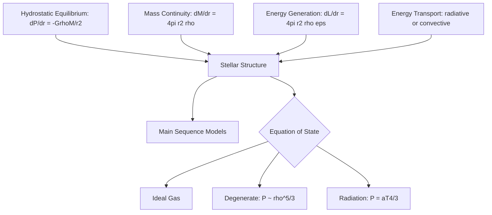
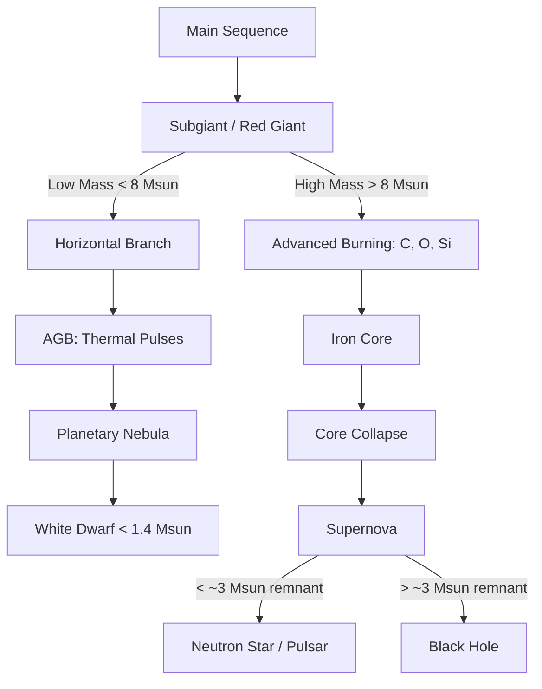
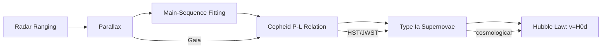

# Astrophysics

## References

- Carroll, B.W. & Ostlie, D.A. *An Introduction to Modern Astrophysics*, 2nd ed. (Cambridge, 2017)
- Ryden, B. *Introduction to Cosmology*, 2nd ed. (Cambridge, 2017)
- Binney, J. & Tremaine, S. *Galactic Dynamics*, 2nd ed. (Princeton, 2008)

---

## Part I: Stellar Structure (Weeks 1-4)

### Fundamental Equations of Stellar Structure

Four coupled differential equations govern a star in hydrostatic equilibrium:

**1. Hydrostatic equilibrium:**

$$\frac{dP}{dr} = -\frac{G\rho(r) M_r}{r^2}$$

**2. Mass continuity:**

$$\frac{dM_r}{dr} = 4\pi r^2 \rho(r)$$

**3. Energy generation:**

$$\frac{dL_r}{dr} = 4\pi r^2 \rho(r)\epsilon$$

where $\epsilon$ is the energy generation rate per unit mass.

**4. Energy transport:**

Radiative: $\frac{dT}{dr} = -\frac{3\kappa\rho L_r}{16\pi a c T^3 r^2}$

Convective: $\frac{dT}{dr} = \left(1 - \frac{1}{\gamma}\right)\frac{T}{P}\frac{dP}{dr}$ (adiabatic gradient)

### Equation of State

Ideal gas: $P = \frac{\rho k_B T}{\mu m_H}$ where $\mu$ is the mean molecular weight.

Radiation pressure: $P_{\text{rad}} = \frac{1}{3}aT^4$

Electron degeneracy pressure (non-relativistic): $P \propto \rho^{5/3}$ (white dwarfs).

Electron degeneracy pressure (relativistic): $P \propto \rho^{4/3}$ (Chandrasekhar limit).

### Opacity

Bound-free (photoionization), free-free (bremsstrahlung), electron scattering ($\kappa_{\text{es}} = 0.02(1+X)$ cm$^2$/g for hydrogen mass fraction $X$), bound-bound (line absorption).

Kramers opacity law: $\kappa \propto \rho T^{-7/2}$

### Virial Theorem

For a self-gravitating system in equilibrium:

$$2K + U_{\text{grav}} = 0$$

where $K$ is the total thermal energy and $U_{\text{grav}}$ the gravitational potential energy. Consequence: as a star radiates, it contracts and heats up.

---

## Part II: Nuclear Fusion and Energy Sources (Weeks 5-6)

### Nuclear Binding Energy

Binding energy per nucleon peaks at $^{56}$Fe. Fusion of light nuclei releases energy; fission of heavy nuclei does as well.

### Proton-Proton Chain

Dominant in stars with $M \lesssim 1.3 M_\odot$ and $T \lesssim 1.8 \times 10^7$ K:

$$4\,^1\text{H} \to\, ^4\text{He} + 2e^+ + 2\nu_e + 26.7\text{ MeV}$$

Three branches (pp I, pp II, pp III). Energy generation rate: $\epsilon_{pp} \propto \rho T^4$ (approximate).

### CNO Cycle

Dominant in stars with $M \gtrsim 1.3 M_\odot$:

$$^{12}\text{C} + 4\,^1\text{H} \to\, ^{12}\text{C} +\, ^4\text{He} + 2e^+ + 2\nu_e + 25.0\text{ MeV}$$

Carbon acts as a catalyst. Much steeper temperature dependence: $\epsilon_{\text{CNO}} \propto \rho T^{16}$.

### Triple-Alpha Process

Helium burning (red giant cores, $T \gtrsim 10^8$ K):

$$3\,^4\text{He} \to\, ^{12}\text{C} + 7.27\text{ MeV}$$

Proceeds via the unstable $^8$Be resonance. The Hoyle state of $^{12}$C is crucial.

---

## Part III: Stellar Evolution (Weeks 7-10)

### The Hertzsprung-Russell Diagram

Axes: luminosity ($L$) vs. effective temperature ($T_{\text{eff}}$) — or equivalently absolute magnitude vs. spectral type (O B A F G K M).

Main sequence: $L \propto M^{3.5}$ (approximately). Main-sequence lifetime: $\tau \propto M/L \propto M^{-2.5}$.

Sun: $T_{\text{eff}} \approx 5778$ K, $L_\odot = 3.828 \times 10^{26}$ W, $M_\odot = 1.989 \times 10^{30}$ kg.

### Post-Main-Sequence Evolution

**Low mass** ($M \lesssim 8 M_\odot$):
1. Hydrogen shell burning, red giant branch
2. Helium flash (for $M \lesssim 2 M_\odot$), horizontal branch
3. Asymptotic giant branch (AGB), thermal pulses
4. Planetary nebula ejection, white dwarf remnant

**High mass** ($M \gtrsim 8 M_\odot$):
1. Successive fusion stages: H, He, C, Ne, O, Si
2. Iron core formation (no further energy from fusion)
3. Core collapse, bounce, supernova explosion
4. Neutron star or black hole remnant

### Compact Objects

**White dwarfs**: supported by electron degeneracy pressure. Chandrasekhar limit:

$$M_{\text{Ch}} = 1.4\,M_\odot\left(\frac{2}{\mu_e}\right)^2$$

Mass-radius relation: $R \propto M^{-1/3}$ (more massive = smaller).

**Neutron stars**: supported by neutron degeneracy + nuclear forces. $M \sim 1.4$-$2.1\,M_\odot$, $R \sim 10$ km. Densities $\sim 10^{17}$ kg/m$^3$. Pulsars: rotating neutron stars with magnetic field $B \sim 10^8$-$10^{15}$ G.

**Black holes**: stellar mass ($\sim 3$-$100\,M_\odot$), supermassive ($10^6$-$10^{10}\,M_\odot$ in galactic centers).

---

## Part IV: Supernovae and Nucleosynthesis (Week 11)

### Type Ia Supernovae

White dwarf in binary system accretes matter, approaches $M_{\text{Ch}}$, thermonuclear detonation. Peak luminosity $\sim 10^{43}$ erg/s. Standardizable candles (Phillips relation) — used to discover dark energy.

### Core-Collapse Supernovae (Type II, Ib, Ic)

Iron core exceeds Chandrasekhar mass, electron capture ($e^- + p \to n + \nu_e$), collapse in $\sim 0.1$ s, bounce at nuclear density, shock wave + neutrino burst.

Energy budget: $\sim 3 \times 10^{53}$ erg total, 99% in neutrinos, $\sim 1$% kinetic energy of ejecta, $\sim 0.01$% in photons.

### Nucleosynthesis

- **Big Bang**: H, He, traces of Li
- **Stellar fusion**: He through Fe
- **s-process**: slow neutron capture in AGB stars (elements up to Bi)
- **r-process**: rapid neutron capture in supernovae / neutron star mergers (heavy elements, lanthanides, actinides)

---

## Part V: Galaxies, Exoplanets, and the Distance Ladder (Weeks 12-14)

### Galaxy Classification

Hubble sequence: ellipticals (E0-E7), spirals (Sa-Sd, barred SBa-SBd), lenticulars (S0), irregulars (Irr).

Milky Way: barred spiral (SBbc), $M \sim 10^{12} M_\odot$ (including dark matter halo), $R \sim 26$ kpc (disk), $\sim 2 \times 10^{11}$ stars.

### Galaxy Formation and Dark Matter

Rotation curves: $v(r) \approx \text{const}$ at large $r$, implying $M(r) \propto r$. Dark matter halo with NFW profile:

$$\rho(r) = \frac{\rho_0}{(r/r_s)(1+r/r_s)^2}$$

Hierarchical structure formation: small halos merge to form larger ones ($\Lambda$CDM cosmology).

### Exoplanets

Detection methods: radial velocity (Doppler), transit photometry ($\Delta F/F \sim (R_p/R_*)^2$), direct imaging, gravitational microlensing, astrometry.

Over 5000 confirmed exoplanets. Hot Jupiters, super-Earths, habitable zone planets. Kepler/TESS missions.

### Cosmological Distance Ladder

| Rung | Method | Range |
|------|--------|-------|
| 1 | Radar ranging | Solar system |
| 2 | Parallax ($d = 1/p''$ pc) | $\lesssim 1$ kpc (Gaia: $\sim 10$ kpc) |
| 3 | Main-sequence fitting | Star clusters |
| 4 | Cepheid period-luminosity ($M \propto -2.8\log P$) | $\lesssim 30$ Mpc (HST/JWST) |
| 5 | Type Ia supernovae | $\lesssim$ several Gpc |
| 6 | Hubble's law ($v = H_0 d$) | Cosmological distances |

Hubble tension: $H_0 \approx 73$ km/s/Mpc (local, Cepheids+SNIa) vs. $H_0 \approx 67$ km/s/Mpc (CMB, Planck). Discrepancy at $\sim 5\sigma$.

---

## Key Problem Types

1. **Stellar structure** — polytropic models, central temperature/pressure estimates
2. **Nuclear reactions** — pp chain rates, CNO energetics, Gamow peak
3. **HR diagram** — evolutionary tracks, main-sequence lifetime estimates
4. **Compact objects** — Chandrasekhar limit derivation, neutron star properties
5. **Distance ladder** — parallax, Cepheid calibration, SNIa cosmology
6. **Dark matter** — rotation curve fitting, virial mass estimates
