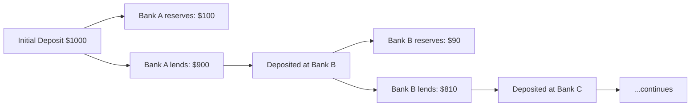
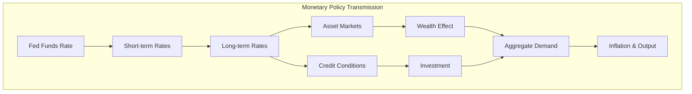
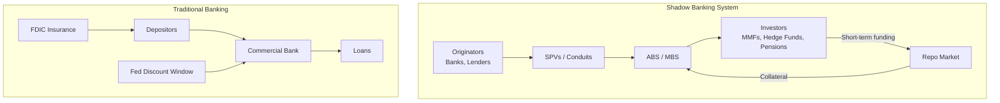

# Banking and Financial Institutions

## Part I: Money Creation and Fractional Reserve Banking

### The Money Multiplier

Under fractional reserve banking, the money supply $M$ is a multiple of the monetary base $B$:

$$M = \frac{B}{r}$$

where $r$ is the required reserve ratio. More precisely, with currency drain ratio $c$:

$$m = \frac{1 + c}{r + c}$$

### Deposit Expansion Process

When a bank receives a deposit $D_0$:
- Reserves held: $r \cdot D_0$
- Loans created: $(1-r) \cdot D_0$
- Total deposits after infinite rounds: $D_0 / r$

### Balance Sheet of a Commercial Bank

| Assets | Liabilities & Equity |
|---|---|
| Reserves (required + excess) | Demand deposits |
| Loans | Time deposits |
| Securities | Borrowings (interbank, Fed) |
| Fixed assets | Subordinated debt |
| | Equity capital |

**Net Interest Margin:**

$$\text{NIM} = \frac{\text{Interest Income} - \text{Interest Expense}}{\text{Earning Assets}}$$

## Part II: Central Banking and Monetary Policy

### Federal Reserve Tools

1. **Open Market Operations (OMO)** — Buy/sell Treasury securities to expand/contract reserves
2. **Discount Rate** — Rate charged to banks borrowing from the Fed's discount window
3. **Reserve Requirements** — Minimum reserves banks must hold (effectively 0% since March 2020)
4. **Interest on Reserves (IOR)** — Rate paid on excess reserves; sets floor for fed funds rate
5. **Quantitative Easing (QE)** — Large-scale asset purchases (Treasuries, MBS) to lower long-term rates

### Federal Funds Rate

$$\text{FFR} = \text{rate at which banks lend reserves overnight}$$

The Fed targets this rate; it transmits to the entire yield curve.

### Term Structure of Interest Rates

The yield curve plots yields vs maturity. Key theories:

| Theory | Key Idea |
|---|---|
| Pure Expectations | Forward rates = expected future spot rates |
| Liquidity Preference | Long-term rates include a liquidity premium |
| Segmented Markets | Each maturity segment has independent supply/demand |
| Preferred Habitat | Similar to segmented, but investors will shift for sufficient premium |

## Part III: Basel Accords and Bank Regulation

### Basel I (1988)
- Minimum capital ratio of 8% of risk-weighted assets (RWA)
- Simple risk weights: 0% (govts), 20% (banks), 50% (mortgages), 100% (corporate)

### Basel II (2004) — Three Pillars
1. **Minimum Capital** — Standardized and IRB approaches for credit risk; market and operational risk
2. **Supervisory Review** — Bank-specific risk assessment (ICAAP)
3. **Market Discipline** — Disclosure requirements

### Basel III (2010+)

**Capital Adequacy Ratio:**

$$\text{CAR} = \frac{\text{Tier 1 + Tier 2}}{\text{RWA}} \geq 8\%$$

Enhanced requirements:
- Common Equity Tier 1 (CET1) $\geq 4.5\%$
- Tier 1 Capital $\geq 6\%$
- Total Capital $\geq 8\%$
- Capital Conservation Buffer: $+2.5\%$
- Countercyclical Buffer: $0\%-2.5\%$
- G-SIB surcharge: $1\%-3.5\%$

**Liquidity Coverage Ratio (LCR):**

$$\text{LCR} = \frac{\text{HQLA}}{\text{Net Cash Outflows}_{30\text{-day}}} \geq 100\%$$

**Net Stable Funding Ratio (NSFR):**

$$\text{NSFR} = \frac{\text{Available Stable Funding}}{\text{Required Stable Funding}} \geq 100\%$$

**Leverage Ratio:**

$$\text{LR} = \frac{\text{Tier 1 Capital}}{\text{Total Exposure}} \geq 3\%$$

## Part IV: Investment Banking

### Core Functions

1. **Underwriting** — Firm commitment vs best efforts; book building, pricing, allocation
2. **M&A Advisory** — Buy-side and sell-side mandates; fairness opinions, deal structuring
3. **Sales & Trading** — Market making, proprietary trading (restricted post-Volcker Rule)
4. **Research** — Equity/credit research (Chinese wall separation from banking)

### IPO Process

Spread: $\text{Gross Spread} = \text{Offer Price} - \text{Price to Issuer}$ (typically 7% for US IPOs)

## Part V: Bank Runs and Financial Stability

### Diamond-Dybvig Model (1983)

Banks provide liquidity insurance by transforming illiquid long-term assets into liquid deposits. Two Nash equilibria:
1. **Good equilibrium**: Only early consumers withdraw early
2. **Bank run equilibrium**: All depositors rush to withdraw (self-fulfilling prophecy)

**Solutions:**
- Deposit insurance (FDIC: $250K per depositor per bank)
- Lender of last resort (Fed discount window)
- Suspension of convertibility

### Shadow Banking

Non-bank financial intermediation: money market funds, repo markets, securitization vehicles, hedge funds. Key risks:
- No deposit insurance
- No direct central bank access
- Susceptible to runs (e.g., repo market freeze in 2008, MMF breaking the buck)

## Part VI: Fintech and the Future of Banking

### Key Disruptions
- **Digital payments**: Mobile wallets, real-time payments (FedNow), stablecoins
- **Neobanks**: Digital-only banks (Chime, Revolut) — lower cost structure, no branches
- **Lending platforms**: Marketplace lending, BNPL (Buy Now Pay Later)
- **DeFi**: Decentralized lending/borrowing protocols (Aave, Compound)
- **Open banking**: API-driven data sharing (PSD2 in EU, Section 1033 in US)
- **CBDCs**: Central Bank Digital Currencies (digital yuan, digital euro pilots)

### Regulatory Challenges
- Charter vs fintech license; bank-fintech partnerships
- Consumer protection (fair lending, data privacy)
- AML/KYC compliance for crypto
- Systemic risk from Big Tech in finance

## References

- Mishkin, F.S. *The Economics of Money, Banking, and Financial Markets* (13th ed.). Pearson.
- Freixas, X. & Rochet, J.-C. *Microeconomics of Banking* (2nd ed.). MIT Press.
- Hull, J.C. *Risk Management and Financial Institutions* (5th ed.). Wiley.
- Diamond, D.W. & Dybvig, P.H. (1983). "Bank Runs, Deposit Insurance, and Liquidity." *JPE*, 91(3).
- Basel Committee on Banking Supervision. *Basel III: Finalising Post-Crisis Reforms* (2017).
