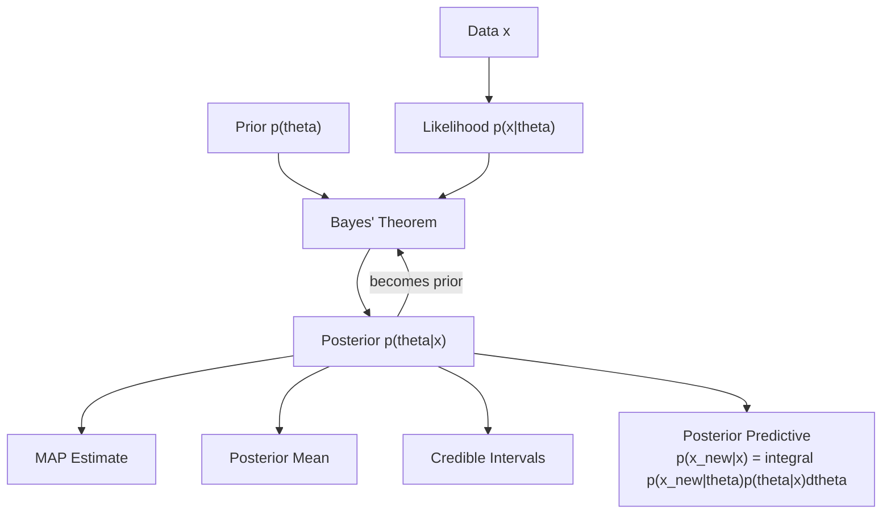
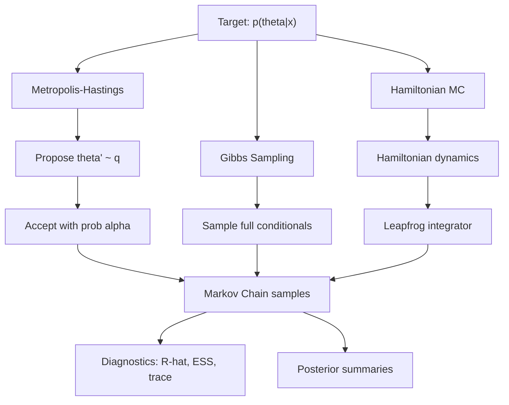
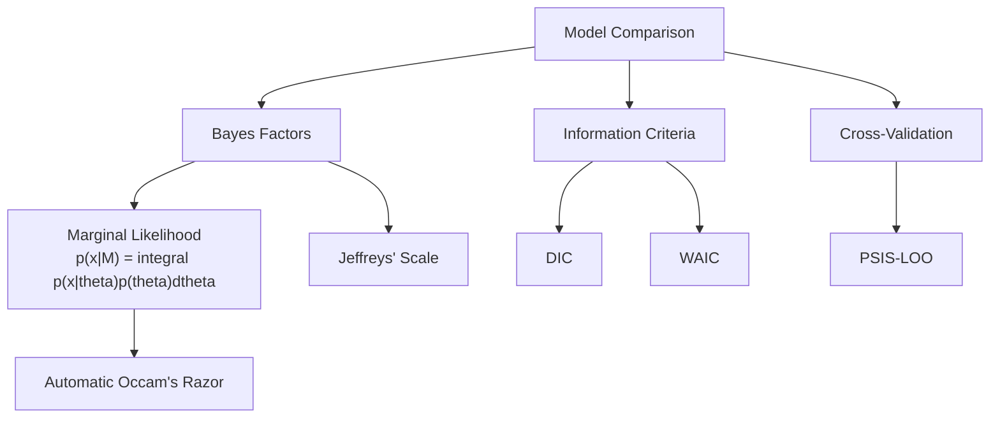

# Bayesian Statistics

> Inference as belief updating: combining prior knowledge with observed data through Bayes' theorem.

Related: [[causal-inference]] | [[stochastic-processes]] | [[time-series]]

---

## Part I: Foundations of Bayesian Inference (Weeks 1-3)

### 1.1 Bayes' Theorem

The core of Bayesian inference:

$$p(\theta \mid x) = \frac{p(x \mid \theta) \, p(\theta)}{p(x)} \propto p(x \mid \theta) \, p(\theta)$$

| Component | Name | Role |
|---|---|---|
| $p(\theta)$ | Prior | Belief about $\theta$ before data |
| $p(x \mid \theta)$ | Likelihood | Data-generating model |
| $p(\theta \mid x)$ | Posterior | Updated belief after data |
| $p(x) = \int p(x \mid \theta)p(\theta)\,d\theta$ | Evidence / Marginal likelihood | Normalizing constant |

### 1.2 Point Estimates

- **MAP** (Maximum a Posteriori): $\hat{\theta}_{\text{MAP}} = \arg\max_\theta \, p(\theta \mid x)$
- **Posterior mean**: $\hat{\theta}_{\text{PM}} = E[\theta \mid x] = \int \theta \, p(\theta \mid x) \, d\theta$
- **Posterior median**: minimizes expected absolute loss

The MAP reduces to the MLE when the prior is flat (uniform).

### 1.3 Credible Intervals

A $100(1-\alpha)\%$ **credible interval** $C$ satisfies $P(\theta \in C \mid x) = 1 - \alpha$.

The **highest posterior density** (HPD) region is the shortest such interval:

$$C_{\text{HPD}} = \{\theta : p(\theta \mid x) \geq c_\alpha\}$$

where $c_\alpha$ is chosen so that $P(\theta \in C_{\text{HPD}} \mid x) = 1 - \alpha$.

Unlike frequentist confidence intervals, $\theta$ is treated as random and the interval is fixed given data.

### 1.4 Conjugate Families

When prior and posterior belong to the same family, computation is tractable.

| Likelihood | Prior | Posterior | Posterior Parameters |
|---|---|---|---|
| $\text{Bin}(n, \theta)$ | $\text{Beta}(\alpha, \beta)$ | $\text{Beta}(\alpha + x, \beta + n - x)$ | Updates with successes/failures |
| $\mathcal{N}(\mu, \sigma^2)$ ($\sigma^2$ known) | $\mathcal{N}(\mu_0, \tau_0^2)$ | $\mathcal{N}(\mu_n, \tau_n^2)$ | $\mu_n = \frac{\tau_0^{-2}\mu_0 + n\sigma^{-2}\bar{x}}{\tau_0^{-2} + n\sigma^{-2}}$ |
| $\text{Poi}(\lambda)$ | $\text{Gamma}(\alpha, \beta)$ | $\text{Gamma}(\alpha + \sum x_i, \beta + n)$ | Updates with count and sample size |
| $\text{Exp}(\lambda)$ | $\text{Gamma}(\alpha, \beta)$ | $\text{Gamma}(\alpha + n, \beta + \sum x_i)$ | Updates with count and total time |

For the Normal-Normal case, the posterior precision is the sum of prior and data precisions:

$$\tau_n^{-2} = \tau_0^{-2} + n\sigma^{-2}$$

The posterior mean is a precision-weighted average of prior mean and sample mean.

---

## Part II: Bayesian Regression and Hierarchical Models (Weeks 4-6)

### 2.1 Bayesian Linear Regression

Model: $y = X\beta + \epsilon$, $\epsilon \sim \mathcal{N}(0, \sigma^2 I)$.

With prior $\beta \sim \mathcal{N}(\beta_0, \Sigma_0)$ and $\sigma^2$ known:

$$\beta \mid y \sim \mathcal{N}(\beta_n, \Sigma_n)$$

where:

$$\Sigma_n = \left(\Sigma_0^{-1} + \frac{1}{\sigma^2}X^TX\right)^{-1}, \quad \beta_n = \Sigma_n\left(\Sigma_0^{-1}\beta_0 + \frac{1}{\sigma^2}X^Ty\right)$$

Note: $\beta_0 = 0$ and $\Sigma_0 = \lambda^{-1}I$ recovers **ridge regression** as the MAP estimate.

### 2.2 Hierarchical / Multilevel Models

Parameters themselves have distributions governed by **hyperparameters**:

$$y_{ij} \mid \theta_j \sim p(y \mid \theta_j), \quad \theta_j \mid \phi \sim p(\theta \mid \phi), \quad \phi \sim p(\phi)$$

Example: **hierarchical Normal model** for $J$ groups:

$$y_{ij} \sim \mathcal{N}(\mu_j, \sigma^2), \quad \mu_j \sim \mathcal{N}(\mu, \tau^2)$$

The posterior mean $\hat{\mu}_j$ exhibits **shrinkage** toward the grand mean:

$$\hat{\mu}_j = \frac{\frac{n_j}{\sigma^2}\bar{y}_j + \frac{1}{\tau^2}\mu}{\frac{n_j}{\sigma^2} + \frac{1}{\tau^2}}$$

Groups with less data shrink more toward the grand mean (partial pooling).

### 2.3 Empirical Bayes

Estimate hyperparameters from the marginal likelihood:

$$\hat{\phi} = \arg\max_\phi \, p(y \mid \phi) = \arg\max_\phi \int p(y \mid \theta) p(\theta \mid \phi) \, d\theta$$

Then condition on $\hat{\phi}$ as if it were known. This is an approximation to the full Bayesian treatment but often works well in practice (James-Stein estimation is an example).

---

## Part III: Markov Chain Monte Carlo (Weeks 7-10)

### 3.1 The Monte Carlo Principle

To compute $E_p[g(\theta)] = \int g(\theta) p(\theta) \, d\theta$, draw samples $\theta^{(1)}, \ldots, \theta^{(S)} \sim p$ and approximate:

$$E_p[g(\theta)] \approx \frac{1}{S}\sum_{s=1}^{S} g(\theta^{(s)})$$

When direct sampling from $p(\theta \mid x)$ is infeasible, construct a Markov chain with $p(\theta \mid x)$ as its stationary distribution.

### 3.2 Metropolis-Hastings Algorithm

Given current state $\theta$, propose $\theta' \sim q(\theta' \mid \theta)$. Accept with probability:

$$\alpha(\theta, \theta') = \min\left(1, \frac{p(\theta' \mid x) \, q(\theta \mid \theta')}{p(\theta \mid x) \, q(\theta' \mid \theta)}\right)$$

Since we only need the posterior up to proportionality, the normalizing constant cancels:

$$\alpha(\theta, \theta') = \min\left(1, \frac{p(x \mid \theta') p(\theta') q(\theta \mid \theta')}{p(x \mid \theta) p(\theta) q(\theta' \mid \theta)}\right)$$

Special cases:
- **Random walk Metropolis:** $q(\theta' \mid \theta) = q(\theta \mid \theta')$ (symmetric), so $\alpha = \min(1, p(\theta'|x)/p(\theta|x))$.
- **Independence sampler:** $q(\theta' \mid \theta) = q(\theta')$.

### 3.3 Gibbs Sampling

When the joint posterior is complex but **full conditionals** are tractable, sample each parameter in turn:

$$\theta_j^{(s+1)} \sim p(\theta_j \mid \theta_{-j}^{(s)}, x)$$

where $\theta_{-j}$ denotes all parameters except $\theta_j$.

Gibbs sampling is a special case of Metropolis-Hastings with acceptance probability 1.

### 3.4 Diagnostics

- **Trace plots:** Visual check for stationarity and mixing
- **Gelman-Rubin $\hat{R}$:** Compare within-chain and between-chain variance. Target $\hat{R} < 1.01$.
- **Effective sample size (ESS):** $\text{ESS} = \frac{S}{1 + 2\sum_{k=1}^{\infty} \rho_k}$ where $\rho_k$ is the lag-$k$ autocorrelation.
- **Autocorrelation plots:** High autocorrelation signals poor mixing.

### 3.5 Hamiltonian Monte Carlo

Introduce auxiliary momentum variables $r \sim \mathcal{N}(0, M)$ and define the Hamiltonian:

$$H(\theta, r) = -\log p(\theta \mid x) + \frac{1}{2}r^T M^{-1} r$$

Simulate Hamiltonian dynamics using the **leapfrog integrator** with step size $\epsilon$ for $L$ steps:

$$r_{t+\epsilon/2} = r_t + \frac{\epsilon}{2}\nabla_\theta \log p(\theta_t \mid x)$$
$$\theta_{t+\epsilon} = \theta_t + \epsilon M^{-1}r_{t+\epsilon/2}$$
$$r_{t+\epsilon} = r_{t+\epsilon/2} + \frac{\epsilon}{2}\nabla_\theta \log p(\theta_{t+\epsilon} \mid x)$$

HMC makes distant proposals with high acceptance rates by following the geometry of the posterior. **NUTS** (No-U-Turn Sampler) adaptively selects $L$.

---

## Part IV: Variational Inference (Weeks 11-13)

### 4.1 The Evidence Lower Bound (ELBO)

Approximate the posterior $p(z \mid x)$ with a tractable family $q(z) \in \mathcal{Q}$:

$$\log p(x) = \mathcal{L}(q) + \text{KL}(q \| p(\cdot|x))$$

where the **ELBO** is:

$$\mathcal{L}(q) = E_q[\log p(x, z)] - E_q[\log q(z)] = E_q[\log p(x, z)] + H[q]$$

Since $\text{KL} \geq 0$, $\mathcal{L}(q) \leq \log p(x)$, and maximizing the ELBO is equivalent to minimizing $\text{KL}(q \| p(\cdot|x))$.

### 4.2 Mean-Field Variational Inference

Assume $q(z) = \prod_{j=1}^d q_j(z_j)$ (full factorization). The optimal factors satisfy:

$$\log q_j^*(z_j) = E_{-j}[\log p(x, z)] + \text{const}$$

Iterate coordinate ascent variational inference (CAVI) over each factor.

### 4.3 Stochastic Variational Inference (SVI)

Parameterize $q_\lambda(z)$ and optimize the ELBO using stochastic gradients:

$$\nabla_\lambda \mathcal{L}(\lambda) \approx \nabla_\lambda \log q_\lambda(z^{(s)}) \left[\log p(x, z^{(s)}) - \log q_\lambda(z^{(s)})\right]$$

The **reparameterization trick** (for continuous $z$): write $z = g(\lambda, \epsilon)$ with $\epsilon \sim p(\epsilon)$, then:

$$\nabla_\lambda \mathcal{L} = E_\epsilon[\nabla_\lambda(\log p(x, g(\lambda,\epsilon)) - \log q_\lambda(g(\lambda,\epsilon)))]$$

This yields lower-variance gradient estimates (used in VAEs).

---

## Part V: Model Comparison and Advanced Topics (Weeks 14-15)

### 5.1 Bayesian Model Comparison

The **Bayes factor** comparing models $M_1$ and $M_2$:

$$B_{12} = \frac{p(x \mid M_1)}{p(x \mid M_2)} = \frac{\int p(x \mid \theta_1, M_1)p(\theta_1 \mid M_1)\,d\theta_1}{\int p(x \mid \theta_2, M_2)p(\theta_2 \mid M_2)\,d\theta_2}$$

| $\log_{10} B_{12}$ | Evidence for $M_1$ |
|---|---|
| 0 to 0.5 | Barely worth mentioning |
| 0.5 to 1 | Substantial |
| 1 to 2 | Strong |
| > 2 | Decisive |

(Jeffreys' scale)

The Bayes factor automatically penalizes model complexity through the prior predictive distribution (Occam's razor).

### 5.2 Information Criteria

- **DIC:** $\text{DIC} = -2\log p(x \mid \hat{\theta}_{\text{Bayes}}) + 2p_D$ where $p_D$ is the effective number of parameters.
- **WAIC:** $\text{WAIC} = -2\sum_i \log E_{\text{post}}[p(x_i \mid \theta)] + 2\sum_i \text{Var}_{\text{post}}[\log p(x_i \mid \theta)]$.
- **LOO-CV** via Pareto-smoothed importance sampling (PSIS-LOO).

### 5.3 Bayesian Nonparametrics

- **Dirichlet Process** $G \sim \text{DP}(\alpha, G_0)$: infinite mixture models, clustering without specifying $K$.
- **Gaussian Process** $f \sim \text{GP}(m, k)$: prior over functions with $f(x) \mid f(X) \sim \mathcal{N}(\mu_*, \Sigma_*)$.

---

## References

1. Gelman, A., Carlin, J. B., Stern, H. S., Dunson, D. B., Vehtari, A. & Rubin, D. B. *Bayesian Data Analysis*. 3rd ed., CRC Press, 2013.
2. Murphy, K. P. *Machine Learning: A Probabilistic Perspective*. MIT Press, 2012.
3. Robert, C. P. *The Bayesian Choice*. 2nd ed., Springer, 2007.
4. Bishop, C. M. *Pattern Recognition and Machine Learning*. Springer, 2006.
5. McElreath, R. *Statistical Rethinking*. 2nd ed., CRC Press, 2020.
6. Blei, D. M., Kucukelbir, A. & McAuliffe, J. D. "Variational Inference: A Review for Statisticians." *JASA*, 112(518), 2017.
