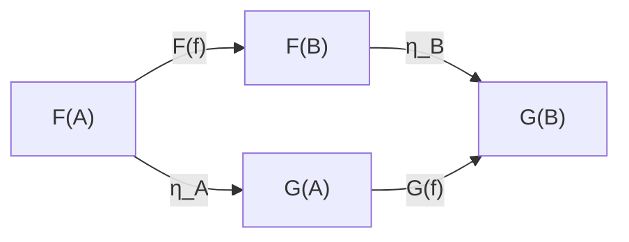
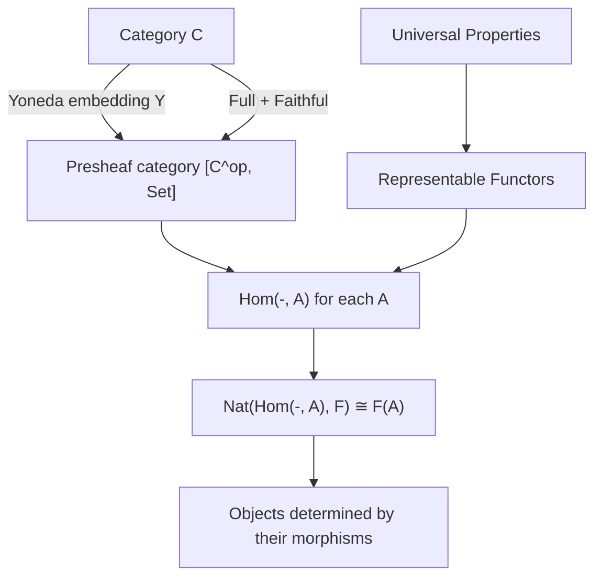

# Category Theory

A graduate-level course covering categories, functors, natural transformations, universal properties, adjunctions, the Yoneda lemma, and monads.

**Prerequisites:** Abstract algebra (groups, rings), basic topology helpful. Familiarity with proof techniques.
**Related courses:** [[logic-proof-theory]], [[set-theory]]

---

## Part I: Categories and Morphisms

### Week 1: Definition and Examples

**Definition:** A **category** $\mathcal{C}$ consists of:
1. A collection $\text{Ob}(\mathcal{C})$ of **objects**.
2. For each pair of objects $A, B$, a collection $\text{Hom}_{\mathcal{C}}(A, B)$ of **morphisms** (arrows) from $A$ to $B$.
3. For each triple $A, B, C$, a **composition** map $\circ : \text{Hom}(B, C) \times \text{Hom}(A, B) \to \text{Hom}(A, C)$.
4. For each object $A$, an **identity morphism** $\text{id}_A \in \text{Hom}(A, A)$.

Subject to:
- **Associativity:** $h \circ (g \circ f) = (h \circ g) \circ f$
- **Identity:** $f \circ \text{id}_A = f = \text{id}_B \circ f$ for $f: A \to B$

**Fundamental examples:**

| Category | Objects | Morphisms |
|----------|---------|-----------|
| $\mathbf{Set}$ | Sets | Functions |
| $\mathbf{Grp}$ | Groups | Group homomorphisms |
| $\mathbf{Ring}$ | Rings | Ring homomorphisms |
| $\mathbf{Top}$ | Topological spaces | Continuous maps |
| $\mathbf{Vect}_k$ | $k$-vector spaces | Linear maps |
| $\mathbf{Pos}$ | Posets | Order-preserving maps |
| Any poset $(P, \leq)$ | Elements of $P$ | Unique arrow $a \to b$ iff $a \leq b$ |
| Any group $G$ | Single object $\bullet$ | Elements of $G$ (composition = multiplication) |
| Any monoid $M$ | Single object $\bullet$ | Elements of $M$ |

**Special morphisms:**
- **Isomorphism:** $f: A \to B$ with two-sided inverse $g: B \to A$ ($g \circ f = \text{id}_A$, $f \circ g = \text{id}_B$)
- **Monomorphism (mono):** $f \circ g_1 = f \circ g_2 \implies g_1 = g_2$ (left-cancellable; generalizes injections)
- **Epimorphism (epi):** $g_1 \circ f = g_2 \circ f \implies g_1 = g_2$ (right-cancellable; generalizes surjections)

**Opposite category:** $\mathcal{C}^{\text{op}}$ has the same objects but $\text{Hom}_{\mathcal{C}^{\text{op}}}(A, B) = \text{Hom}_{\mathcal{C}}(B, A)$.

### Week 2: Duality and Constructions

**Duality principle:** Every categorical statement has a dual obtained by reversing all arrows. If a statement is true in all categories, so is its dual.

**Product:** An object $A \times B$ with projections $\pi_1: A \times B \to A$, $\pi_2: A \times B \to B$ satisfying the universal property: for any $C$ with morphisms $f: C \to A$, $g: C \to B$, there exists a unique $\langle f, g \rangle: C \to A \times B$ with $\pi_1 \circ \langle f, g \rangle = f$ and $\pi_2 \circ \langle f, g \rangle = g$.

**Coproduct (dual of product):** $A \sqcup B$ with injections $\iota_1: A \to A \sqcup B$, $\iota_2: B \to A \sqcup B$.

| Concept | $\mathbf{Set}$ | $\mathbf{Grp}$ | $\mathbf{Top}$ | $\mathbf{Vect}_k$ |
|---------|------|------|------|----------|
| Product | Cartesian product | Direct product | Product topology | Direct sum (finite) |
| Coproduct | Disjoint union | Free product | Disjoint union | Direct sum |
| Terminal | $\{*\}$ | $\{e\}$ | $\{*\}$ | $\{0\}$ |
| Initial | $\emptyset$ | $\{e\}$ | $\emptyset$ | $\{0\}$ |

---

## Part II: Functors and Natural Transformations

### Week 3: Functors

**Definition:** A **(covariant) functor** $F: \mathcal{C} \to \mathcal{D}$ assigns:
- To each object $A \in \mathcal{C}$, an object $F(A) \in \mathcal{D}$.
- To each morphism $f: A \to B$, a morphism $F(f): F(A) \to F(B)$.

Preserving composition and identities:

$$F(g \circ f) = F(g) \circ F(f), \qquad F(\text{id}_A) = \text{id}_{F(A)}$$

A **contravariant functor** $F: \mathcal{C} \to \mathcal{D}$ reverses arrows: $F(f): F(B) \to F(A)$. Equivalently, a covariant functor $\mathcal{C}^{\text{op}} \to \mathcal{D}$.

**Key examples:**
- **Forgetful functor** $U: \mathbf{Grp} \to \mathbf{Set}$: sends a group to its underlying set.
- **Free functor** $F: \mathbf{Set} \to \mathbf{Grp}$: sends a set to the free group on it.
- **Power set functor** $\mathcal{P}: \mathbf{Set} \to \mathbf{Set}$: $A \mapsto \mathcal{P}(A)$, $f \mapsto f_*$ (direct image).
- **Hom-functors:** $\text{Hom}(A, -): \mathcal{C} \to \mathbf{Set}$ is covariant; $\text{Hom}(-, B): \mathcal{C}^{\text{op}} \to \mathbf{Set}$ is contravariant.
- **Fundamental groupoid** $\Pi_1: \mathbf{Top} \to \mathbf{Grpd}$.

**Faithful, full, essentially surjective:** A functor $F$ is **faithful** if injective on hom-sets, **full** if surjective on hom-sets, **essentially surjective** if every object of $\mathcal{D}$ is isomorphic to some $F(A)$. An **equivalence of categories** is a functor that is full, faithful, and essentially surjective.

### Week 4: Natural Transformations

**Definition:** Given functors $F, G: \mathcal{C} \to \mathcal{D}$, a **natural transformation** $\eta: F \Rightarrow G$ is a family of morphisms $\eta_A: F(A) \to G(A)$ indexed by objects of $\mathcal{C}$, such that for every $f: A \to B$:

$$\eta_B \circ F(f) = G(f) \circ \eta_A$$

This is the **naturality square:**

**Natural isomorphism:** $\eta: F \Rightarrow G$ where each $\eta_A$ is an isomorphism. Write $F \cong G$.

**Functor category:** $[\mathcal{C}, \mathcal{D}]$ or $\mathcal{D}^{\mathcal{C}}$ has functors $\mathcal{C} \to \mathcal{D}$ as objects and natural transformations as morphisms. Composition: $(\epsilon \circ \eta)_A = \epsilon_A \circ \eta_A$.

**Example:** The double-dual natural transformation $\eta_V: V \to V^{**}$, defined by $\eta_V(v)(\varphi) = \varphi(v)$, is a natural transformation from $\text{Id}_{\mathbf{Vect}_k}$ to $(-)^{**}$. It is a natural isomorphism when restricted to finite-dimensional spaces.

---

## Part III: Universal Properties, Limits, Colimits

### Week 5: Universal Properties

**Definition:** A construction is characterized by a **universal property** if it is defined (up to unique isomorphism) by a mapping property — typically "for all ... there exists a unique ...".

**Terminal object:** $1 \in \mathcal{C}$ such that $\forall A \in \mathcal{C}$, $|\text{Hom}(A, 1)| = 1$.

**Initial object:** $0 \in \mathcal{C}$ such that $\forall A \in \mathcal{C}$, $|\text{Hom}(0, A)| = 1$.

**Theorem:** Universal objects, when they exist, are unique up to unique isomorphism.

*Proof:* If $X$ and $X'$ both satisfy the universal property, there exist unique maps $f: X \to X'$ and $g: X' \to X$. Then $g \circ f: X \to X$ must equal $\text{id}_X$ by uniqueness, and similarly $f \circ g = \text{id}_{X'}$. $\blacksquare$

### Week 6: Limits and Colimits

**Diagram:** A functor $D: \mathcal{J} \to \mathcal{C}$ from a small "index" category $\mathcal{J}$.

**Cone over $D$:** An object $N$ with morphisms $\psi_j: N \to D(j)$ for each $j \in \mathcal{J}$, commuting with $D$.

**Limit:** A universal cone $(\lim D, \{\pi_j\})$. For any other cone $(N, \{\psi_j\})$, there exists a unique $u: N \to \lim D$ with $\pi_j \circ u = \psi_j$ for all $j$.

**Colimit:** Dual — a universal cocone.

| Index category $\mathcal{J}$ | Limit | Colimit |
|-----------------------------|-------|---------|
| Discrete (two objects) | Product $A \times B$ | Coproduct $A \sqcup B$ |
| $\bullet \rightrightarrows \bullet$ | Equalizer | Coequalizer |
| $\bullet \to \bullet \leftarrow \bullet$ | Pullback (fiber product) | — |
| $\bullet \leftarrow \bullet \to \bullet$ | — | Pushout |
| Empty | Terminal object | Initial object |

**Theorem:** A category has all (small) limits iff it has all products and all equalizers. Dually for colimits.

**Theorem:** $\text{Hom}(A, -)$ preserves all limits: $\text{Hom}(A, \lim D_j) \cong \lim \text{Hom}(A, D_j)$. (Right adjoints preserve limits.)

---

## Part IV: Adjunctions

### Week 7: Definition and Examples

**Definition:** An **adjunction** $F \dashv G$ between categories $\mathcal{C}$ and $\mathcal{D}$ consists of functors $F: \mathcal{C} \to \mathcal{D}$ (left adjoint) and $G: \mathcal{D} \to \mathcal{C}$ (right adjoint) with a natural isomorphism:

$$\text{Hom}_{\mathcal{D}}(F(A), B) \cong \text{Hom}_{\mathcal{C}}(A, G(B))$$

natural in both $A$ and $B$.

**Unit and counit:** The adjunction determines natural transformations:
- **Unit:** $\eta: \text{Id}_{\mathcal{C}} \Rightarrow GF$, with $\eta_A: A \to GF(A)$
- **Counit:** $\epsilon: FG \Rightarrow \text{Id}_{\mathcal{D}}$, with $\epsilon_B: FG(B) \to B$

satisfying the **triangle identities:**

$$\epsilon_{F(A)} \circ F(\eta_A) = \text{id}_{F(A)} \qquad G(\epsilon_B) \circ \eta_{G(B)} = \text{id}_{G(B)}$$

**Fundamental examples:**

| Left adjoint $F$ | Right adjoint $G$ | $\mathcal{C}$ | $\mathcal{D}$ |
|---|---|---|---|
| Free group | Forgetful | $\mathbf{Set}$ | $\mathbf{Grp}$ |
| Free module $R \otimes_\mathbb{Z} -$ | Forgetful | $\mathbf{Ab}$ | $R\text{-}\mathbf{Mod}$ |
| $- \times A$ | $(-)^A$ (internal hom) | $\mathbf{Set}$ | $\mathbf{Set}$ |
| $- \otimes_R M$ | $\text{Hom}_R(M, -)$ | $R\text{-}\mathbf{Mod}$ | $R\text{-}\mathbf{Mod}$ |
| Discrete topology | Forgetful | $\mathbf{Set}$ | $\mathbf{Top}$ |
| Forgetful | Indiscrete topology | $\mathbf{Top}$ | $\mathbf{Set}$ |
| Left Kan extension | Restriction | Functor cat. | Functor cat. |

### Week 8: Properties of Adjoints

**Theorem (RAPL):** Right adjoints preserve limits. Left adjoints preserve colimits.

*Proof sketch (RAPL):* Let $G: \mathcal{D} \to \mathcal{C}$ be right adjoint to $F$. For a diagram $D: \mathcal{J} \to \mathcal{D}$ with limit $L$:

$$\text{Hom}_{\mathcal{C}}(A, G(L)) \cong \text{Hom}_{\mathcal{D}}(F(A), L) \cong \lim_j \text{Hom}_{\mathcal{D}}(F(A), D(j)) \cong \lim_j \text{Hom}_{\mathcal{C}}(A, G(D(j)))$$

By Yoneda, $G(L) \cong \lim_j G(D(j))$. $\blacksquare$

**Theorem (Freyd's Adjoint Functor Theorem):** A functor $G: \mathcal{D} \to \mathcal{C}$ from a complete, locally small category $\mathcal{D}$ has a left adjoint iff $G$ preserves all small limits and satisfies the **solution set condition**.

---

## Part V: The Yoneda Lemma

### Week 9: Representable Functors and Yoneda

**Representable functor:** A functor $F: \mathcal{C}^{\text{op}} \to \mathbf{Set}$ is **representable** if $F \cong \text{Hom}(-, A)$ for some $A \in \mathcal{C}$. The object $A$ is the **representing object**.

**The Yoneda embedding:** The functor $\mathcal{Y}: \mathcal{C} \to [\mathcal{C}^{\text{op}}, \mathbf{Set}]$ defined by $\mathcal{Y}(A) = \text{Hom}(-, A)$.

**Lemma (Yoneda):** For any functor $F: \mathcal{C}^{\text{op}} \to \mathbf{Set}$ and object $A \in \mathcal{C}$:

$$\text{Nat}(\text{Hom}(-, A),\, F) \cong F(A)$$

naturally in both $A$ and $F$.

*Proof:*

Define $\Phi: \text{Nat}(\text{Hom}(-, A), F) \to F(A)$ by $\Phi(\eta) = \eta_A(\text{id}_A)$.

Define $\Psi: F(A) \to \text{Nat}(\text{Hom}(-, A), F)$ by $\Psi(x)_B(f) = F(f)(x)$ for $f: B \to A$.

**$\Psi(x)$ is natural:** For $g: C \to B$, we need $\Psi(x)_C \circ \text{Hom}(g, A) = F(g) \circ \Psi(x)_B$. For $f: B \to A$:

$$\Psi(x)_C(f \circ g) = F(f \circ g)(x) = F(g)(F(f)(x)) = F(g)(\Psi(x)_B(f))$$

This holds by functoriality of $F$. $\checkmark$

**$\Phi \circ \Psi = \text{id}$:** $\Phi(\Psi(x)) = \Psi(x)_A(\text{id}_A) = F(\text{id}_A)(x) = x$. $\checkmark$

**$\Psi \circ \Phi = \text{id}$:** For $\eta: \text{Hom}(-, A) \Rightarrow F$ and $f: B \to A$:

$$\Psi(\Phi(\eta))_B(f) = F(f)(\eta_A(\text{id}_A))$$

By naturality of $\eta$ at $f: B \to A$: $\eta_B(f) = \eta_B(\text{Hom}(f, A)(\text{id}_A)) = F(f)(\eta_A(\text{id}_A))$.

So $\Psi(\Phi(\eta))_B(f) = \eta_B(f)$ for all $B, f$. $\checkmark$ $\blacksquare$

**Corollary (Yoneda embedding is fully faithful):** Setting $F = \text{Hom}(-, B)$:

$$\text{Nat}(\text{Hom}(-, A), \text{Hom}(-, B)) \cong \text{Hom}(A, B)$$

So $\mathcal{Y}$ is full and faithful: $\mathcal{C}$ embeds into $[\mathcal{C}^{\text{op}}, \mathbf{Set}]$.

**Philosophical significance:** Every category embeds into a category of "generalized sets" (presheaves). Objects are completely determined by the morphisms into them.

---

## Part VI: Monads

### Week 10: Monads from Adjunctions

**Definition:** A **monad** on a category $\mathcal{C}$ is a triple $(T, \eta, \mu)$ where:
- $T: \mathcal{C} \to \mathcal{C}$ is an endofunctor
- $\eta: \text{Id}_{\mathcal{C}} \Rightarrow T$ is the **unit**
- $\mu: T^2 \Rightarrow T$ is the **multiplication**

satisfying:

$$\mu \circ T\mu = \mu \circ \mu T \qquad \text{(associativity)}$$
$$\mu \circ T\eta = \text{id}_T = \mu \circ \eta T \qquad \text{(unit laws)}$$

Equivalently, a monad is a monoid in the category of endofunctors $[\mathcal{C}, \mathcal{C}]$.

**From adjunctions:** Every adjunction $F \dashv G$ gives rise to a monad $T = GF$ with unit $\eta$ and multiplication $\mu = G \epsilon F$.

**Examples:**
- **Free monoid monad** on $\mathbf{Set}$: $T(X) = \bigsqcup_{n \geq 0} X^n$ (the "list" monad).
- **Power set monad:** $T = \mathcal{P}: \mathbf{Set} \to \mathbf{Set}$, $\eta_A(a) = \{a\}$, $\mu_A(\mathcal{A}) = \bigcup \mathcal{A}$.
- **Maybe monad:** $T(X) = X \sqcup \{*\}$ (adjoining a "failure" element).
- **Distribution monad:** $T(X)$ = finitely supported probability distributions on $X$.

### Week 11: Kleisli and Eilenberg-Moore Categories

**Kleisli category** $\mathcal{C}_T$: Objects are objects of $\mathcal{C}$. Morphisms $A \to B$ in $\mathcal{C}_T$ are morphisms $A \to T(B)$ in $\mathcal{C}$. Composition of $f: A \to T(B)$ and $g: B \to T(C)$:

$$g \circ_T f = \mu_C \circ T(g) \circ f$$

**Eilenberg-Moore category** $\mathcal{C}^T$ (category of $T$-algebras): Objects are pairs $(A, h: T(A) \to A)$ satisfying:

$$h \circ \eta_A = \text{id}_A \qquad h \circ \mu_A = h \circ T(h)$$

**Theorem (Beck):** Both $\mathcal{C}_T$ and $\mathcal{C}^T$ produce adjunctions that recover $T$. The Kleisli category gives the initial such adjunction, Eilenberg-Moore gives the terminal one.

**Beck's monadicity theorem:** A functor $G: \mathcal{D} \to \mathcal{C}$ with a left adjoint is **monadic** (i.e., $\mathcal{D} \simeq \mathcal{C}^T$ for $T = GF$) iff $G$ reflects isomorphisms and $\mathcal{D}$ has coequalizers of $G$-split pairs.

### Week 12: Monads in Computer Science

In functional programming (Haskell, Scala), a monad encapsulates computational effects:

| Monad | $T(A)$ | Computational Effect |
|-------|--------|---------------------|
| Maybe | $A + 1$ | Partial computation |
| List | $\bigsqcup_{n \geq 0} A^n$ | Non-determinism |
| Reader $E$ | $A^E$ | Environment access |
| Writer $W$ | $A \times W$ | Logging ($W$ a monoid) |
| State $S$ | $(A \times S)^S$ | Mutable state |
| Continuation $R$ | $R^{R^A}$ | CPS / control flow |

The **Kleisli composition** $g \circ_T f$ models sequencing effectful computations — the "bind" operation $\texttt{>>=}$ in Haskell.

---

## Part VII: Abelian Categories (Preview)

### Week 13: Toward Homological Algebra

**Definition:** An **abelian category** is a category $\mathcal{A}$ that:
1. Is enriched over $\mathbf{Ab}$ (hom-sets are abelian groups; composition is bilinear).
2. Has a zero object $0$ (both initial and terminal).
3. Has all finite products and coproducts (which coincide: biproducts).
4. Has all kernels and cokernels.
5. Every monomorphism is a kernel; every epimorphism is a cokernel.

**Examples:** $R\text{-}\mathbf{Mod}$, $\mathbf{Ab}$, sheaves of abelian groups on a topological space.

**Exact sequences:** A sequence $A \xrightarrow{f} B \xrightarrow{g} C$ is **exact at $B$** if $\text{im}(f) = \ker(g)$.

**Short exact sequence:** $0 \to A \xrightarrow{f} B \xrightarrow{g} C \to 0$ with $f$ mono, $g$ epi, and exactness at $B$.

**Key constructions enabled:**
- Chain complexes and homology: $H_n = \ker d_n / \text{im}\, d_{n+1}$
- Derived functors: $\text{Ext}$, $\text{Tor}$ (via projective/injective resolutions)
- Snake lemma, five lemma, long exact sequence
- Derived categories (Verdier): the natural "homotopy-theoretic" localization

**Theorem (Freyd-Mitchell Embedding):** Every small abelian category embeds exactly into $R\text{-}\mathbf{Mod}$ for some ring $R$. This justifies diagram chasing arguments.

---

## References

1. Mac Lane, S. *Categories for the Working Mathematician*. 2nd ed. Springer, 1998.
2. Awodey, S. *Category Theory*. 2nd ed. Oxford University Press, 2010.
3. Riehl, E. *Category Theory in Context*. Dover, 2016. (Freely available at [math.jhu.edu/~eriehl/context.pdf](https://math.jhu.edu/~eriehl/context.pdf))
4. Leinster, T. *Basic Category Theory*. Cambridge University Press, 2014.
5. Borceux, F. *Handbook of Categorical Algebra* (3 vols). Cambridge University Press, 1994.
6. Weibel, C. A. *An Introduction to Homological Algebra*. Cambridge University Press, 1994.
7. Moggi, E. "Notions of Computation and Monads." *Information and Computation*, 93(1), 1991.
