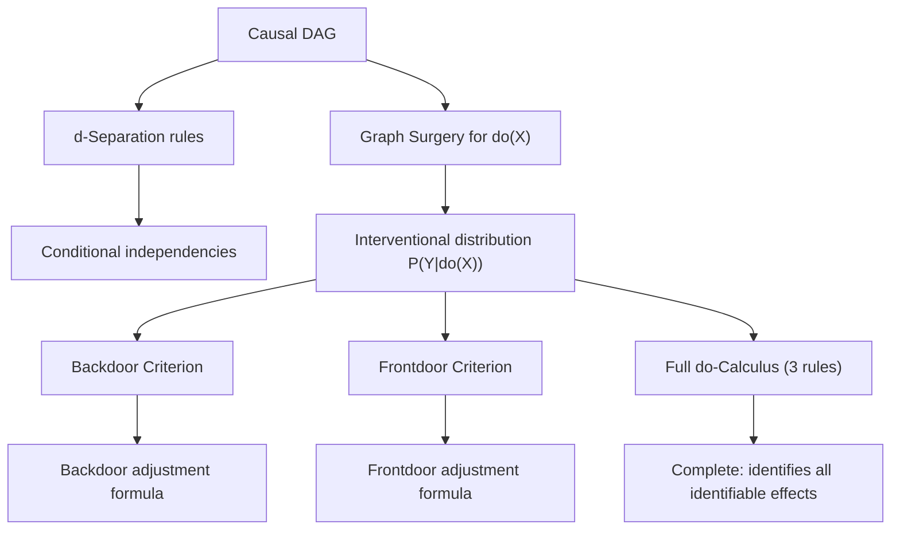
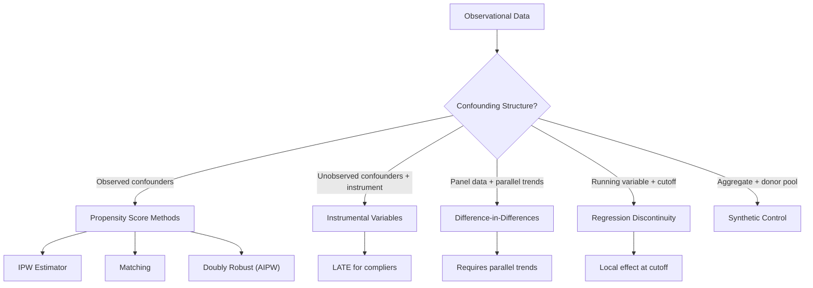
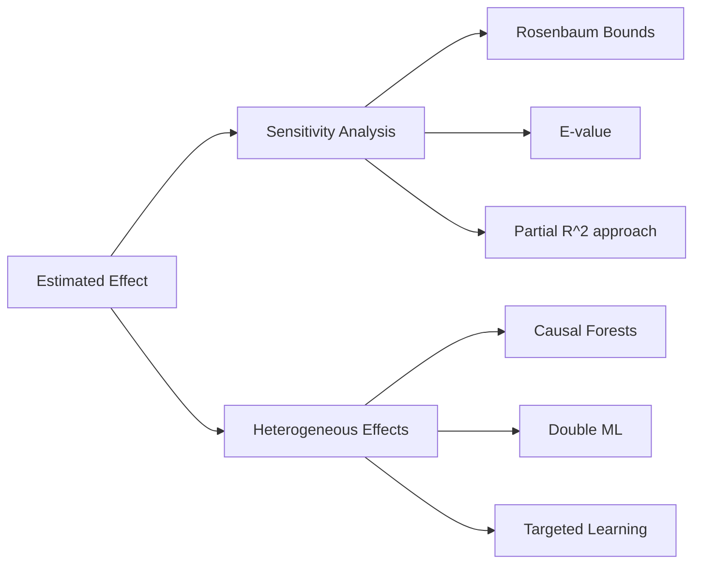

# Causal Inference

> Moving beyond association to causation: frameworks for identifying and estimating causal effects from observational and experimental data.

Related: [[bayesian-statistics]] | [[time-series]] | [[stochastic-processes]]

---

## Part I: Potential Outcomes Framework (Weeks 1-3)

### 1.1 The Fundamental Problem

For each unit $i$, define **potential outcomes**:

- $Y_i(1)$: outcome if treated
- $Y_i(0)$: outcome if not treated

The **individual treatment effect**: $\tau_i = Y_i(1) - Y_i(0)$.

**Fundamental problem of causal inference:** We observe at most one potential outcome per unit.

The observed outcome: $Y_i = T_i Y_i(1) + (1 - T_i)Y_i(0)$ where $T_i \in \{0, 1\}$ is the treatment indicator.

### 1.2 Average Treatment Effects

$$\text{ATE} = \tau = E[Y(1) - Y(0)]$$
$$\text{ATT} = E[Y(1) - Y(0) \mid T = 1]$$
$$\text{ATU} = E[Y(1) - Y(0) \mid T = 0]$$

**Selection bias:**

$$E[Y \mid T=1] - E[Y \mid T=0] = \underbrace{E[Y(1) - Y(0) \mid T=1]}_{\text{ATT}} + \underbrace{E[Y(0) \mid T=1] - E[Y(0) \mid T=0]}_{\text{Selection bias}}$$

### 1.3 SUTVA and Ignorability

**SUTVA** (Stable Unit Treatment Value Assumption):
1. No interference: $Y_i$ depends only on $T_i$, not $T_j$ for $j \neq i$
2. No hidden versions of treatment: treatment is well-defined

**Strong ignorability** (unconfoundedness + overlap):

$$\{Y(0), Y(1)\} \perp\!\!\!\perp T \mid X \quad \text{and} \quad 0 < P(T=1 \mid X=x) < 1 \text{ for all } x$$

Under ignorability:

$$\tau(x) = E[Y \mid T=1, X=x] - E[Y \mid T=0, X=x]$$

$$\text{ATE} = E_X[\tau(X)]$$

### 1.4 Randomized Experiments

Randomization ensures $T \perp\!\!\!\perp \{Y(0), Y(1)\}$, so the simple difference in means is unbiased:

$$\hat{\tau} = \bar{Y}_1 - \bar{Y}_0$$

with variance $\text{Var}(\hat{\tau}) = \frac{S_1^2}{n_1} + \frac{S_0^2}{n_0}$ (Neyman's estimator).

Fisher's **sharp null** $H_0: Y_i(1) = Y_i(0)$ for all $i$ enables exact permutation tests.

---

## Part II: Graphical Causal Models (Weeks 4-6)

### 2.1 DAGs and Structural Causal Models

A **Directed Acyclic Graph** (DAG) encodes causal assumptions. Each node $X_j$ is generated by:

$$X_j = f_j(\text{pa}(X_j), U_j)$$

where $\text{pa}(X_j)$ are parents in the DAG and $U_j$ is exogenous noise.

The DAG implies conditional independencies via the **Markov property**:

$$p(x_1, \ldots, x_d) = \prod_{j=1}^{d} p(x_j \mid \text{pa}(x_j))$$

### 2.2 d-Separation

A path between $X$ and $Y$ is **blocked** by conditioning set $Z$ if:

1. The path contains a chain $A \to M \to B$ or fork $A \leftarrow M \to B$ with $M \in Z$
2. The path contains a **collider** $A \to C \leftarrow B$ with $C \notin Z$ and no descendant of $C$ in $Z$

$X \perp\!\!\!\perp Y \mid Z$ in the DAG iff every path from $X$ to $Y$ is blocked by $Z$ (d-separated).

### 2.3 The do-Calculus

Pearl's **do-operator** represents intervention (setting $X = x$ externally):

$$P(Y \mid do(X = x)) \neq P(Y \mid X = x)$$

The interventional distribution is obtained by **graph surgery** (removing incoming edges to $X$):

$$P(Y \mid do(X = x)) = \sum_z P(Y \mid X = x, Z = z) P(Z = z) \quad \text{(if } Z \text{ satisfies backdoor)}$$

**Three rules of do-calculus** (each with a graphical criterion):

1. **Insertion/deletion of observations:** $P(Y \mid do(X), Z, W) = P(Y \mid do(X), W)$ if $(Y \perp\!\!\!\perp Z \mid X, W)_{G_{\overline{X}}}$
2. **Action/observation exchange:** $P(Y \mid do(X), do(Z), W) = P(Y \mid do(X), Z, W)$ if $(Y \perp\!\!\!\perp Z \mid X, W)_{G_{\overline{X}, \underline{Z}}}$
3. **Insertion/deletion of actions:** $P(Y \mid do(X), do(Z), W) = P(Y \mid do(X), W)$ if $(Y \perp\!\!\!\perp Z \mid X, W)_{G_{\overline{X}, \overline{Z(S)}}}$

These three rules are **complete**: if a causal effect is identifiable from the DAG, the do-calculus can derive it.

### 2.4 Backdoor and Frontdoor Criteria

**Backdoor criterion:** $Z$ satisfies the backdoor criterion relative to $(X, Y)$ if:
1. No node in $Z$ is a descendant of $X$
2. $Z$ blocks every path between $X$ and $Y$ that contains an arrow into $X$

**Backdoor adjustment:**

$$P(Y \mid do(X = x)) = \sum_z P(Y \mid X = x, Z = z) P(Z = z)$$

**Frontdoor criterion:** When $X \to M \to Y$ with unobserved confounder $U$ between $X$ and $Y$, but $M$ is fully observed:

$$P(Y \mid do(X)) = \sum_m P(M = m \mid X) \sum_{x'} P(Y \mid X = x', M = m) P(X = x')$$

---

## Part III: Observational Study Methods (Weeks 7-10)

### 3.1 Propensity Score Methods

The **propensity score** (Rosenbaum & Rubin, 1983):

$$e(x) = P(T = 1 \mid X = x)$$

**Balancing property:** $X \perp\!\!\!\perp T \mid e(X)$. Under ignorability, conditioning on $e(X)$ suffices.

Methods:
- **Matching:** pair treated/control with similar $e(x)$
- **Stratification:** divide into strata by $e(x)$, estimate within-stratum effects
- **IPW** (Inverse Probability Weighting):

$$\hat{\tau}_{\text{IPW}} = \frac{1}{n}\sum_{i=1}^{n}\left[\frac{T_i Y_i}{\hat{e}(X_i)} - \frac{(1-T_i)Y_i}{1-\hat{e}(X_i)}\right]$$

- **Doubly robust** (AIPW): combines outcome regression and IPW; consistent if either model is correct.

### 3.2 Instrumental Variables

An **instrument** $Z$ satisfies:
1. **Relevance:** $\text{Cov}(Z, X) \neq 0$
2. **Exclusion:** $Z$ affects $Y$ only through $X$
3. **Independence:** $Z \perp\!\!\!\perp U$ (unobserved confounders)

The **IV estimator** (Wald estimator for binary $Z$):

$$\hat{\beta}_{\text{IV}} = \frac{\text{Cov}(Y, Z)}{\text{Cov}(X, Z)}$$

**Two-stage least squares (2SLS):**
1. First stage: $\hat{X} = Z\hat{\gamma}$ (regress $X$ on $Z$)
2. Second stage: $Y = \hat{X}\beta + \epsilon$

With heterogeneous effects, IV estimates the **LATE** (Local Average Treatment Effect) for compliers.

### 3.3 Difference-in-Differences

Compare changes over time between treated and control groups:

$$\hat{\tau}_{\text{DiD}} = (\bar{Y}_{1,\text{post}} - \bar{Y}_{1,\text{pre}}) - (\bar{Y}_{0,\text{post}} - \bar{Y}_{0,\text{pre}})$$

**Parallel trends assumption:** $E[Y(0)_{\text{post}} - Y(0)_{\text{pre}} \mid T=1] = E[Y(0)_{\text{post}} - Y(0)_{\text{pre}} \mid T=0]$.

Regression form:

$$Y_{it} = \alpha + \beta T_i + \gamma \text{Post}_t + \tau (T_i \times \text{Post}_t) + \epsilon_{it}$$

The coefficient $\tau$ is the DiD estimate.

### 3.4 Regression Discontinuity Design

Treatment assigned by a **running variable** $R_i$ with cutoff $c$: $T_i = \mathbf{1}(R_i \geq c)$.

**Sharp RDD:**

$$\tau_{\text{RDD}} = \lim_{r \downarrow c} E[Y \mid R = r] - \lim_{r \uparrow c} E[Y \mid R = r]$$

Estimates a **local** effect at the cutoff. Implementation uses local polynomial regression with appropriate bandwidth selection (Imbens-Kalyanaraman, Calonico-Cattaneo-Titiunik).

**Fuzzy RDD:** Treatment probability jumps at $c$ but compliance is imperfect; analogous to IV with the discontinuity as the instrument.

---

## Part IV: Synthetic Control and Mediation (Weeks 11-13)

### 4.1 Synthetic Control Method

For a single treated unit and $J$ control units over $T_0$ pre-treatment periods (Abadie, Diamond, Hainmueller, 2010):

Find weights $w_j \geq 0$, $\sum w_j = 1$ minimizing the pre-treatment fit:

$$\sum_{t=1}^{T_0} \left(Y_{1t} - \sum_{j=2}^{J+1} w_j Y_{jt}\right)^2$$

The treatment effect: $\hat{\tau}_t = Y_{1t} - \sum_j \hat{w}_j Y_{jt}$ for $t > T_0$.

Inference via **placebo tests:** apply the method to each control unit and compare effect sizes.

### 4.2 Mediation Analysis

Decompose the total effect of $X$ on $Y$ through mediator $M$:

$$\text{Total Effect} = \text{Natural Direct Effect} + \text{Natural Indirect Effect}$$

$$\text{NDE} = E[Y(1, M(0)) - Y(0, M(0))]$$
$$\text{NIE} = E[Y(1, M(1)) - Y(1, M(0))]$$

Under sequential ignorability (Imai, Keele, Tingley, 2010):

$$\text{NIE} = \int \{E[Y \mid T=1, M=m, X] - E[Y \mid T=0, M=m, X]\} \, dF_{M|T=0,X}(m) \, dF_X$$

---

## Part V: Sensitivity Analysis and Modern Methods (Weeks 14-15)

### 5.1 Sensitivity Analysis

No observational method fully eliminates confounding concerns. Key approaches:

- **Rosenbaum bounds:** How large must hidden bias $\Gamma$ be to overturn the conclusion?
- **E-value** (VanderWeele & Ding, 2017): minimum strength of unmeasured confounding needed to explain away the effect.
- **Cinelli-Hazlett (2020):** Partial $R^2$ sensitivity analysis for regression.

### 5.2 Modern Developments

- **Double/debiased ML** (Chernozhukov et al., 2018): use ML for nuisance parameters with Neyman orthogonality
- **Causal forests** (Wager & Athey, 2018): heterogeneous treatment effect estimation via random forests
- **Targeted learning / TMLE** (van der Laan & Rose): semiparametric efficient estimation
- **Causal discovery:** PC algorithm, FCI, score-based methods for learning DAGs from data

---

## References

1. Pearl, J. *Causality: Models, Reasoning, and Inference*. 2nd ed., Cambridge University Press, 2009.
2. Imbens, G. W. & Rubin, D. B. *Causal Inference for Statistics, Social, and Biomedical Sciences*. Cambridge University Press, 2015.
3. Hernan, M. A. & Robins, J. M. *Causal Inference: What If*. Chapman & Hall/CRC, 2020.
4. Angrist, J. D. & Pischke, J.-S. *Mostly Harmless Econometrics*. Princeton University Press, 2009.
5. Morgan, S. L. & Winship, C. *Counterfactuals and Causal Inference*. 2nd ed., Cambridge University Press, 2015.
6. Cunningham, S. *Causal Inference: The Mixtape*. Yale University Press, 2021.
7. Abadie, A., Diamond, A. & Hainmueller, J. "Synthetic Control Methods for Comparative Case Studies." *JASA*, 105(490), 2010.
