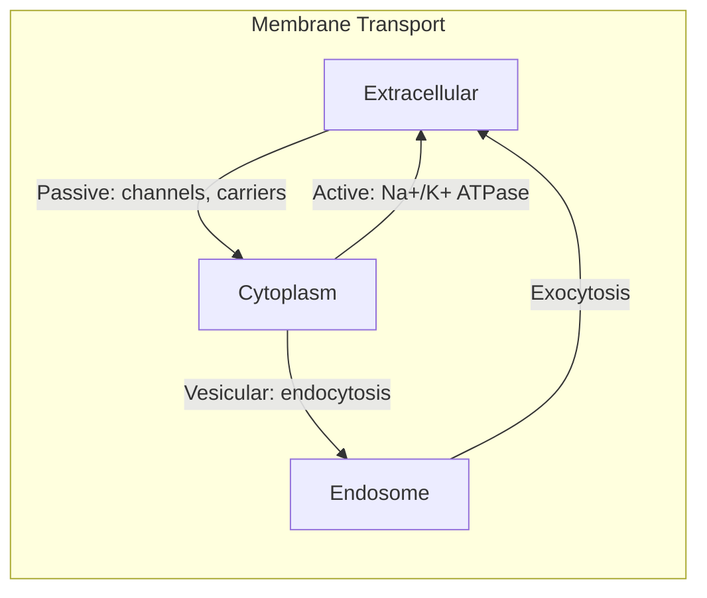
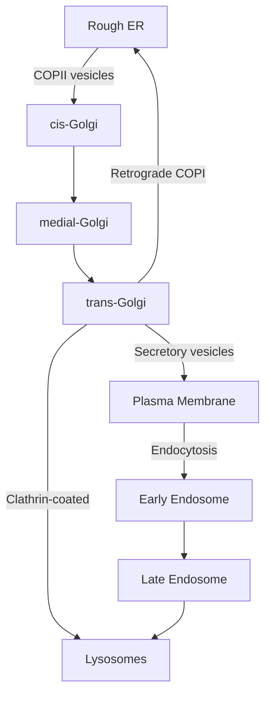
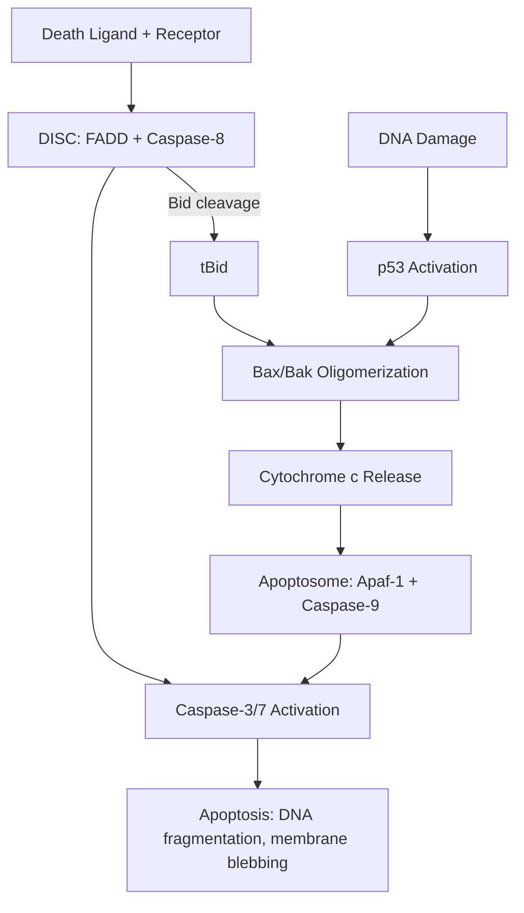

# Cell Biology

Comprehensive notes covering cell structure, membrane biology, organelles, cytoskeleton, cell cycle, apoptosis, and signal transduction.

## References

- Alberts, B. et al. *Molecular Biology of the Cell*, 7th ed. W.W. Norton, 2022.
- Lodish, H. et al. *Molecular Cell Biology*, 9th ed. W.H. Freeman, 2021.
- Pollard, T.D. & Earnshaw, W.C. *Cell Biology*, 4th ed. Elsevier, 2023.

---

## Part I — Cell Structure & Organization

### Week 1: Prokaryotic vs Eukaryotic Cells

**Prokaryotic cells** lack membrane-bound organelles, have circular DNA in a nucleoid region, ribosomes (70S), and a cell wall (peptidoglycan in bacteria). Size: $\sim 1$--$10 \; \mu\text{m}$.

**Eukaryotic cells** possess a nucleus, endomembrane system, mitochondria, and an elaborate cytoskeleton. Size: $\sim 10$--$100 \; \mu\text{m}$. Surface-area-to-volume ratio constrains cell size: $SA/V = 3/r$ for a sphere.

| Feature | Prokaryote | Eukaryote |
|---------|-----------|-----------|
| Nucleus | No | Yes |
| DNA | Circular | Linear chromosomes |
| Ribosomes | 70S | 80S (cytoplasmic) |
| Organelles | Minimal | Extensive |
| Cell division | Binary fission | Mitosis/meiosis |

### Week 2: Membrane Biology

The **fluid mosaic model** (Singer & Nicolson, 1972): a lipid bilayer with embedded and peripheral proteins. Membrane fluidity depends on fatty acid saturation, chain length, and cholesterol content.

**Passive transport** — flux described by Fick's law:

$$J = -P \Delta c$$

where $J$ is flux (mol/m$^2$/s), $P$ is permeability coefficient, and $\Delta c$ is the concentration difference.

**Nernst equation** for equilibrium potential of ion $X$:

$$E_X = \frac{RT}{zF} \ln \frac{[X]_{\text{out}}}{[X]_{\text{in}}}$$

**Active transport** — the Na$^+$/K$^+$ ATPase pumps 3 Na$^+$ out and 2 K$^+$ in per ATP hydrolyzed, maintaining the resting membrane potential ($\sim -70$ mV).

### Week 3: Organelles

- **Endoplasmic reticulum (ER):** Rough ER (ribosome-studded, protein synthesis/folding), Smooth ER (lipid synthesis, detoxification, Ca$^{2+}$ storage).
- **Golgi apparatus:** *cis*-face receives from ER, *trans*-face ships to plasma membrane/lysosomes. Glycosylation, sorting, packaging.
- **Mitochondria:** Double membrane. Outer membrane (porins), inner membrane (cristae, ETC complexes I--V). ATP yield per glucose $\approx 30$--$32$ ATP. Own circular DNA (~16.5 kb in humans).
- **Lysosomes:** Acidic lumen (pH $\sim 4.5$--$5$), contain hydrolases. Autophagy and phagocytosis converge here.
- **Peroxisomes:** $\beta$-oxidation of very long chain fatty acids, catalase degrades $\text{H}_2\text{O}_2$.

---

## Part II — Cytoskeleton

### Week 4: Filament Systems

| Component | Subunit | Diameter | Function |
|-----------|---------|----------|----------|
| Actin (microfilaments) | G-actin | $\sim 7$ nm | Cell motility, contraction, cortex |
| Microtubules | $\alpha/\beta$-tubulin | $\sim 25$ nm | Intracellular transport, mitotic spindle |
| Intermediate filaments | Various (keratin, vimentin, lamin) | $\sim 10$ nm | Mechanical strength |

**Dynamic instability** of microtubules: GTP-tubulin adds at plus end; GTP hydrolysis to GDP destabilizes the lattice. Catastrophe (shrinkage) and rescue (regrowth) alternate stochastically.

**Treadmilling** of actin: net addition at barbed (+) end, net loss at pointed (–) end when monomer concentration is between the two critical concentrations.

Motor proteins: **kinesin** (plus-end directed on MTs), **dynein** (minus-end directed), **myosin** (along actin).

---

## Part III — Cell Cycle & Death

### Week 5: Cell Cycle

Phases: **G1** (growth) → **S** (DNA replication) → **G2** (preparation) → **M** (mitosis + cytokinesis).

**CDK-cyclin regulation:**
- G1/S transition: Cyclin D–CDK4/6, Cyclin E–CDK2
- S phase: Cyclin A–CDK2
- G2/M transition: Cyclin B–CDK1 (MPF)

**Checkpoints:**
1. **G1/S (Restriction point):** p53 → p21 inhibits CDK; checks DNA damage.
2. **Intra-S:** ATR kinase monitors replication fork stalling.
3. **G2/M:** ATM/ATR → Chk1/Chk2 → Wee1 inhibits CDK1.
4. **Spindle assembly checkpoint (SAC):** Mad2/BubR1 inhibit APC/C until all kinetochores attached.

$$\text{Cell cycle duration} \approx 24 \text{ h (typical mammalian cell)}$$

### Week 6: Apoptosis

**Intrinsic (mitochondrial) pathway:**
DNA damage → p53 → Bax/Bak oligomerize → mitochondrial outer membrane permeabilization (MOMP) → cytochrome $c$ release → apoptosome (Apaf-1 + caspase-9) → executioner caspases (caspase-3, -7).

**Extrinsic (death receptor) pathway:**
FasL binds Fas (CD95) → DISC formation (FADD + caspase-8) → caspase-8 activates caspase-3 directly or cleaves Bid → tBid amplifies via mitochondria.

Anti-apoptotic: Bcl-2, Bcl-xL (sequester Bax/Bak). Pro-apoptotic: Bax, Bak, BH3-only proteins (Bid, Bim, Bad).

---

## Part IV — Signal Transduction

### Week 7: Major Signaling Pathways

**GPCR → cAMP pathway:**
Ligand → GPCR → $G_{\alpha s}$ activates adenylyl cyclase → cAMP ↑ → PKA activation → CREB phosphorylation → gene transcription.

$$[\text{cAMP}]_{\text{steady state}} = \frac{V_{\text{AC}}}{k_{\text{PDE}}}$$

**RTK → Ras → MAPK cascade:**
Growth factor → RTK dimerization/autophosphorylation → Grb2/SOS → Ras-GTP → Raf → MEK → ERK → transcription factors (Elk-1, c-Fos).

**IP$_3$/Ca$^{2+}$ pathway:**
PLC cleaves PIP$_2$ → IP$_3$ + DAG. IP$_3$ opens ER Ca$^{2+}$ channels → cytosolic $[\text{Ca}^{2+}]$ rises from $\sim 100$ nM to $\sim 1$ $\mu$M → calmodulin activation → CaMKII, calcineurin.

### Week 8: Integration & Crosstalk

- **Scaffold proteins** (e.g., KSR for MAPK) ensure specificity.
- **Feedback loops:** negative (ERK phosphorylates SOS) and positive (Ca$^{2+}$-induced Ca$^{2+}$ release).
- **Signal amplification:** one GPCR activates many G-proteins; each adenylyl cyclase produces many cAMP molecules.
- **Desensitization:** receptor internalization, $\beta$-arrestin recruitment, GRK phosphorylation.

---

## Summary Equations

| Process | Equation |
|---------|----------|
| Passive flux | $J = -P\Delta c$ |
| Nernst potential | $E = \frac{RT}{zF}\ln\frac{[X]_o}{[X]_i}$ |
| Goldman equation | $V_m = \frac{RT}{F}\ln\frac{P_K[K^+]_o + P_{Na}[Na^+]_o + P_{Cl}[Cl^-]_i}{P_K[K^+]_i + P_{Na}[Na^+]_i + P_{Cl}[Cl^-]_o}$ |
| Michaelis-Menten | $v = \frac{V_{\max}[S]}{K_m + [S]}$ |
