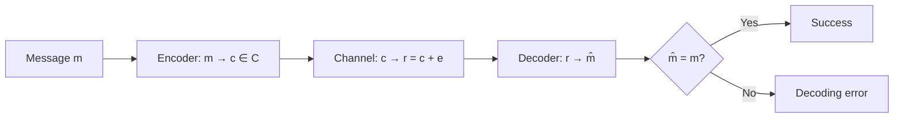
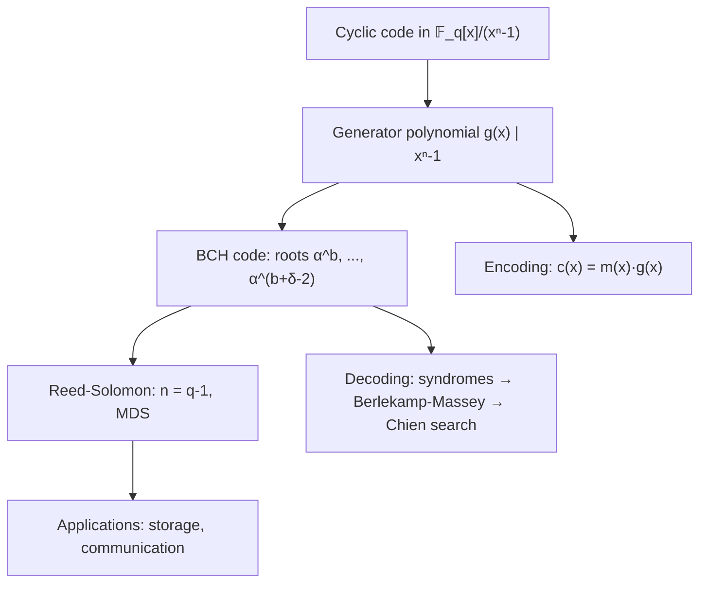
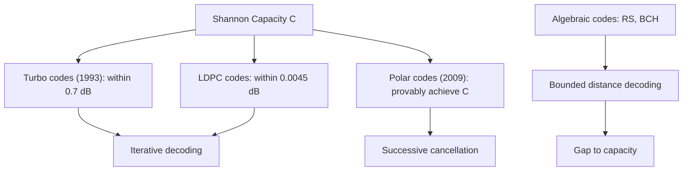

# Coding Theory

## Course Overview

The mathematical theory of error-detecting and error-correcting codes: from Hamming codes through algebraic codes (Reed-Solomon, BCH) to modern iterative codes (LDPC, turbo). Fundamental bounds and Shannon's channel coding theorem provide the theoretical limits.

## References

- J.H. van Lint, *Introduction to Coding Theory*, 3rd ed., Springer GTM 86, 1999.
- W.C. Huffman & V. Pless, *Fundamentals of Error-Correcting Codes*, Cambridge University Press, 2003.
- S. Lin & D.J. Costello Jr., *Error Control Coding*, 2nd ed., Pearson, 2004.

---

# Part I — Foundations

## Week 1: Basic Concepts

### The Communication Model

A message is encoded, sent through a noisy channel, and decoded:

$$\text{Source} \xrightarrow{\text{encode}} \text{Codeword} \xrightarrow{\text{channel}} \text{Received word} \xrightarrow{\text{decode}} \text{Message}$$

### Alphabets and Block Codes

A **block code** $C$ of length $n$ over alphabet $\mathbb{F}_q$ is a subset $C \subseteq \mathbb{F}_q^n$. Key parameters:

- **Length:** $n$ (block size)
- **Size:** $M = |C|$ (number of codewords)
- **Rate:** $R = \frac{\log_q M}{n}$
- An $[n, k, d]_q$ code has $M = q^k$ and minimum distance $d$

### Hamming Distance

The **Hamming distance** $d(x, y) = |\{i : x_i \neq y_i\}|$ is a metric on $\mathbb{F}_q^n$.

The **minimum distance** of $C$: $d(C) = \min_{x \neq y \in C} d(x, y)$.

### Error Capability

A code with minimum distance $d$ can:
- **Detect** up to $d - 1$ errors
- **Correct** up to $t = \lfloor (d-1)/2 \rfloor$ errors

## Week 2: Shannon's Channel Coding Theorem

### Binary Symmetric Channel (BSC)

Each bit is flipped independently with probability $p < 1/2$. The **capacity** is:

$$C_{\text{BSC}} = 1 - H(p) = 1 + p\log_2 p + (1-p)\log_2(1-p)$$

### Shannon's Theorem (1948)

For any rate $R < C$ (channel capacity), there exist codes achieving arbitrarily small error probability. Conversely, for $R > C$, the error probability is bounded away from zero.

This is an **existence** theorem — it does not construct codes. The quest for capacity-approaching codes drove decades of research, culminating in turbo codes and LDPC codes.

### The Gaussian Channel

For AWGN with signal-to-noise ratio $\text{SNR}$:

$$C_{\text{AWGN}} = \frac{1}{2} \log_2(1 + \text{SNR}) \quad \text{bits/channel use}$$

---

# Part II — Linear Codes

## Week 3: Structure of Linear Codes

### Definition

A **linear code** $C$ is a $k$-dimensional subspace of $\mathbb{F}_q^n$. Notation: $[n, k, d]_q$.

### Generator and Parity-Check Matrices

- **Generator matrix** $G \in \mathbb{F}_q^{k \times n}$: rows form a basis for $C$. Encoding: $c = mG$.
- **Parity-check matrix** $H \in \mathbb{F}_q^{(n-k) \times n}$: $C = \ker(H) = \{x : Hx^T = 0\}$.

In systematic form: $G = [I_k \mid P]$ and $H = [-P^T \mid I_{n-k}]$.

### Minimum Distance via $H$

$$d(C) = \min\{w(c) : c \in C, c \neq 0\} = \min\{j : \exists j \text{ linearly dependent columns of } H\}$$

### Syndrome Decoding

The **syndrome** of a received word $r$ is $s = Hr^T$. If $r = c + e$, then $s = He^T$ depends only on the error pattern. Decode by finding the minimum-weight $e$ with syndrome $s$.

## Week 4: Hamming Codes

### Construction

The $[2^r - 1, 2^r - 1 - r, 3]_2$ **Hamming code** uses as $H$ the matrix whose columns are all nonzero vectors in $\mathbb{F}_2^r$.

**Properties:**
- Corrects all single errors ($t = 1$).
- **Perfect code:** every vector in $\mathbb{F}_2^n$ is within distance $1$ of exactly one codeword.
- Rate: $R = 1 - r/(2^r - 1) \to 1$ as $r \to \infty$.

### The Hamming Bound (Sphere-Packing Bound)

An $[n, k, d]_q$ code with $t = \lfloor(d-1)/2\rfloor$ satisfies:

$$q^k \sum_{i=0}^{t} \binom{n}{i}(q-1)^i \leq q^n$$

A code achieving equality is **perfect**. Perfect binary codes: repetition codes, Hamming codes, and the $[23, 12, 7]$ binary Golay code (up to equivalence).

---

# Part III — Algebraic Codes

## Week 5: Cyclic Codes and BCH Codes

### Cyclic Codes

A linear code $C$ is **cyclic** if $(c_0, c_1, \ldots, c_{n-1}) \in C$ implies $(c_{n-1}, c_0, \ldots, c_{n-2}) \in C$.

Cyclic codes correspond to ideals in $\mathbb{F}_q[x]/(x^n - 1)$. Each is generated by a **generator polynomial** $g(x)$ dividing $x^n - 1$:

$$C = \langle g(x) \rangle, \quad \deg(g) = n - k$$

### BCH Codes

Let $\alpha$ be a primitive $n$-th root of unity in $\mathbb{F}_{q^m}$. The **BCH code** of designed distance $\delta$ has generator polynomial:

$$g(x) = \text{lcm}(m_b(x), m_{b+1}(x), \ldots, m_{b+\delta-2}(x))$$

where $m_i(x)$ is the minimal polynomial of $\alpha^i$.

**BCH bound:** The minimum distance $d \geq \delta$.

### Decoding BCH Codes

1. Compute syndromes $S_j = r(\alpha^{b+j})$ for $j = 0, \ldots, \delta - 2$.
2. Find error-locator polynomial via the **Berlekamp-Massey** algorithm.
3. Find roots (error locations) via **Chien search**.
4. Find error values (for non-binary) via **Forney's algorithm**.

## Week 6: Reed-Solomon Codes

### Definition

A **Reed-Solomon code** is a BCH code over $\mathbb{F}_q$ with $n = q - 1$ (the code length equals the field size minus one). Parameters: $[n, k, n-k+1]_q$.

Reed-Solomon codes are **MDS** (Maximum Distance Separable): they achieve the Singleton bound $d \leq n - k + 1$ with equality.

### Applications

- **CD/DVD/Blu-ray** error correction
- **QR codes**
- **Deep space communication** (Voyager, Mars rovers)
- **Data storage** (RAID-6)

### Erasure Recovery

An $[n, k, d]$ RS code can recover from up to $n - k$ erasures (known missing positions), making it ideal for distributed storage.

---

# Part IV — Modern Codes

## Week 7: LDPC Codes

### Definition

A **Low-Density Parity-Check (LDPC)** code is a linear code defined by a sparse parity-check matrix $H$ (most entries are $0$).

A **$(d_v, d_c)$-regular LDPC code** has exactly $d_v$ ones per column and $d_c$ ones per row of $H$.

### Tanner Graphs

An LDPC code is represented as a bipartite graph:
- **Variable nodes** (one per bit)
- **Check nodes** (one per parity check)
- An edge connects variable $j$ to check $i$ iff $H_{ij} = 1$.

### Belief Propagation Decoding

Iterative message-passing on the Tanner graph:
1. Variable nodes send log-likelihood ratios to check nodes.
2. Check nodes compute extrinsic information and send back.
3. Iterate until convergence or maximum iterations.

LDPC codes approach Shannon capacity within $0.0045$ dB (on the AWGN channel).

## Week 8: Turbo Codes

### Structure

A **turbo code** uses two (or more) constituent convolutional encoders connected through an **interleaver**:

- Encoder 1 processes the data directly.
- Encoder 2 processes an interleaved (permuted) version.
- Systematic bits + parity from both encoders form the codeword.

### Turbo Decoding

Iterative decoding with two SISO (Soft-Input Soft-Output) decoders exchanging extrinsic information. Each decoder uses the **BCJR algorithm** (MAP decoding on a trellis).

Turbo codes (Berrou et al., 1993) were the first practical codes to approach Shannon's limit, achieving BER $< 10^{-5}$ within $0.7$ dB of capacity.

---

# Part V — Bounds and Comparisons

## Week 9: Fundamental Bounds

### The Singleton Bound

$$d \leq n - k + 1$$

Codes achieving equality are **MDS** (e.g., Reed-Solomon).

### The Plotkin Bound

For binary codes with $d > n/2$:

$$M \leq 2\left\lfloor \frac{d}{2d - n} \right\rfloor$$

### The Gilbert-Varshamov Bound

There exists an $[n, k, d]_q$ code if:

$$q^{n-k} > \sum_{i=0}^{d-2} \binom{n-1}{i}(q-1)^i$$

This is a lower bound on achievable rates — good codes exist.

### The Asymptotic Picture

For binary codes, let $\delta = d/n$ and $R = k/n$:

$$R_{\text{GV}}(\delta) = 1 - H_2(\delta) \leq R \leq R_{\text{Singleton}}(\delta) = 1 - \delta$$

where $H_2(\delta) = -\delta\log_2\delta - (1-\delta)\log_2(1-\delta)$ is the binary entropy function.

## Week 10: Comparison of Code Families

| Code Family | Parameters | Decoding | Near Capacity? |
|-------------|-----------|----------|---------------|
| Hamming | $[2^r-1, 2^r-1-r, 3]$ | Syndrome | No |
| Reed-Solomon | $[n, k, n-k+1]$ | Berlekamp-Massey | No |
| BCH | $[n, k, \geq \delta]$ | Berlekamp-Massey | No |
| Convolutional | Rate $k/n$, memory $m$ | Viterbi | No |
| Turbo | Parallel concatenation | Iterative BCJR | Yes |
| LDPC | Sparse $H$ | Belief propagation | Yes |
| Polar | $[2^m, k]$ | Successive cancellation | Yes (provably) |

**Polar codes** (Arikan, 2009) are the first provably capacity-achieving codes with efficient encoding and decoding, based on channel polarization:

$$W_N^{(i)} \to \begin{cases} \text{perfect channel} & \text{(information bits)} \\ \text{useless channel} & \text{(frozen bits)} \end{cases} \quad \text{as } N \to \infty$$

---

# Summary of Key Results

| Result | Statement |
|--------|-----------|
| Hamming bound | $q^k V_q(n,t) \leq q^n$ |
| Singleton bound | $d \leq n - k + 1$ |
| Gilbert-Varshamov | Good codes exist above $R = 1 - H_q(\delta)$ |
| Shannon's theorem | Reliable communication possible iff $R < C$ |
| RS codes are MDS | $d = n - k + 1$ exactly |
| LDPC/Turbo | Approach Shannon capacity with iterative decoding |
| Polar codes | Provably achieve capacity |
