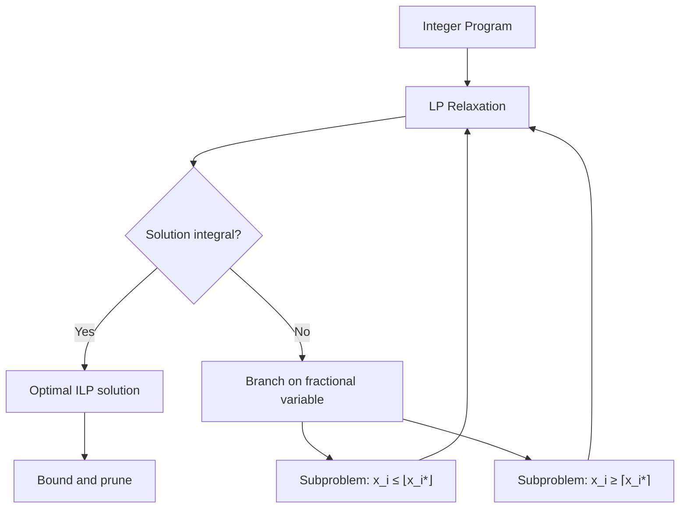
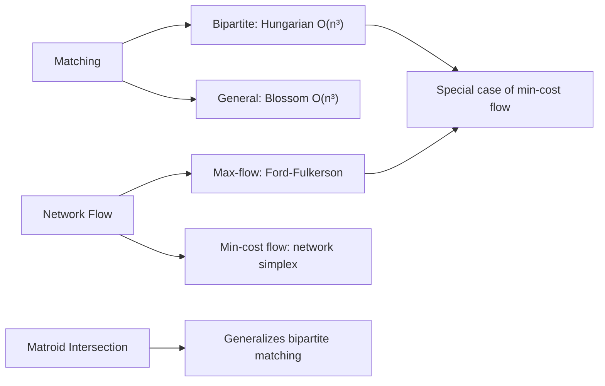
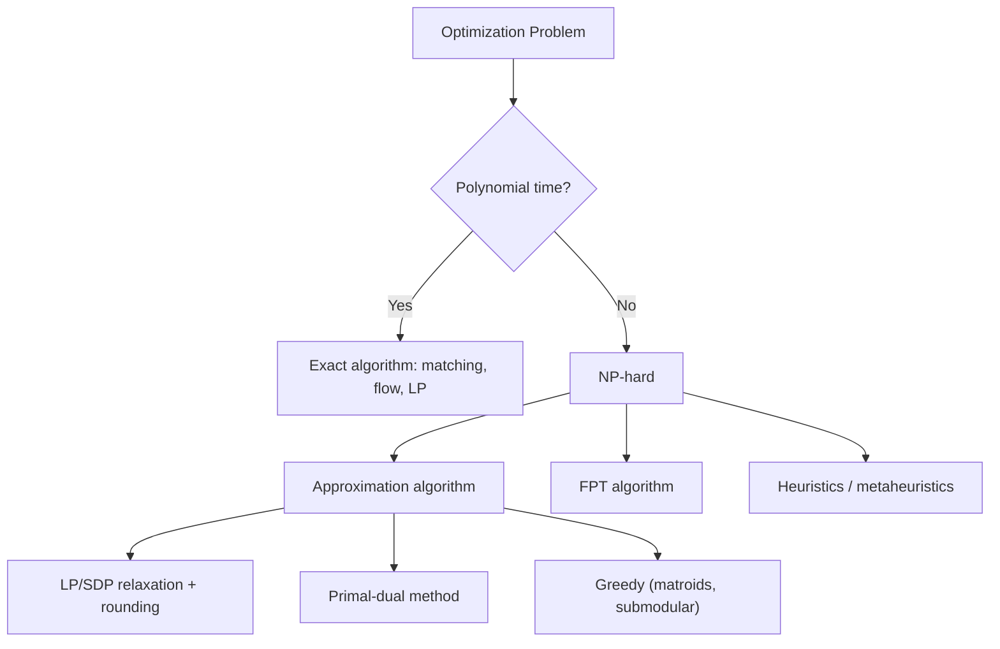

# Combinatorial Optimization

## Course Overview

Optimization over discrete structures: linear and integer programming, matroid theory, matching and flow algorithms, NP-hard problems and their approximation. Bridges combinatorics, algebra, and algorithm design.

## References

- A. Schrijver, *Combinatorial Optimization: Polyhedra and Efficiency*, 3 vols., Springer, 2003.
- B. Korte & J. Vygen, *Combinatorial Optimization: Theory and Algorithms*, 6th ed., Springer, 2018.
- C.H. Papadimitriou & K. Steiglitz, *Combinatorial Optimization: Algorithms and Complexity*, Dover, 1998.

---

# Part I — Linear and Integer Programming

## Week 1: Linear Programming

### The Standard Form

A **linear program** (LP) in standard form:

$$\max\; \mathbf{c}^T \mathbf{x} \quad \text{subject to} \quad A\mathbf{x} \leq \mathbf{b}, \quad \mathbf{x} \geq \mathbf{0}$$

### Fundamental Theorem of LP

If a linear program has an optimal solution, it has one at a vertex (extreme point) of the feasible polyhedron $P = \{\mathbf{x} : A\mathbf{x} \leq \mathbf{b}, \mathbf{x} \geq 0\}$.

### LP Duality

The **dual** of the LP above is:

$$\min\; \mathbf{b}^T \mathbf{y} \quad \text{subject to} \quad A^T \mathbf{y} \geq \mathbf{c}, \quad \mathbf{y} \geq \mathbf{0}$$

**Strong duality theorem:** If either the primal or dual has an optimal solution, so does the other, and:

$$\max\; \mathbf{c}^T \mathbf{x} = \min\; \mathbf{b}^T \mathbf{y}$$

### Complementary Slackness

Optimal solutions $\mathbf{x}^*, \mathbf{y}^*$ satisfy: for each $i$, either $y_i^* = 0$ or $(\mathbf{a}_i^T \mathbf{x}^* = b_i)$, and for each $j$, either $x_j^* = 0$ or $(\mathbf{a}_j^T \mathbf{y}^* = c_j)$.

### Algorithms

| Algorithm | Complexity | Notes |
|-----------|-----------|-------|
| Simplex | Exponential worst-case, fast in practice | Walks along vertices |
| Ellipsoid (Khachiyan, 1979) | $O(n^4 L)$ | First polynomial-time |
| Interior point (Karmarkar, 1984) | $O(n^{3.5} L)$ | Practical and polynomial |

## Week 2: Integer Programming

### Integer Linear Programming (ILP)

$$\max\; \mathbf{c}^T \mathbf{x} \quad \text{s.t.} \quad A\mathbf{x} \leq \mathbf{b}, \quad \mathbf{x} \in \mathbb{Z}^n_{\geq 0}$$

ILP is NP-hard in general.

### LP Relaxation

Drop the integrality constraint to get the **LP relaxation**. If $z^*_{\text{LP}}$ and $z^*_{\text{ILP}}$ are optimal values:

$$z^*_{\text{ILP}} \leq z^*_{\text{LP}} \quad \text{(for maximization)}$$

The gap $z^*_{\text{LP}} - z^*_{\text{ILP}}$ is the **integrality gap**.

### Total Unimodularity

A matrix $A$ is **totally unimodular (TU)** if every square submatrix has determinant $0$, $1$, or $-1$.

If $A$ is TU and $\mathbf{b}$ is integral, the LP relaxation automatically has integral optimal solutions. This explains why network flow LPs are integral.

### Branch and Bound

Solve the LP relaxation. If the solution is fractional, branch on a fractional variable $x_i$:
- Subproblem 1: add constraint $x_i \leq \lfloor x_i^* \rfloor$
- Subproblem 2: add constraint $x_i \geq \lceil x_i^* \rceil$

Prune branches where the LP bound is worse than the best integer solution found.

---

# Part II — Matroids

## Week 3: Matroid Theory

### Definition

A **matroid** $M = (E, \mathcal{I})$ consists of a ground set $E$ and a family $\mathcal{I}$ of **independent sets** satisfying:
1. $\emptyset \in \mathcal{I}$
2. If $I \in \mathcal{I}$ and $J \subseteq I$, then $J \in \mathcal{I}$ (hereditary)
3. If $I, J \in \mathcal{I}$ and $|I| < |J|$, then $\exists e \in J \setminus I$ with $I \cup \{e\} \in \mathcal{I}$ (augmentation)

### Key Examples

| Matroid | Ground set $E$ | Independent sets |
|---------|----------------|-----------------|
| **Graphic matroid** $M(G)$ | Edges of $G$ | Acyclic edge subsets (forests) |
| **Linear matroid** | Vectors in $\mathbb{F}^n$ | Linearly independent subsets |
| **Uniform matroid** $U_{k,n}$ | $[n]$ | All subsets of size $\leq k$ |
| **Partition matroid** | $E = E_1 \sqcup \cdots \sqcup E_\ell$ | $|I \cap E_i| \leq k_i$ for each $i$ |

### Rank, Bases, and Circuits

- **Rank function:** $r(A) = \max\{|I| : I \subseteq A, I \in \mathcal{I}\}$
- **Basis:** maximal independent set (all have the same size $r(E)$)
- **Circuit:** minimal dependent set

### The Greedy Algorithm

**Theorem (Rado-Edmonds):** For a matroid $M$ and weight function $w: E \to \mathbb{R}$, the greedy algorithm (add elements in decreasing weight order, keeping independence) finds a maximum-weight basis.

Moreover, matroids are **exactly** the structures for which the greedy algorithm works for all weight functions.

## Week 4: Matroid Intersection

### Matroid Intersection Theorem (Edmonds, 1970)

Given matroids $M_1 = (E, \mathcal{I}_1)$ and $M_2 = (E, \mathcal{I}_2)$:

$$\max\{|I| : I \in \mathcal{I}_1 \cap \mathcal{I}_2\} = \min_{A \subseteq E} \{r_1(A) + r_2(E \setminus A)\}$$

### Applications of Matroid Intersection

- **Bipartite matching:** Intersection of two partition matroids.
- **Colorful spanning tree:** Intersection of graphic and partition matroids.
- **Arborescences:** Intersection of two graphic matroids (Edmonds' arborescence theorem).

---

# Part III — Matchings and Flows in Graphs

## Week 5: Bipartite Matching Algorithms

### The Hungarian Algorithm

For minimum-weight perfect matching in bipartite graphs:

1. Maintain a feasible dual solution (vertex potentials).
2. Find an augmenting path in the equality graph.
3. If none exists, adjust potentials to expose new edges.

Time complexity: $O(n^3)$.

### The Assignment Problem

Minimize $\sum_{i,j} c_{ij} x_{ij}$ subject to $x$ being a permutation matrix. This is an LP whose constraint matrix is TU, so LP relaxation gives integral solutions.

## Week 6: Non-Bipartite Matching

### Edmonds' Blossom Algorithm (1965)

For maximum matching in general graphs:

1. Search for augmenting paths from exposed vertices.
2. When an odd cycle (blossom) is found, **shrink** it to a single vertex.
3. Recurse until no augmenting path exists.
4. Expand blossoms to recover the matching.

Time complexity: $O(n^3)$ (with improvements by Micali-Vazirani: $O(\sqrt{n}\, m)$).

### Tutte Matrix

The **Tutte matrix** $T(G)$ has entry $T_{ij} = x_{ij}$ (a formal variable) if $\{i,j\} \in E$ and $0$ otherwise, with $T_{ij} = -T_{ji}$. Then:

$$G \text{ has a perfect matching} \iff \det(T(G)) \not\equiv 0$$

This gives a randomized $O(n^\omega)$ algorithm (Lovasz, 1979).

## Week 7: Network Flows and Applications

### Minimum Cost Flow

$$\min \sum_{(i,j) \in E} c_{ij} f_{ij} \quad \text{s.t. flow conservation, } 0 \leq f_{ij} \leq u_{ij}$$

Algorithms: cycle-canceling, successive shortest paths, network simplex.

### Applications Modeled as Flows

- Transportation and assignment problems
- Bipartite matching (unit capacities)
- Project scheduling (CPM/PERT)
- Image segmentation (min-cut)

---

# Part IV — NP-Hard Problems and Approximation

## Week 8: The Traveling Salesman Problem (TSP)

### Problem Statement

Given a complete graph $K_n$ with edge weights $w_{ij}$, find a Hamiltonian cycle of minimum total weight:

$$\min_{\pi \in S_n} \sum_{i=1}^{n} w_{\pi(i), \pi(i+1)}$$

TSP is NP-hard. No polynomial-time algorithm can approximate general TSP within any constant factor (unless P = NP).

### Metric TSP

When $w$ satisfies the triangle inequality ($w_{ij} \leq w_{ik} + w_{kj}$):

| Algorithm | Approximation Ratio | Year |
|-----------|-------------------|------|
| Nearest neighbor | $O(\log n)$ | — |
| Christofides-Serdyukov | $3/2$ | 1976 |
| Karlin-Klein-Oveis Gharan | $3/2 - \epsilon$ | 2021 |

**Christofides' algorithm:**
1. Find MST $T$ (cost $\leq \text{OPT}$).
2. Find minimum-weight perfect matching $M$ on odd-degree vertices of $T$ (cost $\leq \text{OPT}/2$).
3. $T \cup M$ is Eulerian; shortcut to a Hamiltonian cycle.
4. Total cost $\leq 3/2 \cdot \text{OPT}$.

## Week 9: Approximation Algorithms

### Set Cover

Given a universe $U$ and sets $S_1, \ldots, S_m$, find the minimum number of sets covering $U$.

- **Greedy:** $O(\ln n)$-approximation (best possible unless P = NP).
- **LP rounding:** $O(\log n)$-approximation.
- **Primal-dual:** $f$-approximation where $f$ is the max frequency of an element.

### Vertex Cover

Given a graph $G$, find the minimum set of vertices covering all edges.

- **LP relaxation + rounding:** $2$-approximation. The LP has half-integral solutions.
- **Matching-based:** Any maximal matching gives a $2$-approximation (take both endpoints).
- The unique games conjecture implies no $(2 - \epsilon)$-approximation exists.

### Submodular Function Maximization

A set function $f: 2^E \to \mathbb{R}$ is **submodular** if:

$$f(A) + f(B) \geq f(A \cup B) + f(A \cap B)$$

Equivalently: diminishing marginal returns. For monotone submodular $f$ with cardinality constraint $|S| \leq k$:

$$\text{Greedy achieves } f(S_{\text{greedy}}) \geq \left(1 - \frac{1}{e}\right) f(S^*) \approx 0.632 \cdot f(S^*)$$

This ratio is optimal (Nemhauser-Wolsey, 1978).

## Week 10: Advanced Topics

### Semidefinite Programming (SDP) Relaxation

For Max-Cut: given $G$, find a partition $(S, \bar{S})$ maximizing $|E(S, \bar{S})|$.

The Goemans-Williamson SDP relaxation (1995) achieves a $0.878$-approximation:

$$\max \frac{1}{4} \sum_{(i,j) \in E} \|\mathbf{v}_i - \mathbf{v}_j\|^2 \quad \text{s.t. } \|\mathbf{v}_i\| = 1$$

Round by choosing a random hyperplane.

### Fixed-Parameter Tractability (FPT)

Some NP-hard problems are solvable in $O(f(k) \cdot n^c)$ time where $k$ is a problem-specific parameter:

| Problem | Parameter $k$ | FPT Algorithm |
|---------|--------------|---------------|
| Vertex cover | Cover size | $O(2^k n)$ |
| TSP | Treewidth $t$ | $O(2^t n)$ |
| $k$-path | Path length | $O(2^k n)$ (color coding) |

---

# Summary of Key Results

| Result | Statement |
|--------|-----------|
| LP strong duality | $\max \mathbf{c}^T\mathbf{x} = \min \mathbf{b}^T\mathbf{y}$ |
| TU integrality | TU matrix + integral RHS $\Rightarrow$ integral LP solution |
| Greedy on matroids | Greedy finds max-weight basis iff independence system is a matroid |
| Matroid intersection | $\max|I_1 \cap I_2| = \min_A(r_1(A) + r_2(E\setminus A))$ |
| Christofides (metric TSP) | $3/2$-approximation |
| Greedy set cover | $O(\ln n)$-approximation (optimal) |
| Submodular greedy | $(1-1/e)$-approximation for monotone + cardinality constraint |
| Goemans-Williamson | $0.878$-approximation for Max-Cut |
