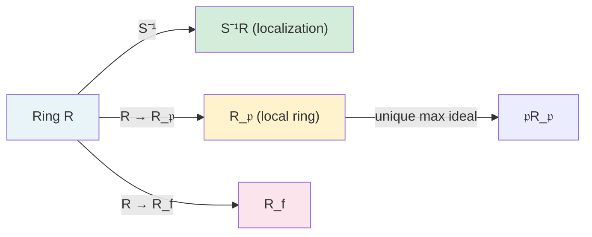
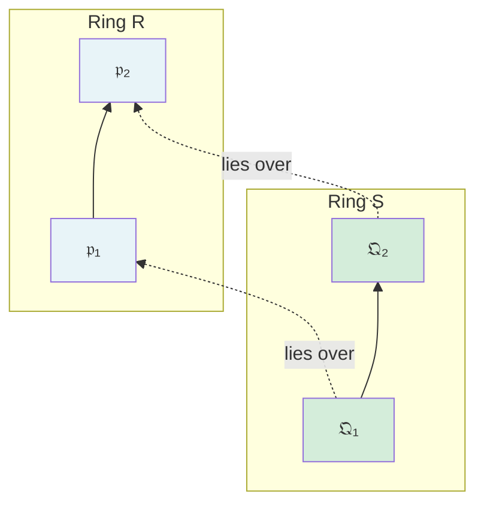

# Commutative Algebra

Graduate course covering the algebraic foundations underlying algebraic geometry and algebraic number theory. All rings are assumed commutative with unity unless stated otherwise.

---

## Part I: Noetherian and Artinian Rings

### Week 1 — Chain Conditions

**Definition.** A ring $R$ is *Noetherian* if it satisfies the ascending chain condition (ACC) on ideals: every ascending chain $I_1 \subseteq I_2 \subseteq \cdots$ stabilizes.

**Equivalent conditions** for $R$ Noetherian:
1. Every ideal of $R$ is finitely generated.
2. Every nonempty set of ideals has a maximal element.
3. ACC on ideals.

**Definition.** A ring $R$ is *Artinian* if it satisfies the descending chain condition (DCC) on ideals.

**Theorem (Hopkins-Levitzki).** A commutative ring is Artinian if and only if it is Noetherian and every prime ideal is maximal (equivalently, $\dim R = 0$).

### Week 2 — Hilbert Basis Theorem and Applications

**Hilbert Basis Theorem.** If $R$ is Noetherian, then $R[x]$ is Noetherian.

*Proof sketch.* Given an ideal $I \subseteq R[x]$, consider the ideal $L_n \subseteq R$ of leading coefficients of polynomials in $I$ of degree $\leq n$. These form an ascending chain $L_0 \subseteq L_1 \subseteq \cdots$ which stabilizes. Use finite generation of each $L_n$ to build a finite generating set for $I$. $\square$

**Corollary.** $k[x_1, \ldots, x_n]$ is Noetherian for any field $k$. More generally, any finitely generated algebra over a Noetherian ring is Noetherian.

**Corollary.** Any quotient of a Noetherian ring is Noetherian.

### Week 3 — Nakayama's Lemma and Artin-Rees

**Nakayama's Lemma.** Let $R$ be a local ring with maximal ideal $\mathfrak{m}$, and let $M$ be a finitely generated $R$-module. If $\mathfrak{m}M = M$, then $M = 0$.

**Corollary.** Elements $m_1, \ldots, m_n \in M$ generate $M$ if and only if their images generate $M/\mathfrak{m}M$ as an $R/\mathfrak{m}$-vector space.

**Artin-Rees Lemma.** Let $R$ be Noetherian, $I$ an ideal, $M$ a finitely generated $R$-module, and $N \subseteq M$ a submodule. Then there exists $k \geq 0$ such that for all $n \geq k$:
$$I^n M \cap N = I^{n-k}(I^k M \cap N).$$

**Krull Intersection Theorem.** If $R$ is a Noetherian local ring with maximal ideal $\mathfrak{m}$, then:
$$\bigcap_{n=1}^{\infty} \mathfrak{m}^n = 0.$$

---

## Part II: Localization

### Week 4 — Construction and Properties

**Definition.** Let $S \subseteq R$ be a multiplicative set ($1 \in S$, $S$ closed under multiplication). The *localization* $S^{-1}R$ consists of equivalence classes of fractions $r/s$ where $(r_1, s_1) \sim (r_2, s_2)$ iff there exists $t \in S$ with $t(r_1 s_2 - r_2 s_1) = 0$.

**Special cases:**
- $S = R \setminus \mathfrak{p}$ for a prime ideal $\mathfrak{p}$: gives the *local ring* $R_\mathfrak{p}$ with unique maximal ideal $\mathfrak{p}R_\mathfrak{p}$.
- $S = \{f^n : n \geq 0\}$ for $f \in R$: gives $R_f$.

**Ideals in $S^{-1}R$.** There is an order-preserving bijection:
$$\{\text{prime ideals } \mathfrak{q} \subseteq R \text{ with } \mathfrak{q} \cap S = \emptyset\} \longleftrightarrow \{\text{prime ideals of } S^{-1}R\}$$
given by $\mathfrak{q} \mapsto S^{-1}\mathfrak{q}$ and $\mathfrak{Q} \mapsto \mathfrak{Q} \cap R$.

### Week 5 — Local Properties

A property $\mathcal{P}$ of modules is *local* if $M$ has $\mathcal{P}$ iff $M_\mathfrak{p}$ has $\mathcal{P}$ for all primes $\mathfrak{p}$ (equivalently, for all maximal ideals $\mathfrak{m}$).

**Local properties include:**
- $M = 0$
- $M$ is flat
- $M$ is finitely generated (over Noetherian rings)
- A sequence $0 \to M' \to M \to M'' \to 0$ is exact

**Exact Functor.** Localization $S^{-1}(-)$ is an exact functor: it preserves short exact sequences.

**Localization commutes with key operations:**
$$S^{-1}(M \otimes_R N) \cong S^{-1}M \otimes_{S^{-1}R} S^{-1}N$$
$$S^{-1}(M/N) \cong S^{-1}M / S^{-1}N$$
$$S^{-1}(I \cap J) = S^{-1}I \cap S^{-1}J$$

---

## Part III: Primary Decomposition

### Week 6 — Primary Ideals

**Definition.** An ideal $\mathfrak{q} \subset R$ is *$\mathfrak{p}$-primary* if $\sqrt{\mathfrak{q}} = \mathfrak{p}$ and whenever $ab \in \mathfrak{q}$ with $a \notin \mathfrak{q}$, we have $b \in \mathfrak{p}$.

**Examples:**
- In $\mathbb{Z}$: the ideal $(p^n)$ is $(p)$-primary.
- In $k[x,y]$: the ideal $(x^2, y)$ is $(x,y)$-primary, but $(x^2, xy)$ is *not* primary.

**Lemma.** If $\mathfrak{m}$ is maximal and $\mathfrak{m}^n \subseteq \mathfrak{q} \subseteq \mathfrak{m}$, then $\mathfrak{q}$ is $\mathfrak{m}$-primary.

### Week 7 — Lasker-Noether Theorem

**Primary Decomposition.** An ideal $I$ has a *primary decomposition* if:
$$I = \mathfrak{q}_1 \cap \mathfrak{q}_2 \cap \cdots \cap \mathfrak{q}_n$$
where each $\mathfrak{q}_i$ is primary.

**Lasker-Noether Theorem.** In a Noetherian ring, every ideal has a primary decomposition.

A decomposition is *minimal* (or *irredundant*) if:
1. The radicals $\mathfrak{p}_i = \sqrt{\mathfrak{q}_i}$ are all distinct.
2. No $\mathfrak{q}_i$ contains $\bigcap_{j \neq i} \mathfrak{q}_j$.

**Uniqueness Results.** In a minimal primary decomposition $I = \mathfrak{q}_1 \cap \cdots \cap \mathfrak{q}_n$:
- The set $\{\mathfrak{p}_1, \ldots, \mathfrak{p}_n\} = \operatorname{Ass}(R/I)$ of *associated primes* is uniquely determined (the **First Uniqueness Theorem**).
- The primary components corresponding to *minimal* (isolated) primes are uniquely determined (the **Second Uniqueness Theorem**). Embedded components are generally not unique.

**Associated Primes.** $\mathfrak{p} \in \operatorname{Ass}(M)$ iff $\mathfrak{p} = \operatorname{Ann}(m)$ for some $m \in M$. The minimal elements of $\operatorname{Ass}(M)$ are precisely the minimal primes of $\operatorname{Ann}(M)$.

---

## Part IV: Integral Extensions

### Week 8 — Integral Dependence

**Definition.** An element $\alpha \in S$ (where $R \subseteq S$) is *integral* over $R$ if it satisfies a monic polynomial $\alpha^n + r_{n-1}\alpha^{n-1} + \cdots + r_0 = 0$ with $r_i \in R$.

**Equivalent conditions** ($\alpha$ integral over $R$):
1. $R[\alpha]$ is a finitely generated $R$-module.
2. $R[\alpha]$ is contained in a subring of $S$ that is finitely generated as an $R$-module.
3. There exists a faithful $R[\alpha]$-module that is finitely generated over $R$.

**Integral Closure.** The set of elements in $S$ integral over $R$ forms a subring $\overline{R}$ (the *integral closure* of $R$ in $S$). If $\overline{R} = R$, then $R$ is *integrally closed* (or *normal*).

**Theorem.** Every UFD is integrally closed.

### Week 9 — Going-Up, Going-Down, and Lying-Over

**Lying-Over Theorem.** If $R \subseteq S$ is an integral extension, then for every prime $\mathfrak{p}$ of $R$, there exists a prime $\mathfrak{Q}$ of $S$ with $\mathfrak{Q} \cap R = \mathfrak{p}$.

**Going-Up Theorem (Cohen-Seidenberg).** If $R \subseteq S$ is integral, $\mathfrak{p}_1 \subseteq \mathfrak{p}_2$ are primes in $R$, and $\mathfrak{Q}_1$ lies over $\mathfrak{p}_1$, then there exists $\mathfrak{Q}_2 \supseteq \mathfrak{Q}_1$ lying over $\mathfrak{p}_2$.

**Going-Down Theorem.** If $R \subseteq S$ is integral and $R$ is integrally closed (and $S$ is a domain), $\mathfrak{p}_1 \supseteq \mathfrak{p}_2$ in $R$, $\mathfrak{Q}_1$ over $\mathfrak{p}_1$, then there exists $\mathfrak{Q}_2 \subseteq \mathfrak{Q}_1$ over $\mathfrak{p}_2$.

*Going-Up: given $\mathfrak{p}_1 \subseteq \mathfrak{p}_2$ and $\mathfrak{Q}_1$ over $\mathfrak{p}_1$, find $\mathfrak{Q}_2 \supseteq \mathfrak{Q}_1$ over $\mathfrak{p}_2$.*

---

## Part V: Dimension Theory

### Week 10 — Krull Dimension

**Definition.** The *Krull dimension* of $R$ is:
$$\dim R = \sup\{n : \exists \text{ chain } \mathfrak{p}_0 \subsetneq \mathfrak{p}_1 \subsetneq \cdots \subsetneq \mathfrak{p}_n \text{ of prime ideals}\}.$$

**Examples:**
- $\dim k = 0$ (field), $\dim \mathbb{Z} = 1$, $\dim k[x_1, \ldots, x_n] = n$.
- $\dim R_\mathfrak{p} = \operatorname{ht}(\mathfrak{p})$ (the *height* of $\mathfrak{p}$).

**Krull's Principal Ideal Theorem (Krull's Hauptidealsatz).** Let $R$ be a Noetherian ring and $f \in R$ a non-unit, non-zero-divisor. If $\mathfrak{p}$ is a minimal prime over $(f)$, then $\operatorname{ht}(\mathfrak{p}) \leq 1$.

**Generalization.** If $I = (f_1, \ldots, f_r)$ and $\mathfrak{p}$ is a minimal prime over $I$, then $\operatorname{ht}(\mathfrak{p}) \leq r$.

### Week 11 — Dimension of Local Rings

**Theorem (Krull).** For a Noetherian local ring $(R, \mathfrak{m})$:
$$\dim R = \min\{r : \exists f_1, \ldots, f_r \in \mathfrak{m} \text{ with } \sqrt{(f_1, \ldots, f_r)} = \mathfrak{m}\}.$$
Such a minimal set $\{f_1, \ldots, f_d\}$ is a *system of parameters*.

**Hilbert Function.** For a Noetherian local ring $(R, \mathfrak{m})$ with residue field $k = R/\mathfrak{m}$, define:
$$H(n) = \dim_k \mathfrak{m}^n / \mathfrak{m}^{n+1}.$$
For $n \gg 0$, $H(n)$ agrees with a polynomial of degree $\dim R - 1$.

**Regular Local Rings.** A Noetherian local ring $(R, \mathfrak{m})$ is *regular* if $\dim_k \mathfrak{m}/\mathfrak{m}^2 = \dim R$. Equivalently, $\mathfrak{m}$ is generated by exactly $\dim R$ elements. Regular local rings are integral domains and UFDs (Auslander-Buchsbaum).

### Week 12 — Depth and Cohen-Macaulay Rings

**Definition.** An element $f \in \mathfrak{m}$ is a *non-zero-divisor on $M$* (or $M$-regular) if the multiplication map $M \xrightarrow{f} M$ is injective. A sequence $f_1, \ldots, f_r \in \mathfrak{m}$ is a *regular sequence* on $M$ if each $f_i$ is a non-zero-divisor on $M/(f_1, \ldots, f_{i-1})M$.

**Definition.** The *depth* of $M$ (with respect to $\mathfrak{m}$) is the length of a maximal regular sequence in $\mathfrak{m}$ on $M$:
$$\operatorname{depth}(M) = \min\{i : \operatorname{Ext}^i_R(k, M) \neq 0\}.$$

**Inequality.** $\operatorname{depth}(R) \leq \dim R$.

**Definition.** A Noetherian local ring $R$ is *Cohen-Macaulay* if $\operatorname{depth}(R) = \dim R$.

**Examples:** Regular local rings are Cohen-Macaulay. $k[x,y]/(xy)$ localized at $(x,y)$ is Cohen-Macaulay of dimension 1.

---

## Part VI: Completions and Hensel's Lemma

### Week 13 — $\mathfrak{m}$-adic Completion

**Definition.** The *$I$-adic completion* of $R$ is:
$$\hat{R} = \varprojlim R/I^n.$$

For a Noetherian local ring $(R, \mathfrak{m})$, the completion $\hat{R}$ is again Noetherian local with maximal ideal $\hat{\mathfrak{m}} = \mathfrak{m}\hat{R}$.

**Key properties:** $\dim \hat{R} = \dim R$, and $R \hookrightarrow \hat{R}$ is faithfully flat.

**Hensel's Lemma.** Let $(R, \mathfrak{m})$ be a complete local ring and $f \in R[x]$ monic. If $f \equiv g_0 h_0 \pmod{\mathfrak{m}[x]}$ where $g_0, h_0 \in (R/\mathfrak{m})[x]$ are coprime, then there exist monic $g, h \in R[x]$ with $f = gh$, $g \equiv g_0$, $h \equiv h_0 \pmod{\mathfrak{m}[x]}$.

### Week 14 — Valuation Rings and Dedekind Domains

**Dedekind Domain.** An integral domain $R$ is *Dedekind* if:
1. $R$ is Noetherian,
2. $\dim R = 1$,
3. $R$ is integrally closed.

Equivalently, every nonzero ideal of $R$ factors uniquely as a product of prime ideals. The ring of integers $\mathcal{O}_K$ of a number field $K$ is Dedekind.

**Fractional Ideals.** In a Dedekind domain, the group of nonzero fractional ideals modulo principal fractional ideals is the *class group* $\operatorname{Cl}(R)$, measuring failure of unique factorization of elements.

---

## Exercises

1. Prove that $k[x,y]/(y^2 - x^3)$ is not integrally closed.
2. Compute $\operatorname{Ass}(k[x,y]/(x^2, xy))$ and find a minimal primary decomposition.
3. Show that $\dim k[x_1, \ldots, x_n] = n$ directly from the definition.
4. Prove Nakayama's Lemma using the Cayley-Hamilton theorem applied to the identity endomorphism.
5. Show that $\mathbb{Z}_p$ (the $p$-adic integers) is a DVR.

---

## References

- Atiyah, M.F. & Macdonald, I.G. *Introduction to Commutative Algebra*. Addison-Wesley, 1969.
- Eisenbud, D. *Commutative Algebra with a View Toward Algebraic Geometry*. Springer GTM 150, 1995.
- Matsumura, H. *Commutative Ring Theory*. Cambridge Studies in Advanced Mathematics 8, 1989.
- Zariski, O. & Samuel, P. *Commutative Algebra*, Vols. I & II. Springer, 1958/1960.
- Bourbaki, N. *Commutative Algebra*, Chapters 1-7. Springer, 1989.
