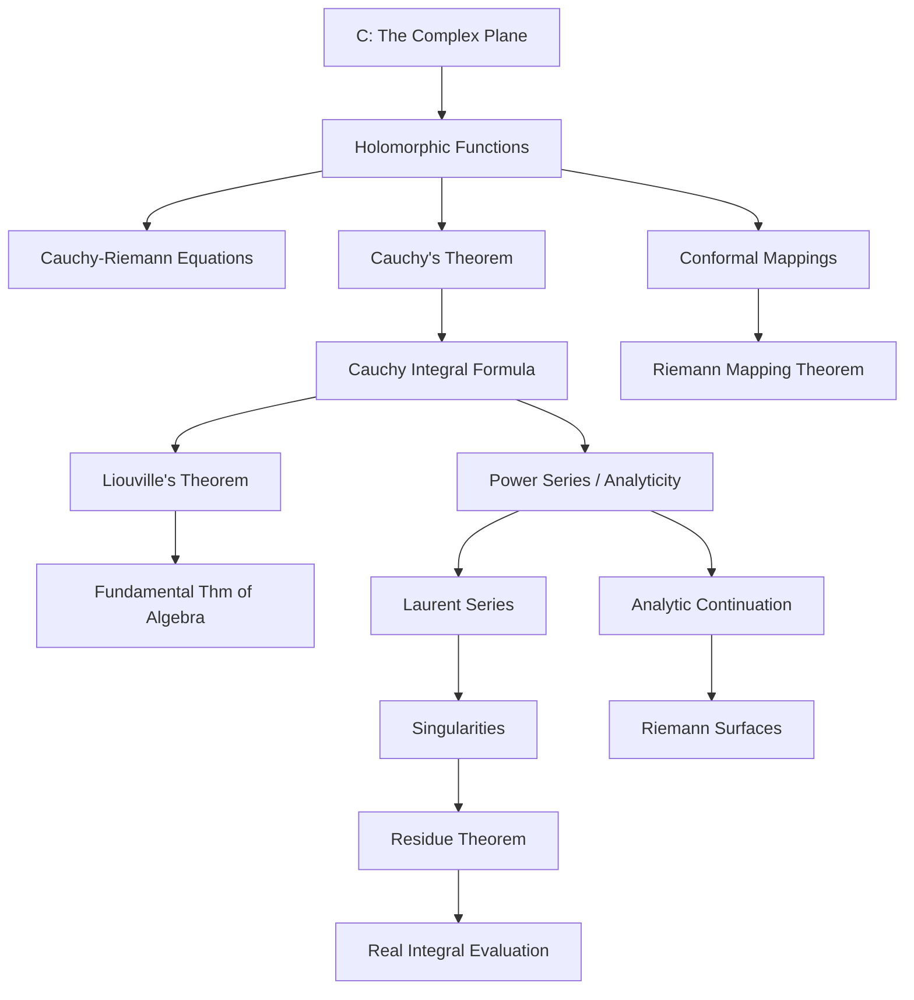
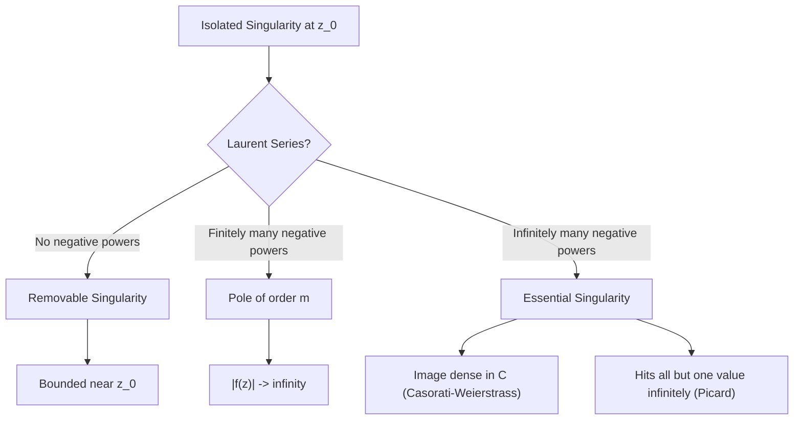

# Complex Analysis

> *Back to [[../math-syllabus|Mathematics Syllabus]]*
> *Related: [[functional-analysis]], [[differential-geometry]], [[topology]], [[number-theory]]*

---

## Concept Map



---

## 1. Motivation

Complex analysis is one of the most beautiful and powerful branches of mathematics. Functions of a complex variable exhibit a rigidity that has no analogue in real analysis: a function that is once complex-differentiable is automatically infinitely differentiable, analytic, and determined globally by its local behavior. This rigidity makes complex analysis simultaneously easier and deeper than real analysis.

Applications span nearly all of mathematics and the physical sciences: evaluation of real integrals via residues, conformal mappings in fluid dynamics and electrostatics, the prime number theorem in [[number-theory|number theory]], the spectral theory of operators in [[functional-analysis|functional analysis]], and the geometry of Riemann surfaces connecting to [[topology|algebraic topology]] and [[differential-geometry|differential geometry]].

## 2. Prerequisites

- **Real analysis:** Rigorous limits, continuity, uniform convergence, metric spaces.
- **Multivariable calculus:** Partial derivatives, line integrals, Green's theorem.
- **Linear algebra:** Linear maps, eigenvalues, inner products.

---

## 3. Detailed Topic Outline

### Part I: Foundations

#### 3.1 The Complex Plane and Elementary Functions

- The field $\mathbb{C}$: algebraic and topological structure.
- Polar form, argument, and the exponential map: $e^{iz} = \cos z + i \sin z$.
- The Riemann sphere $\hat{\mathbb{C}} = \mathbb{C} \cup \{\infty\}$ as a compact surface.
- Power series and radius of convergence; the identity theorem.
- Elementary functions: $\exp$, $\log$ (multi-valued), $z^a$, trigonometric and hyperbolic functions.

#### 3.2 Holomorphic Functions and the Cauchy-Riemann Equations

- **Definition.** A function $f: U \to \mathbb{C}$ is holomorphic at $z_0$ if the limit $f'(z_0) = \lim_{h \to 0} \frac{f(z_0+h) - f(z_0)}{h}$ exists (as a complex limit).
- Writing $f = u + iv$, holomorphicity is equivalent to the **Cauchy-Riemann equations**:
$$\frac{\partial u}{\partial x} = \frac{\partial v}{\partial y}, \qquad \frac{\partial u}{\partial y} = -\frac{\partial v}{\partial x}$$
  provided the partial derivatives are continuous.
- **Intuition:** The derivative $df/dz$ is a linear map $\mathbb{C} \to \mathbb{C}$, i.e., multiplication by a complex number (rotation + scaling). The CR equations express exactly the constraint that the Jacobian matrix is a rotation-dilation, not a general $2 \times 2$ matrix.
- Harmonic functions: $u$ and $v$ are harmonic (Laplacian zero). Connection to potential theory.

#### 3.3 Conformal Mappings (Introduction)

- Holomorphic maps with nonzero derivative are conformal (angle-preserving).
- Mobius transformations: $\frac{az+b}{cz+d}$, their group structure ($\mathrm{PSL}(2,\mathbb{C})$), action on the Riemann sphere.
- Classification: circles/lines map to circles/lines.

### Part II: Core Theory

#### 3.4 Complex Integration and Cauchy's Theorem

- Line integrals $\int_\gamma f(z)\, dz$; relationship to real line integrals.
- **Cauchy's Integral Theorem (Cauchy-Goursat).** If $f$ is holomorphic on a simply connected domain $D$, then for every closed curve $\gamma$ in $D$:
$$\oint_\gamma f(z)\, dz = 0$$
- **Intuition:** This is a far-reaching consequence of the CR equations and Green's theorem. The "irrotational + incompressible" conditions in the real plane translate to exact cancellation.
- **Cauchy's Integral Formula.** For $f$ holomorphic on $D$ and $z_0$ inside a simple closed curve $\gamma$:
$$f(z_0) = \frac{1}{2\pi i} \oint_\gamma \frac{f(z)}{z - z_0}\, dz$$
- Consequences:
  - $f$ is infinitely differentiable; $f^{(n)}(z_0) = \frac{n!}{2\pi i} \oint_\gamma \frac{f(z)}{(z - z_0)^{n+1}}\, dz$.
  - **Liouville's theorem:** bounded entire functions are constant.
  - **Fundamental theorem of algebra** (via Liouville).
  - **Morera's theorem:** converse of Cauchy's theorem.
  - **Maximum modulus principle:** $|f|$ has no interior maximum on a connected open set unless $f$ is constant.

#### 3.5 Power Series and Analytic Functions

- Taylor series: every holomorphic function equals its Taylor series on any disk within its domain.
- Equivalence of holomorphic and analytic (in contrast to the real case).
- Zeros of holomorphic functions are isolated (identity theorem).
- Hurwitz's theorem and Rouche's theorem (counting zeros).

#### 3.6 Laurent Series and Singularities

- **Laurent series:** $f(z) = \sum_{n=-\infty}^{\infty} a_n (z - z_0)^n$ on an annulus.
- Classification of isolated singularities:
  - **Removable** (no negative terms): extends to a holomorphic function.
  - **Pole of order $m$** (finitely many negative terms): $f(z) \sim \frac{c}{(z - z_0)^m}$.
  - **Essential singularity** (infinitely many negative terms): Casorati-Weierstrass theorem — the image of any punctured neighborhood is dense.
- **Great Picard theorem:** near an essential singularity, $f$ takes every value (with at most one exception) infinitely often.

#### 3.7 The Residue Theorem

- **Residue** of $f$ at $z_0$: $\operatorname{Res}(f, z_0) = a_{-1}$ in the Laurent expansion $= \frac{1}{2\pi i} \oint_\gamma f(z)\, dz$.
- **Residue theorem.** If $f$ is holomorphic on $D$ except at isolated singularities $z_1, \ldots, z_n$ inside $\gamma$:
$$\oint_\gamma f(z)\, dz = 2\pi i \sum_{k=1}^{n} \operatorname{Res}(f, z_k)$$
- **Computation techniques:**
  - Simple pole: $\operatorname{Res}(f, z_0) = \lim_{z \to z_0} (z - z_0)f(z)$.
  - Pole of order $m$: use the $(m-1)$-th derivative formula.
- **Applications to real integrals:**
  - Trigonometric integrals via unit circle substitution.
  - Improper integrals $\int_{-\infty}^{\infty}$ by semicircular contours (Jordan's lemma).
  - Integrals involving branch cuts (e.g., $\int_0^\infty \frac{x^{a-1}}{1+x}\, dx = \frac{\pi}{\sin(\pi a)}$).
  - Summation of series using $\cot(\pi z)$ or $\csc(\pi z)$.

### Part III: Advanced Topics

#### 3.8 Conformal Mappings (Advanced)

- **Riemann Mapping Theorem.** Every simply connected proper open subset of $\mathbb{C}$ is biholomorphic to the open unit disk.
- **Intuition:** Topology (simply connected) determines conformal type completely in one complex dimension. This is a deep rigidity result with no higher-dimensional analogue.
- Proof sketch: normal families, Montel's theorem, extremal maps.
- Schwarz-Christoffel formula for polygonal domains.
- Applications: fluid flow around obstacles, electrostatic potential problems.

#### 3.9 Analytic Continuation

- The monodromy theorem: analytic continuation along homotopic paths yields the same result.
- The Schwarz reflection principle.
- Natural boundaries (e.g., lacunary series).
- Multi-valued functions and branch cuts revisited: $\log$, $z^a$, $(z^2-1)^{1/2}$.

#### 3.10 Riemann Surfaces

- **Motivation:** Resolve multi-valuedness by "unfolding" the domain into a surface.
- Definition as a 1-dimensional complex manifold (connections to [[differential-geometry]]).
- Examples:
  - The Riemann surface of $\sqrt{z}$: a 2-sheeted cover of $\mathbb{C}$ branched at 0.
  - The Riemann surface of $\log(z)$: the universal cover of $\mathbb{C}\setminus\{0\}$, an infinite helicoidal surface.
  - Elliptic curves as tori $\mathbb{C}/\Lambda$ (connections to [[number-theory|elliptic curves in number theory]]).
- Genus, Euler characteristic, Riemann-Hurwitz formula.
- Uniformization theorem (preview): every simply connected Riemann surface is biholomorphic to the sphere, the plane, or the disk.

#### 3.11 Entire and Meromorphic Functions

- Weierstrass factorization theorem: constructing entire functions with prescribed zeros.
- Mittag-Leffler theorem: constructing meromorphic functions with prescribed poles.
- Order and type of entire functions.
- Hadamard's factorization theorem.

#### 3.12 The Gamma and Zeta Functions

- Gamma function $\Gamma(s)$: analytic continuation, functional equation, poles at non-positive integers.
- Riemann zeta function $\zeta(s)$: Euler product, analytic continuation, functional equation.
- Connection to prime number theorem (see [[number-theory]]).
- Non-trivial zeros and the Riemann Hypothesis (statement only).

---

## Singularity Classification



---

## Residue Computation Flowchart

```mermaid
graph TD
    A["Compute Res(f, z_0)"] --> B{Type of singularity?}
    B -->|Simple pole| C["lim (z-z_0) f(z)"]
    B -->|"Pole of order m"| D["(1/(m-1)!) lim d^(m-1)/dz^(m-1) [(z-z_0)^m f(z)]"]
    B -->|Essential| E[Read a_{-1} from Laurent expansion]
    B -->|"f = g/h, simple zero of h"| F["g(z_0) / h'(z_0)"]
```

---

## 4. Key Theorems — Summary with Intuitions

| Theorem | Statement (abbreviated) | Intuition |
|---------|------------------------|-----------|
| Cauchy-Goursat | $\oint_\gamma f\, dz = 0$ for $f$ holomorphic, $\gamma$ null-homotopic | CR equations make the integrand an exact form |
| Cauchy Integral Formula | $f(z_0) = \frac{1}{2\pi i} \oint \frac{f}{z-z_0}\, dz$ | Values inside determined by boundary — extreme rigidity |
| Liouville | Bounded entire $\implies$ constant | Cauchy estimates force all derivatives to vanish |
| Residue Theorem | $\oint f\, dz = 2\pi i \sum \operatorname{Res}$ | Contour integral captures local Laurent data |
| Riemann Mapping | Simply connected $\subsetneq \mathbb{C} \cong \mathbb{D}$ | Conformal type depends only on topology |
| Maximum Modulus | $|f|$ has no interior max | Holomorphic functions "push mass outward" |
| Identity Theorem | $f = g$ on set with limit point $\implies f = g$ | Zeros cannot accumulate — extreme rigidity |
| Great Picard | Near essential singularity, $f$ hits all but one value $\infty$-often | Essential singularities are maximally wild |

---

## 5. Applications

- **Physics:** Electrostatics, fluid dynamics (conformal maps), quantum field theory (contour integrals, analytic continuation of Feynman diagrams).
- **Engineering:** Signal processing ($z$-transform), control theory (Nyquist criterion), aerodynamics (Joukowski airfoil).
- **Number theory:** Analytic methods via $L$-functions and zeta functions. See [[number-theory]].
- **Combinatorics:** Generating functions analyzed via singularities (transfer theorems).
- **Differential equations:** Monodromy, Fuchsian equations, hypergeometric functions.

---

## 6. Recommended References

1. **Ahlfors, L.** *Complex Analysis* (3rd ed.). — The classic. Elegant, concise, rigorous.
2. **Stein & Shakarchi.** *Complex Analysis* (Princeton Lectures in Analysis II). — Modern, well-motivated, excellent problems.
3. **Conway, J.B.** *Functions of One Complex Variable* (I & II). — Comprehensive graduate reference.
4. **Needham, T.** *Visual Complex Analysis.* — Geometric intuition without peer.
5. **Lang, S.** *Complex Analysis* (GTM 103). — Efficient and algebraic in flavor.

---

## 7. Exercises and Milestones

- [ ] Verify CR equations for $e^z$, $\sin(z)$, and $1/z$.
- [ ] Evaluate $\int_0^\infty \frac{dx}{1+x^2}$ by residues.
- [ ] Evaluate $\int_0^{2\pi} \frac{d\theta}{a + \cos \theta}$ for $a > 1$ via unit circle substitution.
- [ ] Compute the Laurent series of $\frac{1}{e^z - 1}$ around $z = 0$.
- [ ] Prove the fundamental theorem of algebra using Liouville's theorem.
- [ ] Find a conformal map from the upper half-plane to the unit disk.
- [ ] Construct the Riemann surface of $\sqrt{z(z-1)}$ and determine its genus.
- [ ] Prove the reflection principle for the real axis.

---

> *Back to [[../math-syllabus|Mathematics Syllabus]]*
