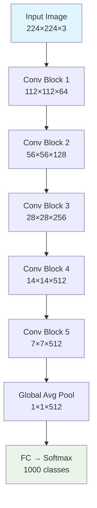
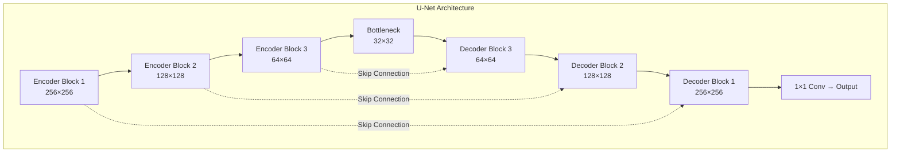
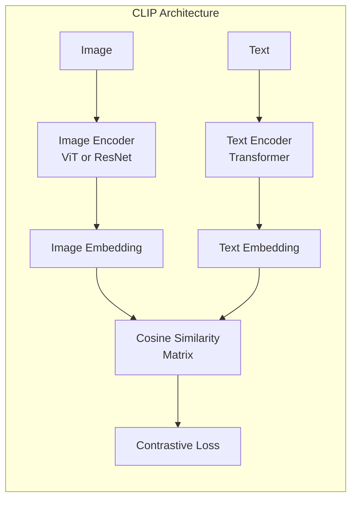

# Computer Vision

> Image classification, object detection, segmentation, and generative models.

## References

- Szeliski, R. *Computer Vision: Algorithms and Applications*, 2nd ed. Springer, 2022.
- Prince, S. J. D. *Understanding Deep Learning*. MIT Press, 2023.
- Goodfellow, I. et al. "Generative Adversarial Networks." NeurIPS, 2014.
- Redmon, J. et al. "You Only Look Once: Unified, Real-Time Object Detection." CVPR, 2016.
- Ho, J. et al. "Denoising Diffusion Probabilistic Models." NeurIPS, 2020.
- Dosovitskiy, A. et al. "An Image Is Worth 16x16 Words." ICLR, 2021.
- Kirillov, A. et al. "Segment Anything." ICCV, 2023.

---

# Part I — Image Classification

## Week 1: Convolution and Feature Extraction

### Continuous Convolution

$$(f * g)(t) = \int_{-\infty}^{\infty} f(\tau) \, g(t - \tau) \, d\tau$$

### Discrete 2D Convolution (Cross-Correlation)

In practice, CNNs compute cross-correlation (no kernel flip):

$$(I * K)(i, j) = \sum_{m}\sum_{n} I(i+m, j+n) \cdot K(m, n)$$

### Learned Feature Hierarchy

- **Early layers**: edges, corners, textures (Gabor-like filters)
- **Middle layers**: parts, motifs, patterns
- **Deep layers**: object-level, semantic features

### Transfer Learning

Pre-train on ImageNet (1.4M images, 1000 classes), then:
1. **Feature extraction**: freeze backbone, train new classifier head
2. **Fine-tuning**: unfreeze top layers, train with small learning rate

---

# Part II — Object Detection

## Week 2: Detection Architectures

### Intersection over Union

$$\text{IoU} = \frac{|A \cap B|}{|A \cup B|}$$

Used for matching predictions to ground truth. Typically IoU $\geq 0.5$ counts as a correct detection (AP@0.5).

### Mean Average Precision

$$\text{mAP} = \frac{1}{C}\sum_{c=1}^C \text{AP}_c, \quad \text{AP} = \int_0^1 P(r) \, dr$$

### Two-Stage Detectors (R-CNN Family)

| Model | Innovation |
|-------|-----------|
| R-CNN | Selective search + CNN features + SVM |
| Fast R-CNN | RoI pooling, single-stage feature extraction |
| Faster R-CNN | Region Proposal Network (RPN), end-to-end |
| Cascade R-CNN | Multi-stage refinement with increasing IoU thresholds |

**RPN**: slides $3 \times 3$ conv over feature map, predicts objectness + box regression at each anchor.

### Single-Stage Detectors

**YOLO** philosophy: divide image into $S \times S$ grid, each cell predicts $B$ bounding boxes with confidence and class probabilities simultaneously.

**YOLO loss** combines localization, confidence, and classification:

$$\mathcal{L} = \lambda_{\text{coord}} \sum_{ij} \mathbb{1}_{ij}^{\text{obj}}[(x_i - \hat{x}_i)^2 + (y_i - \hat{y}_i)^2 + (\sqrt{w_i} - \sqrt{\hat{w}_i})^2 + (\sqrt{h_i} - \sqrt{\hat{h}_i})^2] + \ldots$$

**SSD**: multi-scale feature maps for detecting objects at different sizes.

**Anchor-free detectors**: FCOS (fully convolutional), CenterNet (keypoint-based).

### Non-Maximum Suppression (NMS)

Post-processing to remove duplicate detections:
1. Sort boxes by confidence
2. Keep highest confidence box
3. Remove all boxes with IoU > threshold with kept box
4. Repeat

---

# Part III — Segmentation

## Week 3: Pixel-Level Prediction

### Semantic Segmentation

Classify every pixel into a category. No instance distinction.

**Fully Convolutional Networks (FCN)**: replace FC layers with $1 \times 1$ convolutions, upsample with transposed convolutions.

### U-Net Architecture

Encoder-decoder with skip connections at each resolution:

$$\text{output}_l = \text{Conv}(\text{Concat}(\text{Up}(d_l), e_l))$$

where $e_l$ is the encoder feature at level $l$ and $d_l$ is the decoder feature.

**Dice Loss** (common in medical segmentation):

$$\mathcal{L}_{\text{Dice}} = 1 - \frac{2|P \cap G|}{|P| + |G|} = 1 - \frac{2\sum_i p_i g_i}{\sum_i p_i + \sum_i g_i}$$

### Instance Segmentation

**Mask R-CNN**: extends Faster R-CNN with a parallel mask prediction branch. Uses RoIAlign (bilinear interpolation instead of quantized RoIPool).

### Segment Anything Model (SAM)

Foundation model for segmentation (Kirillov et al., 2023):
- **Image encoder**: ViT-H pre-trained with MAE
- **Prompt encoder**: handles points, boxes, text prompts
- **Mask decoder**: lightweight transformer decoder
- Trained on SA-1B dataset (1B masks, 11M images)

---

# Part IV — Generative Models

## Week 4: GANs

### GAN Objective (Goodfellow et al., 2014)

$$\min_G \max_D \; V(D, G) = E_{x \sim p_{\text{data}}}[\log D(x)] + E_{z \sim p_z}[\log(1 - D(G(z)))]$$

At optimum, $D^*(x) = \frac{p_{\text{data}}(x)}{p_{\text{data}}(x) + p_g(x)}$ and $G$ minimizes the Jensen-Shannon divergence.

### GAN Variants

| Variant | Key Change |
|---------|-----------|
| DCGAN | Convolutional architecture, batch norm |
| WGAN | Wasserstein distance, weight clipping |
| WGAN-GP | Gradient penalty instead of clipping |
| StyleGAN | Style-based generator, progressive training |
| CycleGAN | Unpaired image-to-image translation |

### Training Challenges

- **Mode collapse**: generator produces limited variety
- **Training instability**: discriminator overwhelms generator
- Solutions: spectral normalization, progressive growing, two-timescale update rule

## Week 5: Diffusion Models

### Forward Process (Noise Schedule)

Gradually add Gaussian noise over $T$ steps:

$$q(x_t | x_{t-1}) = \mathcal{N}(x_t; \sqrt{1-\beta_t} \, x_{t-1}, \beta_t I)$$

Closed-form for arbitrary $t$ with $\bar{\alpha}_t = \prod_{s=1}^t (1-\beta_s)$:

$$q(x_t | x_0) = \mathcal{N}(x_t; \sqrt{\bar{\alpha}_t} \, x_0, (1-\bar{\alpha}_t)I)$$

### Reverse Process (Denoising)

Learn to denoise:

$$p_\theta(x_{t-1} | x_t) = \mathcal{N}(x_{t-1}; \mu_\theta(x_t, t), \Sigma_\theta(x_t, t))$$

### Training Objective

Simplified loss (Ho et al., 2020) — predict the noise:

$$\mathcal{L}_{\text{simple}} = E_{t, x_0, \epsilon}\left[\|\epsilon - \epsilon_\theta(x_t, t)\|^2\right]$$

### Classifier-Free Guidance

Interpolate between conditional and unconditional predictions:

$$\tilde{\epsilon}_\theta(x_t, c) = (1+w) \cdot \epsilon_\theta(x_t, c) - w \cdot \epsilon_\theta(x_t, \emptyset)$$

where $w$ is the guidance scale. Used in DALL-E 2, Stable Diffusion, Imagen.

### Latent Diffusion (Stable Diffusion)

Run diffusion in the latent space of a pre-trained VAE encoder, reducing computational cost dramatically.

---

# Part V — Vision Transformers

## Week 6: ViT and Multimodal Models

### Vision Transformer (ViT)

Split image into $N = \frac{H \times W}{P^2}$ patches of size $P \times P$. Flatten and linearly project each patch, add positional embeddings, prepend `[CLS]` token, and process through standard Transformer encoder.

$$z_0 = [x_{\text{class}}; \; x_1 E; \; x_2 E; \; \ldots; \; x_N E] + E_{\text{pos}}$$

### CLIP (Contrastive Language-Image Pre-training)

Train image and text encoders jointly with contrastive loss:

$$\mathcal{L} = -\frac{1}{N}\sum_i \log \frac{\exp(\text{sim}(I_i, T_i)/\tau)}{\sum_j \exp(\text{sim}(I_i, T_j)/\tau)}$$

Enables zero-shot classification by comparing image embeddings to text embeddings of class descriptions.

### DINOv2

Self-supervised ViT training using self-distillation with no labels. Produces versatile visual features competitive with supervised pre-training.

---

## Summary Checklist

- [ ] Implement convolution and cross-correlation from scratch
- [ ] Calculate IoU and mAP for a set of detections
- [ ] Trace through U-Net skip connections
- [ ] Derive the GAN minimax equilibrium
- [ ] Implement the diffusion forward process
- [ ] Fine-tune a ViT on a custom dataset
- [ ] Use CLIP for zero-shot image classification
