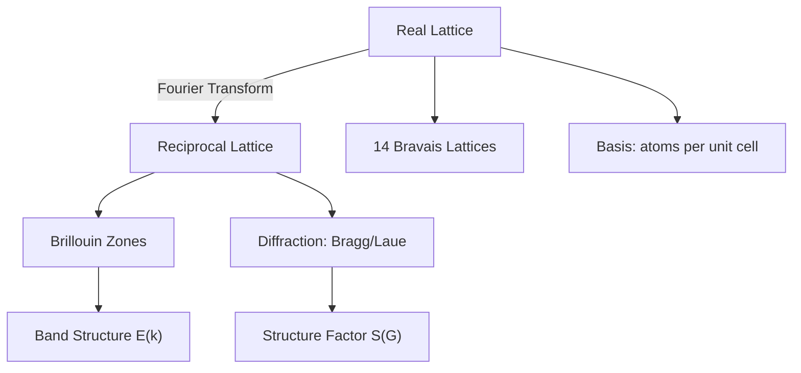
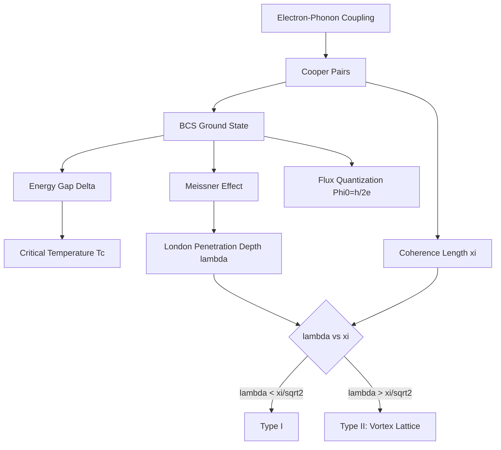
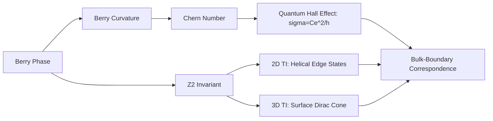

# Condensed Matter Physics

## References

- Ashcroft, N.W. & Mermin, N.D. *Solid State Physics* (Cengage, 1976)
- Kittel, C. *Introduction to Solid State Physics*, 8th ed. (Wiley, 2004)
- Altland, A. & Simons, B.D. *Condensed Matter Field Theory*, 2nd ed. (Cambridge, 2010)

---

## Part I: Crystal Structure and Reciprocal Space (Weeks 1-3)

### Bravais Lattices

A Bravais lattice is the set of points $\mathbf{R} = n_1\mathbf{a}_1 + n_2\mathbf{a}_2 + n_3\mathbf{a}_3$ with integer $n_i$. In 3D there are 14 distinct Bravais lattices grouped into 7 crystal systems.

Key lattices: simple cubic (sc), body-centered cubic (bcc), face-centered cubic (fcc), hexagonal close-packed (hcp).

Crystal structure = Bravais lattice + basis. Point group symmetries + translations form the 230 space groups.

### Reciprocal Lattice

Reciprocal lattice vectors satisfy $\mathbf{b}_i \cdot \mathbf{a}_j = 2\pi\delta_{ij}$:

$$\mathbf{b}_1 = \frac{2\pi(\mathbf{a}_2 \times \mathbf{a}_3)}{\mathbf{a}_1\cdot(\mathbf{a}_2\times\mathbf{a}_3)}$$

The first Brillouin zone is the Wigner-Seitz cell of the reciprocal lattice.

### X-Ray Diffraction

Bragg condition: $2d\sin\theta = n\lambda$

Laue condition: $\Delta\mathbf{k} = \mathbf{G}$ (scattering vector equals a reciprocal lattice vector).

Structure factor: $S(\mathbf{G}) = \sum_j f_j e^{-i\mathbf{G}\cdot\mathbf{d}_j}$ where $f_j$ is the atomic form factor and $\mathbf{d}_j$ the basis vector.

---

## Part II: Electronic Band Theory (Weeks 4-7)

### Free Electron Model

Electrons in a box of volume $V$: plane wave states $\psi_\mathbf{k} = V^{-1/2}e^{i\mathbf{k}\cdot\mathbf{r}}$ with $E = \hbar^2k^2/2m$.

Density of states in 3D: $g(E) = \frac{V}{2\pi^2}\left(\frac{2m}{\hbar^2}\right)^{3/2}\sqrt{E}$

Fermi energy: $E_F = \frac{\hbar^2}{2m}(3\pi^2 n)^{2/3}$ where $n = N/V$.

### Bloch's Theorem

For a periodic potential $V(\mathbf{r} + \mathbf{R}) = V(\mathbf{r})$, the eigenstates take the Bloch form:

$$\psi_{n\mathbf{k}}(\mathbf{r}) = e^{i\mathbf{k}\cdot\mathbf{r}}u_{n\mathbf{k}}(\mathbf{r})$$

where $u_{n\mathbf{k}}$ has the periodicity of the lattice. The energy $E_n(\mathbf{k})$ is a periodic function of $\mathbf{k}$ (the band structure).

### Nearly Free Electron Model

Weak periodic potential opens band gaps at Brillouin zone boundaries. Near a zone boundary with reciprocal lattice vector $\mathbf{G}$, the gap is:

$$E_{\text{gap}} = 2|V_\mathbf{G}|$$

where $V_\mathbf{G}$ is the Fourier component of the potential.

### Tight-Binding Model

Starting from atomic orbitals, hopping between nearest neighbors gives:

$$E(\mathbf{k}) = \epsilon_0 - t\sum_{\boldsymbol{\delta}}e^{i\mathbf{k}\cdot\boldsymbol{\delta}}$$

For a 1D chain: $E(k) = \epsilon_0 - 2t\cos(ka)$. Bandwidth $= 4t$.

### Metals, Insulators, Semiconductors

- **Metal**: partially filled band (Fermi level inside a band)
- **Insulator**: large band gap ($> 3$ eV), completely filled valence band
- **Semiconductor**: small band gap ($\sim 0.1$-$3$ eV); conduction by thermal excitation

### Semiconductors in Detail

Intrinsic carrier concentration: $n_i = \sqrt{N_c N_v}\,e^{-E_g/(2k_BT)}$

Doping: n-type (donors, e.g., P in Si), p-type (acceptors, e.g., B in Si).

p-n junction: built-in potential $V_0 = (k_BT/e)\ln(N_A N_D/n_i^2)$. Depletion width, current-voltage characteristic $I = I_0(e^{eV/k_BT} - 1)$.

Effective mass from band curvature: $m^* = \hbar^2\left(\frac{\partial^2 E}{\partial k^2}\right)^{-1}$

---

## Part III: Collective Phenomena (Weeks 8-11)

### Lattice Vibrations and Phonons

For a 1D monatomic chain (spring constant $K$, mass $m$, spacing $a$):

$$\omega(k) = 2\sqrt{\frac{K}{m}}\left|\sin\frac{ka}{2}\right|$$

Diatomic chain: acoustic and optical branches.

Phonons are quantized lattice vibrations (bosons). Debye model: $C_V \propto T^3$ at low $T$.

### Magnetism

**Diamagnetism**: $\chi < 0$, all materials (Lenz's law at atomic level).

**Paramagnetism**: $\chi > 0$, Curie law $\chi = C/T$.

**Ferromagnetism**: Heisenberg model $H = -J\sum_{\langle ij\rangle}\mathbf{S}_i\cdot\mathbf{S}_j$. Mean-field Curie temperature $T_C = Jz S(S+1)/(3k_B)$. Domains, hysteresis.

**Antiferromagnetism**: alternating spins, Neel temperature $T_N$.

### Superconductivity

**Phenomenology**: zero resistivity below $T_c$, Meissner effect ($\mathbf{B} = 0$ inside), magnetic flux quantization $\Phi_0 = h/(2e)$.

**London equations**: $\nabla^2\mathbf{B} = \mathbf{B}/\lambda_L^2$, penetration depth $\lambda_L = \sqrt{m/(n_s e^2\mu_0)}$.

**BCS Theory**: Cooper pairs form via electron-phonon interaction. The gap equation:

$$\Delta = V g(E_F)\int_0^{\hbar\omega_D}\frac{\Delta}{\sqrt{\xi^2+\Delta^2}}\tanh\frac{\sqrt{\xi^2+\Delta^2}}{2k_BT}\,d\xi$$

Gap at $T=0$: $\Delta_0 \approx 1.76\,k_BT_c$. The Cooper pair wave function extends over the coherence length $\xi_0 = \hbar v_F/(\pi\Delta_0)$.

**Type I vs Type II**: Type II superconductors (with $\lambda > \xi/\sqrt{2}$) allow magnetic flux penetration via Abrikosov vortex lattice between $H_{c1}$ and $H_{c2}$.

---

## Part IV: Topological Phases (Weeks 12-14)

### Berry Phase

For a Hamiltonian $\hat{H}(\mathbf{R})$ depending on parameters $\mathbf{R}$, adiabatic transport around a closed loop $C$ yields a geometric phase:

$$\gamma_n = \oint_C \mathbf{A}_n(\mathbf{R})\cdot d\mathbf{R}, \qquad \mathbf{A}_n = i\langle n(\mathbf{R})|\nabla_\mathbf{R}|n(\mathbf{R})\rangle$$

Berry curvature: $\mathbf{F}_n = \nabla_\mathbf{R} \times \mathbf{A}_n$

### Topological Insulators

Bulk insulator with protected conducting surface/edge states. Characterized by topological invariants.

**Integer Quantum Hall Effect**: Hall conductance is quantized $\sigma_{xy} = \nu e^2/h$ where $\nu$ is an integer. The Chern number:

$$C = \frac{1}{2\pi}\int_{\text{BZ}} F_{xy}(\mathbf{k})\,d^2k \in \mathbb{Z}$$

TKNN formula connects $\sigma_{xy}$ to $C$: $\sigma_{xy} = Ce^2/h$.

**2D Topological Insulator**: $\mathbb{Z}_2$ invariant, helical edge states (spin-momentum locking). Kane-Mele model (graphene with spin-orbit coupling).

**3D Topological Insulator**: surface Dirac cone, protected by time-reversal symmetry. Materials: Bi$_2$Se$_3$, Bi$_2$Te$_3$.

### Bulk-Boundary Correspondence

The number of topologically protected edge/surface states equals the difference in topological invariants across the boundary.

---

## Key Problem Types

1. **Crystal structure** — identify lattice, basis, reciprocal lattice, Brillouin zone
2. **Band structure** — tight-binding and NFE models, effective mass, DOS
3. **Transport** — Drude model, Hall effect, Boltzmann equation
4. **Phonons** — dispersion relations, Debye model, thermal properties
5. **Superconductivity** — London equations, BCS gap, flux quantization
6. **Topology** — Berry phase calculations, Chern number, edge states
