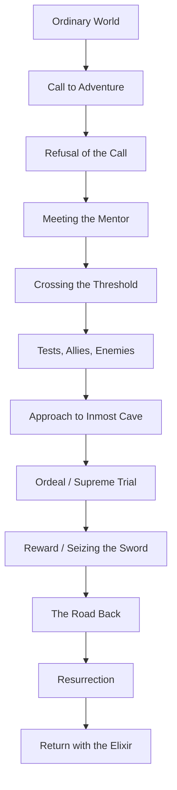
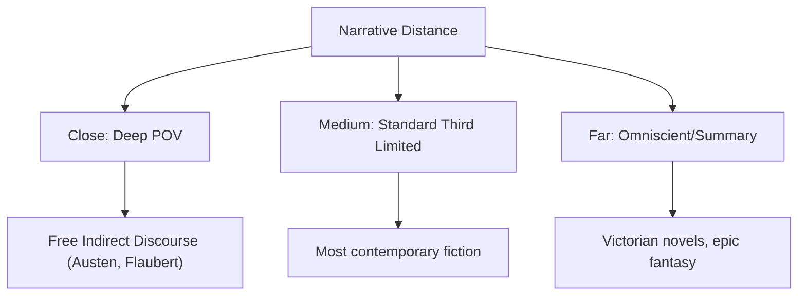
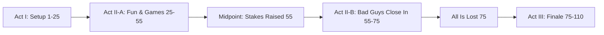

# Creative Writing — Fiction, Poetry, and Craft

## Part I — Narrative Structure

### Week 1: Story Architecture

**Three-Act Structure**
- Act I (Setup ~25%): introduce protagonist, establish world, inciting incident
- Act II (Confrontation ~50%): rising action, complications, midpoint reversal
- Act III (Resolution ~25%): climax, falling action, denouement

**Freytag's Pyramid** (1863): Exposition - Rising Action - Climax - Falling Action - Denouement. Originally described for five-act tragedy; still useful as a diagnostic tool.

**The Hero's Journey (Campbell, *The Hero with a Thousand Faces*, 1949)**

**Alternative Structures**:
- *In medias res*: begin in the middle of the action (Homer's *Iliad*, *Beloved*)
- *Frame narrative*: story within a story (*Wuthering Heights*, *Heart of Darkness*)
- *Braided narrative*: multiple storylines woven together (*Cloud Atlas*)
- *Circular*: ending returns to the beginning (*Finnegans Wake*, *Pedro Paramo*)

### Week 2: Plot and Conflict

Seven basic plots (Booker): Overcoming the Monster, Rags to Riches, The Quest, Voyage and Return, Comedy, Tragedy, Rebirth. These are archetypes, not formulas.

**Conflict types**: Person vs. Person, Person vs. Self, Person vs. Society, Person vs. Nature, Person vs. Technology, Person vs. Fate/God.

Tension requires *stakes* (what can be lost) and *urgency* (time pressure, escalation). Without stakes, there is no story — only situation.

---

## Part II — Character

### Week 3: Building Characters

**E.M. Forster's distinction (*Aspects of the Novel*, 1927)**:
- **Flat characters**: defined by a single quality, unchanging. Useful as foils, comic relief, archetypes.
- **Round characters**: complex, contradictory, capable of surprising us "convincingly." The protagonist must almost always be round.

**Character arc**: the internal transformation driven by external events. A character who begins afraid and ends courageous has a positive arc. A character who begins idealistic and ends corrupt has a negative arc (tragedy). A flat-arc character (e.g., Sherlock Holmes) changes the world around them.

**Motivation**: What does the character want (external goal)? What do they *need* (internal need, often unknown to them)? The gap between want and need drives the story.

### Week 4: Dialogue and Subtext

Good dialogue is:
- **Indirect**: characters rarely say exactly what they mean
- **Revealing**: each line exposes character, advances plot, or both
- **Distinct**: each character's voice is recognizable without attribution tags

**Subtext**: what is communicated beneath the surface. In Hemingway's "iceberg theory," 7/8 of meaning is below the waterline. Pinter's pauses. What characters *don't* say.

**"Show, don't tell"**: dramatize through scene (action, dialogue, sensory detail) rather than summarize through exposition. But: telling has its place — for transitions, compression, narrative distance.

---

## Part III — Point of View

### Week 5: POV and Narrative Voice

| POV | Characteristics | Examples |
|-----|----------------|----------|
| First person | "I" narrator; limited to one consciousness; intimate | *Catcher in the Rye*, *Jane Eyre* |
| Second person | "You" — rare, disorienting, implicating | Italo Calvino *If on a winter's night a traveler* |
| Third limited | "He/She" but filtered through one character's perception | *Harry Potter*, most contemporary fiction |
| Third omniscient | God's-eye narrator; can enter any mind | Tolstoy, Eliot, Garcia Marquez |
| Objective | External observation only; no interiority | Hemingway "Hills Like White Elephants" |

**The Unreliable Narrator**: a narrator whose credibility is compromised. Nabokov's Humbert Humbert (*Lolita*) is charming, erudite, and a monster. The reader must read *against* the narrator. Other examples: Stevens in *The Remains of the Day*, the governess in *The Turn of the Screw*.

---

## Part IV — Forms and Genres

### Week 6: Flash Fiction and the Short Story

**Flash Fiction** (under 1000 words): compression is everything. Lydia Davis, Amy Hempel, Diane Williams. The flash must contain a *turn* — a shift in understanding, a reversal, a moment of recognition — in miniature.

**The Short Story**: Chekhov established the modern form: no tidy morals, ambiguous endings, detail as revelation. Key principles:
- **Chekhov's gun**: if a rifle hangs on the wall in Act I, it must fire by Act III. Every detail earns its place.
- **Epiphany** (Joyce): a moment of sudden insight or revelation. "A sudden spiritual manifestation." (*Dubliners*)
- **The Iceberg Theory** (Hemingway): omit what the reader can infer. Dignity of the unsaid.

### Week 7: The Novel

**Pacing**: alternation of scene (real-time, dramatized) and summary (compressed, narrated). Long novels need subplots to prevent monotony and deepen theme.

**Chapter structure**: each chapter as a mini-story with its own arc. End chapters on questions, revelations, or cliffhangers to maintain forward momentum.

**Revision**: the novel is written in revision. First drafts are for discovery; subsequent drafts are for architecture, voice, and precision.

### Week 8: Poetry Writing

- **Image first**: concrete, sensory, specific. Not "sadness" but "the empty chair at the kitchen table."
- **Line break as tool**: the end of a line creates a pause, a slight suspense. Break where meaning is enriched by ambiguity.
- **Sound**: read aloud. Listen for unintended rhyme, dead spots, rhythmic monotony.
- **Revision**: Robert Lowell rewrote some poems over 100 times. Cut what is merely decorative.

### Week 9: Screenwriting Basics

**Beat Sheet (Blake Snyder, *Save the Cat!*, 2005)**:
1. Opening Image — 2. Theme Stated — 3. Setup — 4. Catalyst — 5. Debate — 6. Break into Two — 7. B Story — 8. Fun and Games — 9. Midpoint — 10. Bad Guys Close In — 11. All Is Lost — 12. Dark Night of the Soul — 13. Break into Three — 14. Finale — 15. Final Image

Format: action in present tense, all caps for character introductions, dialogue centered. A screenplay page roughly equals one minute of screen time.

---

## Part V — The Writing Life

### Week 10: Revision Process

1. **Cool off**: put the draft away for days or weeks
2. **Read as reader**: print it out, read it straight through, note where attention wanders
3. **Structural pass**: does the plot work? Are there sagging middles? Cut or rearrange
4. **Line edit**: every sentence earns its place. Kill adverbs, cliches, vague abstractions
5. **Polish**: rhythm, word choice, consistency of voice

> "The beautiful part of writing is that you don't have to get it right the first time, unlike, say, a brain surgeon." — Robert Cormier

### Week 11: Workshop Etiquette

The **Iowa model**:
- Author remains silent while piece is discussed
- Readers describe what they see happening in the text (not what they'd do differently)
- Praise specific strengths; critique specific weaknesses
- Focus on craft, not taste
- Written feedback supplements oral discussion

### Week 12: Building a Practice

- Write daily, even if badly. Quantity produces quality over time (Art & Fear: "the ceramics class parable")
- Read voraciously, widely, critically. Read as a writer — reverse-engineer what works.
- Keep a notebook: overheard dialogue, images, ideas, first lines
- Submit work. Rejection is data, not judgment.

---

## References

- Gardner, John. *The Art of Fiction*. Vintage, 1991.
- Burroway, Janet. *Writing Fiction: A Guide to Narrative Craft*. 10th ed. U of Chicago P, 2019.
- King, Stephen. *On Writing: A Memoir of the Craft*. Scribner, 2000.
- Lamott, Anne. *Bird by Bird: Some Instructions on Writing and Life*. Anchor, 1995.
- Forster, E.M. *Aspects of the Novel*. Harcourt, 1927.
- Campbell, Joseph. *The Hero with a Thousand Faces*. Pantheon, 1949.
- Wood, James. *How Fiction Works*. Farrar, Straus and Giroux, 2008.
- Snyder, Blake. *Save the Cat!* Michael Wiese, 2005.
