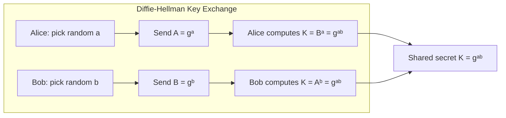
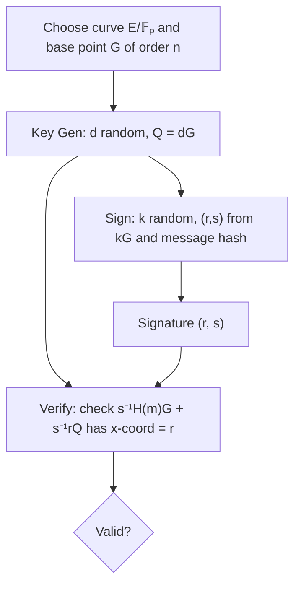
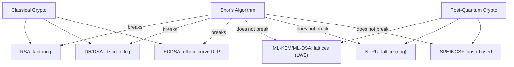

# Cryptographic Number Theory

## Course Overview

Number-theoretic foundations of modern cryptography: hardness assumptions based on factoring, discrete logarithms, and lattice problems; the construction of RSA, Diffie-Hellman, elliptic curve, and post-quantum cryptosystems; and zero-knowledge proof systems.

## References

- J. Katz & Y. Lindell, *Introduction to Modern Cryptography*, 3rd ed., CRC Press, 2021.
- L.C. Washington, *Elliptic Curves: Number Theory and Cryptography*, 2nd ed., CRC Press, 2008.
- J. Hoffstein, J. Pipher & J.H. Silverman, *An Introduction to Mathematical Cryptography*, 2nd ed., Springer UTM, 2014.

---

# Part I — Classical Public-Key Cryptography

## Week 1: Computational Number Theory Foundations

### Hard Problems

Modern public-key cryptography rests on the computational intractability of certain number-theoretic problems:

| Problem | Input | Task | Best Known |
|---------|-------|------|------------|
| **Integer Factorization** | $n = pq$ | Find $p, q$ | $L_n[1/3, 1.923]$ (GNFS) |
| **RSA Problem** | $n, e, c$ | Find $m: c = m^e \bmod n$ | Equivalent to factoring (believed) |
| **Discrete Log (DLP)** | $g, h, p$ | Find $x: g^x \equiv h \pmod{p}$ | $L_p[1/3, 1.923]$ (NFS-DL) |
| **ECDLP** | $P, Q$ on $E$ | Find $k: Q = kP$ | $O(\sqrt{q})$ (Pollard rho) |

Here $L_n[\alpha, c] = \exp(c (\ln n)^\alpha (\ln \ln n)^{1-\alpha})$ denotes subexponential complexity.

### Primality Testing

- **Miller-Rabin:** Probabilistic, error $\leq 4^{-k}$ after $k$ rounds.
- **AKS (2002):** Deterministic polynomial time: $\tilde{O}(\log^6 n)$.

For a prime $p$, write $p - 1 = 2^s d$ with $d$ odd. Then $a$ is a **strong witness** for the compositeness of $n$ if $a^d \not\equiv 1 \pmod{n}$ and $a^{2^r d} \not\equiv -1 \pmod{n}$ for all $0 \leq r < s$.

## Week 2: RSA

### Key Generation

1. Choose large primes $p, q$ (typically 1024+ bits each).
2. Compute $n = pq$ and $\lambda(n) = \text{lcm}(p-1, q-1)$.
3. Choose $e$ with $\gcd(e, \lambda(n)) = 1$ (common: $e = 65537$).
4. Compute $d \equiv e^{-1} \pmod{\lambda(n)}$.

**Public key:** $(n, e)$. **Private key:** $d$.

### Encryption and Decryption

$$c = m^e \bmod n \qquad \text{(encrypt)}$$
$$m = c^d \bmod n \qquad \text{(decrypt)}$$

Correctness follows from Euler's theorem: $m^{ed} = m^{1 + k\lambda(n)} \equiv m \pmod{n}$.

### Security Considerations

- **Textbook RSA** is deterministic and thus not CPA-secure. Use **OAEP** padding (PKCS#1 v2).
- Choosing $e$ small (e.g., $e = 3$) without padding is vulnerable to Coppersmith's attack.
- The private exponent $d$ must satisfy $d > n^{0.292}$ (Boneh-Durfee bound), else lattice attacks recover $d$.

## Week 3: Diffie-Hellman Key Exchange

### Protocol

Over a cyclic group $G = \langle g \rangle$ of prime order $q$:

1. Alice picks $a \xleftarrow{\$} \mathbb{Z}_q$, sends $A = g^a$.
2. Bob picks $b \xleftarrow{\$} \mathbb{Z}_q$, sends $B = g^b$.
3. Shared secret: $K = g^{ab} = A^b = B^a$.

### Hardness Assumptions

- **Computational Diffie-Hellman (CDH):** Given $g, g^a, g^b$, compute $g^{ab}$.
- **Decisional Diffie-Hellman (DDH):** Distinguish $(g^a, g^b, g^{ab})$ from $(g^a, g^b, g^c)$.

DDH $\Rightarrow$ CDH $\Rightarrow$ DLP (reductions in this direction).

---

# Part II — Elliptic Curve Cryptography

## Week 4: Elliptic Curves

### Weierstrass Form

An **elliptic curve** over a field $K$ (with $\text{char}(K) \neq 2, 3$) is:

$$E: y^2 = x^3 + ax + b, \quad \Delta = -16(4a^3 + 27b^2) \neq 0$$

The set $E(K)$ of $K$-rational points (plus a point at infinity $\mathcal{O}$) forms an abelian group under the chord-and-tangent law.

### Point Addition

For $P = (x_1, y_1)$ and $Q = (x_2, y_2)$ with $P \neq \pm Q$:

$$\lambda = \frac{y_2 - y_1}{x_2 - x_1}, \quad x_3 = \lambda^2 - x_1 - x_2, \quad y_3 = \lambda(x_1 - x_3) - y_1$$

For point doubling ($P = Q$):

$$\lambda = \frac{3x_1^2 + a}{2y_1}$$

### Hasse's Theorem

For $E/\mathbb{F}_p$:

$$|E(\mathbb{F}_p)| = p + 1 - t, \quad |t| \leq 2\sqrt{p}$$

where $t$ is the **trace of Frobenius**.

## Week 5: ECDSA and Scalar Multiplication

### Scalar Multiplication

Given $P \in E$ and integer $k$, compute $Q = kP = P + P + \cdots + P$ ($k$ times). Efficient via **double-and-add** in $O(\log k)$ group operations.

### ECDSA (Elliptic Curve Digital Signature Algorithm)

**Parameters:** Curve $E/\mathbb{F}_p$, base point $G$ of prime order $n$, hash function $H$.

**Key generation:** Private key $d \xleftarrow{\$} [1, n-1]$, public key $Q = dG$.

**Signing** message $m$:
1. Pick $k \xleftarrow{\$} [1, n-1]$.
2. Compute $(x_1, y_1) = kG$, set $r = x_1 \bmod n$.
3. Compute $s = k^{-1}(H(m) + rd) \bmod n$.
4. Signature: $(r, s)$.

**Verification:** Accept iff the $x$-coordinate of $s^{-1}H(m) \cdot G + s^{-1}r \cdot Q$ equals $r \pmod{n}$.

### Standard Curves

| Curve | Field Size | Security Level |
|-------|-----------|---------------|
| secp256k1 (Bitcoin) | 256-bit | 128-bit |
| P-256 (NIST) | 256-bit | 128-bit |
| Curve25519 (Bernstein) | 255-bit | 128-bit |
| P-384 (NIST) | 384-bit | 192-bit |

---

# Part III — Lattice-Based Cryptography

## Week 6: Lattices and Hard Problems

### Lattice Basics

A **lattice** $\mathcal{L}$ in $\mathbb{R}^n$ is a discrete additive subgroup:

$$\mathcal{L} = \left\{\sum_{i=1}^n z_i \mathbf{b}_i : z_i \in \mathbb{Z}\right\}$$

for a basis $\{\mathbf{b}_1, \ldots, \mathbf{b}_n\}$.

### Hard Lattice Problems

- **Shortest Vector Problem (SVP):** Find the shortest nonzero vector in $\mathcal{L}$.
- **Closest Vector Problem (CVP):** Given a target $\mathbf{t}$, find the closest lattice point.
- **Learning With Errors (LWE):** Given $(\mathbf{A}, \mathbf{b} = \mathbf{A}\mathbf{s} + \mathbf{e})$ where $\mathbf{e}$ is a small error vector, recover $\mathbf{s}$.

LWE is as hard as worst-case lattice problems (Regev, 2005):

$$\text{GapSVP}_\gamma \leq_{\text{quantum}} \text{LWE}_{n, q, \chi}$$

## Week 7: LWE-Based Encryption and NTRU

### Regev's Encryption Scheme

**Public key:** $(\mathbf{A}, \mathbf{b} = \mathbf{A}\mathbf{s} + \mathbf{e}) \in \mathbb{Z}_q^{m \times n} \times \mathbb{Z}_q^m$.

**Encrypt** bit $\mu \in \{0, 1\}$:
- Choose random $\mathbf{r} \in \{0,1\}^m$.
- $\mathbf{c}_1 = \mathbf{A}^T \mathbf{r}, \quad c_2 = \mathbf{b}^T \mathbf{r} + \mu \lfloor q/2 \rfloor$.

**Decrypt:** Compute $c_2 - \mathbf{s}^T \mathbf{c}_1 \approx \mu \lfloor q/2 \rfloor$ and round.

### NTRU

Operate in the ring $R = \mathbb{Z}[x]/(x^n - 1)$. Key generation:
- Choose small polynomials $f, g \in R$.
- Public key: $h = g \cdot f^{-1} \bmod q$.
- Encrypt: $c = r \cdot h + m \bmod q$ for small random $r$.
- Decrypt using $f$: $f \cdot c = f \cdot r \cdot h + f \cdot m = r \cdot g + f \cdot m \bmod q$, then reduce mod $p$.

---

# Part IV — Post-Quantum Cryptography and ZKPs

## Week 8: Post-Quantum Standards

### NIST Post-Quantum Selections (2022-2024)

| Algorithm | Type | Based On | Use |
|-----------|------|----------|-----|
| ML-KEM (Kyber) | KEM | Module-LWE | Key encapsulation |
| ML-DSA (Dilithium) | Signature | Module-LWE | Digital signatures |
| SLH-DSA (SPHINCS+) | Signature | Hash-based | Stateless signatures |
| FN-DSA (Falcon) | Signature | NTRU lattices | Compact signatures |

### Why Post-Quantum?

Shor's algorithm (1994) solves factoring and DLP in polynomial time on a quantum computer:

$$\text{Factoring } n: O((\log n)^3) \text{ quantum gates}$$

This breaks RSA, Diffie-Hellman, and ECDSA. Lattice problems (LWE, NTRU) are believed to resist quantum attacks.

## Week 9: Zero-Knowledge Proofs

### Definition

A **zero-knowledge proof** for a language $L$ is an interactive protocol $(P, V)$ where:
1. **Completeness:** If $x \in L$, honest $P$ convinces $V$ with probability $\geq 1 - \epsilon$.
2. **Soundness:** If $x \notin L$, no $P^*$ convinces $V$ with probability $> \epsilon$.
3. **Zero-Knowledge:** $V$'s view can be simulated without $P$, so $V$ learns nothing beyond $x \in L$.

### Schnorr Protocol (DL-based ZKP)

Prove knowledge of $x$ such that $h = g^x$ without revealing $x$:

1. Prover picks $r \xleftarrow{\$} \mathbb{Z}_q$, sends $a = g^r$.
2. Verifier sends challenge $c \xleftarrow{\$} \mathbb{Z}_q$.
3. Prover sends $z = r + cx \bmod q$.
4. Verifier accepts iff $g^z = a \cdot h^c$.

### zk-SNARKs

**Succinct Non-interactive Arguments of Knowledge:** The proof is constant size (a few group elements), verification is $O(1)$. Used in blockchain privacy (Zcash) and rollups (zkSync, StarkNet).

Key construction: arithmetic circuit $\to$ R1CS $\to$ QAP $\to$ pairing-based proof.

## Week 10: Pairings and Advanced Protocols

### Bilinear Pairings

A **pairing** on elliptic curves is a map $e: G_1 \times G_2 \to G_T$ satisfying:

$$e(aP, bQ) = e(P, Q)^{ab}$$

Pairings enable: identity-based encryption (IBE), short signatures (BLS), and efficient ZKPs.

### BLS Signatures

- **Key:** $sk = x$, $pk = xG \in G_2$.
- **Sign:** $\sigma = xH(m) \in G_1$ where $H: \{0,1\}^* \to G_1$.
- **Verify:** $e(\sigma, G) = e(H(m), pk)$.

Signatures are aggregatable: $\sigma_{\text{agg}} = \sigma_1 + \cdots + \sigma_n$ verifies against all public keys simultaneously.

---

# Summary of Key Systems

| System | Hard Problem | Key Size | Quantum Safe? |
|--------|-------------|----------|--------------|
| RSA-2048 | Factoring | 2048-bit modulus | No |
| ECDSA P-256 | ECDLP | 256-bit | No |
| ML-KEM-768 | Module-LWE | ~1184 bytes | Yes |
| ML-DSA-65 | Module-LWE | ~1952 bytes | Yes |
| NTRU-HPS | Ring-LWE variant | ~930 bytes | Yes |
