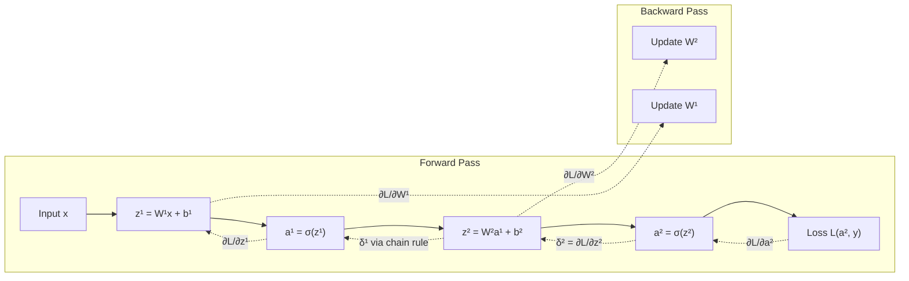
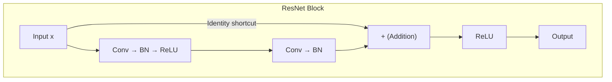
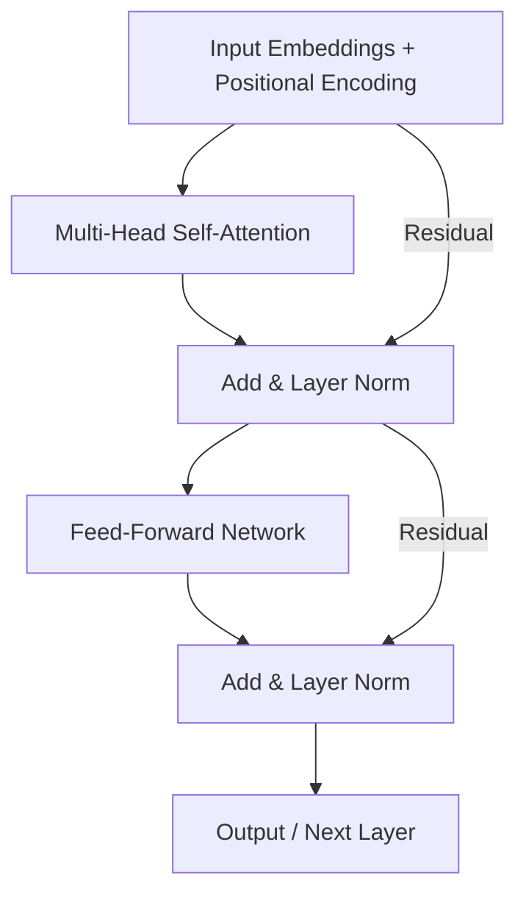

# Deep Learning

> From backpropagation fundamentals through CNNs, RNNs, and Transformers.

## References

- Goodfellow, I., Bengio, Y., & Courville, A. *Deep Learning*. MIT Press, 2016.
- Prince, S. J. D. *Understanding Deep Learning*. MIT Press, 2023.
- Zhang, A. et al. *Dive into Deep Learning* (d2l.ai). Cambridge University Press, 2023.
- He, K. et al. "Deep Residual Learning for Image Recognition." CVPR, 2016.
- Vaswani, A. et al. "Attention Is All You Need." NeurIPS, 2017.

---

# Part I — Foundations

## Week 1: Neural Network Basics

### The Perceptron and MLPs

A single neuron computes:

$$a = \sigma(w^Tx + b)$$

where $\sigma$ is a nonlinear activation. Common activations:

| Function | Formula | Range |
|----------|---------|-------|
| Sigmoid | $\sigma(z) = \frac{1}{1+e^{-z}}$ | $(0, 1)$ |
| Tanh | $\tanh(z) = \frac{e^z - e^{-z}}{e^z + e^{-z}}$ | $(-1, 1)$ |
| ReLU | $\text{ReLU}(z) = \max(0, z)$ | $[0, \infty)$ |
| GELU | $\text{GELU}(z) = z \cdot \Phi(z)$ | $(-0.17, \infty)$ |
| SiLU/Swish | $\text{SiLU}(z) = z \cdot \sigma(z)$ | $(-0.28, \infty)$ |

### Universal Approximation Theorem

A feedforward network with a single hidden layer of sufficient width can approximate any continuous function on a compact set to arbitrary precision (Cybenko, 1989; Hornik, 1991).

## Week 2: Backpropagation

### Chain Rule and Computational Graphs

For a loss $L$ depending on weight $w$ through intermediate computations:

$$\frac{\partial L}{\partial w} = \frac{\partial L}{\partial a} \cdot \frac{\partial a}{\partial z} \cdot \frac{\partial z}{\partial w}$$

For a layer $l$ with $z^{(l)} = W^{(l)}a^{(l-1)} + b^{(l)}$ and $a^{(l)} = \sigma(z^{(l)})$:

$$\delta^{(l)} = \frac{\partial L}{\partial z^{(l)}} = \left(\delta^{(l+1)} \cdot W^{(l+1)T}\right) \odot \sigma'(z^{(l)})$$

$$\frac{\partial L}{\partial W^{(l)}} = a^{(l-1)T} \cdot \delta^{(l)}, \quad \frac{\partial L}{\partial b^{(l)}} = \delta^{(l)}$$

### Vanishing/Exploding Gradients

If $\|W^{(l)}\| < 1$ for many layers, gradients vanish exponentially. If $\|W^{(l)}\| > 1$, they explode.

Solutions: careful initialization (Xavier/He), residual connections, gradient clipping, normalization.

**Xavier init**: $W \sim \mathcal{N}\left(0, \frac{2}{n_{\text{in}} + n_{\text{out}}}\right)$

**He init** (for ReLU): $W \sim \mathcal{N}\left(0, \frac{2}{n_{\text{in}}}\right)$

---

# Part II — Convolutional Neural Networks

## Week 3: CNN Architectures

### Convolution Operation

For a 2D input $I$ and kernel $K$ of size $k \times k$:

$$(I * K)(i, j) = \sum_{m=0}^{k-1}\sum_{n=0}^{k-1} I(i+m, j+n) \cdot K(m, n)$$

Output spatial size: $\left\lfloor\frac{W - K + 2P}{S}\right\rfloor + 1$ where $W$ = input size, $K$ = kernel size, $P$ = padding, $S$ = stride.

### Pooling

**Max pooling**: $\text{MaxPool}(x_{i,j}) = \max_{(m,n) \in \mathcal{R}} x_{i+m, j+n}$

**Average pooling**: mean over the receptive field.

**Global Average Pooling (GAP)**: averages each feature map to a single value — replaces fully connected layers.

### Architecture Evolution

| Architecture | Year | Key Innovation | Top-5 Error |
|-------------|------|----------------|-------------|
| LeNet-5 | 1998 | First practical CNN | — |
| AlexNet | 2012 | ReLU, dropout, GPU training | 16.4% |
| VGGNet | 2014 | Small 3x3 filters, deep | 7.3% |
| GoogLeNet | 2014 | Inception modules | 6.7% |
| ResNet | 2015 | Skip connections | 3.6% |
| DenseNet | 2017 | Dense connections | 3.5% |
| EfficientNet | 2019 | Compound scaling | 2.9% |

### Residual Connection

$$a^{(l+2)} = \sigma\left(F(a^{(l)}, W) + a^{(l)}\right)$$

The identity shortcut allows gradients to flow directly, enabling training of networks with 100+ layers.

---

# Part III — Sequence Models

## Week 4: RNNs and LSTMs

### Vanilla RNN

$$h_t = \tanh(W_{hh}h_{t-1} + W_{xh}x_t + b_h)$$
$$y_t = W_{hy}h_t + b_y$$

Suffers from vanishing gradients over long sequences since $\frac{\partial h_T}{\partial h_1} = \prod_{t=2}^T \frac{\partial h_t}{\partial h_{t-1}}$.

### LSTM (Long Short-Term Memory)

Gate equations controlling information flow:

**Forget gate**: $f_t = \sigma(W_f[h_{t-1}, x_t] + b_f)$

**Input gate**: $i_t = \sigma(W_i[h_{t-1}, x_t] + b_i)$

**Candidate cell**: $\tilde{c}_t = \tanh(W_c[h_{t-1}, x_t] + b_c)$

**Cell state**: $c_t = f_t \odot c_{t-1} + i_t \odot \tilde{c}_t$

**Output gate**: $o_t = \sigma(W_o[h_{t-1}, x_t] + b_o)$

**Hidden state**: $h_t = o_t \odot \tanh(c_t)$

### GRU (Gated Recurrent Unit)

Simplified version with two gates (update $z_t$, reset $r_t$):

$$z_t = \sigma(W_z[h_{t-1}, x_t]), \quad r_t = \sigma(W_r[h_{t-1}, x_t])$$
$$h_t = (1 - z_t) \odot h_{t-1} + z_t \odot \tanh(W_h[r_t \odot h_{t-1}, x_t])$$

---

# Part IV — Transformers

## Week 5: The Transformer Architecture

### Scaled Dot-Product Attention

$$\text{Attention}(Q, K, V) = \text{softmax}\left(\frac{QK^T}{\sqrt{d_k}}\right)V$$

where $Q \in \mathbb{R}^{n \times d_k}$, $K \in \mathbb{R}^{m \times d_k}$, $V \in \mathbb{R}^{m \times d_v}$. The scaling $\sqrt{d_k}$ prevents softmax saturation.

### Multi-Head Attention

$$\text{MultiHead}(Q, K, V) = \text{Concat}(\text{head}_1, \ldots, \text{head}_h)W^O$$
$$\text{head}_i = \text{Attention}(QW_i^Q, KW_i^K, VW_i^V)$$

### Positional Encoding

Sinusoidal encoding for position $\text{pos}$ and dimension $i$:

$$PE_{(\text{pos}, 2i)} = \sin\left(\frac{\text{pos}}{10000^{2i/d}}\right), \quad PE_{(\text{pos}, 2i+1)} = \cos\left(\frac{\text{pos}}{10000^{2i/d}}\right)$$

Modern alternatives: RoPE (Rotary Position Embedding), ALiBi.

### Transformer Block

Each encoder block: Multi-Head Attention $\rightarrow$ Add & LayerNorm $\rightarrow$ FFN $\rightarrow$ Add & LayerNorm.

FFN: $\text{FFN}(x) = \text{GELU}(xW_1 + b_1)W_2 + b_2$

---

# Part V — Normalization and Optimization

## Week 6: Training Deep Networks

### Normalization Techniques

**Batch Normalization**: normalize across batch dimension:

$$\hat{x}_i = \frac{x_i - \mu_B}{\sqrt{\sigma_B^2 + \epsilon}}, \quad y_i = \gamma \hat{x}_i + \beta$$

where $\mu_B, \sigma_B^2$ are batch statistics during training, running averages during inference.

**Layer Normalization**: normalize across feature dimension (used in Transformers):

$$\hat{x}_i = \frac{x_i - \mu_L}{\sqrt{\sigma_L^2 + \epsilon}}$$

**Group Normalization**: divide channels into groups, normalize within each.

**RMSNorm**: $\hat{x}_i = \frac{x_i}{\text{RMS}(x)} \cdot \gamma$ — simpler, used in LLaMA.

### Optimizers

**SGD with momentum**: $v_t = \mu v_{t-1} + \eta \nabla L$, $\theta_t = \theta_{t-1} - v_t$

**Adam**: combines momentum and adaptive learning rates:

$$m_t = \beta_1 m_{t-1} + (1-\beta_1)g_t, \quad v_t = \beta_2 v_{t-1} + (1-\beta_2)g_t^2$$
$$\hat{m}_t = \frac{m_t}{1-\beta_1^t}, \quad \hat{v}_t = \frac{v_t}{1-\beta_2^t}$$
$$\theta_t = \theta_{t-1} - \frac{\eta \hat{m}_t}{\sqrt{\hat{v}_t} + \epsilon}$$

**AdamW**: decouples weight decay from gradient update: $\theta_t = \theta_{t-1} - \eta(\frac{\hat{m}_t}{\sqrt{\hat{v}_t}+\epsilon} + \lambda \theta_{t-1})$

### Regularization

- **Dropout**: randomly zero activations with probability $p$ during training; scale by $\frac{1}{1-p}$ during inference.
- **Weight decay**: add $\frac{\lambda}{2}\|w\|^2$ to loss (equivalent to $L_2$ regularization for SGD, not for Adam).
- **Data augmentation**: random crops, flips, color jitter, mixup ($\tilde{x} = \lambda x_i + (1-\lambda)x_j$), cutout.
- **Label smoothing**: replace hard targets with $(1-\epsilon)y + \epsilon/K$.

### Learning Rate Schedules

- Step decay, cosine annealing: $\eta_t = \eta_{\min} + \frac{1}{2}(\eta_{\max} - \eta_{\min})(1 + \cos(\frac{t}{T}\pi))$
- Warmup + decay (standard for Transformers)
- One-cycle policy (Smith, 2018)

---

## Summary Checklist

- [ ] Derive backpropagation for a 2-layer MLP
- [ ] Calculate CNN output dimensions with stride and padding
- [ ] Implement LSTM forward pass from gate equations
- [ ] Code scaled dot-product attention from scratch
- [ ] Compare BatchNorm vs LayerNorm behavior
- [ ] Train a model with Adam vs AdamW and compare generalization
- [ ] Implement cosine annealing with warmup
