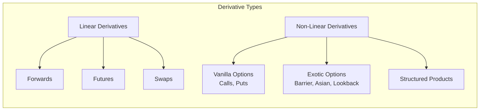
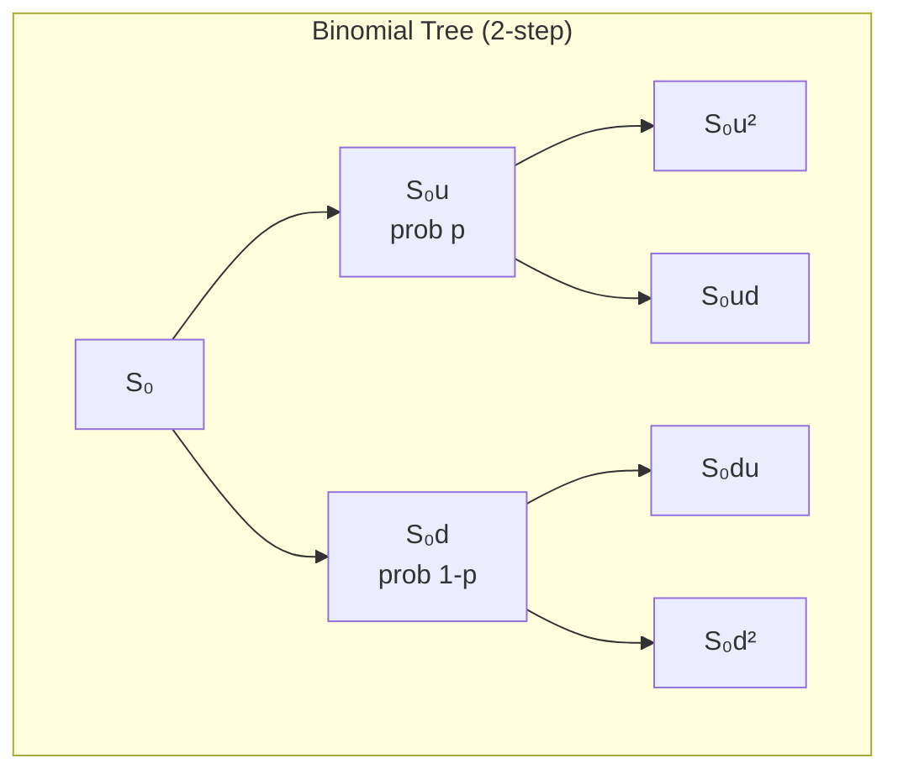
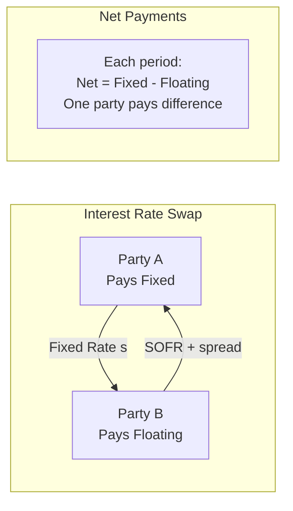

# Derivatives — Options, Futures, and Swaps

## Part I: Foundations

### Forward and Futures Pricing

Cost-of-carry model for a forward on an asset paying continuous dividend yield $q$:

$$F_0 = S_0 e^{(r-q)T}$$

For discrete dividends: $F_0 = (S_0 - \text{PV(dividends)}) \cdot e^{rT}$

Storage costs (commodities): $F_0 = S_0 e^{(r+u-y)T}$ where $u$ = storage cost rate, $y$ = convenience yield.

### Forward vs Futures
- Forwards: OTC, customized, counterparty risk, settled at maturity
- Futures: exchange-traded, standardized, daily mark-to-market (margin), clearinghouse eliminates counterparty risk

### Options: Basics

| | Call | Put |
|---|---|---|
| **Payoff at expiry** | $\max(S_T - K, 0)$ | $\max(K - S_T, 0)$ |
| **Right** | Buy at $K$ | Sell at $K$ |
| **Long P&L** | Unlimited upside | Upside to $K$ |

- **European:** Exercise only at expiration
- **American:** Exercise any time up to expiration
- **Moneyness:** ITM ($S > K$ for call), ATM ($S \approx K$), OTM ($S < K$ for call)

### Put-Call Parity (European options)

$$C - P = S_0 - K e^{-rT}$$

For dividend-paying stock: $C - P = S_0 e^{-qT} - K e^{-rT}$

## Part II: Black-Scholes Model

### Assumptions
1. GBM for stock price: $dS = \mu S\,dt + \sigma S\,dW$
2. Constant $r$, $\sigma$; no dividends (basic version)
3. No transaction costs or taxes
4. Continuous trading; no arbitrage
5. European options only

### Black-Scholes Formula

**Call:**

$$C = S_0 N(d_1) - K e^{-rT} N(d_2)$$

**Put:**

$$P = K e^{-rT} N(-d_2) - S_0 N(-d_1)$$

where:

$$d_1 = \frac{\ln(S_0/K) + (r + \sigma^2/2)T}{\sigma\sqrt{T}}$$

$$d_2 = d_1 - \sigma\sqrt{T}$$

$N(\cdot)$ is the standard normal CDF.

With continuous dividend yield $q$: replace $S_0$ with $S_0 e^{-qT}$ throughout.

### Black-Scholes PDE

$$\frac{\partial V}{\partial t} + rS\frac{\partial V}{\partial S} + \frac{1}{2}\sigma^2 S^2 \frac{\partial^2 V}{\partial S^2} = rV$$

## Part III: Binomial Model

### Cox-Ross-Rubinstein (CRR) Model

At each step $\Delta t$:

$$u = e^{\sigma\sqrt{\Delta t}}, \quad d = \frac{1}{u} = e^{-\sigma\sqrt{\Delta t}}$$

Risk-neutral probability:

$$p = \frac{e^{r\Delta t} - d}{u - d}$$

Option value at any node:

$$V = e^{-r\Delta t}[p \cdot V_u + (1-p) \cdot V_d]$$

For American options: $V = \max(\text{exercise value}, \text{continuation value})$ at each node.

### Convergence

As $n \to \infty$ (more steps), the binomial model converges to Black-Scholes. Practical accuracy with $n \geq 100$ steps.

## Part IV: The Greeks

| Greek | Symbol | Definition | Interpretation |
|---|---|---|---|
| Delta | $\Delta$ | $\frac{\partial V}{\partial S}$ | Price sensitivity to underlying |
| Gamma | $\Gamma$ | $\frac{\partial^2 V}{\partial S^2}$ | Rate of change of delta |
| Theta | $\Theta$ | $\frac{\partial V}{\partial t}$ | Time decay (usually negative for longs) |
| Vega | $\mathcal{V}$ | $\frac{\partial V}{\partial \sigma}$ | Sensitivity to implied vol |
| Rho | $\rho$ | $\frac{\partial V}{\partial r}$ | Sensitivity to interest rate |

### Black-Scholes Greeks (Call)

$$\Delta_C = N(d_1)$$

$$\Gamma = \frac{N'(d_1)}{S_0 \sigma \sqrt{T}}$$

$$\Theta_C = -\frac{S_0 N'(d_1)\sigma}{2\sqrt{T}} - rKe^{-rT}N(d_2)$$

$$\mathcal{V} = S_0 \sqrt{T} N'(d_1)$$

### Delta Hedging

A delta-neutral portfolio: $\Pi = V - \Delta \cdot S$. Requires continuous rebalancing (in practice, discrete). P&L from discrete hedging driven by gamma and realized vs implied vol.

## Part V: Exotic Options

| Type | Payoff | Key Feature |
|---|---|---|
| **Barrier** | Activated/extinguished at barrier $H$ | Knock-in, knock-out; cheaper than vanilla |
| **Asian** | Based on average price: $\max(\bar{S} - K, 0)$ | Reduces manipulation; lower vol |
| **Lookback** | Based on max/min: $\max(S_T - S_{\min}, 0)$ | Expensive; path-dependent |
| **Digital (Binary)** | Fixed payout if ITM: $Q \cdot \mathbf{1}_{S_T > K}$ | All-or-nothing |
| **Chooser** | Choose call or put at time $t_c$ | Flexibility premium |
| **Compound** | Option on an option | Used in corporate finance (equity as call on assets) |

### Volatility Smile and Surface

- **Equity markets:** Implied vol skew — OTM puts have higher IV than ATM (crash protection demand)
- **FX markets:** Smile — both OTM puts and calls have higher IV than ATM
- **Volatility surface:** IV as function of both strike $K$ and maturity $T$

Explanations: fat tails (non-normal returns), stochastic volatility, jump risk, leverage effect.

## Part VI: Swaps

### Interest Rate Swaps

Exchange fixed rate payments for floating (e.g., SOFR). Notional is not exchanged.

**Fixed leg PV:**

$$PV_{\text{fixed}} = s \cdot N \sum_{i=1}^{n} \Delta_i \cdot d(t_i)$$

**Floating leg PV:**

$$PV_{\text{float}} = N \sum_{i=1}^{n} L_i \cdot \Delta_i \cdot d(t_i)$$

At inception: $PV_{\text{fixed}} = PV_{\text{float}}$, determining swap rate $s$.

### Currency Swaps

Exchange principal and interest in two currencies. Both notionals are exchanged at inception and maturity.

### Credit Default Swaps (CDS)

Protection buyer pays periodic premium (spread); protection seller pays par minus recovery upon credit event.

$$\text{CDS Spread} \approx \frac{\text{PD} \times \text{LGD}}{1 - \text{PD}/2}$$

## References

- Hull, J.C. *Options, Futures, and Other Derivatives* (11th ed.). Pearson.
- Shreve, S.E. *Stochastic Calculus for Finance I: The Binomial Asset Pricing Model*. Springer.
- Wilmott, P. *Paul Wilmott on Quantitative Finance* (2nd ed.). Wiley.
- Black, F. & Scholes, M. (1973). "The Pricing of Options and Corporate Liabilities." *JPE*, 81(3).
- Cox, J.C., Ross, S.A., & Rubinstein, M. (1979). "Option Pricing: A Simplified Approach." *JFE*, 7(3).
