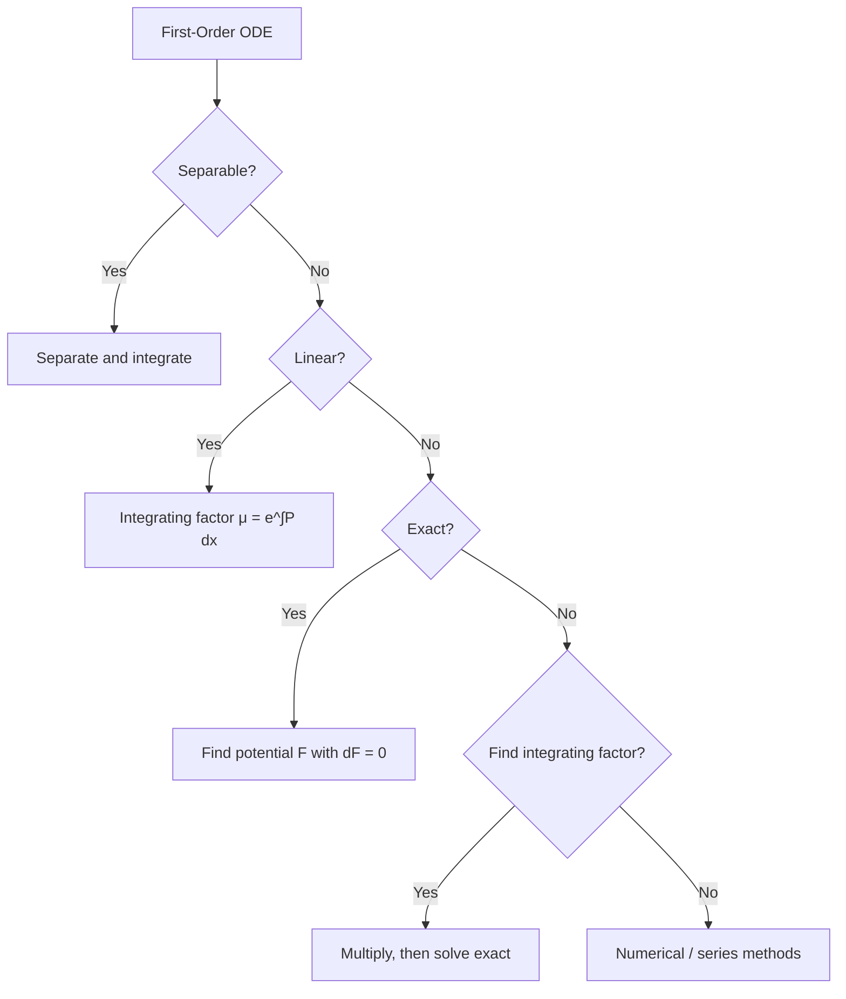
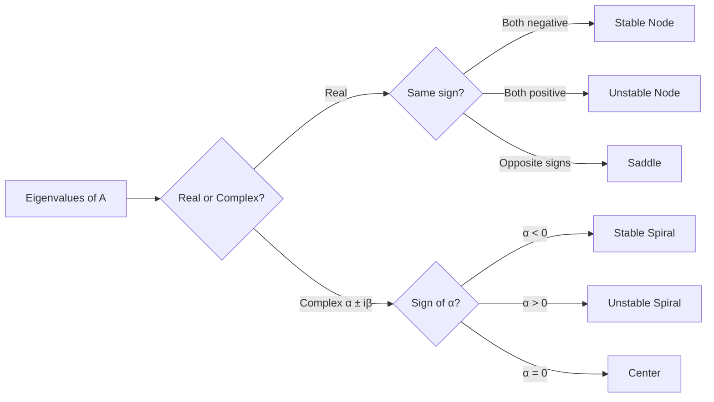
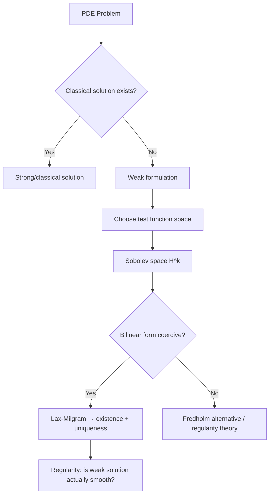

# Differential Equations

Comprehensive treatment of ordinary and partial differential equations, from classical solution methods through modern functional-analytic frameworks.

---

## Part I: Ordinary Differential Equations

### Week 1: Foundations and First-Order Equations

#### Existence and Uniqueness

The foundational result for ODEs is the **Picard-Lindelof theorem** (Cauchy-Lipschitz theorem):

> **Theorem (Picard-Lindelof).** Consider the IVP $\dot{x} = f(t,x)$, $x(t_0) = x_0$. If $f$ is continuous in $t$ and Lipschitz continuous in $x$ on a rectangle $R = \{(t,x) : |t - t_0| \leq a,\; |x - x_0| \leq b\}$ with Lipschitz constant $L$, then there exists a unique solution on $|t - t_0| \leq \min(a, b/M)$ where $M = \max_R |f|$.

The proof constructs the **Picard iteration**:

$$x_{n+1}(t) = x_0 + \int_{t_0}^{t} f(s, x_n(s))\, ds$$

which converges uniformly by the Banach fixed-point theorem applied to the operator $T$ on $C([t_0-\delta, t_0+\delta])$.

**Peano's theorem** weakens the hypothesis: continuity of $f$ alone guarantees existence (but not uniqueness). Counterexample for uniqueness: $\dot{x} = x^{2/3}$, $x(0) = 0$ admits both $x(t) = 0$ and $x(t) = (t/3)^3$.

#### Separable Equations

Form: $\frac{dy}{dx} = g(x)h(y)$. Separation yields:

$$\int \frac{dy}{h(y)} = \int g(x)\, dx + C$$

#### Exact Equations and Integrating Factors

An equation $M(x,y)\,dx + N(x,y)\,dy = 0$ is **exact** if $\frac{\partial M}{\partial y} = \frac{\partial N}{\partial x}$. The solution satisfies $F(x,y) = C$ where:

$$F(x,y) = \int M\,dx + \phi(y), \quad \frac{\partial F}{\partial y} = N$$

When not exact, an **integrating factor** $\mu$ may exist. If $\frac{M_y - N_x}{N}$ depends only on $x$, then:

$$\mu(x) = \exp\left(\int \frac{M_y - N_x}{N}\, dx\right)$$

### Week 2: Higher-Order Linear ODEs

The general $n$-th order linear ODE:

$$a_n(t)x^{(n)} + a_{n-1}(t)x^{(n-1)} + \cdots + a_1(t)\dot{x} + a_0(t)x = g(t)$$

The solution space of the homogeneous equation is an $n$-dimensional vector space. For constant coefficients, the **characteristic equation** $a_n r^n + \cdots + a_0 = 0$ determines the solution basis.

**Variation of parameters** for $\ddot{x} + p(t)\dot{x} + q(t)x = g(t)$ with fundamental solutions $x_1, x_2$:

$$x_p(t) = -x_1\int \frac{x_2 g}{W}\,dt + x_2\int \frac{x_1 g}{W}\,dt$$

where $W = x_1\dot{x}_2 - \dot{x}_1 x_2$ is the **Wronskian**.

### Week 3: Linear Systems

A linear system $\dot{\mathbf{x}} = A\mathbf{x}$ with $A \in \mathbb{R}^{n \times n}$ constant has the general solution:

$$\mathbf{x}(t) = e^{At}\mathbf{x}(0)$$

The **matrix exponential** is defined by:

$$e^{At} = \sum_{k=0}^{\infty} \frac{(At)^k}{k!} = I + At + \frac{A^2t^2}{2!} + \cdots$$

Computation methods:
1. **Diagonalizable case:** If $A = PDP^{-1}$, then $e^{At} = P e^{Dt} P^{-1}$
2. **Jordan form:** If $A = PJP^{-1}$, compute $e^{Jt}$ block-by-block
3. **Cayley-Hamilton:** Express $e^{At}$ as a polynomial of degree $\leq n-1$ in $A$

#### Phase Portraits in $\mathbb{R}^2$

For $\dot{\mathbf{x}} = A\mathbf{x}$ with eigenvalues $\lambda_1, \lambda_2$:

| Eigenvalues | Type | Stability |
|---|---|---|
| $\lambda_1 < \lambda_2 < 0$ | Stable node | Asymptotically stable |
| $0 < \lambda_1 < \lambda_2$ | Unstable node | Unstable |
| $\lambda_1 < 0 < \lambda_2$ | Saddle point | Unstable |
| $\alpha \pm i\beta$, $\alpha < 0$ | Stable spiral | Asymptotically stable |
| $\alpha \pm i\beta$, $\alpha > 0$ | Unstable spiral | Unstable |
| $\pm i\beta$ | Center | Stable (not asymptotically) |

### Week 4: Stability Theory

#### Lyapunov's Direct Method

For $\dot{\mathbf{x}} = f(\mathbf{x})$ with equilibrium at the origin:

> **Theorem (Lyapunov).** If there exists a continuously differentiable function $V: \mathbb{R}^n \to \mathbb{R}$ with $V(0) = 0$, $V(\mathbf{x}) > 0$ for $\mathbf{x} \neq 0$, then:
> - If $\dot{V}(\mathbf{x}) \leq 0$, the origin is **stable**
> - If $\dot{V}(\mathbf{x}) < 0$ for $\mathbf{x} \neq 0$, the origin is **asymptotically stable**

where $\dot{V} = \nabla V \cdot f(\mathbf{x})$.

**LaSalle's Invariance Principle** extends this: if $\dot{V} \leq 0$ and the largest invariant set in $\{\mathbf{x} : \dot{V} = 0\}$ is $\{0\}$, then the origin is asymptotically stable.

---

## Part II: Partial Differential Equations

### Week 5: Classification and the Big Three

Second-order linear PDEs in two variables $a u_{xx} + 2b u_{xy} + c u_{yy} + \cdots = 0$ are classified by the discriminant $\Delta = b^2 - ac$:

| $\Delta$ | Type | Canonical Example | Physical Model |
|---|---|---|---|
| $\Delta < 0$ | Elliptic | $\nabla^2 u = 0$ (Laplace) | Steady-state diffusion |
| $\Delta = 0$ | Parabolic | $u_t = \alpha \nabla^2 u$ (Heat) | Transient diffusion |
| $\Delta > 0$ | Hyperbolic | $u_{tt} = c^2 \nabla^2 u$ (Wave) | Vibrations, acoustics |

#### Heat Equation

$$u_t = \alpha \nabla^2 u$$

On $[0, L]$ with Dirichlet BCs, separation of variables $u(x,t) = X(x)T(t)$ yields:

$$u(x,t) = \sum_{n=1}^{\infty} b_n \sin\left(\frac{n\pi x}{L}\right) e^{-\alpha(n\pi/L)^2 t}$$

with $b_n = \frac{2}{L}\int_0^L f(x)\sin\left(\frac{n\pi x}{L}\right) dx$.

The **fundamental solution** (Green's function on $\mathbb{R}^n$):

$$\Phi(x,t) = \frac{1}{(4\pi\alpha t)^{n/2}} \exp\left(-\frac{|x|^2}{4\alpha t}\right), \quad t > 0$$

#### Wave Equation

$$u_{tt} = c^2 \nabla^2 u$$

**D'Alembert's solution** in 1D: $u(x,t) = f(x - ct) + g(x + ct)$, representing right- and left-traveling waves.

General solution with initial data $u(x,0) = \phi(x)$, $u_t(x,0) = \psi(x)$:

$$u(x,t) = \frac{\phi(x+ct) + \phi(x-ct)}{2} + \frac{1}{2c}\int_{x-ct}^{x+ct} \psi(s)\, ds$$

#### Laplace Equation

$$\nabla^2 u = 0$$

Solutions are **harmonic functions**. Key properties:
- **Mean value property:** $u(\mathbf{x}_0) = \frac{1}{|\partial B_r|}\oint_{\partial B_r} u\, dS$
- **Maximum principle:** $\max_{\bar{\Omega}} u = \max_{\partial\Omega} u$
- **Regularity:** Harmonic functions are $C^\infty$ (in fact, real analytic)

### Week 6: Fourier Methods

The **Fourier transform** converts PDEs to algebraic equations:

$$\hat{u}(\xi) = \int_{\mathbb{R}^n} u(x) e^{-2\pi i \xi \cdot x}\, dx$$

Key properties: $\widehat{\partial_x u} = 2\pi i \xi \hat{u}$, $\widehat{u * v} = \hat{u}\cdot\hat{v}$.

**Parseval's theorem:** $\|u\|_{L^2}^2 = \|\hat{u}\|_{L^2}^2$.

### Week 7: Green's Functions and Distributions

The **Green's function** $G(\mathbf{x}, \mathbf{x}')$ satisfies $LG = \delta(\mathbf{x} - \mathbf{x}')$ where $L$ is the differential operator. Then the solution to $Lu = f$ is:

$$u(\mathbf{x}) = \int_\Omega G(\mathbf{x}, \mathbf{x}') f(\mathbf{x}')\, d\mathbf{x}'$$

For the Laplacian in $\mathbb{R}^3$: $G(\mathbf{x}, \mathbf{x}') = -\frac{1}{4\pi|\mathbf{x} - \mathbf{x}'|}$.

### Week 8: Weak Solutions and Sobolev Spaces

Classical solutions may not exist. A **weak solution** of $-\nabla^2 u = f$ satisfies:

$$\int_\Omega \nabla u \cdot \nabla v\, dx = \int_\Omega f v\, dx \quad \forall v \in H_0^1(\Omega)$$

The **Sobolev space** $H^k(\Omega) = W^{k,2}(\Omega)$ consists of $L^2$ functions with weak derivatives up to order $k$ in $L^2$:

$$\|u\|_{H^k}^2 = \sum_{|\alpha| \leq k} \|D^\alpha u\|_{L^2}^2$$

The **Lax-Milgram theorem** guarantees existence and uniqueness of weak solutions for coercive bilinear forms, providing the foundation for finite element methods.

---

## Key Theorems Summary

| Theorem | Domain | Statement (brief) |
|---|---|---|
| Picard-Lindelof | ODE | Lipschitz $f$ implies unique local solution |
| Gronwall's inequality | ODE | Differential inequality control |
| Sturm-Liouville | ODE/PDE | Eigenvalue theory for self-adjoint operators |
| Maximum principle | PDE (elliptic) | Harmonic functions attain extrema on boundary |
| Lax-Milgram | PDE (weak) | Coercive bilinear form gives unique weak solution |
| Sobolev embedding | PDE | $H^k \hookrightarrow C^m$ for $k$ large enough |

---

## References

1. Tenenbaum, M. & Pollard, H. *Ordinary Differential Equations*. Dover, 1985.
2. Evans, L. C. *Partial Differential Equations*. 2nd ed., AMS Graduate Studies in Mathematics, 2010.
3. Strauss, W. A. *Partial Differential Equations: An Introduction*. 2nd ed., Wiley, 2007.
4. Coddington, E. A. & Levinson, N. *Theory of Ordinary Differential Equations*. McGraw-Hill, 1955.
5. Brezis, H. *Functional Analysis, Sobolev Spaces and Partial Differential Equations*. Springer, 2011.
