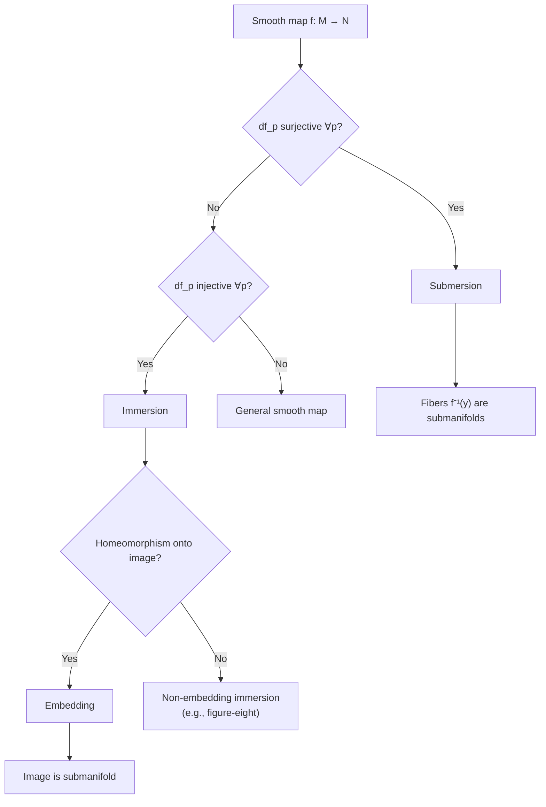
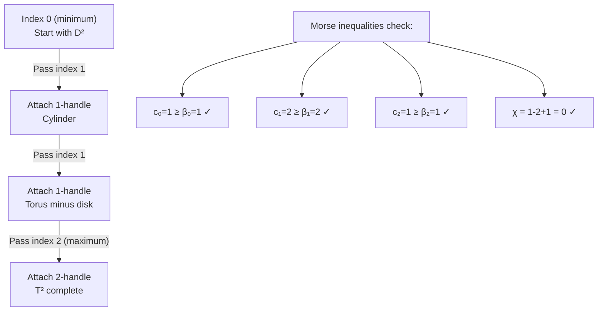

# Differential Topology

> The study of smooth manifolds and smooth maps — where calculus meets topology. Unlike differential geometry, the emphasis is on global topological properties rather than curvature and metric structure.

---

## Part I — Smooth Manifolds and Maps

### Week 1: Smooth Manifolds

**Definition.** A *smooth $n$-manifold* $M$ is a second-countable Hausdorff space with an atlas $\{(U_\alpha, \varphi_\alpha)\}$ where $\varphi_\alpha: U_\alpha \to \mathbb{R}^n$ are homeomorphisms onto open sets, and the transition maps:
$$\varphi_\beta \circ \varphi_\alpha^{-1}: \varphi_\alpha(U_\alpha \cap U_\beta) \to \varphi_\beta(U_\alpha \cap U_\beta)$$
are $C^\infty$ diffeomorphisms.

**Examples:**
- $\mathbb{R}^n$, $S^n$, $T^n = (S^1)^n$
- $\mathbb{RP}^n$, $\mathbb{CP}^n$
- Lie groups: $GL(n, \mathbb{R})$, $O(n)$, $SO(n)$, $U(n)$
- Regular level sets of smooth maps (by implicit function theorem)

**Smooth maps.** $f: M \to N$ is smooth if for all charts $(U, \varphi)$ on $M$ and $(V, \psi)$ on $N$:
$$\psi \circ f \circ \varphi^{-1}: \varphi(U \cap f^{-1}(V)) \to \mathbb{R}^{\dim N}$$
is $C^\infty$. A *diffeomorphism* is a smooth bijection with smooth inverse.

### Week 2: Tangent Spaces and the Derivative

**Tangent space.** $T_pM$ is the vector space of derivations at $p$: linear maps $v: C^\infty(M) \to \mathbb{R}$ satisfying the Leibniz rule $v(fg) = f(p)v(g) + g(p)v(f)$.

In local coordinates $(x^1, \ldots, x^n)$:
$$T_pM = \text{span}\left\{\frac{\partial}{\partial x^1}\bigg|_p, \ldots, \frac{\partial}{\partial x^n}\bigg|_p\right\}$$

**Derivative (differential).** For $f: M \to N$ smooth, $df_p: T_pM \to T_{f(p)}N$:
$$(df_p(v))(g) = v(g \circ f)$$

In coordinates, $df_p$ is represented by the Jacobian matrix $\left(\frac{\partial f^i}{\partial x^j}\right)$.

**Tangent bundle.** $TM = \bigsqcup_{p \in M} T_pM$ is itself a $2n$-dimensional smooth manifold with natural projection $\pi: TM \to M$.

### Week 3: Immersions, Submersions, and Embeddings

**Critical and regular values.** $p \in M$ is a *regular point* of $f: M \to N$ if $df_p$ is surjective. $y \in N$ is a *regular value* if every $p \in f^{-1}(y)$ is regular.

| Map type | Condition on $df_p$ | Local model |
|----------|---------------------|-------------|
| Immersion | Injective ($\text{rank} = \dim M$) | $(x_1, \ldots, x_m) \mapsto (x_1, \ldots, x_m, 0, \ldots, 0)$ |
| Submersion | Surjective ($\text{rank} = \dim N$) | $(x_1, \ldots, x_n) \mapsto (x_1, \ldots, x_k)$ |
| Embedding | Injective immersion + homeomorphism onto image | Submanifold inclusion |

**Regular Value Theorem (Preimage Theorem).** If $y \in N$ is a regular value of $f: M^m \to N^n$ ($m \geq n$), then $f^{-1}(y)$ is a smooth submanifold of $M$ with dimension $m - n$.

**Example.** $S^{n-1} = f^{-1}(1)$ where $f(x) = |x|^2: \mathbb{R}^n \to \mathbb{R}$ ($1$ is a regular value).

---

## Part II — Transversality and Intersection Theory

### Week 4: Sard's Theorem

**Sard's Theorem.** The set of critical values of a smooth map $f: M \to N$ has measure zero in $N$.

**Consequence.** Regular values are *generic* — they form a dense subset (in fact, a residual set).

**Brown's theorem.** The set of regular values is residual (countable intersection of open dense sets) in $N$.

**Applications:**
- Any smooth $f: M^m \to N^n$ with $m < n$ has image of measure zero ($N$ is "too big" to be filled)
- Whitney embedding: every smooth $n$-manifold embeds in $\mathbb{R}^{2n+1}$ (and immerses in $\mathbb{R}^{2n}$)

### Week 5: Transversality

**Definition.** $f: M \to N$ is *transverse* to a submanifold $Z \subseteq N$ (written $f \pitchfork Z$) if for every $p \in f^{-1}(Z)$:
$$df_p(T_pM) + T_{f(p)}Z = T_{f(p)}N$$

**Transversality theorem.** If $f \pitchfork Z$, then $f^{-1}(Z)$ is a submanifold of $M$ with:
$$\text{codim}_M f^{-1}(Z) = \text{codim}_N Z$$

**Transversality homotopy theorem (Thom).** Any smooth $f: M \to N$ can be perturbed by an arbitrarily small homotopy to a map transverse to $Z$.

**Intersection of submanifolds.** $X \pitchfork Y$ in $M$ means the inclusion $X \hookrightarrow M$ is transverse to $Y$. Then $X \cap Y$ is a submanifold with:
$$\dim(X \cap Y) = \dim X + \dim Y - \dim M$$

### Week 6: Intersection Number and Degree

**Oriented intersection number.** For $X^k, Y^{n-k} \subseteq M^n$ closed oriented submanifolds meeting transversally, each $p \in X \cap Y$ receives a sign $\pm 1$ based on orientation. The *intersection number*:
$$I(X, Y) = \sum_{p \in X \cap Y} \varepsilon(p) \in \mathbb{Z}$$

This is a homotopy invariant.

**Mod 2 intersection number.** $I_2(X, Y) = |X \cap Y| \pmod{2}$ — works without orientations.

**Degree of a map.** For $f: M^n \to N^n$ between closed oriented manifolds, and $y$ a regular value:
$$\deg(f) = \sum_{p \in f^{-1}(y)} \text{sign}(\det df_p)$$

This equals the homological degree: $f_*[M] = \deg(f) [N]$ in $H_n$.

---

## Part III — Morse Theory

### Week 7: Morse Functions and Critical Points

**Morse function.** $f: M \to \mathbb{R}$ is *Morse* if all critical points are non-degenerate (the Hessian $H_p f = \left(\frac{\partial^2 f}{\partial x^i \partial x^j}\right)$ is non-singular).

**Morse Lemma.** Near a non-degenerate critical point of index $\lambda$, there exist local coordinates with:
$$f(x) = f(p) - x_1^2 - \cdots - x_\lambda^2 + x_{\lambda+1}^2 + \cdots + x_n^2$$

The *index* $\lambda$ = number of negative eigenvalues of the Hessian.

**Morse inequalities.** Let $c_\lambda$ = number of critical points of index $\lambda$, $\beta_\lambda = \text{rank}\, H_\lambda(M)$. Then:

*Weak:* $c_\lambda \geq \beta_\lambda$ for each $\lambda$.

*Strong:*
$$\sum_{\lambda=0}^k (-1)^{k-\lambda} c_\lambda \geq \sum_{\lambda=0}^k (-1)^{k-\lambda} \beta_\lambda$$

*Equality (Euler):* $\sum (-1)^\lambda c_\lambda = \chi(M)$.

### Week 8: Handle Decompositions

**Sublevel sets.** $M^a = f^{-1}((-\infty, a])$. As $a$ increases through a critical value of index $\lambda$:
$$M^{a+\varepsilon} \simeq M^{a-\varepsilon} \cup_\varphi D^\lambda \times D^{n-\lambda}$$

This is "attaching a $\lambda$-handle."

**CW structure from Morse theory.** A Morse function on a compact manifold gives a CW decomposition with one $\lambda$-cell per critical point of index $\lambda$.

**Example: $T^2$.** The height function has critical points of index $0, 1, 1, 2$:

---

## Part IV — Cobordism and Further Topics

### Week 9: Cobordism

**Definition.** Closed $n$-manifolds $M_0, M_1$ are *cobordant* if there exists a compact $(n+1)$-manifold $W$ with $\partial W = M_0 \sqcup M_1$.

**Cobordism ring.** $\Omega_n^O$ = cobordism classes of closed $n$-manifolds. The ring $\Omega_*^O = \bigoplus_n \Omega_n^O$ with:
- Addition: disjoint union $[M] + [N] = [M \sqcup N]$
- Multiplication: Cartesian product $[M] \cdot [N] = [M \times N]$

**Thom's theorem.** $\Omega_*^O \otimes \mathbb{Q} \cong \mathbb{Q}[\mathbb{CP}^2, \mathbb{CP}^4, \mathbb{CP}^6, \ldots]$. The Stiefel-Whitney numbers are complete cobordism invariants.

**Pontryagin-Thom construction.** Relates cobordism to homotopy theory of Thom spaces, establishing:
$$\Omega_n^O \cong \pi_{n+k}(TO(k)) \quad \text{for } k \gg 0$$

### Week 10: The Poincaré-Hopf Theorem

**Vector fields and zeros.** A smooth vector field $v$ on $M$ assigns $v(p) \in T_pM$. An isolated zero $p$ has *index* $\text{ind}_p(v) \in \mathbb{Z}$ (degree of $v/|v|$ on a small sphere around $p$).

**Poincaré-Hopf Index Theorem.** If $v$ is a vector field on a compact oriented manifold $M$ with isolated zeros:
$$\sum_{v(p)=0} \text{ind}_p(v) = \chi(M)$$

**Corollaries:**
- $S^{2n}$ has no nowhere-vanishing vector field ($\chi(S^{2n}) = 2$) — "hairy ball theorem"
- $S^{2n+1}$ does ($\chi(S^{2n+1}) = 0$)
- Every compact odd-dimensional manifold has $\chi = 0$

### Week 11: Whitney Embedding and Immersion

**Whitney Embedding Theorem.** Every smooth closed $n$-manifold embeds smoothly in $\mathbb{R}^{2n}$ (for $n > 0$).

**Whitney Immersion Theorem.** Every smooth $n$-manifold immerses in $\mathbb{R}^{2n-1}$ (for $n > 1$).

**Whitney trick.** In dimensions $\geq 5$, pairs of transverse intersection points of opposite sign can be cancelled — the geometric core of the h-cobordism theorem.

**h-Cobordism Theorem (Smale).** If $W^{n+1}$ is a simply connected compact cobordism between simply connected manifolds $M_0, M_1$, and $W$ is an h-cobordism (inclusions are homotopy equivalences), then for $n \geq 5$: $W \cong M_0 \times [0,1]$. Hence $M_0 \cong M_1$.

*Consequence:* Generalized Poincaré conjecture in dimensions $\geq 6$.

---

## References

1. **Milnor, J.W.** *Topology from the Differentiable Viewpoint* (1965, revised 1997). Princeton University Press. — Beautiful 65-page gem; essential first reading.
2. **Guillemin, V. & Pollack, A.** *Differential Topology* (1974, AMS Chelsea reprint 2010). — Concrete and example-rich; ideal course text.
3. **Hirsch, M.W.** *Differential Topology* (1976). Springer GTM 33. — More thorough and technical; covers isotopy, tubular neighborhoods, transversality in depth.
