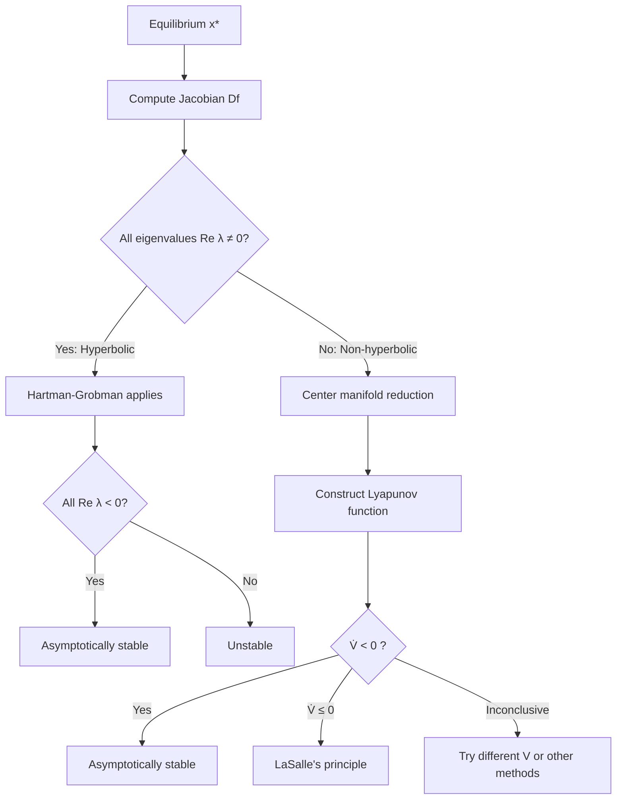
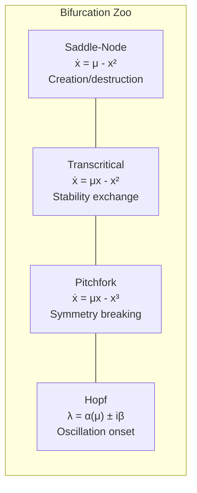
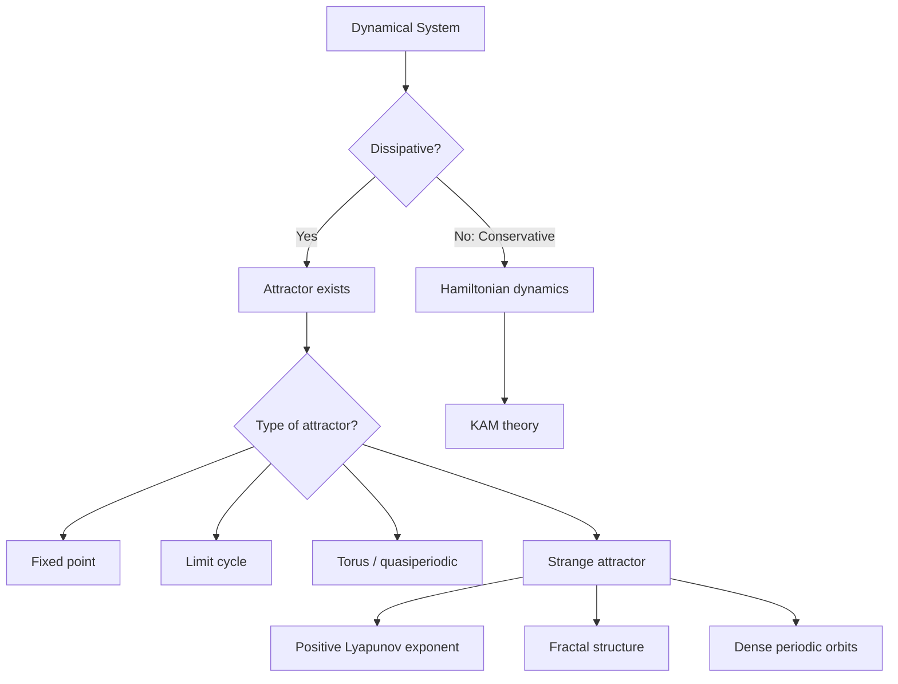

# Dynamical Systems and Chaos

From stability of fixed points through bifurcation theory to chaos, strange attractors, and ergodic theory. Emphasis on geometric and qualitative methods.

---

## Part I: Local Theory

### Week 1: Fixed Points and Stability

Consider the autonomous system $\dot{\mathbf{x}} = f(\mathbf{x})$, $\mathbf{x} \in \mathbb{R}^n$. A point $\mathbf{x}^*$ is a **fixed point** (equilibrium) if $f(\mathbf{x}^*) = 0$.

#### Linearization

Near $\mathbf{x}^*$, setting $\mathbf{u} = \mathbf{x} - \mathbf{x}^*$:

$$\dot{\mathbf{u}} = Df(\mathbf{x}^*)\mathbf{u} + O(|\mathbf{u}|^2)$$

where $Df(\mathbf{x}^*)$ is the **Jacobian matrix** with entries $(Df)_{ij} = \frac{\partial f_i}{\partial x_j}\bigg|_{\mathbf{x}^*}$.

#### Hartman-Grobman Theorem

> **Theorem (Hartman-Grobman).** If $\mathbf{x}^*$ is a **hyperbolic** fixed point (all eigenvalues of $Df(\mathbf{x}^*)$ have nonzero real part), then the nonlinear flow is topologically conjugate to the linearized flow $\dot{\mathbf{u}} = Df(\mathbf{x}^*)\mathbf{u}$ in a neighborhood of $\mathbf{x}^*$.

This means the phase portrait near a hyperbolic equilibrium is qualitatively determined by the linearization. Non-hyperbolic cases (eigenvalues on the imaginary axis) require **center manifold reduction**.

#### Stable and Unstable Manifolds

The **stable manifold** $W^s(\mathbf{x}^*)$ and **unstable manifold** $W^u(\mathbf{x}^*)$:

$$W^s(\mathbf{x}^*) = \{\mathbf{x} : \phi_t(\mathbf{x}) \to \mathbf{x}^* \text{ as } t \to +\infty\}$$
$$W^u(\mathbf{x}^*) = \{\mathbf{x} : \phi_t(\mathbf{x}) \to \mathbf{x}^* \text{ as } t \to -\infty\}$$

By the **Stable Manifold Theorem**, $W^s$ and $W^u$ are smooth manifolds tangent to the stable and unstable eigenspaces of $Df(\mathbf{x}^*)$.

### Week 2: Lyapunov Functions

A **Lyapunov function** $V: U \to \mathbb{R}$ for $\dot{\mathbf{x}} = f(\mathbf{x})$ at $\mathbf{x}^*$ satisfies:
1. $V(\mathbf{x}^*) = 0$ and $V(\mathbf{x}) > 0$ for $\mathbf{x} \neq \mathbf{x}^*$ in $U$
2. $\dot{V}(\mathbf{x}) = \nabla V \cdot f(\mathbf{x}) \leq 0$ in $U$

If $\dot{V} < 0$ for all $\mathbf{x} \neq \mathbf{x}^*$, the equilibrium is **asymptotically stable**.

**Example:** For the damped pendulum $\ddot{\theta} + \gamma\dot{\theta} + \sin\theta = 0$, the energy $V = \frac{1}{2}\dot{\theta}^2 + (1 - \cos\theta)$ gives $\dot{V} = -\gamma\dot{\theta}^2 \leq 0$.

For global stability, if $V$ is **radially unbounded** ($V(\mathbf{x}) \to \infty$ as $|\mathbf{x}| \to \infty$) and $\dot{V} < 0$, then $\mathbf{x}^*$ is **globally asymptotically stable**.

---

## Part II: Bifurcation Theory

### Week 3: One-Dimensional Bifurcations

Consider $\dot{x} = f_\mu(x)$ depending on a parameter $\mu \in \mathbb{R}$.

#### Saddle-Node Bifurcation

Normal form: $\dot{x} = \mu - x^2$

- $\mu < 0$: no fixed points
- $\mu = 0$: one semi-stable fixed point at $x = 0$
- $\mu > 0$: two fixed points $x^* = \pm\sqrt{\mu}$ (one stable, one unstable)

Two equilibria collide and annihilate. This is the **generic** mechanism for fixed points to appear or disappear.

#### Transcritical Bifurcation

Normal form: $\dot{x} = \mu x - x^2$

Fixed points: $x^* = 0$ (always exists) and $x^* = \mu$. At $\mu = 0$ they exchange stability.

#### Pitchfork Bifurcation

**Supercritical:** $\dot{x} = \mu x - x^3$

At $\mu = 0$, the stable origin becomes unstable and two symmetric stable branches $x^* = \pm\sqrt{\mu}$ emerge. Common in systems with symmetry $x \mapsto -x$.

**Subcritical:** $\dot{x} = \mu x + x^3$ -- unstable branches exist for $\mu < 0$, catastrophic loss of stability at $\mu = 0$.

### Week 4: Hopf Bifurcation

For $\dot{\mathbf{x}} = f_\mu(\mathbf{x})$ in $\mathbb{R}^2$ (or higher):

> **Theorem (Hopf).** Suppose the Jacobian at $\mathbf{x}^*$ has eigenvalues $\lambda(\mu) = \alpha(\mu) \pm i\beta(\mu)$ with $\alpha(\mu_c) = 0$, $\beta(\mu_c) \neq 0$, and the **transversality condition** $\alpha'(\mu_c) \neq 0$. Then a family of periodic orbits bifurcates from $\mathbf{x}^*$ at $\mu = \mu_c$.

- **Supercritical Hopf:** stable limit cycle emerges (first Lyapunov coefficient $l_1 < 0$)
- **Subcritical Hopf:** unstable limit cycle disappears ($l_1 > 0$)

The period of the bifurcating cycle is approximately $T \approx 2\pi/\beta(\mu_c)$.

---

## Part III: Global Dynamics

### Week 5: Limit Cycles and Poincare-Bendixson

A **limit cycle** is an isolated closed orbit. In the plane:

> **Theorem (Poincare-Bendixson).** In $\mathbb{R}^2$, a nonempty compact $\omega$-limit set that contains no fixed points is a periodic orbit.

This is remarkably powerful: trap a trajectory in a region with no equilibria, and it must approach a limit cycle. Note: this theorem fails in $\mathbb{R}^3$ and higher -- that is where chaos becomes possible.

**Bendixson's criterion:** If $\nabla \cdot f = \frac{\partial f_1}{\partial x_1} + \frac{\partial f_2}{\partial x_2}$ does not change sign in a simply connected region, there are no closed orbits in that region.

**Liénard's theorem:** The equation $\ddot{x} + f(x)\dot{x} + g(x) = 0$ has a unique stable limit cycle under appropriate conditions on $f$ and $g$ (odd $f$, $F(x) = \int_0^x f(s)\,ds$ has a single positive zero and is monotone for $x$ large).

### Week 6: Chaos and Strange Attractors

#### The Lorenz System

$$\dot{x} = \sigma(y - x), \quad \dot{y} = rx - y - xz, \quad \dot{z} = xy - bz$$

Standard parameters: $\sigma = 10$, $b = 8/3$, $r = 28$. Properties:
- **Dissipative:** $\nabla \cdot f = -(\sigma + 1 + b) < 0$, so volumes contract
- **Symmetry:** $(x,y,z) \mapsto (-x,-y,z)$
- Three fixed points: the origin and $C^{\pm} = (\pm\sqrt{b(r-1)}, \pm\sqrt{b(r-1)}, r-1)$
- For $r > 24.74$, all three equilibria are unstable, yet trajectories remain bounded: they are attracted to the **Lorenz attractor**, a fractal set with Hausdorff dimension $\approx 2.06$

#### Sensitivity to Initial Conditions

Chaos is characterized by **positive Lyapunov exponents**. The maximal Lyapunov exponent:

$$\lambda_{\max} = \lim_{t \to \infty} \frac{1}{t} \ln \frac{|\delta\mathbf{x}(t)|}{|\delta\mathbf{x}(0)|}$$

For the Lorenz attractor at standard parameters, $\lambda_{\max} \approx 0.9056$. A system is **chaotic** if:
1. $\lambda_{\max} > 0$ (sensitive dependence)
2. The attractor is bounded (trajectories do not escape)
3. The attractor is not a fixed point or periodic orbit

The full **Lyapunov spectrum** $\lambda_1 \geq \lambda_2 \geq \cdots \geq \lambda_n$ satisfies $\sum \lambda_i < 0$ for dissipative systems. The **Kaplan-Yorke dimension**:

$$D_{KY} = j + \frac{\sum_{i=1}^{j} \lambda_i}{|\lambda_{j+1}|}$$

where $j$ is the largest integer with $\sum_{i=1}^j \lambda_i \geq 0$.

### Week 7: Poincare Maps and Symbolic Dynamics

#### Poincare (First Return) Map

Given a periodic orbit $\gamma$, choose a transverse section $\Sigma$. The **Poincare map** $P: \Sigma \to \Sigma$ sends each point to its first return to $\Sigma$. This reduces the continuous flow to a discrete map, lowering dimension by one.

A fixed point of $P$ corresponds to a periodic orbit of the flow. Stability is determined by $|DP| < 1$ (stable) or $|DP| > 1$ (unstable).

#### Symbolic Dynamics

Partition the state space into finitely many regions $\{R_1, \ldots, R_k\}$. Each orbit generates a **symbol sequence** $(s_0, s_1, s_2, \ldots)$ where $s_n = j$ if $\mathbf{x}(n) \in R_j$.

The **shift map** $\sigma: \Sigma_k \to \Sigma_k$ defined by $\sigma(s_0, s_1, s_2, \ldots) = (s_1, s_2, \ldots)$ on the **full shift** space $\Sigma_k = \{1, \ldots, k\}^{\mathbb{N}}$ is a canonical chaotic system:
- Topological entropy $h_{top} = \ln k$
- Countably many periodic orbits, all unstable
- Dense orbits exist

The **Smale horseshoe** provides a concrete example: the dynamics on the invariant Cantor set is conjugate to the full 2-shift.

### Week 8: Ergodic Theory

For a measure-preserving dynamical system $(X, \mathcal{B}, \mu, T)$:

> **Theorem (Birkhoff Ergodic Theorem).** If $T$ is measure-preserving and $f \in L^1(\mu)$, then $\frac{1}{N}\sum_{n=0}^{N-1} f(T^n x)$ converges a.e. to $\bar{f}(x)$. If $T$ is ergodic, $\bar{f} = \int f\, d\mu$ a.e.

Ergodicity means time averages equal space averages -- the system visits all parts of the state space "fairly."

**Mixing** is stronger than ergodicity: $\mu(T^{-n}A \cap B) \to \mu(A)\mu(B)$ as $n \to \infty$. The Lorenz attractor is known to be mixing with respect to its SRB (Sinai-Ruelle-Bowen) measure.

---

## Key Results Summary

| Result | Significance |
|---|---|
| Hartman-Grobman | Linearization valid near hyperbolic points |
| Poincare-Bendixson | No chaos in $\mathbb{R}^2$ flows |
| Hopf bifurcation | Generic birth of oscillations |
| Smale horseshoe | Structural mechanism for chaos |
| Birkhoff ergodic theorem | Time averages = space averages for ergodic systems |
| Takens embedding | Reconstruct attractors from scalar time series |

---

## References

1. Strogatz, S. H. *Nonlinear Dynamics and Chaos*. 2nd ed., Westview Press, 2015.
2. Katok, A. & Hasselblatt, B. *Introduction to the Modern Theory of Dynamical Systems*. Cambridge University Press, 1995.
3. Guckenheimer, J. & Holmes, P. *Nonlinear Oscillations, Dynamical Systems, and Bifurcations of Vector Fields*. Springer, 1983.
4. Wiggins, S. *Introduction to Applied Nonlinear Dynamical Systems and Chaos*. 2nd ed., Springer, 2003.
5. Lorenz, E. N. "Deterministic Nonperiodic Flow." *Journal of the Atmospheric Sciences* 20 (1963): 130--141.
