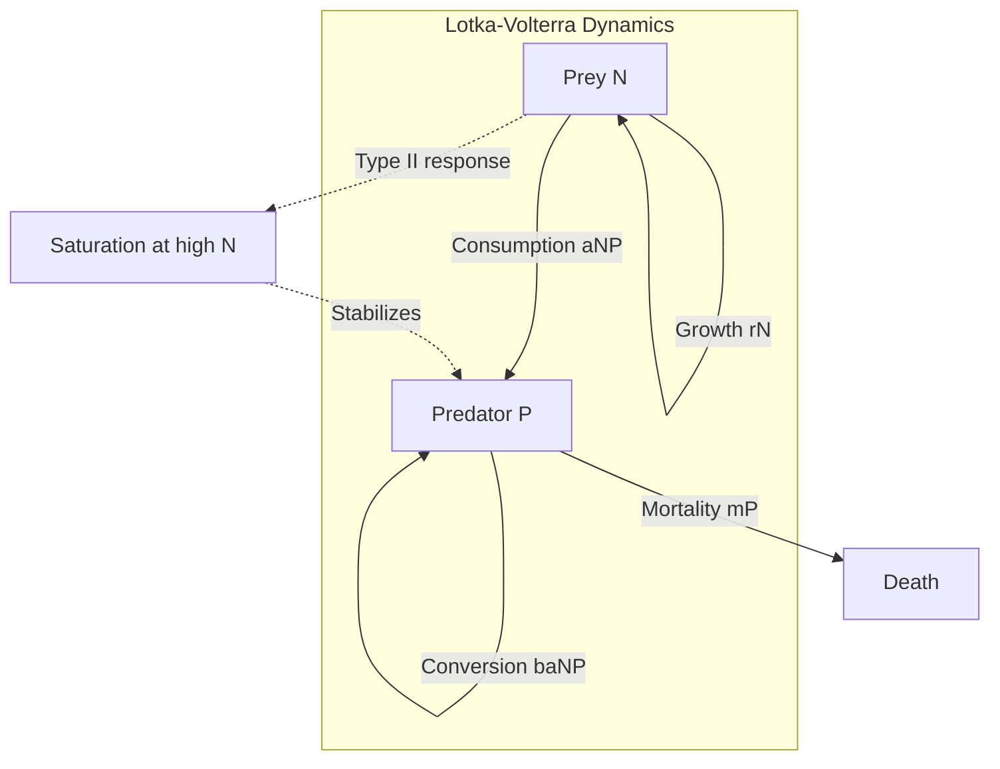
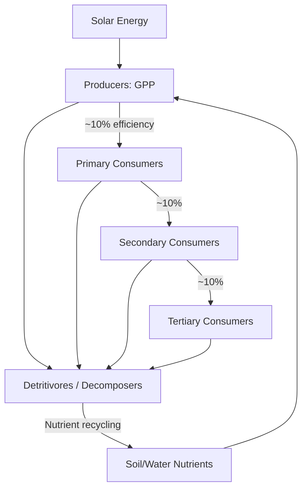
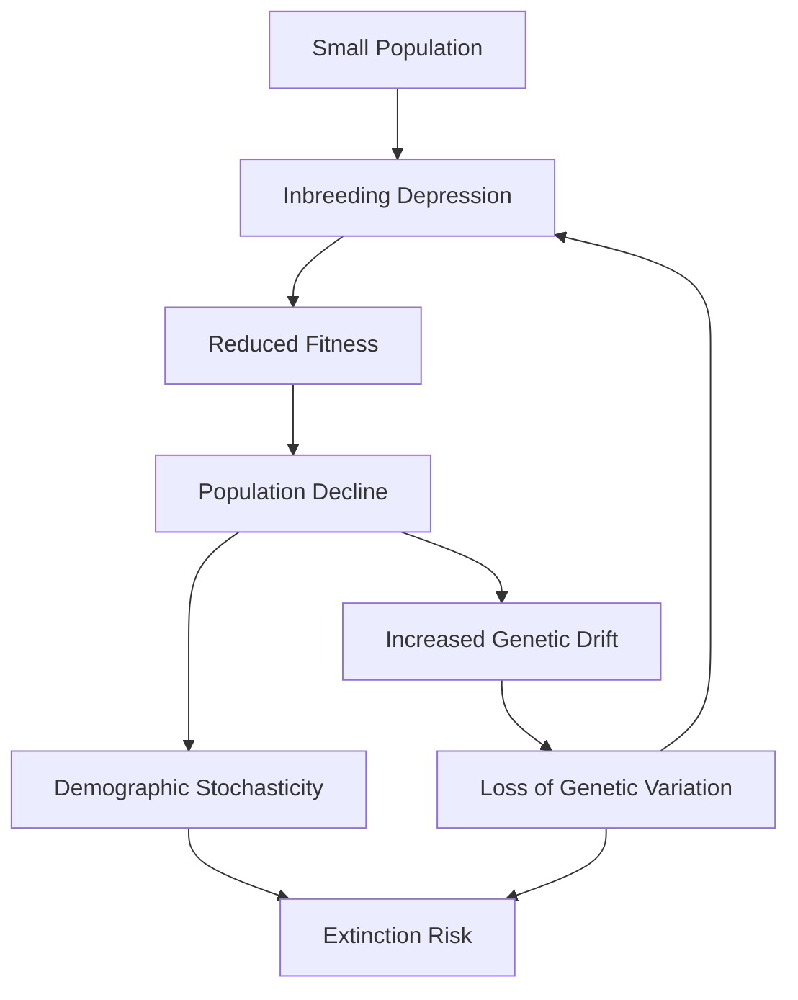

# Ecology

Population dynamics, species interactions, community ecology, ecosystem processes, and conservation biology.

## References

- Begon, M., Townsend, C.R. & Harper, J.L. *Ecology: From Individuals to Ecosystems*, 4th ed. Blackwell, 2006.
- Gotelli, N.J. *A Primer of Ecology*, 4th ed. Sinauer, 2008.
- Mittelbach, G.G. *Community Ecology*, 2nd ed. Oxford, 2019.

---

## Part I — Population Ecology

### Week 1: Single-Species Dynamics

**Exponential growth** (unlimited resources):

$$\frac{dN}{dt} = rN \quad \Rightarrow \quad N(t) = N_0 e^{rt}$$

where $r = b - d$ is the intrinsic rate of increase, $b$ = per-capita birth rate, $d$ = per-capita death rate.

**Doubling time:** $t_d = \frac{\ln 2}{r}$.

**Logistic growth** (density-dependent):

$$\frac{dN}{dt} = rN\left(1 - \frac{N}{K}\right)$$

- $K$ = carrying capacity.
- Maximum growth rate at $N = K/2$.
- Stable equilibrium at $N = K$; unstable at $N = 0$.

**Discrete logistic (Ricker model):**

$$N_{t+1} = N_t \exp\left[r\left(1 - \frac{N_t}{K}\right)\right]$$

Exhibits complex dynamics: stable point → damped oscillations → limit cycles → chaos as $r$ increases past $\sim 2.0$.

**Life tables:** Age-specific survival ($l_x$) and fecundity ($m_x$). Net reproductive rate:

$$R_0 = \sum l_x m_x$$

$R_0 > 1$: growing. Generation time $T = \frac{\sum x \cdot l_x m_x}{R_0}$. Approximate $r \approx \frac{\ln R_0}{T}$.

### Week 2: Interspecific Interactions — Predation

**Lotka-Volterra predator-prey model:**

$$\frac{dN}{dt} = rN - aNP$$

$$\frac{dP}{dt} = baNP - mP$$

where $N$ = prey, $P$ = predator, $a$ = attack rate, $b$ = conversion efficiency, $m$ = predator mortality.

Neutral oscillations with period $T = \frac{2\pi}{\sqrt{rm}}$. Equilibria:

$$N^* = \frac{m}{ba}, \quad P^* = \frac{r}{a}$$

**Functional responses** (Holling):
- **Type I:** linear ($f = aN$) — filter feeders.
- **Type II:** saturating ($f = \frac{aN}{1 + ahN}$) — handling time $h$ limits intake.
- **Type III:** sigmoidal — prey switching, learning.

### Week 3: Competition

**Lotka-Volterra competition** for species $i$ and $j$:

$$\frac{dN_i}{dt} = r_i N_i \left(1 - \frac{N_i + \alpha_{ij}N_j}{K_i}\right)$$

- $\alpha_{ij}$: competition coefficient (effect of species $j$ on species $i$).
- **Competitive exclusion principle** (Gause): Two species competing for the same limiting resource cannot coexist — one will be driven extinct.

**Coexistence conditions:** $\alpha_{12} < K_1/K_2$ AND $\alpha_{21} < K_2/K_1$ — intraspecific competition must exceed interspecific competition for both species.

**Resource competition** (Tilman): Each species has minimum resource requirement $R^*$; the species with lowest $R^*$ wins. Coexistence on $n$ resources requires $n$ species with trade-offs.

---

## Part II — Community Ecology

### Week 4: Biodiversity & Community Structure

**Species diversity indices:**

Shannon diversity:

$$H' = -\sum_{i=1}^{S} p_i \ln p_i$$

where $p_i$ is the proportional abundance of species $i$, $S$ is species richness.

**Simpson's diversity:** $D = 1 - \sum p_i^2$ (probability two random individuals are different species).

**Evenness:** $E = H' / \ln S$ (ratio of observed to maximum possible diversity).

**Species-abundance distributions:** Log-normal (Preston), log-series (Fisher), neutral theory predictions (Hubbell).

**Rank-abundance (Whittaker) plots:** Steep slope = low evenness; shallow = high evenness.

### Week 5: Trophic Ecology & Food Webs

**Trophic levels:** Producers → primary consumers → secondary consumers → tertiary consumers → decomposers.

**Trophic efficiency:** $\sim 10\%$ transfer between levels (Lindeman's 10% rule). Explains why food chains rarely exceed 4--5 links.

**Bottom-up vs. top-down control:**
- Bottom-up: nutrient/resource limitation cascades upward.
- Top-down: predator removal cascades downward (**trophic cascade**; e.g., sea otter → sea urchin → kelp).

**Keystone species:** Disproportionate effect relative to abundance (e.g., *Pisaster* sea star in rocky intertidal).

---

## Part III — Ecosystem Ecology

### Week 6: Energy Flow & Nutrient Cycling

**Gross primary productivity (GPP):** Total carbon fixed by photosynthesis.

**Net primary productivity (NPP):** $\text{NPP} = \text{GPP} - R_a$ where $R_a$ = autotrophic respiration. Global NPP $\approx 120$ Pg C/yr (terrestrial) + $\sim 50$ Pg C/yr (marine).

**Carbon cycle:** Atmosphere ($\sim 870$ Pg C as CO$_2$) ↔ terrestrial biosphere ↔ ocean ↔ fossil fuels ↔ sedimentary rock. Anthropogenic emissions $\sim 10$ Pg C/yr.

**Nitrogen cycle:** $\text{N}_2$ fixation (biological: nitrogenase; industrial: Haber-Bosch) → NH$_4^+$ → nitrification (NO$_3^-$) → assimilation or denitrification (back to N$_2$).

**Phosphorus cycle:** No significant atmospheric phase. Rock weathering → dissolved PO$_4^{3-}$ → biological uptake → sedimentation. Often the limiting nutrient in freshwater systems (N limits marine).

### Week 7: Island Biogeography

**MacArthur-Wilson equilibrium theory** (1967):

$$S = cA^z$$

where $S$ = number of species, $A$ = island area, $c$ = constant, $z \approx 0.25$--$0.35$ for oceanic islands.

Species richness at equilibrium where immigration rate = extinction rate:
- Larger islands: lower extinction → more species.
- Closer islands: higher immigration → more species.

Applied to habitat fragments (conservation): habitat patches as "islands" in a matrix of unsuitable habitat.

---

## Part IV — Conservation Biology

### Week 8: Applied Conservation

**Minimum viable population (MVP):** Smallest population with $> 95\%$ probability of persistence for 100+ years. Rule of thumb: $N_e \geq 50$ (short-term inbreeding avoidance), $N_e \geq 500$ (long-term evolutionary potential). Census $N$ often $5$--$10\times N_e$.

**Extinction vortex:** Small population → inbreeding depression → reduced fitness → smaller population → more drift → loss of adaptive variation → positive feedback to extinction.

**Population viability analysis (PVA):** Stochastic simulation incorporating demographic stochasticity, environmental stochasticity, catastrophes, and genetic effects. Outputs: extinction probability over time horizon.

**SLOSS debate:** Single Large Or Several Small reserves? Generally, large connected reserves preserve more interior habitat and large-range species; multiple small reserves can capture more beta-diversity.

**Metapopulation dynamics** (Levins model):

$$\frac{dp}{dt} = cp(1 - p) - ep$$

where $p$ = fraction of occupied patches, $c$ = colonization rate, $e$ = local extinction rate. Persistence requires $c > e$, equilibrium $\hat{p} = 1 - e/c$.

---

## Key Equations Summary

| Concept | Equation |
|---------|----------|
| Exponential growth | $dN/dt = rN$ |
| Logistic growth | $dN/dt = rN(1 - N/K)$ |
| Lotka-Volterra prey | $dN/dt = rN - aNP$ |
| Lotka-Volterra predator | $dP/dt = baNP - mP$ |
| Competition | $dN_i/dt = r_iN_i(1-(N_i+\alpha_{ij}N_j)/K_i)$ |
| Shannon diversity | $H' = -\sum p_i \ln p_i$ |
| Species-area | $S = cA^z$ |
| Net reproductive rate | $R_0 = \sum l_x m_x$ |
| Metapopulation | $dp/dt = cp(1-p) - ep$ |
