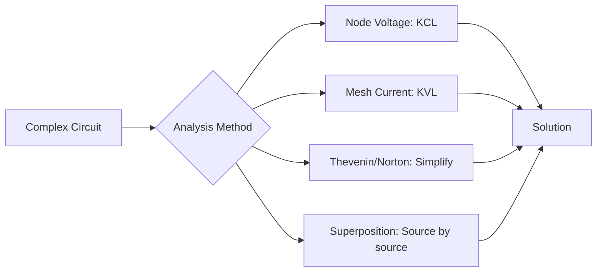
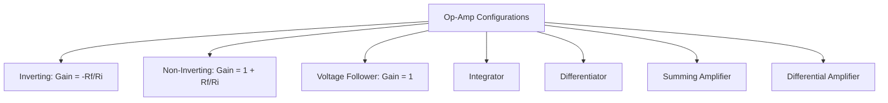
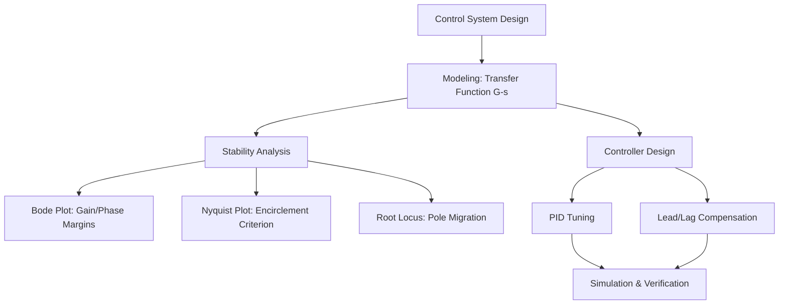

# Electrical Engineering — Circuits, Signals, and Control

## Part I — Circuit Theory

### Week 1: Fundamentals

**Ohm's Law**:

$$V = IR$$

where $V$ is voltage (volts), $I$ is current (amperes), $R$ is resistance (ohms).

**Power**: $P = IV = I^2R = \frac{V^2}{R}$ (watts)

**Kirchhoff's Laws**:
- **KCL (Current Law)**: At any node, the sum of currents entering equals the sum leaving:
$$\sum_{k} I_k = 0$$
- **KVL (Voltage Law)**: Around any closed loop, the sum of voltage drops equals zero:
$$\sum_{k} V_k = 0$$

**Series and Parallel**:

| Configuration | Resistance | Capacitance | Inductance |
|--------------|-----------|-------------|------------|
| Series | $R_{eq} = R_1 + R_2$ | $\frac{1}{C_{eq}} = \frac{1}{C_1} + \frac{1}{C_2}$ | $L_{eq} = L_1 + L_2$ |
| Parallel | $\frac{1}{R_{eq}} = \frac{1}{R_1} + \frac{1}{R_2}$ | $C_{eq} = C_1 + C_2$ | $\frac{1}{L_{eq}} = \frac{1}{L_1} + \frac{1}{L_2}$ |

### Week 2: Network Theorems

**Thevenin's Theorem**: Any linear two-terminal network can be replaced by a voltage source $V_{th}$ in series with a resistance $R_{th}$.
- $V_{th}$ = open-circuit voltage across the terminals
- $R_{th}$ = equivalent resistance with all independent sources deactivated

**Norton's Theorem**: Equivalent current source $I_N = \frac{V_{th}}{R_{th}}$ in parallel with $R_{th}$.

**Superposition**: In a linear circuit with multiple independent sources, the response at any element equals the algebraic sum of responses due to each source acting alone (other sources deactivated: voltage sources $\to$ short, current sources $\to$ open).

---

## Part II — AC Circuits

### Week 3: Phasor Analysis

In steady-state AC, sinusoidal signals are represented as complex phasors:

$$v(t) = V_0 \cos(\omega t + \phi) \quad \Longleftrightarrow \quad \mathbf{V} = V_0 e^{j\phi}$$

**Impedance** generalizes resistance to AC:
- Resistor: $Z_R = R$
- Capacitor: $Z_C = \frac{1}{j\omega C}$
- Inductor: $Z_L = j\omega L$

Ohm's law in phasor domain: $\mathbf{V} = \mathbf{I} Z$

**Complex power**: $S = P + jQ$ where $P$ is real power (watts), $Q$ is reactive power (VAR), and $|S|$ is apparent power (VA). Power factor: $\cos\phi = \frac{P}{|S|}$.

### Week 4: Resonance

**Series RLC resonance**: impedance is purely resistive when inductive and capacitive reactances cancel.

Resonant frequency:
$$\omega_0 = \frac{1}{\sqrt{LC}}$$

**Quality factor** (sharpness of resonance):
$$Q = \frac{\omega_0 L}{R} = \frac{1}{R}\sqrt{\frac{L}{C}}$$

**Bandwidth**: $BW = \frac{\omega_0}{Q} = \frac{R}{L}$

High $Q$ = narrow bandwidth = selective filter. Low $Q$ = wide bandwidth = broadband response.

| Parameter | Series RLC | Parallel RLC |
|-----------|-----------|-------------|
| $\omega_0$ | $\frac{1}{\sqrt{LC}}$ | $\frac{1}{\sqrt{LC}}$ |
| $Q$ | $\frac{\omega_0 L}{R}$ | $R\sqrt{\frac{C}{L}}$ |
| At resonance | Min impedance ($= R$) | Max impedance ($= R$) |

---

## Part III — Operational Amplifiers

### Week 5: Ideal Op-Amp Circuits

Ideal op-amp assumptions: infinite input impedance, zero output impedance, infinite open-loop gain.

**Inverting amplifier**:
$$V_o = -\frac{R_f}{R_i} V_i$$

**Non-inverting amplifier**:
$$V_o = \left(1 + \frac{R_f}{R_i}\right) V_i$$

**Summing amplifier** (inverting):
$$V_o = -R_f \left(\frac{V_1}{R_1} + \frac{V_2}{R_2} + \cdots\right)$$

**Integrator**:
$$V_o(t) = -\frac{1}{R_i C_f} \int_0^t V_i(\tau)\, d\tau$$

**Differentiator**:
$$V_o(t) = -R_f C_i \frac{dV_i}{dt}$$

---

## Part IV — Digital Logic

### Week 6: Boolean Algebra and Gates

**Basic gates**:
- AND: $Y = A \cdot B$
- OR: $Y = A + B$
- NOT: $Y = \overline{A}$
- XOR: $Y = A \oplus B = A\overline{B} + \overline{A}B$
- NAND: $Y = \overline{A \cdot B}$ (functionally complete)
- NOR: $Y = \overline{A + B}$ (functionally complete)

**De Morgan's Theorems**:
$$\overline{A \cdot B} = \overline{A} + \overline{B}$$
$$\overline{A + B} = \overline{A} \cdot \overline{B}$$

**Karnaugh Maps**: graphical method for minimizing Boolean expressions. Group adjacent 1s in powers of 2.

### Week 7: Sequential Logic and FSMs

**Flip-Flops**:
- **SR**: Set/Reset — forbidden state when both S=R=1
- **D**: Data — output follows input on clock edge ($Q^+ = D$)
- **JK**: Universal — toggles when J=K=1; no forbidden state
- **T**: Toggle — flips state when T=1

**Finite State Machines (FSMs)**:
- **Mealy**: output depends on current state AND current input — outputs can change asynchronously with input
- **Moore**: output depends only on current state — outputs change synchronously with clock

Design process: state diagram $\to$ state table $\to$ state encoding $\to$ next-state logic (Karnaugh maps) $\to$ circuit implementation.

---

## Part V — Signal Processing

### Week 8: Sampling and the DFT

**Nyquist-Shannon Sampling Theorem**: to perfectly reconstruct a bandlimited signal, the sampling frequency must satisfy:

$$f_s \geq 2 f_{max}$$

Violation causes **aliasing**: high-frequency components fold back as spurious low frequencies.

**Discrete Fourier Transform (DFT)**:
$$X[k] = \sum_{n=0}^{N-1} x[n]\, e^{-j2\pi kn/N}, \quad k = 0, 1, \ldots, N-1$$

**Inverse DFT**:
$$x[n] = \frac{1}{N} \sum_{k=0}^{N-1} X[k]\, e^{j2\pi kn/N}$$

**FFT** (Cooley-Tukey, 1965): computes the DFT in $O(N \log N)$ instead of $O(N^2)$ by exploiting symmetry and periodicity of the twiddle factors $W_N^{kn} = e^{-j2\pi kn/N}$.

### Week 9: Filters and the Z-Transform

**Z-Transform**:
$$X(z) = \sum_{n=0}^{\infty} x[n]\, z^{-n}$$

Maps discrete-time sequences to the complex $z$-plane. Poles inside the unit circle $\Rightarrow$ stable system.

**FIR (Finite Impulse Response)**: output depends on current and past inputs only. Always stable. Linear phase possible.
$$y[n] = \sum_{k=0}^{M} b_k\, x[n-k]$$

**IIR (Infinite Impulse Response)**: output depends on past outputs too (feedback). More efficient (fewer coefficients) but can be unstable.
$$y[n] = \sum_{k=0}^{M} b_k\, x[n-k] - \sum_{k=1}^{N} a_k\, y[n-k]$$

| Property | FIR | IIR |
|----------|-----|-----|
| Stability | Always stable | Can be unstable |
| Linear phase | Possible | Generally not |
| Efficiency | Requires more taps | Fewer coefficients |
| Design methods | Windowing, Parks-McClellan | Bilinear transform, impulse invariance |

---

## Part VI — Control Systems

### Week 10: Transfer Functions

A linear time-invariant (LTI) system is characterized by its **transfer function** in the Laplace domain:

$$G(s) = \frac{Y(s)}{U(s)}$$

where $Y(s)$ is the output and $U(s)$ is the input. Poles of $G(s)$ determine stability: all poles must have negative real parts (left half-plane) for BIBO stability.

**Standard second-order system**:
$$G(s) = \frac{\omega_n^2}{s^2 + 2\zeta\omega_n s + \omega_n^2}$$

where $\omega_n$ is natural frequency and $\zeta$ is damping ratio:
- $\zeta < 1$: underdamped (oscillatory)
- $\zeta = 1$: critically damped
- $\zeta > 1$: overdamped

### Week 11: PID Control

The **PID controller** is the workhorse of industrial control:

$$u(t) = K_p\, e(t) + K_i \int_0^t e(\tau)\, d\tau + K_d \frac{de(t)}{dt}$$

| Term | Effect | Tradeoff |
|------|--------|----------|
| $K_p$ (Proportional) | Reduces steady-state error | Too high $\to$ oscillation |
| $K_i$ (Integral) | Eliminates steady-state error | Too high $\to$ overshoot, wind-up |
| $K_d$ (Derivative) | Anticipates error, adds damping | Amplifies noise |

**Tuning methods**: Ziegler-Nichols (step response or ultimate gain), Cohen-Coon, auto-tuning, trial and error with simulation.

### Week 12: Frequency-Domain Analysis

**Bode Plots**: magnitude (dB) and phase (degrees) vs. frequency (log scale). Used to assess gain margin, phase margin, bandwidth, and stability.

- **Gain margin**: how much gain can increase before instability (measured at phase = -180 deg)
- **Phase margin**: how much phase can decrease before instability (measured at gain = 0 dB)

**Nyquist Stability Criterion**: plot $G(j\omega)H(j\omega)$ in the complex plane as $\omega$ varies from $-\infty$ to $+\infty$. The number of clockwise encirclements of the critical point $(-1, 0)$ determines closed-loop stability via:

$$Z = N + P$$

where $Z$ = closed-loop RHP poles, $N$ = encirclements, $P$ = open-loop RHP poles. Stable if $Z = 0$.

**Root Locus**: plots closed-loop pole locations as a parameter (typically gain $K$) varies from 0 to $\infty$. Rules: starts at open-loop poles, ends at open-loop zeros (or infinity). Branches crossing the imaginary axis indicate the gain at which instability begins.

---

## References

- Sedra, Adel S., and Kenneth C. Smith. *Microelectronic Circuits*. 8th ed. Oxford UP, 2020.
- Oppenheim, Alan V., and Alan S. Willsky. *Signals and Systems*. 2nd ed. Pearson, 1997.
- Ogata, Katsuhiko. *Modern Control Engineering*. 5th ed. Pearson, 2010.
- Hayt, William H., Jack E. Kemmerly, and Steven M. Durbin. *Engineering Circuit Analysis*. 9th ed. McGraw-Hill, 2019.
- Proakis, John G., and Dimitris G. Manolakis. *Digital Signal Processing*. 4th ed. Pearson, 2007.
- Mano, M. Morris. *Digital Logic and Computer Design*. Pearson, 2017.
- Nise, Norman S. *Control Systems Engineering*. 8th ed. Wiley, 2019.
