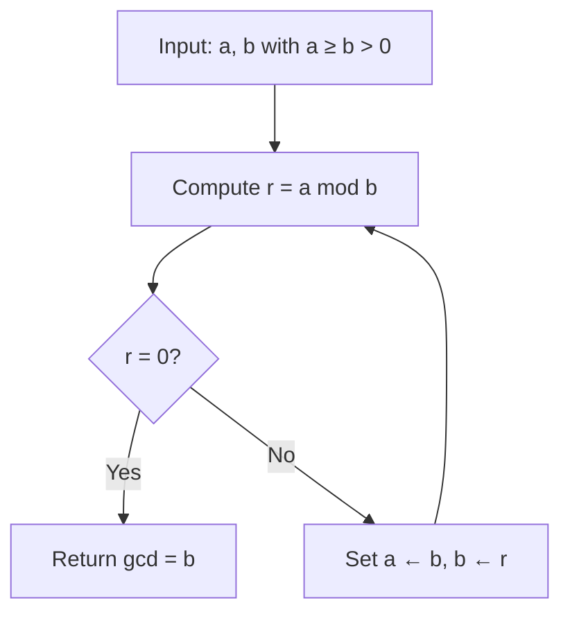
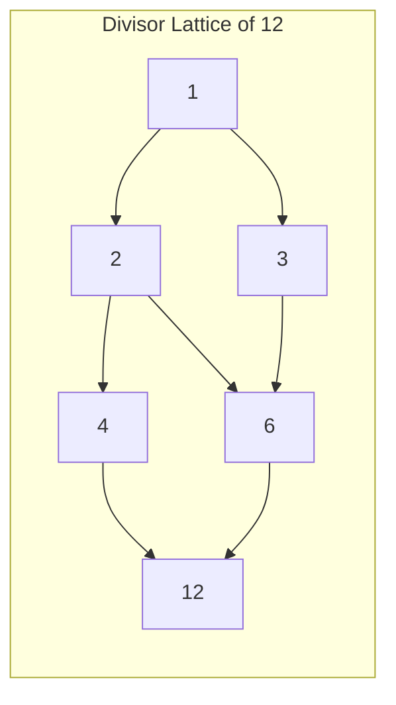
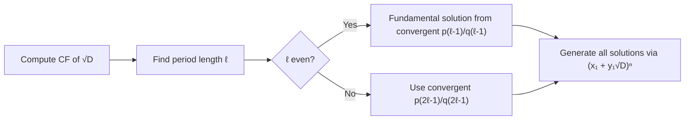

# Elementary Number Theory

## Course Overview

A foundational course covering the classical theory of integers: divisibility, prime factorization, modular arithmetic, and the landmark theorems of Fermat, Euler, and Gauss. The material forms the bedrock for algebraic number theory, cryptography, and combinatorics.

## References

- G.H. Hardy & E.M. Wright, *An Introduction to the Theory of Numbers*, 6th ed., Oxford University Press, 2008.
- I. Niven, H.S. Zuckerman & H.L. Montgomery, *An Introduction to the Theory of Numbers*, 5th ed., Wiley, 1991.
- K. Ireland & M. Rosen, *A Classical Introduction to Modern Number Theory*, 2nd ed., Springer GTM 84, 1990.

---

# Part I — Divisibility and the Euclidean Algorithm

## Week 1: Divisibility

### Basic Definitions

An integer $a$ **divides** $b$ (written $a \mid b$) if there exists an integer $k$ such that $b = ak$. Key properties:

- **Reflexivity:** $a \mid a$ for all $a \neq 0$.
- **Transitivity:** If $a \mid b$ and $b \mid c$, then $a \mid c$.
- **Linearity:** If $a \mid b$ and $a \mid c$, then $a \mid (bx + cy)$ for all integers $x, y$.

### The Division Algorithm

For any integers $a$ and $b > 0$, there exist unique integers $q$ (quotient) and $r$ (remainder) such that:

$$a = bq + r, \quad 0 \leq r < b$$

## Week 2: GCD, LCM, and the Euclidean Algorithm

### Greatest Common Divisor

The **greatest common divisor** $\gcd(a, b)$ is the largest positive integer dividing both $a$ and $b$. It satisfies Bezout's identity:

$$\gcd(a, b) = ax + by \quad \text{for some } x, y \in \mathbb{Z}$$

### The Euclidean Algorithm

Compute $\gcd(a, b)$ by repeated division:

$$a = bq_1 + r_1, \quad b = r_1 q_2 + r_2, \quad r_1 = r_2 q_3 + r_3, \quad \ldots$$

The last nonzero remainder is $\gcd(a, b)$. The algorithm terminates in at most $O(\log(\min(a,b)))$ steps.

### Least Common Multiple

$$\text{lcm}(a, b) = \frac{|ab|}{\gcd(a, b)}$$

For any prime $p$: if $p^{\alpha} \| a$ and $p^{\beta} \| b$, then $p^{\min(\alpha,\beta)} \| \gcd(a,b)$ and $p^{\max(\alpha,\beta)} \| \text{lcm}(a,b)$.

---

# Part II — Primes and Unique Factorization

## Week 3: Prime Numbers

### Fundamental Theorem of Arithmetic

Every integer $n > 1$ has a unique factorization (up to order):

$$n = p_1^{a_1} p_2^{a_2} \cdots p_k^{a_k}, \quad p_1 < p_2 < \cdots < p_k$$

### Euclid's Theorem

There are infinitely many primes. *Proof:* Given primes $p_1, \ldots, p_n$, consider $N = p_1 p_2 \cdots p_n + 1$. No $p_i$ divides $N$, so $N$ has a prime factor not in the list.

### Distribution of Primes

The prime counting function $\pi(x) = \#\{p \leq x : p \text{ prime}\}$ satisfies:

$$\pi(x) \sim \frac{x}{\ln x} \quad \text{as } x \to \infty$$

This is the **Prime Number Theorem** (proved independently by Hadamard and de la Vallee Poussin in 1896).

## Week 4: Arithmetic Functions

Key multiplicative functions:

| Function | Definition | Formula |
|----------|-----------|---------|
| $\tau(n)$ | Number of divisors | $\prod (a_i + 1)$ |
| $\sigma(n)$ | Sum of divisors | $\prod \frac{p_i^{a_i+1}-1}{p_i - 1}$ |
| $\phi(n)$ | Euler's totient | $n \prod_{p \mid n}\left(1 - \frac{1}{p}\right)$ |
| $\mu(n)$ | Mobius function | $(-1)^k$ if squarefree, else $0$ |

**Mobius Inversion:** If $f(n) = \sum_{d \mid n} g(d)$, then $g(n) = \sum_{d \mid n} \mu(n/d)\, f(d)$.

---

# Part III — Congruences

## Week 5: Modular Arithmetic

### Congruence Relation

We write $a \equiv b \pmod{n}$ if $n \mid (a - b)$. The integers modulo $n$ form the ring $\mathbb{Z}/n\mathbb{Z}$.

### Linear Congruences

The congruence $ax \equiv b \pmod{n}$ has a solution if and only if $\gcd(a, n) \mid b$. When solvable, there are exactly $\gcd(a, n)$ solutions modulo $n$.

### Chinese Remainder Theorem

If $\gcd(m, n) = 1$, then the system

$$x \equiv a \pmod{m}, \quad x \equiv b \pmod{n}$$

has a unique solution modulo $mn$. More generally, for pairwise coprime moduli $m_1, \ldots, m_k$:

$$\mathbb{Z}/m_1 \cdots m_k \mathbb{Z} \cong \mathbb{Z}/m_1\mathbb{Z} \times \cdots \times \mathbb{Z}/m_k\mathbb{Z}$$

## Week 6: Fermat and Euler

### Fermat's Little Theorem

If $p$ is prime and $\gcd(a, p) = 1$, then:

$$a^{p-1} \equiv 1 \pmod{p}$$

Equivalently, $a^p \equiv a \pmod{p}$ for all integers $a$.

### Euler's Theorem

If $\gcd(a, n) = 1$, then:

$$a^{\phi(n)} \equiv 1 \pmod{n}$$

where $\phi(n)$ is Euler's totient function. This generalizes Fermat's little theorem since $\phi(p) = p - 1$.

### Order and Primitive Roots

The **order** of $a$ modulo $n$ is the smallest positive $k$ with $a^k \equiv 1 \pmod{n}$. We write $\text{ord}_n(a) = k$, and $\text{ord}_n(a) \mid \phi(n)$.

A **primitive root** modulo $n$ is an element of order $\phi(n)$. Primitive roots exist modulo $n$ if and only if $n \in \{1, 2, 4, p^k, 2p^k\}$ for odd primes $p$.

### Wilson's Theorem

$p$ is prime if and only if $(p-1)! \equiv -1 \pmod{p}$.

---

# Part IV — Quadratic Residues and Reciprocity

## Week 7: Quadratic Residues

An integer $a$ is a **quadratic residue** mod $p$ if $x^2 \equiv a \pmod{p}$ has a solution. The Legendre symbol:

$$\left(\frac{a}{p}\right) = \begin{cases} 1 & \text{if } a \text{ is a QR mod } p \\ -1 & \text{if } a \text{ is a QNR mod } p \\ 0 & \text{if } p \mid a \end{cases}$$

**Euler's Criterion:**

$$\left(\frac{a}{p}\right) \equiv a^{(p-1)/2} \pmod{p}$$

## Week 8: Quadratic Reciprocity

### The Law of Quadratic Reciprocity (Gauss, 1801)

For distinct odd primes $p$ and $q$:

$$\left(\frac{p}{q}\right)\left(\frac{q}{p}\right) = (-1)^{\frac{p-1}{2} \cdot \frac{q-1}{2}}$$

### First and Second Supplements

$$\left(\frac{-1}{p}\right) = (-1)^{(p-1)/2}, \qquad \left(\frac{2}{p}\right) = (-1)^{(p^2 - 1)/8}$$

### The Jacobi Symbol

Extends the Legendre symbol to composite moduli: for odd $n = p_1^{a_1} \cdots p_k^{a_k}$,

$$\left(\frac{a}{n}\right) = \prod_{i=1}^k \left(\frac{a}{p_i}\right)^{a_i}$$

---

# Part V — Continued Fractions and Diophantine Equations

## Week 9: Continued Fractions

Every real number $\alpha$ has a (simple) continued fraction expansion:

$$\alpha = a_0 + \cfrac{1}{a_1 + \cfrac{1}{a_2 + \cfrac{1}{a_3 + \cdots}}} = [a_0; a_1, a_2, a_3, \ldots]$$

The expansion is finite if and only if $\alpha$ is rational. The convergents $p_k/q_k = [a_0; a_1, \ldots, a_k]$ satisfy the recurrence:

$$p_k = a_k p_{k-1} + p_{k-2}, \quad q_k = a_k q_{k-1} + q_{k-2}$$

and give the **best rational approximations** to $\alpha$:

$$\left|\alpha - \frac{p_k}{q_k}\right| < \frac{1}{q_k q_{k+1}}$$

## Week 10: Pell's Equation

### The Equation $x^2 - Dy^2 = 1$

For non-square $D > 0$, the continued fraction expansion of $\sqrt{D}$ is eventually periodic: $\sqrt{D} = [a_0; \overline{a_1, a_2, \ldots, a_\ell}]$.

The fundamental solution $(x_1, y_1)$ comes from the convergent $p_{\ell-1}/q_{\ell-1}$ (or $p_{2\ell-1}/q_{2\ell-1}$ if $\ell$ is odd). All solutions are generated by:

$$(x_n + y_n\sqrt{D}) = (x_1 + y_1\sqrt{D})^n$$

### Example: $x^2 - 2y^2 = 1$

$\sqrt{2} = [1; \overline{2}]$, period $\ell = 1$ (odd). Use $p_1/q_1 = 3/2$: check $9 - 8 = 1$. The fundamental solution is $(3, 2)$, and all solutions come from $(3 + 2\sqrt{2})^n$.

---

# Summary of Key Theorems

| Theorem | Statement |
|---------|-----------|
| Fundamental Theorem of Arithmetic | $n = p_1^{a_1} \cdots p_k^{a_k}$ uniquely |
| Bezout's Identity | $\gcd(a,b) = ax + by$ |
| Chinese Remainder Theorem | System solvable iff pairwise coprime moduli |
| Fermat's Little Theorem | $a^{p-1} \equiv 1 \pmod{p}$ |
| Euler's Theorem | $a^{\phi(n)} \equiv 1 \pmod{n}$ |
| Quadratic Reciprocity | $\left(\frac{p}{q}\right)\left(\frac{q}{p}\right) = (-1)^{\frac{p-1}{2}\frac{q-1}{2}}$ |
| Pell's Equation | Infinite solutions via CF of $\sqrt{D}$ |
