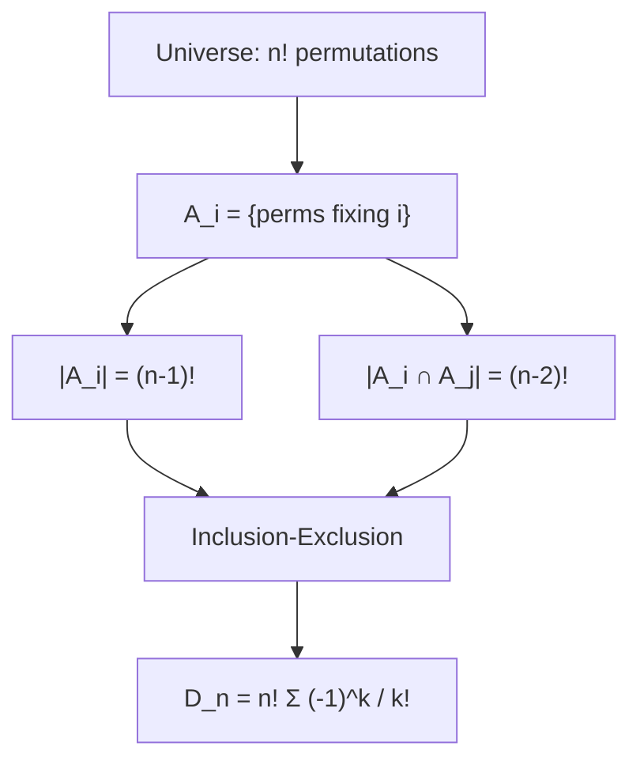
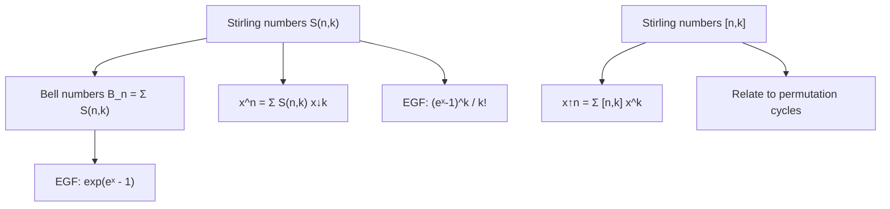
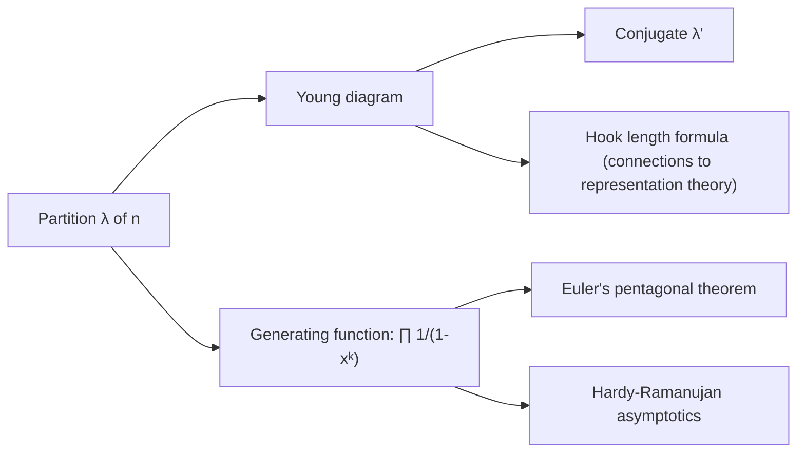

# Enumerative Combinatorics

## Course Overview

Systematic counting techniques: from basic principles through generating functions, recurrence relations, and the theory of partitions. Emphasis on bijective proofs, algebraic methods, and the interplay between formal power series and combinatorial structures.

## References

- R.P. Stanley, *Enumerative Combinatorics*, Vol. 1, 2nd ed., Cambridge University Press, 2012.
- H.S. Wilf, *generatingfunctionology*, 3rd ed., A K Peters, 2006.
- P. Flajolet & R. Sedgewick, *Analytic Combinatorics*, Cambridge University Press, 2009.

---

# Part I — Basic Counting

## Week 1: Fundamental Principles

### Sum and Product Rules

- **Sum rule:** If $A$ and $B$ are disjoint finite sets, $|A \cup B| = |A| + |B|$.
- **Product rule:** $|A \times B| = |A| \cdot |B|$.

### Permutations and Combinations

- **Permutations** of $k$ from $n$: $P(n, k) = \frac{n!}{(n-k)!}$
- **Combinations:** $\binom{n}{k} = \frac{n!}{k!(n-k)!}$

### The Binomial Theorem

$$(x + y)^n = \sum_{k=0}^{n} \binom{n}{k} x^k y^{n-k}$$

### Multinomial Coefficient

The number of ways to partition $n$ objects into groups of sizes $k_1, \ldots, k_r$:

$$\binom{n}{k_1, k_2, \ldots, k_r} = \frac{n!}{k_1! k_2! \cdots k_r!}$$

## Week 2: Inclusion-Exclusion

### The Principle

For finite sets $A_1, \ldots, A_n$:

$$\left|\bigcup_{i=1}^n A_i\right| = \sum_{i} |A_i| - \sum_{i<j} |A_i \cap A_j| + \sum_{i<j<k} |A_i \cap A_j \cap A_k| - \cdots$$

### Derangements

A **derangement** is a permutation with no fixed points. The number of derangements of $[n]$:

$$D_n = n! \sum_{k=0}^{n} \frac{(-1)^k}{k!} \approx \frac{n!}{e}$$

### Euler's Totient via Inclusion-Exclusion

$$\phi(n) = n \prod_{p \mid n} \left(1 - \frac{1}{p}\right)$$

---

# Part II — Generating Functions

## Week 3: Ordinary Generating Functions

### Definition

The **ordinary generating function** (OGF) of a sequence $(a_n)_{n \geq 0}$ is:

$$A(x) = \sum_{n=0}^{\infty} a_n x^n$$

### Key OGFs

| Sequence | OGF |
|----------|-----|
| $a_n = 1$ | $\frac{1}{1-x}$ |
| $a_n = n$ | $\frac{x}{(1-x)^2}$ |
| $a_n = \binom{n+k-1}{k-1}$ | $\frac{1}{(1-x)^k}$ |
| $a_n = F_n$ (Fibonacci) | $\frac{x}{1-x-x^2}$ |
| $a_n = C_n$ (Catalan) | $\frac{1 - \sqrt{1-4x}}{2x}$ |

### Operations on OGFs

| Operation on $(a_n)$ | Effect on $A(x)$ |
|----------------------|------------------|
| Shift: $(a_{n+1})$ | $\frac{A(x) - a_0}{x}$ |
| Prefix sums: $\sum_{k=0}^n a_k$ | $\frac{A(x)}{1-x}$ |
| Convolution: $\sum_{k=0}^n a_k b_{n-k}$ | $A(x) \cdot B(x)$ |

## Week 4: Exponential Generating Functions

### Definition

The **exponential generating function** (EGF) of $(a_n)$ is:

$$\hat{A}(x) = \sum_{n=0}^{\infty} a_n \frac{x^n}{n!}$$

### Key EGFs

| Sequence | EGF |
|----------|-----|
| $a_n = 1$ | $e^x$ |
| $a_n = n!$ (permutations) | $\frac{1}{1-x}$ |
| $a_n = D_n$ (derangements) | $\frac{e^{-x}}{1-x}$ |
| $a_n = B_n$ (Bell numbers) | $e^{e^x - 1}$ |

### The Exponential Formula

If $\hat{A}(x)$ is the EGF for labeled connected structures, then $e^{\hat{A}(x)}$ is the EGF for sets of such structures.

**Example:** Connected labeled graphs $\to$ all labeled graphs: $e^{\hat{C}(x)} = \sum_{n \geq 0} 2^{\binom{n}{2}} \frac{x^n}{n!}$.

---

# Part III — Recurrences and Special Sequences

## Week 5: Solving Recurrences

### Linear Recurrences with Constant Coefficients

The recurrence $a_n = c_1 a_{n-1} + \cdots + c_k a_{n-k}$ has characteristic equation:

$$x^k - c_1 x^{k-1} - \cdots - c_k = 0$$

If the roots are $r_1, \ldots, r_k$ (distinct), then $a_n = \alpha_1 r_1^n + \cdots + \alpha_k r_k^n$.

### Fibonacci Numbers

$F_n = F_{n-1} + F_{n-2}$, with $F_0 = 0, F_1 = 1$. Characteristic roots $\phi = \frac{1+\sqrt{5}}{2}$ and $\hat{\phi} = \frac{1-\sqrt{5}}{2}$:

$$F_n = \frac{\phi^n - \hat{\phi}^n}{\sqrt{5}}$$

## Week 6: Catalan Numbers

### Definition and Formula

The **Catalan numbers** $C_n = \frac{1}{n+1}\binom{2n}{n}$ count an enormous variety of structures:

| $n$ | 0 | 1 | 2 | 3 | 4 | 5 | 6 |
|-----|---|---|---|---|---|---|---|
| $C_n$ | 1 | 1 | 2 | 5 | 14 | 42 | 132 |

### Catalan Structures (Stanley lists 200+)

- Balanced parenthesizations of $n$ pairs
- Binary trees with $n$ internal nodes
- Triangulations of an $(n+2)$-gon
- Dyck paths from $(0,0)$ to $(2n,0)$
- Non-crossing partitions of $[n]$

### Generating Function

$$C(x) = \sum_{n=0}^{\infty} C_n x^n = \frac{1 - \sqrt{1 - 4x}}{2x}$$

satisfying $C(x) = 1 + x\, C(x)^2$.

### Asymptotic Growth

$$C_n \sim \frac{4^n}{n^{3/2} \sqrt{\pi}}$$

## Week 7: Stirling Numbers

### Stirling Numbers of the Second Kind

$S(n, k) = \left\{n \atop k\right\}$ counts the number of partitions of $[n]$ into $k$ nonempty blocks. Recurrence:

$$S(n, k) = k \cdot S(n-1, k) + S(n-1, k-1)$$

Connection to powers: $x^n = \sum_{k=0}^n S(n,k)\, x^{\underline{k}}$ where $x^{\underline{k}} = x(x-1)\cdots(x-k+1)$.

### Bell Numbers

$B_n = \sum_{k=0}^n S(n, k)$ counts the total number of partitions of $[n]$.

### Stirling Numbers of the First Kind

$s(n, k) = \left[n \atop k\right]$ (unsigned) counts permutations of $[n]$ with exactly $k$ cycles. Connection:

$$x^{\overline{n}} = x(x+1)\cdots(x+n-1) = \sum_{k=0}^n \left[n \atop k\right] x^k$$

---

# Part IV — Polya Enumeration and Lattice Paths

## Week 8: Polya Enumeration Theorem

### Burnside's Lemma

The number of distinct colorings under a group $G$ acting on a set $X$:

$$|X/G| = \frac{1}{|G|} \sum_{g \in G} |X^g|$$

where $X^g = \{x \in X : g \cdot x = x\}$ is the set of elements fixed by $g$.

### Cycle Index

For a permutation group $G$ acting on $[n]$, the **cycle index** is:

$$Z_G(x_1, \ldots, x_n) = \frac{1}{|G|} \sum_{g \in G} x_1^{c_1(g)} x_2^{c_2(g)} \cdots x_n^{c_n(g)}$$

where $c_k(g)$ is the number of $k$-cycles of $g$.

### Polya Enumeration Theorem

The number of distinct colorings using colors $\{1, \ldots, m\}$ is $Z_G(m, m, \ldots, m)$.

The **pattern inventory** (generating function by color count) is obtained by substituting $x_k = c_1^k + c_2^k + \cdots + c_m^k$.

**Example:** Necklaces with $n$ beads and $m$ colors. The cyclic group $C_n$ gives:

$$Z_{C_n}(x_1, \ldots, x_n) = \frac{1}{n} \sum_{d \mid n} \phi(d)\, x_d^{n/d}$$

## Week 9: Lattice Paths

### Dyck Paths

A **Dyck path** of length $2n$ is a path from $(0,0)$ to $(2n,0)$ using steps $U=(1,1)$ and $D=(1,-1)$ that never goes below the $x$-axis. Count: $C_n$ (Catalan number).

### Ballot Problem

The number of paths from $(0,0)$ to $(m,n)$ with $m > n$ that stay strictly above the $x$-axis is:

$$\frac{m - n}{m + n} \binom{m+n}{m}$$

### The Lindstrom-Gessel-Viennot Lemma

The number of non-intersecting lattice path systems from sources $(s_1, \ldots, s_k)$ to destinations $(t_1, \ldots, t_k)$ equals:

$$\det\left[e(s_i \to t_j)\right]_{1 \leq i,j \leq k}$$

where $e(s \to t)$ is the number of individual paths from $s$ to $t$.

---

# Part V — Partitions

## Week 10: Integer Partitions

### Definition

A **partition** of $n$ is a way to write $n = \lambda_1 + \lambda_2 + \cdots + \lambda_k$ with $\lambda_1 \geq \lambda_2 \geq \cdots \geq \lambda_k > 0$. The number of partitions of $n$ is $p(n)$.

| $n$ | 0 | 1 | 2 | 3 | 4 | 5 | 6 | 7 | 8 |
|-----|---|---|---|---|---|---|---|---|---|
| $p(n)$ | 1 | 1 | 2 | 3 | 5 | 7 | 11 | 15 | 22 |

### Generating Function

$$\sum_{n=0}^{\infty} p(n) x^n = \prod_{k=1}^{\infty} \frac{1}{1 - x^k}$$

### Euler's Distinct-Odd Theorem

The number of partitions of $n$ into **distinct** parts equals the number into **odd** parts:

$$\prod_{k=1}^{\infty} (1 + x^k) = \prod_{k=0}^{\infty} \frac{1}{1 - x^{2k+1}}$$

### Hardy-Ramanujan Asymptotic Formula

$$p(n) \sim \frac{1}{4n\sqrt{3}} \exp\left(\pi \sqrt{\frac{2n}{3}}\right)$$

### Ferrers/Young Diagrams and Conjugation

A partition $\lambda$ is visualized as a left-justified array of boxes. The **conjugate** $\lambda'$ is obtained by transposing the diagram. This gives bijective proofs: e.g., the number of partitions of $n$ with largest part $k$ equals the number with exactly $k$ parts.

### Pentagonal Number Theorem (Euler)

$$\prod_{n=1}^{\infty}(1 - x^n) = \sum_{k=-\infty}^{\infty} (-1)^k x^{k(3k-1)/2} = 1 - x - x^2 + x^5 + x^7 - x^{12} - \cdots$$

This yields the recurrence:

$$p(n) = p(n-1) + p(n-2) - p(n-5) - p(n-7) + \cdots$$

---

# Summary of Key Formulas

| Object | Formula |
|--------|---------|
| Derangements | $D_n = n! \sum_{k=0}^n (-1)^k / k!$ |
| Fibonacci | $F_n = (\phi^n - \hat\phi^n)/\sqrt{5}$ |
| Catalan | $C_n = \frac{1}{n+1}\binom{2n}{n} \sim 4^n / (n^{3/2}\sqrt\pi)$ |
| Bell | $B_n = \sum_k S(n,k)$, EGF $= e^{e^x - 1}$ |
| Partitions | $p(n) \sim \frac{1}{4n\sqrt{3}} e^{\pi\sqrt{2n/3}}$ |
| Burnside | $|X/G| = \frac{1}{|G|}\sum_g |X^g|$ |
