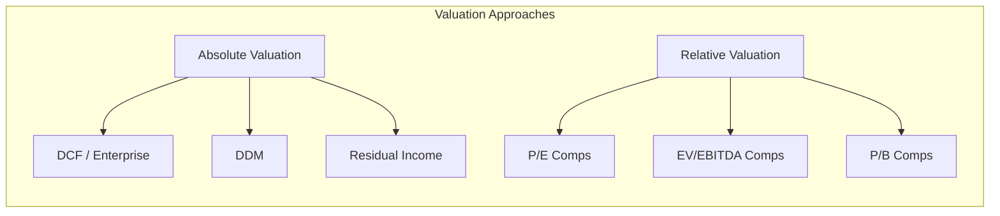
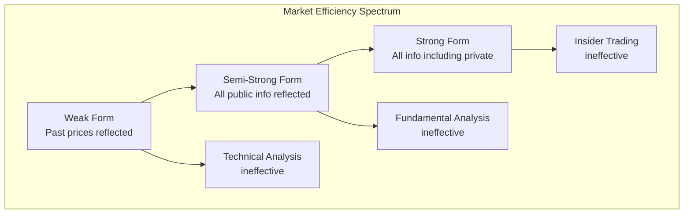

# Equity Analysis and Valuation

## Part I: Discounted Cash Flow Valuation

### Enterprise DCF

The intrinsic value of a firm equals the present value of all future free cash flows:

$$V = \sum_{t=1}^{\infty}\frac{FCF_t}{(1+WACC)^t}$$

In practice, use a two-stage model with explicit forecast period $T$ and terminal value:

$$V = \sum_{t=1}^{T}\frac{FCF_t}{(1+WACC)^t} + \frac{TV}{(1+WACC)^T}$$

### Terminal Value Methods

**Gordon Growth (perpetuity):**

$$TV = \frac{FCF_{T+1}}{WACC - g} = \frac{FCF_T(1+g)}{WACC - g}$$

where $g$ is the long-term sustainable growth rate (typically $\leq$ nominal GDP growth).

**Exit multiple:**

$$TV = FCF_T \times \text{EV/FCF multiple}$$

or $TV = \text{EBITDA}_T \times \text{EV/EBITDA multiple}$

### Free Cash Flow

$$FCF = \text{EBIT}(1-T) + \text{D\&A} - \text{CapEx} - \Delta\text{NWC}$$

where NWC = Current Operating Assets $-$ Current Operating Liabilities.

### WACC

$$WACC = \frac{E}{V}r_e + \frac{D}{V}r_d(1-T_c)$$

where $E$ = market value of equity, $D$ = market value of debt, $V = E + D$, $r_e$ = cost of equity (from CAPM), $r_d$ = cost of debt, $T_c$ = corporate tax rate.

Cost of equity via CAPM:

$$r_e = r_f + \beta(E[R_m] - r_f)$$

```mermaid
graph TD
    subgraph "DCF Valuation Framework"
        RF[Revenue Forecast] --> FCF[Free Cash Flow<br/>EBIT(1-T) + D&A - CapEx - ΔNWC]
        FCF --> PV["PV of FCFs<br/>Σ FCF_t / (1+WACC)^t"]
        FCF --> TV2["Terminal Value<br/>FCF_T+1 / (WACC - g)"]
        PV --> EV[Enterprise Value]
        TV2 --> EV
        EV --> |"- Net Debt"| EqV[Equity Value]
        EqV --> |"÷ Shares"| SP[Share Price]
    end
```

## Part II: Dividend Discount Models

### Gordon Growth Model (Constant Growth DDM)

$$P_0 = \frac{D_1}{r - g}$$

where $D_1 = D_0(1+g)$, $r$ = required return, $g$ = constant dividend growth rate.

Implied return: $r = \frac{D_1}{P_0} + g$ (dividend yield + growth).

### Multi-Stage DDM

**Two-stage:** High growth $g_1$ for years $1$ to $T$, then stable $g_2$:

$$P_0 = \sum_{t=1}^{T}\frac{D_0(1+g_1)^t}{(1+r)^t} + \frac{D_{T+1}}{(r-g_2)(1+r)^T}$$

**H-Model:** Growth declines linearly from $g_S$ to $g_L$ over $2H$ years:

$$P_0 = \frac{D_0(1+g_L) + D_0 \cdot H \cdot (g_S - g_L)}{r - g_L}$$

### Sustainable Growth Rate

$$g = \text{ROE} \times b$$

where $b$ = retention ratio $= 1 - \text{payout ratio}$.

## Part III: Relative Valuation (Comparables)

### Key Multiples

| Multiple | Formula | Use Case |
|---|---|---|
| P/E | $\text{Price} / \text{EPS}$ | General; earnings-positive firms |
| EV/EBITDA | $\text{EV} / \text{EBITDA}$ | Capital-structure neutral |
| P/B | $\text{Price} / \text{BVPS}$ | Asset-heavy firms, banks |
| P/S | $\text{Price} / \text{Sales per share}$ | Early-stage, negative earnings |
| EV/Revenue | $\text{EV} / \text{Revenue}$ | High-growth tech |
| PEG | $(\text{P/E}) / g$ | Growth-adjusted P/E |

### Enterprise Value

$$\text{EV} = \text{Market Cap} + \text{Debt} - \text{Cash} + \text{Minority Interest} + \text{Preferred Stock}$$

### Peer Selection Criteria
- Same industry (GICS sub-industry)
- Similar size (revenue, market cap)
- Similar growth profile, margins, and risk
- Same geographic exposure

## Part IV: Residual Income Model

$$V = B_0 + \sum_{t=1}^{\infty} \frac{RI_t}{(1+r)^t}$$

where residual income:

$$RI_t = NI_t - r \cdot B_{t-1} = (ROE_t - r) \cdot B_{t-1}$$

Value is created when $ROE > r$ (cost of equity). Advantages: anchored to book value, works when dividends are irregular.



## Part V: Financial Modeling (3-Statement Model)

### Model Architecture

1. **Income Statement** — Revenue build-up, COGS/OpEx assumptions, tax rate → Net Income
2. **Balance Sheet** — Working capital (DSO, DIO, DPO), PP&E schedule, debt schedule → Balancing via cash or revolver
3. **Cash Flow Statement** — Derived from IS and BS changes; circular reference from interest expense ↔ debt balance

### Key Checks
- $A = L + E$ every period
- Cash flow statement ties to BS cash change
- Debt schedule interest matches IS interest expense
- Depreciation ties to PP&E schedule

### Sensitivity and Scenario Analysis
- Data tables varying WACC and terminal growth
- Upside / Base / Downside scenarios
- Monte Carlo simulation for probabilistic valuation

## Part VI: Technical Analysis

### Core Concepts
- **Support & Resistance** — Price levels where buying/selling pressure concentrates
- **Moving Averages** — SMA, EMA; golden cross (50-day crosses above 200-day), death cross
- **RSI (Relative Strength Index)** — $RSI = 100 - \frac{100}{1 + RS}$ where $RS = \text{avg gain}/\text{avg loss}$; overbought > 70, oversold < 30
- **MACD** — $\text{MACD} = \text{EMA}_{12} - \text{EMA}_{26}$; signal line = $\text{EMA}_9(\text{MACD})$

### Behavioral Finance

| Bias | Description |
|---|---|
| Overreaction | Prices overshoot on news, then revert |
| Herding | Following the crowd, momentum cascades |
| Anchoring | Fixating on arbitrary reference points |
| Loss aversion | Losses hurt ~2x more than equivalent gains |
| Overconfidence | Overestimating prediction accuracy |
| Disposition effect | Selling winners too early, holding losers too long |



## References

- Damodaran, A. *Investment Valuation* (3rd ed.). Wiley.
- Greenwald, B., Kahn, J., et al. *Value Investing: From Graham to Buffett and Beyond* (2nd ed.). Wiley.
- Graham, B. *The Intelligent Investor* (Revised ed., commentary by Zweig). HarperBusiness.
- Koller, T., Goedhart, M., & Wessels, D. *Valuation: Measuring and Managing the Value of Companies* (7th ed.). McKinsey / Wiley.
- CFA Institute. *Equity Asset Valuation* (4th ed.). Wiley.
