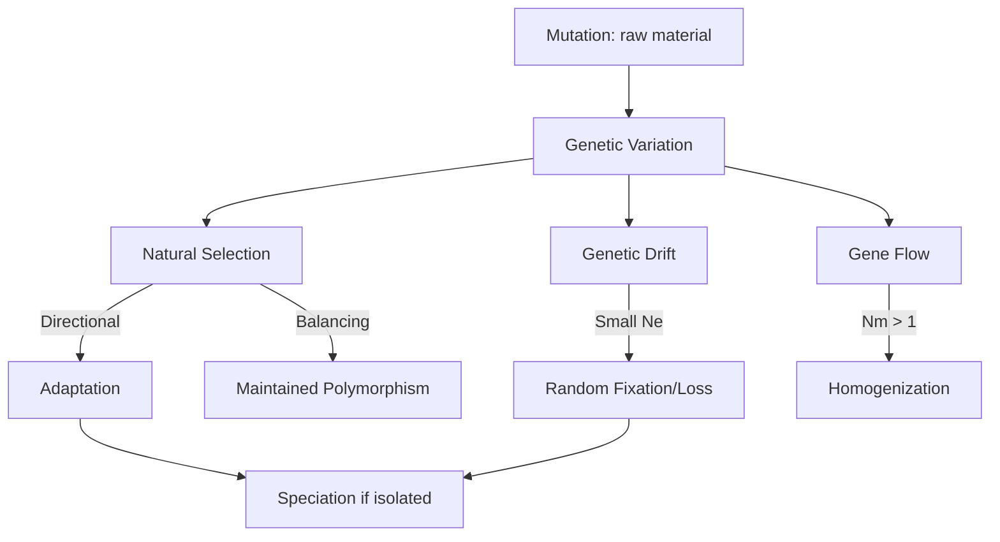
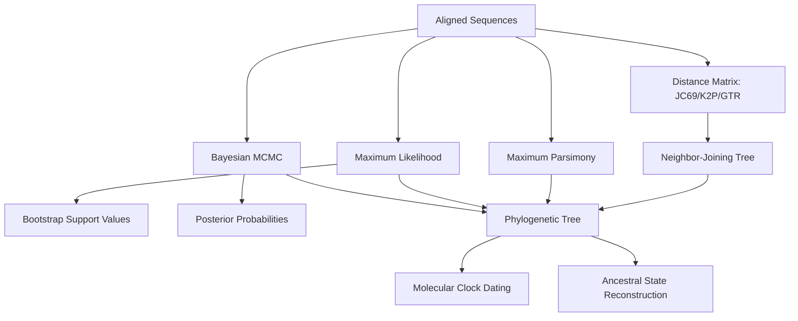
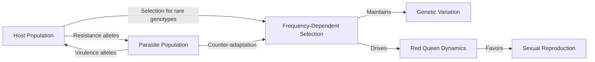

# Evolutionary Biology

Natural selection, drift, speciation, phylogenetics, molecular evolution, evo-devo, and sexual selection.

## References

- Futuyma, D.J. & Kirkpatrick, M. *Evolution*, 4th ed. Sinauer, 2017.
- Hartl, D.L. & Clark, A.G. *Principles of Population Genetics*, 4th ed. Sinauer, 2007.
- Ridley, M. *Evolution*, 3rd ed. Blackwell, 2004.

---

## Part I — Mechanisms of Evolution

### Week 1: Natural Selection

**Fitness** ($w$): relative reproductive success of a genotype. **Selection coefficient** $s = 1 - w$ for the disfavored genotype.

For a biallelic locus (alleles $A_1$ at frequency $p$, $A_2$ at frequency $q = 1 - p$) with fitnesses $w_{11}, w_{12}, w_{22}$:

**Mean fitness:**

$$\bar{w} = p^2 w_{11} + 2pq w_{12} + q^2 w_{22}$$

**Change in allele frequency** (general form):

$$\Delta p = \frac{pq[p(w_{11} - w_{12}) + q(w_{12} - w_{22})]}{2\bar{w}}$$

For selection against a recessive ($w_{11} = w_{12} = 1$, $w_{22} = 1 - s$):

$$\Delta p = \frac{spq^2}{1 - sq^2}$$

**Types of selection:**
- **Directional:** one extreme favored (shifts mean).
- **Stabilizing:** intermediate optimum (reduces variance).
- **Disruptive:** both extremes favored (increases variance, can lead to speciation).
- **Balancing:** heterozygote advantage (overdominance), frequency-dependent selection.

**Heterozygote advantage** equilibrium: $\hat{p} = \frac{s_2}{s_1 + s_2}$ (e.g., sickle cell: $s_1$ = anemia cost, $s_2$ = malaria susceptibility).

### Week 2: Genetic Drift & Neutral Theory

**Drift:** stochastic change in allele frequencies due to finite population size.

- Probability of fixation of a new neutral mutation: $\frac{1}{2N}$.
- Rate of neutral substitution: $k = \mu$ (substitution rate equals mutation rate — Kimura's key insight).
- Time to fixation of a neutral allele (given fixation): $\bar{t} = 4N_e$ generations.

**Effective population size** $N_e$ — accounts for unequal sex ratios, variance in offspring number, fluctuating $N$:

$$\frac{1}{N_e} = \frac{1}{t}\sum_{i=1}^{t}\frac{1}{N_i} \quad \text{(harmonic mean for fluctuating size)}$$

**Nearly neutral theory** (Ohta): mutations with $|s| < 1/(2N_e)$ behave as effectively neutral.

### Week 3: Mutation & Migration

**Mutation rate:** $\mu \sim 10^{-8}$ per bp per generation in humans ($\sim 1$--$2$ de novo mutations per cell division).

**Mutation-selection balance:**
- Deleterious recessive: $\hat{q} = \sqrt{\mu / s}$
- Deleterious dominant: $\hat{p} = \mu / (hs)$ where $h$ is dominance coefficient.

**Migration (gene flow):** Homogenizes allele frequencies. One-island model:

$$F_{ST} \approx \frac{1}{1 + 4N_e m}$$

Even $N_e m > 1$ (one migrant per generation) substantially reduces differentiation.

---

## Part II — Speciation & Phylogenetics

### Week 4: Speciation

**Biological species concept** (Mayr): groups of actually or potentially interbreeding natural populations reproductively isolated from other such groups.

**Modes:**
- **Allopatric:** geographic barrier splits population → independent divergence → reproductive isolation.
- **Peripatric:** small peripheral population diverges (founder effect + drift + selection).
- **Parapatric:** adjacent populations diverge despite limited gene flow (hybrid zone).
- **Sympatric:** speciation without geographic isolation (e.g., host shifts in phytophagous insects, disruptive selection + assortative mating).

**Reproductive barriers:**
- *Prezygotic:* habitat isolation, temporal isolation, behavioral isolation, mechanical isolation, gametic incompatibility.
- *Postzygotic:* hybrid inviability, hybrid sterility (Haldane's rule: heterogametic sex affected first), hybrid breakdown.

**Dobzhansky-Muller incompatibilities:** epistatic interactions between derived alleles at different loci cause hybrid dysfunction. Number of incompatibilities grows at least as $\binom{n}{2}$ with $n$ substitutions → "snowball effect."

### Week 5: Phylogenetics

**Molecular clock hypothesis** (Zuckerkandl & Pauling): rate of molecular substitution is approximately constant over time for a given protein.

**Substitution models:**
- **JC69** (Jukes-Cantor): equal rates among all substitutions. Distance:

$$d = -\frac{3}{4}\ln\left(1 - \frac{4}{3}p\right)$$

where $p$ = proportion of differing sites.

- **K2P** (Kimura two-parameter): transitions ($\alpha$) ≠ transversions ($\beta$).
- **GTR** (General Time Reversible): most general model with 6 rate parameters + base frequencies.

**Tree reconstruction:**
- **Distance methods:** UPGMA (ultrametric), Neighbor-Joining (allows rate variation).
- **Maximum Parsimony:** minimize total character changes.
- **Maximum Likelihood:** find tree + branch lengths maximizing $P(\text{data} | \text{tree}, \text{model})$.
- **Bayesian (MCMC):** posterior probability of trees; MrBayes, BEAST.
- **Bootstrap support:** resample columns → fraction of replicates recovering a clade.

---

## Part III — Evo-Devo & Molecular Evolution

### Week 6: Evolutionary Developmental Biology

**Hox genes:** Highly conserved transcription factors with homeobox domains. Collinear expression along anterior-posterior axis. Duplication and divergence of Hox clusters (1 in insects → 4 in vertebrates) enabled body plan elaboration.

**Cis-regulatory element (CRE) evolution:** Changes in enhancers/promoters alter gene expression patterns without disrupting protein function. Examples:
- *Pitx1* pelvic enhancer loss → stickleback pelvic reduction.
- *Shh* limb enhancer (*ZRS*) mutations → polydactyly.
- Wing spot patterns in Drosophila: *yellow* CRE gains/losses.

**Developmental constraint vs. evolvability:** Body plan features (phylum-level) are highly conserved; within-body-plan variation is extensive. Phylotypic stage ("hourglass model") shows maximum conservation mid-embryogenesis.

### Week 7: Molecular Evolution

**Neutral theory** (Kimura, 1968): Most molecular substitutions are selectively neutral.

- Rate of neutral substitution: $k = \mu$ (independent of population size).
- Rate of adaptive substitution: $k_a = 2N_e \mu \cdot 2s \cdot \frac{1}{1-e^{-4N_e s}}$ for beneficial mutations.

**dN/dS ratio ($\omega$):**
- $\omega < 1$: purifying selection (most genes).
- $\omega = 1$: neutral evolution.
- $\omega > 1$: positive selection (e.g., MHC genes, viral coat proteins).

**McDonald-Kreitman test:** Compare ratio of nonsynonymous-to-synonymous fixed differences (between species) vs. polymorphisms (within species). Excess fixed nonsynonymous = positive selection.

### Week 8: Sexual Selection & Coevolution

**Sexual selection** (Darwin): selection arising from variation in mating success.
- **Intrasexual:** competition (antlers, fighting → armaments).
- **Intersexual:** mate choice (peacock tails → ornaments).
- **Fisher's runaway:** female preference + male trait co-evolve in positive feedback.
- **Handicap principle** (Zahavi): costly signals honestly indicate quality.
- **Good genes:** ornaments correlate with parasite resistance (Hamilton-Zuk hypothesis).

**Coevolution:**
- **Mutualism:** fig-fig wasp, mycorrhizal networks.
- **Antagonistic:** Red Queen hypothesis — host-parasite arms race drives frequency-dependent selection, maintaining genetic variation.
- **Diffuse coevolution:** involving multiple species (e.g., Müllerian mimicry rings).

---

## Key Equations Summary

| Concept | Equation |
|---------|----------|
| Mean fitness | $\bar{w} = p^2w_{11} + 2pqw_{12} + q^2w_{22}$ |
| $\Delta p$ (general) | $pq[p(w_{11}-w_{12})+q(w_{12}-w_{22})]/(2\bar{w})$ |
| Neutral substitution rate | $k = \mu$ |
| JC69 distance | $d = -\frac{3}{4}\ln(1-\frac{4}{3}p)$ |
| $F_{ST}$ (island model) | $1/(1+4N_em)$ |
| Fixation probability (neutral) | $1/(2N)$ |
| Time to fixation (neutral) | $4N_e$ generations |
| dN/dS | $\omega > 1$ positive, $< 1$ purifying |
