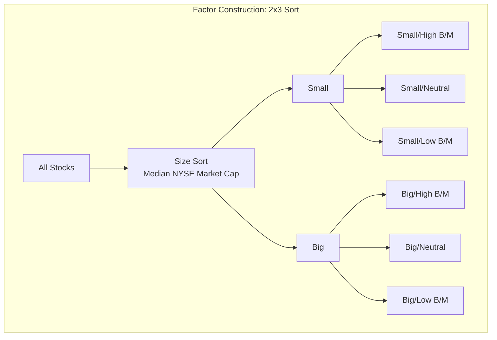
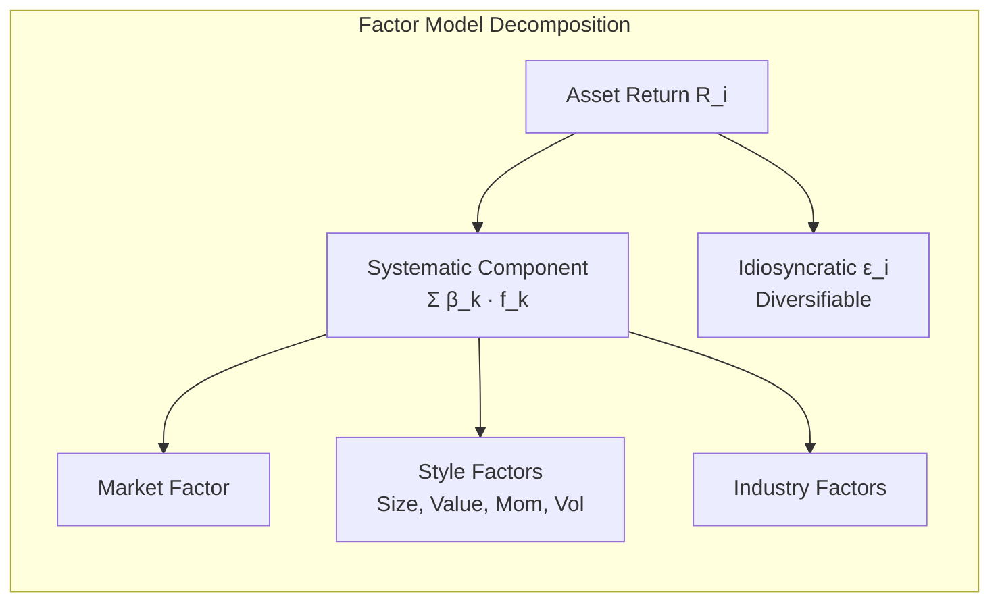
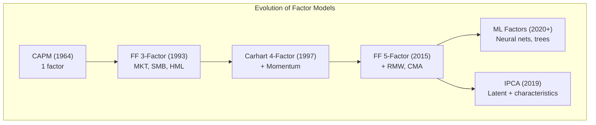

# Factor Models in Asset Pricing

## Part I: The Fama-French Three-Factor Model

### Model Specification

$$R_i - R_f = \alpha_i + \beta_{m} \cdot MKT_t + \beta_{s} \cdot SMB_t + \beta_{h} \cdot HML_t + \epsilon_{it}$$

where:
- $MKT_t = R_m - R_f$ (market excess return)
- $SMB_t$ = Small Minus Big (size premium)
- $HML_t$ = High Minus Low (value premium, based on book-to-market)

### Factor Construction

**SMB (Size):** Sort all stocks by market cap into Small and Big. SMB = average return of small portfolios $-$ average return of big portfolios.

**HML (Value):** Sort by book-to-market (B/M) into High, Medium, Low (30/40/30 breakpoints). HML = average return of High B/M $-$ average return of Low B/M.

Portfolios are formed as $2 \times 3$ sorts (size $\times$ B/M) to control for the other factor.

### Historical Premia (US, 1926-2023, annualized)

| Factor | Average | Std Dev | Sharpe |
|---|---|---|---|
| MKT | ~8.0% | ~20% | ~0.40 |
| SMB | ~3.0% | ~11% | ~0.27 |
| HML | ~4.0% | ~12% | ~0.33 |

## Part II: Extensions — Carhart 4-Factor and FF 5-Factor

### Carhart Four-Factor Model

$$R_i - R_f = \alpha_i + \beta_m MKT + \beta_s SMB + \beta_h HML + \beta_u UMD + \epsilon_i$$

$UMD$ (Up Minus Down) = momentum factor. Long past 12-month winners (excluding most recent month), short past losers.

Momentum premium: ~7-8% annualized historically, but subject to crashes (e.g., 2009).

### Fama-French Five-Factor Model (2015)

$$R_i - R_f = \alpha_i + \beta_m MKT + \beta_s SMB + \beta_h HML + \beta_r RMW + \beta_c CMA + \epsilon_i$$

- $RMW$ = Robust Minus Weak (profitability: operating profitability high $-$ low)
- $CMA$ = Conservative Minus Aggressive (investment: low asset growth $-$ high)

Key finding: HML becomes redundant when RMW and CMA are included (HML is spanned by the other factors).

### Hou-Xue-Zhang q-Factor Model

Alternative four-factor model motivated by investment-based asset pricing:
- Market, Size, Investment ($I/A$), Profitability ($ROE$)

## Part III: Barra Risk Models

### Multi-Factor Risk Models

Barra (now MSCI) models decompose returns into:

$$R_i = \sum_{k=1}^{K} X_{ik} f_k + \epsilon_i$$

where $X_{ik}$ = exposure of asset $i$ to factor $k$ (known), $f_k$ = factor return (estimated).

### Factor Categories

| Category | Examples |
|---|---|
| **Country** | US, UK, Japan, etc. |
| **Industry** | Technology, Financials, Healthcare, etc. |
| **Style** | Size, Value, Momentum, Volatility, Quality, Leverage, Liquidity, Growth |

### Covariance Estimation

Factor model reduces dimensionality of the covariance matrix:

$$\Sigma = X F X^T + D$$

where $F$ = $K \times K$ factor covariance matrix, $D$ = diagonal specific risk matrix. Estimating $K^2/2 + n$ parameters instead of $n^2/2$.

## Part IV: Cross-Sectional Testing — Fama-MacBeth

### Two-Pass Regression

**Pass 1 — Time-Series:** For each asset $i$, regress returns on factors to estimate betas:

$$R_{it} - R_{ft} = \alpha_i + \beta_{i1}f_{1t} + \ldots + \beta_{iK}f_{Kt} + \epsilon_{it}$$

**Pass 2 — Cross-Sectional:** For each month $t$, regress returns on estimated betas:

$$R_{it} = \gamma_{0t} + \gamma_{1t}\hat{\beta}_{i1} + \ldots + \gamma_{Kt}\hat{\beta}_{iK} + \eta_{it}$$

Factor risk premia estimated as time-series averages: $\hat{\lambda}_k = \frac{1}{T}\sum_{t=1}^{T} \hat{\gamma}_{kt}$

Standard errors: $\text{SE}(\hat{\lambda}_k) = \frac{s(\hat{\gamma}_{kt})}{\sqrt{T}}$

### Errors-in-Variables (EIV) Problem
- Estimated betas from Pass 1 contain measurement error
- Attenuates Pass 2 slope estimates toward zero
- Solution: use portfolio betas (portfolio sorts reduce EIV) or Shanken correction

### GRS Test

Gibbons-Ross-Shanken test for joint significance of all alphas:

$$\text{GRS} = \frac{T-N-K}{N}\frac{1}{1+\hat{\mu}'^T\hat{\Sigma}_f^{-1}\hat{\mu}'}\hat{\alpha}'^T\hat{\Sigma}_\epsilon^{-1}\hat{\alpha}' \sim F(N, T-N-K)$$

Reject if GRS statistic is too large — model's factors do not fully explain the cross-section.

## Part V: Factor Timing and Crowding

### Factor Timing

Can factor premia be predicted? Potential signals:
- **Valuation spreads:** Value premium higher when HML spread is wide
- **Macro conditions:** Momentum crashes in recessions (high market volatility)
- **Sentiment:** Factors driven by mispricing may be stronger after high sentiment periods

Evidence is mixed. Most factor timing strategies have limited out-of-sample success.

### Factor Crowding

When too many investors pursue the same factor strategy:
- Factor valuations compress (lower expected future returns)
- Unwinding risk increases (crowded exits amplify drawdowns)
- Monitoring: short interest, position overlap, factor valuation spreads

### Transaction Costs and Implementation

$$\text{Net Alpha} = \text{Gross Alpha} - \text{Transaction Costs} - \text{Market Impact}$$

High-turnover factors (momentum) have higher implementation costs than low-turnover (value). Optimal portfolios trade off signal strength vs trading costs.

## Part VI: The Factor Zoo and Machine Learning

### The Replication Crisis

Harvey, Liu, and Zhu (2016): over 300 published factors. Many likely false discoveries due to:
- Data mining / p-hacking
- Publication bias (positive results more publishable)
- Multiple testing without correction

Proposed solutions: higher $t$-stat thresholds ($t > 3.0$ instead of $t > 2.0$), out-of-sample testing, economic rationale required.

### Machine Learning Approaches

| Method | Application |
|---|---|
| LASSO/Elastic Net | Factor selection from large candidate set |
| Random Forests | Non-linear return prediction |
| Neural Networks | Complex interactions between characteristics |
| PCA | Extract latent factors from return covariance |
| Autoencoders | Non-linear dimensionality reduction |

Gu, Kelly, and Xiu (2020): ML methods (especially neural nets and gradient-boosted trees) significantly outperform linear models in predicting cross-sectional returns.

### Instrumented PCA (IPCA)

Kelly, Pruitt, and Su (2019): latent factor model where loadings vary with observable characteristics:

$$R_{it} = \alpha_i + \beta_{it}' f_t + \epsilon_{it}, \quad \beta_{it} = Z_{it}' \Gamma$$

Bridges characteristics-based and factor-based approaches.

## References

- Cochrane, J.H. *Asset Pricing* (Revised ed.). Princeton University Press.
- Ang, A. *Asset Management: A Systematic Approach to Factor Investing*. Oxford University Press.
- Bali, T.G., Engle, R.F., & Murray, S. *Empirical Asset Pricing: The Cross Section of Stock Returns*. Wiley.
- Fama, E.F. & French, K.R. (1993). "Common Risk Factors in the Returns on Stocks and Bonds." *JFE*, 33(1).
- Fama, E.F. & French, K.R. (2015). "A Five-Factor Asset Pricing Model." *JFE*, 116(1).
- Harvey, C.R., Liu, Y., & Zhu, H. (2016). "...and the Cross-Section of Expected Returns." *RFS*, 29(1).
- Gu, S., Kelly, B., & Xiu, D. (2020). "Empirical Asset Pricing via Machine Learning." *RFS*, 33(5).
