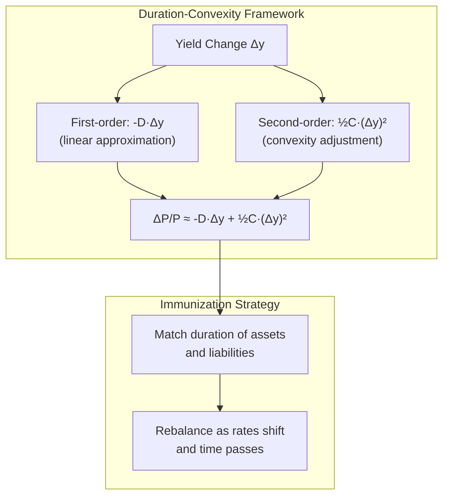
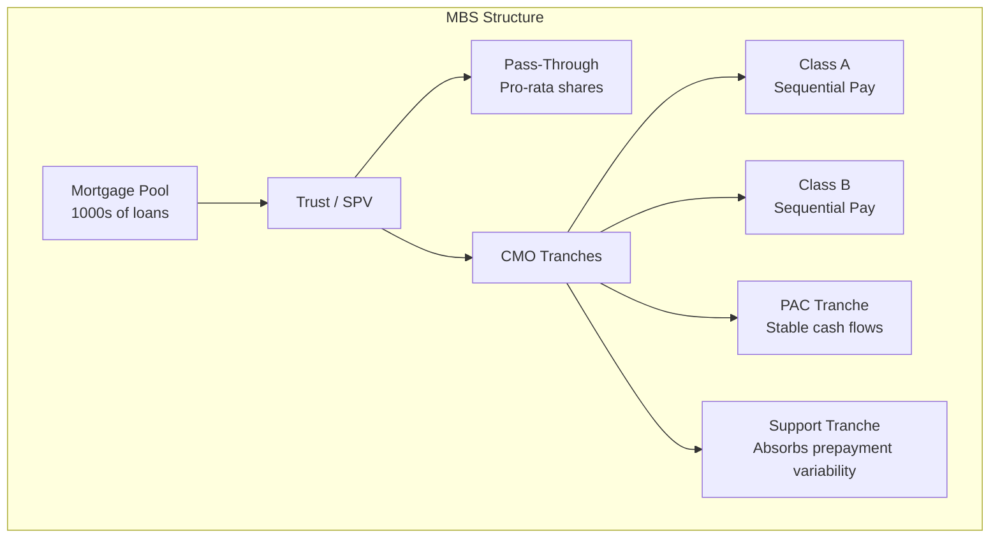

# Fixed Income Securities

## Part I: Bond Pricing Fundamentals

### Present Value of Cash Flows

The price of a bond paying coupon $C$ semiannually with face value $F$, maturity $n$ periods, and yield $y$ per period:

$$P = \sum_{t=1}^{n} \frac{C}{(1+y)^t} + \frac{F}{(1+y)^n}$$

For a par bond ($P = F$), coupon rate equals yield. Premium bonds have coupon > yield; discount bonds have coupon < yield.

### Clean vs Dirty Price

$$\text{Dirty Price} = \text{Clean Price} + \text{Accrued Interest}$$

$$\text{Accrued Interest} = C \times \frac{\text{Days since last coupon}}{\text{Days in coupon period}}$$

Day-count conventions: 30/360 (corporate), ACT/ACT (Treasuries), ACT/360 (money market).

### Yield Measures

- **Current yield**: $\text{CY} = C_{\text{annual}} / P$
- **Yield to maturity (YTM)**: IRR of bond cash flows
- **Yield to call (YTC)**: YTM assuming call at first call date
- **Yield to worst (YTW)**: $\min(\text{YTM}, \text{YTC}_1, \text{YTC}_2, \ldots)$

## Part II: Spot Rates, Forward Rates, and the Yield Curve

### Spot Rates (Zero Rates)

The spot rate $s_t$ is the yield on a zero-coupon bond maturing at time $t$. A coupon bond's price using spot rates:

$$P = \sum_{t=1}^{n} \frac{C}{(1+s_t)^t} + \frac{F}{(1+s_n)^n}$$

Bootstrap method extracts spot rates from par yields of coupon bonds.

### Forward Rates

The forward rate $f(t_1, t_2)$ is the rate agreed today for borrowing from $t_1$ to $t_2$:

$$f(t_1,t_2) = \frac{(1+s_{t_2})^{t_2}/(1+s_{t_1})^{t_1} - 1}{t_2 - t_1}$$

In continuous compounding: $f(t_1,t_2) = \frac{s_{t_2} t_2 - s_{t_1} t_1}{t_2 - t_1}$

```mermaid
graph LR
    subgraph "Yield Curve Construction"
        A[Market Prices<br/>Treasuries, Swaps] --> B[Bootstrap<br/>Strip Coupons]
        B --> C[Spot Rate Curve<br/>s_1, s_2, ..., s_n]
        C --> D[Forward Rate Curve<br/>f_1,2, f_2,3, ...]
        C --> E[Discount Factors<br/>d_t = 1/(1+s_t)^t]
    end
```

### Term Structure Theories

| Theory | Implication |
|---|---|
| **Expectations Hypothesis** | $f(t_1,t_2) = E[s_{t_1,t_2}]$; forward = expected future spot |
| **Liquidity Preference** | $f(t_1,t_2) = E[s_{t_1,t_2}] + L_{t_2}$; long rates biased upward |
| **Segmented Markets** | Supply/demand in each maturity segment; no arbitrage linkage |

## Part III: Duration and Convexity

### Macaulay Duration

Weighted average time to receive cash flows:

$$D_{\text{mac}} = \sum_{t=1}^{n} \frac{t \cdot CF_t / (1+y)^t}{P}$$

### Modified Duration

Sensitivity of price to yield changes:

$$D_{\text{mod}} = -\frac{1}{P}\frac{dP}{dy} = \frac{D_{\text{mac}}}{1+y}$$

For small yield changes: $\frac{\Delta P}{P} \approx -D_{\text{mod}} \cdot \Delta y$

### Effective Duration (for bonds with embedded options)

$$D_{\text{eff}} = \frac{P_{y-\Delta y} - P_{y+\Delta y}}{2 \cdot P \cdot \Delta y}$$

### Convexity

Second-order price sensitivity:

$$C = \frac{1}{P}\frac{d^2P}{dy^2} = \frac{1}{P}\sum_{t=1}^{n}\frac{t(t+1) \cdot CF_t}{(1+y)^{t+2}}$$

### Price Approximation (Duration + Convexity)

$$\Delta P \approx -D_{\text{mod}} \cdot P \cdot \Delta y + \frac{1}{2} C \cdot P \cdot (\Delta y)^2$$

Convexity is always positive for option-free bonds (price-yield relationship is convex). Investors prefer higher convexity.



## Part IV: Credit Risk in Fixed Income

### Credit Spreads

$$\text{Credit Spread} = y_{\text{corporate}} - y_{\text{Treasury}}$$

Components: expected default loss + credit risk premium + liquidity premium + tax effects.

### Credit Ratings

| Moody's | S&P/Fitch | Grade |
|---|---|---|
| Aaa | AAA | Investment |
| Aa1-Aa3 | AA+/AA/AA- | Investment |
| A1-A3 | A+/A/A- | Investment |
| Baa1-Baa3 | BBB+/BBB/BBB- | Investment |
| Ba1-Ba3 | BB+/BB/BB- | Speculative |
| B1-B3 | B+/B/B- | Speculative |
| Caa-C | CCC-D | Distressed |

### Default Probability and Recovery

$$\text{Spread} \approx \text{PD} \times \text{LGD} = \text{PD} \times (1 - \text{Recovery Rate})$$

Historical recovery rates: Senior secured ~65%, Senior unsecured ~45%, Subordinated ~30%.

## Part V: Mortgage-Backed Securities

### Prepayment Risk

Homeowners can prepay mortgages at any time (embedded call option for borrower). Key measures:

**CPR (Conditional Prepayment Rate):** annualized fraction of remaining principal prepaid.

**SMM (Single Monthly Mortality):**

$$\text{SMM} = 1 - (1 - \text{CPR})^{1/12}$$

**PSA Model:** PSA 100% assumes CPR ramps linearly from 0% to 6% over first 30 months, then stays at 6%. PSA 200% doubles the rate.

### Pass-Through Securities

Investors receive pro-rata share of principal and interest (minus servicing fee). Subject to:
- **Contraction risk** — rates fall, prepayments accelerate, average life shortens
- **Extension risk** — rates rise, prepayments slow, average life extends

### CMO Tranching

Sequential-pay, PAC (Planned Amortization Class), support/companion tranches designed to redistribute prepayment risk.

### Option-Adjusted Spread (OAS)

$$\text{OAS} = \text{Z-spread} - \text{Option Cost}$$

OAS measures compensation above Treasury after removing the value of embedded options. Computed via Monte Carlo simulation of interest rate paths.



## Part VI: Asset-Backed Securities

### ABS Structures
- **Auto loan ABS** — amortizing, short duration, low prepayment
- **Credit card ABS** — revolving, controlled amortization
- **Student loan ABS (SLABS)** — government-guaranteed or private
- **CLOs (Collateralized Loan Obligations)** — pools of leveraged loans, tranched

### Credit Enhancement
- Subordination (junior tranches absorb losses first)
- Overcollateralization
- Excess spread
- Reserve accounts
- Monoline insurance (wraps)

## References

- Fabozzi, F.J. *Fixed Income Analysis* (4th ed.). CFA Institute / Wiley.
- Tuckman, B. & Serrat, A. *Fixed Income Securities* (3rd ed.). Wiley.
- Hull, J.C. *Options, Futures, and Other Derivatives* (11th ed.). Pearson.
- Sundaresan, S.M. *Fixed Income Markets and Their Derivatives* (4th ed.). Academic Press.
