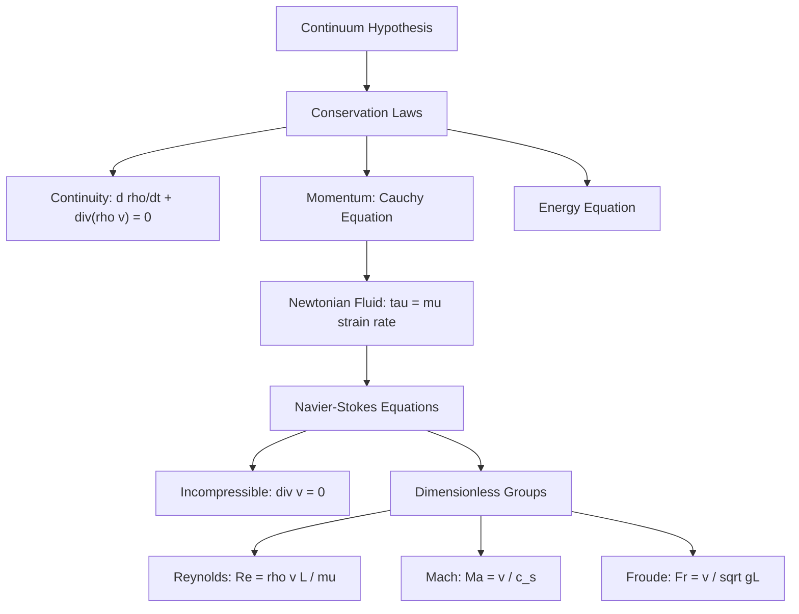
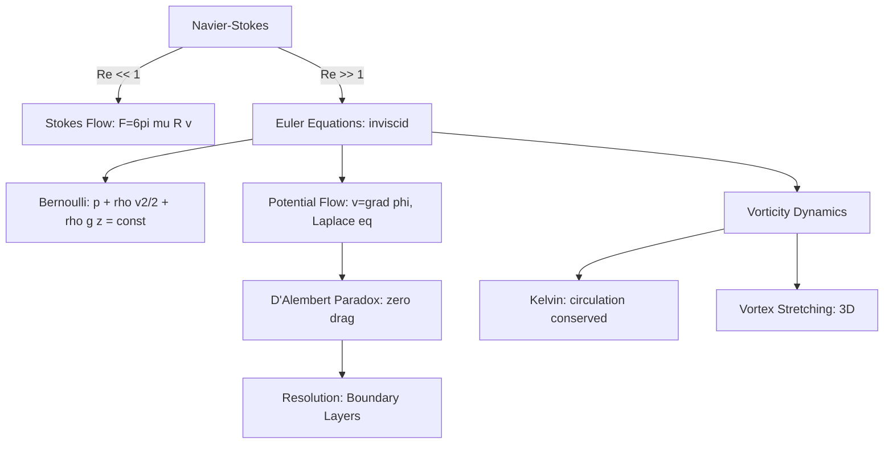
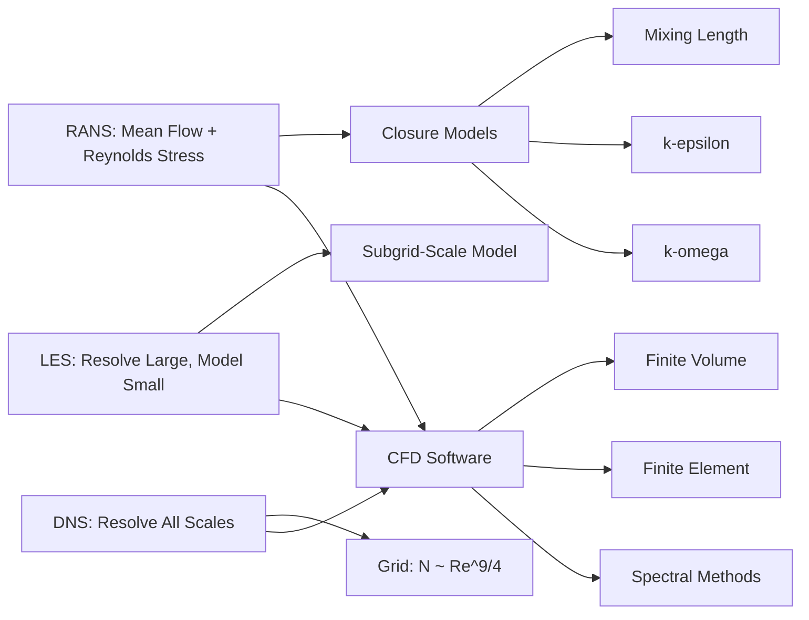

# Fluid Mechanics

## References

- Batchelor, G.K. *An Introduction to Fluid Dynamics* (Cambridge, 2000)
- Kundu, P.K. & Cohen, I.M. *Fluid Mechanics*, 6th ed. (Academic Press, 2015)
- Landau, L.D. & Lifshitz, E.M. *Fluid Mechanics* (Course of Theoretical Physics, Vol. 6), 2nd ed. (Butterworth-Heinemann, 1987)

---

## Part I: Fundamentals (Weeks 1-3)

### Continuum Hypothesis

A fluid element is small compared to macroscopic scales but large enough to contain many molecules. Valid when Knudsen number $Kn = \lambda/L \ll 1$ (mean free path $\lambda$ vs. characteristic length $L$).

### Fluid Properties

**Density**: $\rho$ (kg/m$^3$). **Viscosity**: dynamic $\mu$ (Pa$\cdot$s), kinematic $\nu = \mu/\rho$ (m$^2$/s). **Compressibility**: bulk modulus $K = -V(dP/dV)$; speed of sound $c_s = \sqrt{K/\rho}$.

### Kinematics

**Eulerian description**: field quantities $\mathbf{v}(\mathbf{r},t)$, $\rho(\mathbf{r},t)$, $p(\mathbf{r},t)$.

**Material derivative**: $\frac{D}{Dt} = \frac{\partial}{\partial t} + \mathbf{v}\cdot\nabla$

Velocity gradient tensor: $\partial v_i/\partial x_j = e_{ij} + \omega_{ij}$ where $e_{ij} = \frac{1}{2}(\partial_i v_j + \partial_j v_i)$ is the strain rate tensor and $\omega_{ij} = \frac{1}{2}(\partial_i v_j - \partial_j v_i)$ is the rotation tensor.

### Conservation Laws

**Mass** (continuity equation):

$$\frac{\partial\rho}{\partial t} + \nabla\cdot(\rho\mathbf{v}) = 0$$

For incompressible flow ($\rho = \text{const}$): $\nabla\cdot\mathbf{v} = 0$

**Momentum** (Cauchy's equation):

$$\rho\frac{D\mathbf{v}}{Dt} = \nabla\cdot\boldsymbol{\sigma} + \rho\mathbf{g}$$

where $\boldsymbol{\sigma}$ is the stress tensor.

### The Navier-Stokes Equations

For a Newtonian, incompressible fluid:

$$\rho\left(\frac{\partial\mathbf{v}}{\partial t} + \mathbf{v}\cdot\nabla\mathbf{v}\right) = -\nabla p + \mu\nabla^2\mathbf{v} + \mathbf{f}$$

Together with $\nabla\cdot\mathbf{v} = 0$. This is 4 equations (3 momentum + 1 continuity) for 4 unknowns ($v_x, v_y, v_z, p$).

The Navier-Stokes existence and smoothness problem (in 3D) is one of the Clay Millennium Prize Problems.

### Dimensionless Parameters

**Reynolds number**: $Re = \frac{\rho v L}{\mu} = \frac{vL}{\nu}$ (inertia/viscous forces)

- $Re \ll 1$: Stokes flow (viscous dominated)
- $Re \sim 10^3$-$10^5$: transition to turbulence
- $Re \gg 1$: turbulent (in general)

Other key numbers: Mach ($Ma = v/c_s$), Froude ($Fr = v/\sqrt{gL}$), Strouhal ($St = fL/v$), Weber ($We = \rho v^2 L/\sigma$).

---

## Part II: Exact Solutions and Inviscid Flow (Weeks 4-7)

### Exact Solutions of Navier-Stokes

**Couette flow** (flow between parallel plates, top plate moving at $U$):

$$v_x(y) = U\frac{y}{h}, \qquad \tau = \mu\frac{U}{h}$$

**Poiseuille flow** (pressure-driven flow in a pipe of radius $R$):

$$v_z(r) = \frac{1}{4\mu}\left(-\frac{dp}{dz}\right)(R^2 - r^2), \qquad Q = \frac{\pi R^4}{8\mu}\left(-\frac{dp}{dz}\right)$$

Hagen-Poiseuille law: $\Delta p = 8\mu L Q/(\pi R^4)$.

**Stokes flow** ($Re \ll 1$): linearized N-S. Stokes drag on a sphere: $F = 6\pi\mu R v$.

### Bernoulli's Equation

For steady, inviscid, incompressible flow along a streamline:

$$p + \frac{1}{2}\rho v^2 + \rho g z = \text{const}$$

Applications: Venturi meter, Pitot tube, flow over airfoils, Torricelli's law ($v = \sqrt{2gh}$).

### Potential Flow

Irrotational flow: $\nabla\times\mathbf{v} = 0$, so $\mathbf{v} = \nabla\phi$ where $\nabla^2\phi = 0$ (Laplace equation).

Stream function $\psi$ (2D, incompressible): $v_x = \partial\psi/\partial y$, $v_y = -\partial\psi/\partial x$.

Elementary flows: uniform stream, source/sink, vortex, doublet. Superposition gives flow around bodies.

**D'Alembert's paradox**: potential flow around a body predicts zero drag — resolved by boundary layer theory.

### Vorticity

Vorticity vector: $\boldsymbol{\omega} = \nabla\times\mathbf{v}$

Vorticity equation (incompressible):

$$\frac{D\boldsymbol{\omega}}{Dt} = (\boldsymbol{\omega}\cdot\nabla)\mathbf{v} + \nu\nabla^2\boldsymbol{\omega}$$

The $(\boldsymbol{\omega}\cdot\nabla)\mathbf{v}$ term represents vortex stretching (absent in 2D).

**Kelvin's circulation theorem** (inviscid, barotropic): $\frac{D\Gamma}{Dt} = 0$ where $\Gamma = \oint\mathbf{v}\cdot d\mathbf{l}$.

**Helmholtz vortex theorems**: vortex lines move with the fluid, strength of a vortex tube is constant along its length, vortex lines cannot end in the fluid.

---

## Part III: Boundary Layers and Transition (Weeks 8-10)

### Prandtl Boundary Layer Theory

At high $Re$, viscous effects are confined to a thin boundary layer of thickness $\delta \sim L/\sqrt{Re}$.

Boundary layer equations (2D, steady, incompressible):

$$u\frac{\partial u}{\partial x} + v\frac{\partial u}{\partial y} = -\frac{1}{\rho}\frac{dp}{dx} + \nu\frac{\partial^2 u}{\partial y^2}$$

$$\frac{\partial u}{\partial x} + \frac{\partial v}{\partial y} = 0$$

### Blasius Solution

Flat plate boundary layer (zero pressure gradient). Similarity variable $\eta = y\sqrt{U/(2\nu x)}$.

$$\delta_{99} \approx \frac{5.0x}{\sqrt{Re_x}}, \qquad c_f = \frac{0.664}{\sqrt{Re_x}}$$

Displacement thickness: $\delta^* = \int_0^\infty(1 - u/U)\,dy$. Momentum thickness: $\theta = \int_0^\infty\frac{u}{U}\left(1 - \frac{u}{U}\right)dy$.

### Separation and Adverse Pressure Gradient

When $dp/dx > 0$, the boundary layer decelerates. Separation occurs when $(\partial u/\partial y)_{y=0} = 0$. Flow reversal and wake formation follow.

### Laminar-Turbulent Transition

Critical Reynolds number for pipe flow: $Re_c \approx 2300$. For flat plate: $Re_{x,c} \approx 5 \times 10^5$.

Tollmien-Schlichting waves: linear instability of boundary layer. Nonlinear growth leads to turbulence.

---

## Part IV: Turbulence (Weeks 11-13)

### Reynolds Decomposition

Decompose: $\mathbf{v} = \overline{\mathbf{v}} + \mathbf{v}'$ (mean + fluctuation).

Reynolds-averaged Navier-Stokes (RANS):

$$\rho\overline{v}_j\frac{\partial\overline{v}_i}{\partial x_j} = -\frac{\partial\overline{p}}{\partial x_i} + \mu\nabla^2\overline{v}_i - \rho\frac{\partial\overline{v'_iv'_j}}{\partial x_j}$$

The Reynolds stress tensor $-\rho\overline{v'_iv'_j}$ represents turbulent momentum transport. This introduces more unknowns than equations — the **closure problem**.

### Kolmogorov Theory (K41)

At sufficiently high $Re$, there exists an inertial subrange between the energy-containing scales and the dissipation scales.

Energy cascade: energy injected at large scales $L$, cascaded down, dissipated at the Kolmogorov microscale:

$$\eta = \left(\frac{\nu^3}{\epsilon}\right)^{1/4}$$

where $\epsilon$ is the energy dissipation rate per unit mass.

**Kolmogorov energy spectrum**: $E(k) = C_K\epsilon^{2/3}k^{-5/3}$ (inertial subrange).

Scale separation: $L/\eta \sim Re^{3/4}$. Kolmogorov velocity: $v_\eta = (\nu\epsilon)^{1/4}$.

### Turbulence Modeling

| Model | Description | Complexity |
|-------|------------|------------|
| Mixing length (Prandtl) | $\nu_t = l_m^2|\partial\overline{u}/\partial y|$ | Algebraic |
| $k$-$\epsilon$ model | Transport eqs for $k$ and $\epsilon$ | 2-equation |
| $k$-$\omega$ model | Transport eqs for $k$ and $\omega = \epsilon/k$ | 2-equation |
| Reynolds Stress Model | Transport eqs for $\overline{v'_iv'_j}$ | 7-equation |
| Large Eddy Simulation | Resolve large scales, model small | Computationally intensive |
| Direct Numerical Simulation | Resolve all scales | $N \sim Re^{9/4}$ grid points |

---

## Part V: Computational Fluid Dynamics Overview (Week 14)

### Discretization Methods

**Finite Difference**: approximate derivatives on structured grids. Simple but limited to regular geometries.

**Finite Volume**: integrate conservation laws over control volumes. Naturally conservative. Most widely used in CFD.

**Finite Element**: weak formulation, unstructured meshes. Flexible geometry handling.

**Spectral Methods**: expand in global basis functions (Fourier, Chebyshev). High accuracy for smooth problems.

### The CFD Pipeline

1. Geometry and mesh generation (structured, unstructured, adaptive)
2. Governing equations and boundary conditions
3. Spatial and temporal discretization
4. Solution of algebraic system (iterative solvers)
5. Post-processing and validation

### Stability and Accuracy

CFL condition (explicit time-stepping): $\Delta t \leq C\,\Delta x/v_{\max}$ where $C$ is the Courant number ($C \leq 1$ typically).

Numerical diffusion and dispersion: low-order schemes are diffusive; high-order schemes can be dispersive/oscillatory. Upwinding, limiters, and hybrid schemes balance accuracy and stability.

---

## Key Problem Types

1. **Exact solutions** — Couette, Poiseuille, Stokes drag, oscillating plate
2. **Bernoulli applications** — Venturi, Pitot tube, siphon, water jets
3. **Potential flow** — complex potential, flow around cylinders, lift (Kutta-Joukowski)
4. **Boundary layers** — Blasius profile, separation, drag estimation
5. **Dimensional analysis** — Buckingham Pi theorem, similarity solutions
6. **Turbulence** — energy spectrum, Kolmogorov scales, Reynolds stress
7. **CFD** — mesh convergence, CFL condition, validation against analytical solutions
