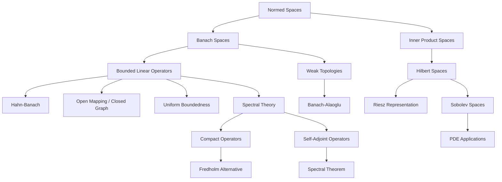
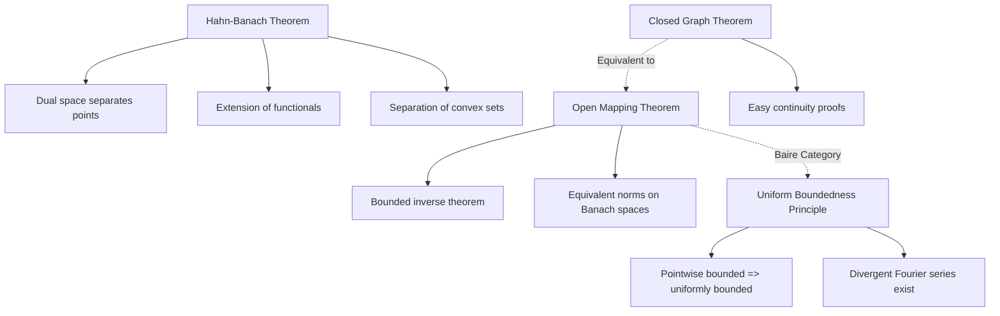

# Functional Analysis

> *Back to [[../math-syllabus|Mathematics Syllabus]]*
> *Related: [[complex-analysis]], [[topology]], [[differential-geometry]], [[information-theory]]*

---

## Concept Map

---

## 1. Motivation

Functional analysis is the study of infinite-dimensional vector spaces equipped with topological structure — the natural language for modern analysis, PDEs, quantum mechanics, and probability. It extends linear algebra to spaces of functions and provides the rigorous foundations for solving equations in infinitely many unknowns.

The central insight is that many problems in analysis (solving differential equations, optimizing functionals, understanding convergence of Fourier series) become transparent when viewed as linear algebra in the right infinite-dimensional space. The three pillars — the Hahn-Banach theorem, the open mapping theorem, and the uniform boundedness principle — are the tools that make this program work.

## 2. Prerequisites

- **Real analysis:** Lebesgue measure and integration, $L^p$ spaces, completeness.
- **Linear algebra:** Vector spaces, linear maps, eigenvalues, inner products.
- **Topology basics:** Metric spaces, compactness, continuity. See [[topology]].
- **Measure theory:** $\sigma$-algebras, measurable functions, convergence theorems.

---

## 3. Detailed Topic Outline

### Part I: Spaces

#### 3.1 Normed Spaces and Banach Spaces

- **Normed space:** a vector space $V$ with a norm $\|\cdot\|$ satisfying positivity, homogeneity, triangle inequality.
- **Banach space:** a complete normed space — every Cauchy sequence converges.
- **Key examples:**
  - $\mathbb{R}^n$ and $\mathbb{C}^n$ with any $p$-norm.
  - $C([a,b])$ with the sup norm — the space of continuous functions. Complete.
  - $L^p(X, \mu)$ for $1 \leq p \leq \infty$ — Banach spaces by the Riesz-Fischer theorem.
  - $\ell^p$ spaces (sequence spaces).
  - $C^k$ spaces, Holder spaces $C^{k,\alpha}$.
- **Schauder basis** vs. Hamel basis; separability.
- **Quotient spaces** and completions.
- **Baire category theorem:** a complete metric space is not a countable union of nowhere dense sets. Applications: existence of continuous nowhere-differentiable functions, existence of non-convergent Fourier series.

#### 3.2 Hilbert Spaces

- **Inner product spaces:** $\langle x, y \rangle$ satisfying linearity, conjugate symmetry, positive definiteness.
- **Hilbert space:** a complete inner product space.
- **Key examples:** $L^2(X, \mu)$, $\ell^2$, Sobolev spaces $H^s$.
- **Parallelogram law** characterizes inner product norms.
- **Orthogonality:** orthogonal complements, orthogonal projections.
- **Projection theorem:** every closed convex subset of a Hilbert space has a unique nearest point. Consequence: $H = M \oplus M^\perp$ for closed subspaces $M$.
- **Orthonormal bases (ONB):** Bessel's inequality, Parseval's identity, every separable Hilbert space is isomorphic to $\ell^2$.
- **Intuition:** Hilbert spaces are the infinite-dimensional spaces that behave most like $\mathbb{R}^n$, because the inner product gives us angles and projections.
- **Riesz Representation Theorem.** Every bounded linear functional on a Hilbert space $H$ is of the form $\varphi(x) = \langle x, y \rangle$ for a unique $y \in H$.
  - *Intuition:* The dual of a Hilbert space is itself — the nicest possible duality.

#### 3.3 $L^p$ Spaces in Depth

- Holder's inequality and Minkowski's inequality.
- Duality: $(L^p)^* \cong L^q$ for $1 \leq p < \infty$ (where $\frac{1}{p} + \frac{1}{q} = 1$).
- $L^\infty$ and its predual $L^1$; $(L^\infty)^*$ strictly larger than $L^1$.
- Density of smooth/compactly supported functions (mollification).
- Reflexivity: $L^p$ is reflexive for $1 < p < \infty$ but not for $p = 1, \infty$.

### Part II: Operators

#### 3.4 Bounded Linear Operators

- **Bounded $=$ continuous** for linear maps between normed spaces.
- **Operator norm:** $\|T\| = \sup_{\|x\|=1} \|Tx\|$.
- $B(X, Y) =$ space of bounded linear operators; a Banach space when $Y$ is Banach.
- The dual space $X^* = B(X, \mathbb{C})$ (or $B(X, \mathbb{R})$).
- Examples: integral operators, multiplication operators, shift operators.
- **Adjoint operator** $T^*$: defined by $\langle Tx, y \rangle = \langle x, T^*y \rangle$ in Hilbert spaces; more generally via dual spaces.

#### 3.5 The Three Pillars

##### Hahn-Banach Theorem
- **Statement (analytic form).** If $p$ is a sublinear functional on $X$, and $f$ is a linear functional defined on a subspace $M$ with $f \leq p$ on $M$, then $f$ extends to all of $X$ with $f \leq p$.
- **Corollary:** For any $x \in X$, there exists $\varphi \in X^*$ with $\varphi(x) = \|x\|$ and $\|\varphi\| = 1$.
- **Intuition:** You can always find enough continuous linear functionals to separate points. The dual space is "rich."
- **Geometric form:** Convex sets can be separated by hyperplanes.
- Applications: existence of invariant means, Banach limits.

##### Open Mapping Theorem (Banach-Schauder)
- **Statement.** A surjective bounded linear operator between Banach spaces is an open map.
- **Corollary (Bounded Inverse Theorem).** A bijective bounded linear operator between Banach spaces has a bounded inverse.
- **Intuition:** Completeness prevents surjective linear maps from collapsing open sets.

##### Closed Graph Theorem
- **Statement.** A linear operator $T: X \to Y$ between Banach spaces is bounded if and only if its graph $\{(x, Tx)\}$ is closed in $X \times Y$.
- **Intuition:** "Closed graph implies bounded" — a powerful tool for proving continuity without explicit estimates.
- **Uniform Boundedness Principle (Banach-Steinhaus).** If $\{T_\alpha\} \subset B(X,Y)$ satisfies $\sup_\alpha \|T_\alpha x\| < \infty$ for all $x$, then $\sup_\alpha \|T_\alpha\| < \infty$.
  - *Intuition:* Pointwise boundedness implies uniform boundedness — a Baire category consequence.
  - Application: divergence of Fourier series for some continuous functions.

### Part III: Spectral Theory

#### 3.6 Spectrum of a Bounded Operator

- **Resolvent set** $\rho(T) = \{\lambda \in \mathbb{C} : (T - \lambda I) \text{ is bijective with bounded inverse}\}$.
- **Spectrum** $\sigma(T) = \mathbb{C} \setminus \rho(T)$, decomposed into:
  - Point spectrum $\sigma_p(T)$ — eigenvalues.
  - Continuous spectrum — injective, dense range, unbounded inverse.
  - Residual spectrum — injective, non-dense range.
- Spectrum is compact, nonempty (for $T \neq 0$ on a complex Banach space).
- Spectral radius formula: $r(T) = \lim \|T^n\|^{1/n} = \sup\{|\lambda| : \lambda \in \sigma(T)\}$.

#### 3.7 Compact Operators

- **Definition:** $T$ maps bounded sets to precompact sets. Equivalently, $T$ maps bounded sequences to sequences with convergent subsequences.
- $K(X, Y)$ is a closed ideal in $B(X, Y)$.
- Examples: integral operators with continuous or $L^2$ kernels, embeddings between Sobolev spaces.
- **Fredholm alternative** (Riesz-Schauder theory):
  - For $T$ compact and $\lambda \neq 0$: either $(T - \lambda I)$ is bijective, or $\lambda$ is an eigenvalue of finite multiplicity.
  - The spectrum of a compact operator is countable with $0$ as the only accumulation point.
  - *Intuition:* Compact operators are "almost finite-dimensional" — their spectral theory mirrors that of matrices.

#### 3.8 Self-Adjoint and Normal Operators on Hilbert Spaces

- **Self-adjoint:** $T = T^*$. Spectrum is real. Eigenvectors for distinct eigenvalues are orthogonal.
- **Normal:** $TT^* = T^*T$.
- **Spectral theorem for compact self-adjoint operators:** There exists an ONB of eigenvectors; the eigenvalues are real and converge to $0$.
  - *Intuition:* The infinite-dimensional analogue of diagonalizing a symmetric matrix.
- **Spectral theorem for bounded self-adjoint operators:** Existence of a projection-valued measure $E$ such that $T = \int \lambda\, dE(\lambda)$.
- **Continuous functional calculus:** for normal $T$, one can define $f(T)$ for any continuous $f$ on $\sigma(T)$.

#### 3.9 Unbounded Operators (Overview)

- Densely defined operators, closed operators, closable operators.
- The adjoint of an unbounded operator.
- Self-adjoint vs. symmetric: the distinction matters.
- Spectral theorem for unbounded self-adjoint operators.
- Application to quantum mechanics: observables as self-adjoint operators on $L^2$, Stone's theorem for unitary groups.

### Part IV: Topological Aspects

#### 3.10 Weak and Weak* Topologies

- **Weak topology** on $X$: the coarsest topology making all $\varphi \in X^*$ continuous. Fewer open sets, more compact sets.
- **Weak* topology** on $X^*$: the coarsest topology making all evaluation maps $\hat{x}: X^* \to \mathbb{C}$ continuous.
- **Banach-Alaoglu theorem:** The closed unit ball of $X^*$ is weak*-compact.
  - *Intuition:* This is the infinite-dimensional substitute for the Heine-Borel theorem. Critical for existence arguments.
- **Goldstine's theorem:** The unit ball of $X$ is weak*-dense in the unit ball of $X^{**}$.
- Reflexive spaces: $X \cong X^{**}$ canonically. The unit ball is weakly compact (Eberlein-Smulian).
- Weak convergence vs. norm convergence; examples in $L^p$.

#### 3.11 Distributions and Sobolev Spaces

- **Test functions** $\mathcal{D}(\Omega) = C_c^\infty(\Omega)$ with its inductive limit topology.
- **Distributions** $\mathcal{D}'(\Omega)$: continuous linear functionals on $\mathcal{D}(\Omega)$. Every locally integrable function defines a distribution. The Dirac delta is a distribution, not a function.
- Operations on distributions: differentiation, convolution, Fourier transform.
- **Schwartz space** $\mathcal{S}(\mathbb{R}^n)$ and tempered distributions $\mathcal{S}'(\mathbb{R}^n)$. Fourier transform on $\mathcal{S}'$.
- **Sobolev spaces** $H^s(\Omega) = W^{s,2}(\Omega)$:
  - $H^s = \{u \in L^2 : D^\alpha u \in L^2 \text{ for } |\alpha| \leq s\}$ (integer $s$), or via Fourier transform for fractional $s$.
  - Sobolev embedding theorems: $H^s$ embeds into $C^k$ when $s > k + n/2$.
  - Trace theorems: restriction to boundaries.
  - Rellich-Kondrachov: the embedding $H^1 \hookrightarrow L^2$ is compact on bounded domains.
- **Applications to PDEs:** Weak solutions of elliptic equations, Lax-Milgram theorem, existence and regularity.

---

## The Three Pillars and Their Consequences

---

## 4. Key Theorems — Summary

| Theorem | Role |
|---------|------|
| Riesz Representation | $H^* \cong H$ — duals of Hilbert spaces are simple |
| Hahn-Banach | Dual spaces are rich enough to separate points |
| Open Mapping | Surjective bounded linear maps between Banach spaces are open |
| Closed Graph | Closed graph implies bounded — easy continuity proofs |
| Uniform Boundedness | Pointwise bounds on operators imply uniform bounds |
| Banach-Alaoglu | Dual unit ball is weak*-compact — existence tool |
| Spectral Theorem | Normal operators are "diagonalizable" (via measures) |
| Fredholm Alternative | Compact perturbations of identity behave like matrices |
| Lax-Milgram | Coercive bilinear forms give unique weak solutions to PDEs |
| Sobolev Embedding | Enough weak derivatives implies classical regularity |

---

## 5. Applications

- **PDEs:** Existence, uniqueness, and regularity of solutions via Sobolev spaces and the Lax-Milgram theorem. Fredholm theory for elliptic operators. See also [[differential-geometry]] for geometric PDEs.
- **Quantum mechanics:** States are vectors in a Hilbert space ($L^2$), observables are self-adjoint operators, the spectral theorem gives possible measurement outcomes.
- **Optimization and control:** Calculus of variations in Banach spaces, optimal control via adjoint equations.
- **Probability:** Gaussian measures on Banach spaces, reproducing kernel Hilbert spaces.
- **Machine learning:** Kernel methods (RKHS), functional gradient descent, neural tangent kernel theory. Connections to [[information-theory]].
- **Signal processing:** Fourier analysis in $L^2$, sampling theorems, wavelet theory.

---

## 6. Recommended References

1. **Kreyszig, E.** *Introductory Functional Analysis with Applications.* — Accessible, good for a first pass.
2. **Brezis, H.** *Functional Analysis, Sobolev Spaces and PDEs.* — The modern standard; excellent for PDE applications.
3. **Rudin, W.** *Functional Analysis* (2nd ed.). — Comprehensive, rigorous, terse.
4. **Conway, J.B.** *A Course in Functional Analysis* (GTM 96). — Good balance of theory and examples.
5. **Reed, M. & Simon, B.** *Methods of Modern Mathematical Physics* (Vol. I). — Functional analysis for physicists. Spectral theory focus.
6. **Lax, P.** *Functional Analysis.* — Insightful, with a master's perspective.

---

## 7. Exercises and Milestones

- [ ] Prove that $C([0,1])$ with the sup norm is a Banach space.
- [ ] Show $\ell^p \subsetneq \ell^q$ for $p < q$ by finding a sequence in $\ell^q \setminus \ell^p$.
- [ ] Prove the Riesz representation theorem for Hilbert spaces.
- [ ] Use Hahn-Banach to show $X^*$ separates points of $X$.
- [ ] Apply the uniform boundedness principle to prove the existence of a continuous function whose Fourier series diverges at a point.
- [ ] Compute the spectrum of the right shift on $\ell^2$.
- [ ] Prove the spectral theorem for compact self-adjoint operators.
- [ ] Solve $-u'' + u = f$ on $[0,1]$ with Dirichlet conditions using Lax-Milgram.
- [ ] Show $H^1(0,1)$ embeds continuously into $C([0,1])$.
- [ ] Prove Banach-Alaoglu using Tychonoff's theorem.

---

> *Back to [[../math-syllabus|Mathematics Syllabus]]*
