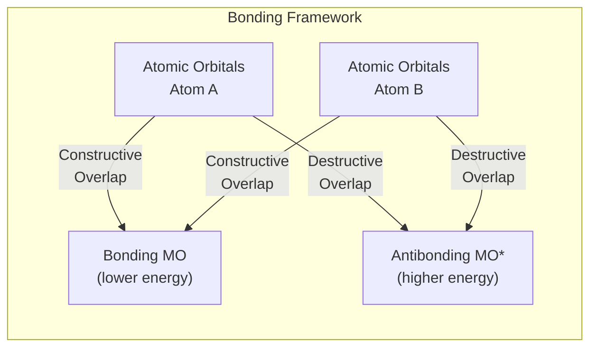
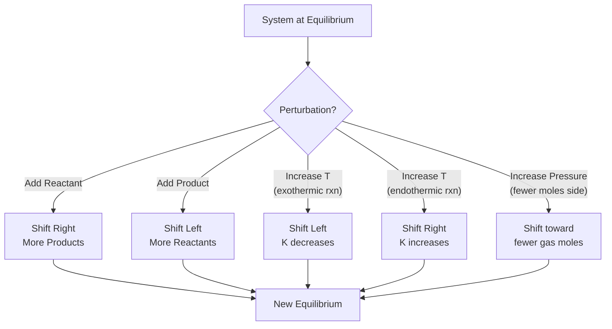

# General Chemistry

> Comprehensive notes covering foundational chemistry: atomic structure, periodicity, bonding, stoichiometry, solutions, equilibrium, acid-base chemistry, and thermochemistry.

**Primary Texts:**
- Atkins, P. & Jones, L. *Chemical Principles: The Quest for Insight*, 7th ed. W.H. Freeman, 2016.
- Zumdahl, S. & Zumdahl, S. *Chemistry*, 10th ed. Cengage, 2018.
- Silberberg, M. *Chemistry: The Molecular Nature of Matter and Change*, 9th ed. McGraw-Hill, 2021.

---

## Part I — Atomic Structure and Quantum Model

### Week 1: The Bohr Model and Beyond

The hydrogen atom energy levels follow the Bohr equation:

$$E_n = -\frac{13.6 \text{ eV}}{n^2}$$

where $n = 1, 2, 3, \ldots$ is the principal quantum number. The energy of a photon emitted during a transition from $n_i$ to $n_f$:

$$\Delta E = -13.6 \left(\frac{1}{n_f^2} - \frac{1}{n_i^2}\right) \text{ eV}$$

### Week 2: Quantum Numbers and Electron Configuration

Each electron is described by four quantum numbers:

| Quantum Number | Symbol | Values | Physical Meaning |
|---|---|---|---|
| Principal | $n$ | $1, 2, 3, \ldots$ | Energy level / shell size |
| Angular momentum | $l$ | $0, 1, \ldots, n-1$ | Orbital shape (s, p, d, f) |
| Magnetic | $m_l$ | $-l, \ldots, 0, \ldots, +l$ | Orbital orientation |
| Spin | $m_s$ | $+\frac{1}{2}, -\frac{1}{2}$ | Electron spin direction |

**Aufbau Principle:** Fill orbitals lowest energy first.
**Pauli Exclusion Principle:** No two electrons share all four quantum numbers.
**Hund's Rule:** Maximize unpaired spins in degenerate orbitals.

---

## Part II — Periodic Trends

### Week 3: Periodicity

Key periodic trends across a period (left to right) and down a group:

| Property | Across Period | Down Group |
|---|---|---|
| Atomic radius | Decreases | Increases |
| Ionization energy (IE) | Increases | Decreases |
| Electronegativity ($\chi$) | Increases | Decreases |
| Electron affinity | Generally increases | Generally decreases |

**First ionization energy:** energy to remove one electron from a gaseous atom.

$$X(g) \rightarrow X^+(g) + e^- \qquad \Delta E = IE_1$$

**Electronegativity** (Pauling scale): F = 4.0 (highest), Cs = 0.7 (lowest among common elements).

---

## Part III — Chemical Bonding

### Week 4: Lewis Structures and VSEPR

**Lewis structures** depict bonding and lone pairs. Follow the octet rule (duet for H).

**VSEPR (Valence Shell Electron Pair Repulsion)** predicts molecular geometry:

| Electron Domains | Molecular Geometry | Bond Angle | Example |
|---|---|---|---|
| 2 | Linear | 180 deg | CO$_2$ |
| 3 | Trigonal planar | 120 deg | BF$_3$ |
| 4 | Tetrahedral | 109.5 deg | CH$_4$ |
| 5 | Trigonal bipyramidal | 90/120 deg | PCl$_5$ |
| 6 | Octahedral | 90 deg | SF$_6$ |

### Week 5: Hybridization and Molecular Orbital Theory

Hybridization correlates with electron domain geometry:
- **sp** — linear (2 domains)
- **sp$^2$** — trigonal planar (3 domains)
- **sp$^3$** — tetrahedral (4 domains)
- **sp$^3$d** — trigonal bipyramidal (5 domains)
- **sp$^3$d$^2$** — octahedral (6 domains)

Bond order from MO theory:

$$\text{Bond Order} = \frac{(\text{bonding } e^-) - (\text{antibonding } e^-)}{2}$$

---

## Part IV — Stoichiometry and Solutions

### Week 6: The Mole and Stoichiometry

**Avogadro's number:** $N_A = 6.022 \times 10^{23}$ mol$^{-1}$

**Molar mass** links grams to moles. For a balanced reaction $aA + bB \rightarrow cC + dD$, mole ratios determine product yields.

**Limiting reagent** is consumed first; **percent yield:**

$$\% \text{ yield} = \frac{\text{actual yield}}{\text{theoretical yield}} \times 100\%$$

### Week 7: Solution Chemistry

**Molarity:**

$$M = \frac{n}{V} = \frac{\text{moles of solute}}{\text{liters of solution}}$$

**Dilution equation:**

$$M_1 V_1 = M_2 V_2$$

**Colligative properties** depend only on solute particle count:
- Boiling point elevation: $\Delta T_b = i \cdot K_b \cdot m$
- Freezing point depression: $\Delta T_f = i \cdot K_f \cdot m$
- Osmotic pressure: $\Pi = iMRT$

---

## Part V — Chemical Equilibrium

### Week 8: Equilibrium Constants and Le Chatelier's Principle

For the general reaction $aA + bB \rightleftharpoons cC + dD$:

$$K = \frac{[C]^c [D]^d}{[A]^a [B]^b}$$

or more generally:

$$K = \frac{\prod [P]^p}{\prod [R]^r}$$

**Reaction quotient** $Q$ has the same form but uses non-equilibrium concentrations.
- $Q < K$: reaction shifts right (toward products)
- $Q > K$: reaction shifts left (toward reactants)
- $Q = K$: system at equilibrium

**Le Chatelier's Principle:** A system at equilibrium responds to a stress by shifting to partially counteract that stress (concentration changes, pressure changes, temperature changes).

---

## Part VI — Acids, Bases, and pH

### Week 9: Bronsted-Lowry Theory and pH

**pH** is the measure of hydrogen ion activity:

$$\text{pH} = -\log[H^+]$$

$$\text{pOH} = -\log[OH^-]$$

$$\text{pH} + \text{pOH} = 14.00 \quad (\text{at } 25°C)$$

**Acid dissociation constant** for $HA \rightleftharpoons H^+ + A^-$:

$$K_a = \frac{[H^+][A^-]}{[HA]}$$

### Week 10: Buffers and Henderson-Hasselbalch

A buffer resists pH change and consists of a weak acid and its conjugate base. The Henderson-Hasselbalch equation:

$$\text{pH} = \text{p}K_a + \log\frac{[A^-]}{[HA]}$$

**Buffer capacity** is greatest when $[A^-] = [HA]$, i.e., when $\text{pH} = \text{p}K_a$.

**Titration curves:** equivalence point occurs when moles acid = moles base. For strong acid / strong base, equivalence pH = 7. For weak acid / strong base, equivalence pH > 7.

---

## Part VII — Thermochemistry and Thermodynamics

### Week 11: Enthalpy, Entropy, and Gibbs Free Energy

**First Law:** $\Delta U = q + w$ (energy is conserved).

**Enthalpy of reaction** (at constant pressure):

$$\Delta H_{rxn} = \sum \Delta H_f^\circ(\text{products}) - \sum \Delta H_f^\circ(\text{reactants})$$

**Entropy** measures disorder: $\Delta S > 0$ for spontaneous processes in an isolated system.

**Gibbs free energy** determines spontaneity at constant $T$ and $P$:

$$\Delta G = \Delta H - T\Delta S$$

| $\Delta H$ | $\Delta S$ | Spontaneity |
|---|---|---|
| $-$ | $+$ | Always spontaneous |
| $+$ | $-$ | Never spontaneous |
| $-$ | $-$ | Spontaneous at low $T$ |
| $+$ | $+$ | Spontaneous at high $T$ |

**Relationship to equilibrium:**

$$\Delta G^\circ = -RT \ln K$$

### Week 12: Electrochemistry Basics

**Standard cell potential:**

$$E^\circ_{cell} = E^\circ_{cathode} - E^\circ_{anode}$$

**Nernst equation:**

$$E = E^\circ - \frac{RT}{nF}\ln Q$$

At $25°C$: $E = E^\circ - \frac{0.0592}{n}\log Q$

**Faraday's constant:** $F = 96485$ C/mol $e^-$

---

## Summary and Review Checklist

- [ ] Bohr model and quantum numbers
- [ ] Periodic trends: IE, EN, radius
- [ ] Lewis structures, VSEPR, hybridization
- [ ] Stoichiometry and limiting reagents
- [ ] Molarity, dilution, colligative properties
- [ ] Equilibrium constants, Le Chatelier
- [ ] pH, buffers, Henderson-Hasselbalch
- [ ] Thermodynamics: $\Delta G = \Delta H - T\Delta S$
- [ ] Electrochemistry and Nernst equation
