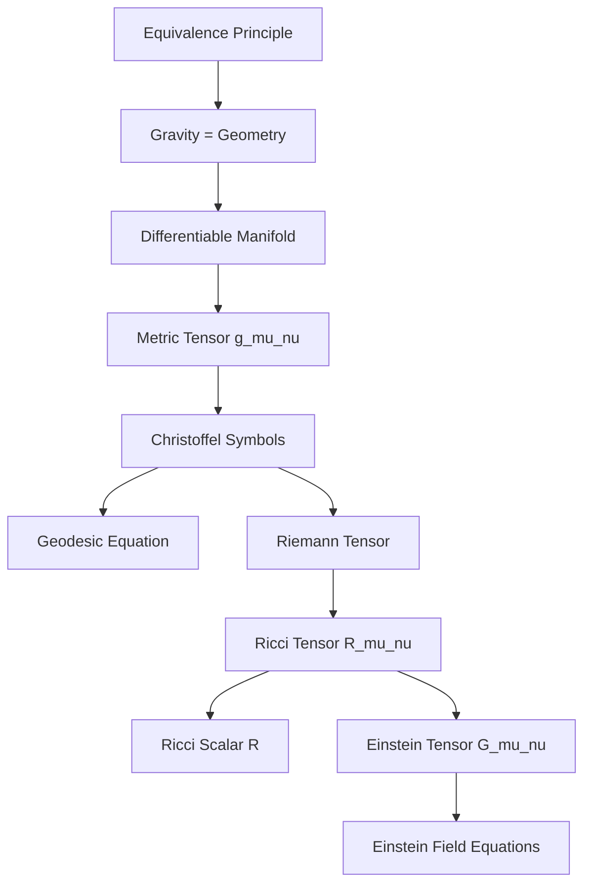
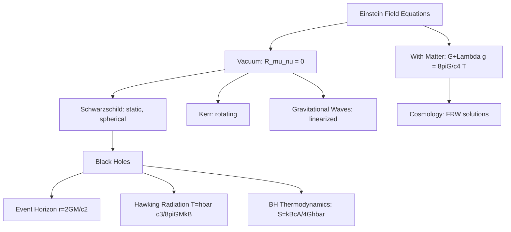
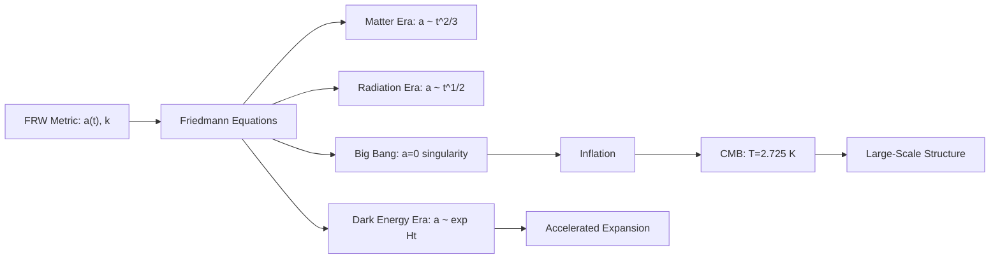

# General Relativity

## References

- Carroll, S.M. *Spacetime and Geometry: An Introduction to General Relativity* (Cambridge, 2019)
- Wald, R.M. *General Relativity* (Chicago, 1984)
- Misner, C.W., Thorne, K.S. & Wheeler, J.A. *Gravitation* (Princeton, 2017 reprint)

---

## Part I: Differential Geometry Foundations (Weeks 1-4)

### Special Relativity Review

Minkowski metric: $\eta_{\mu\nu} = \text{diag}(-1,+1,+1,+1)$ (signature convention).

Interval: $ds^2 = \eta_{\mu\nu}dx^\mu dx^\nu = -c^2dt^2 + dx^2 + dy^2 + dz^2$

Lorentz transformations preserve $ds^2$. Proper time: $d\tau^2 = -ds^2/c^2$.

### The Equivalence Principle

**Weak**: inertial mass = gravitational mass (Eotvos experiments, $\sim 10^{-15}$ precision).

**Einstein**: in a sufficiently small region, the effects of gravity are indistinguishable from acceleration. Locally, spacetime is Minkowski.

Consequence: gravity is geometry. Freely falling particles follow geodesics of curved spacetime.

### Manifolds, Tensors, and the Metric

A spacetime is a 4D differentiable manifold $\mathcal{M}$ equipped with a metric tensor $g_{\mu\nu}$.

The line element: $ds^2 = g_{\mu\nu}(x)dx^\mu dx^\nu$

Tensors transform as: $T'^{\mu\nu} = \frac{\partial x'^\mu}{\partial x^\alpha}\frac{\partial x'^\nu}{\partial x^\beta}T^{\alpha\beta}$

Covariant derivative: $\nabla_\mu V^\nu = \partial_\mu V^\nu + \Gamma^\nu_{\mu\lambda}V^\lambda$

Christoffel symbols (Levi-Civita connection):

$$\Gamma^\sigma_{\mu\nu} = \frac{1}{2}g^{\sigma\lambda}(\partial_\mu g_{\nu\lambda} + \partial_\nu g_{\mu\lambda} - \partial_\lambda g_{\mu\nu})$$

### Curvature

Riemann curvature tensor (measures the failure of parallel transport to commute):

$$R^\rho_{\ \sigma\mu\nu} = \partial_\mu\Gamma^\rho_{\nu\sigma} - \partial_\nu\Gamma^\rho_{\mu\sigma} + \Gamma^\rho_{\mu\lambda}\Gamma^\lambda_{\nu\sigma} - \Gamma^\rho_{\nu\lambda}\Gamma^\lambda_{\mu\sigma}$$

Ricci tensor: $R_{\mu\nu} = R^\lambda_{\ \mu\lambda\nu}$

Ricci scalar: $R = g^{\mu\nu}R_{\mu\nu}$

Einstein tensor: $G_{\mu\nu} = R_{\mu\nu} - \frac{1}{2}Rg_{\mu\nu}$ (satisfies $\nabla_\mu G^{\mu\nu} = 0$ by the Bianchi identity).

### Geodesics

Free particles follow geodesics, extremizing proper time:

$$\frac{d^2x^\mu}{d\tau^2} + \Gamma^\mu_{\alpha\beta}\frac{dx^\alpha}{d\tau}\frac{dx^\beta}{d\tau} = 0$$

Equivalently: parallel transport of the tangent vector along itself.

---

## Part II: Einstein's Field Equations and Solutions (Weeks 5-9)

### Einstein Field Equations

$$G_{\mu\nu} + \Lambda g_{\mu\nu} = \frac{8\pi G}{c^4}T_{\mu\nu}$$

Left side: geometry (curvature). Right side: matter-energy content (stress-energy tensor $T_{\mu\nu}$). $\Lambda$: cosmological constant.

In vacuum ($T_{\mu\nu} = 0$, $\Lambda = 0$): $R_{\mu\nu} = 0$.

Derived from the Einstein-Hilbert action: $S = \frac{c^4}{16\pi G}\int(R - 2\Lambda)\sqrt{-g}\,d^4x + S_{\text{matter}}$

### Schwarzschild Solution

The unique spherically symmetric vacuum solution:

$$ds^2 = -\left(1 - \frac{r_s}{r}\right)c^2dt^2 + \left(1 - \frac{r_s}{r}\right)^{-1}dr^2 + r^2 d\Omega^2$$

where $r_s = 2GM/c^2$ is the Schwarzschild radius and $d\Omega^2 = d\theta^2 + \sin^2\theta\,d\phi^2$.

### Classical Tests of GR

1. **Perihelion precession of Mercury**: $\Delta\phi = \frac{6\pi GM}{c^2 a(1-e^2)}$ per orbit ($\approx 43''$/century)
2. **Light deflection**: $\Delta\phi = \frac{4GM}{c^2 b}$ (twice the Newtonian prediction)
3. **Gravitational redshift**: $\Delta\nu/\nu = -\Delta\Phi/c^2$
4. **Shapiro time delay**: radar echo delay past the Sun

### Black Holes

At $r = r_s$: coordinate singularity (event horizon). At $r = 0$: true curvature singularity.

Kruskal-Szekeres coordinates reveal the maximal extension of Schwarzschild spacetime.

**Kerr solution** (rotating black hole): $ds^2$ depends on mass $M$ and angular momentum $J = Ma$. Ergosphere: region where no static observer can exist. Frame dragging.

**Penrose process**: extract energy from the ergosphere. Black hole area theorem: $\delta A \geq 0$.

**Hawking radiation**: quantum effect, temperature $T_H = \frac{\hbar c^3}{8\pi G M k_B}$. Black hole thermodynamics:

$$S_{BH} = \frac{k_B c^3 A}{4G\hbar}$$

---

## Part III: Gravitational Waves (Weeks 10-11)

### Linearized Gravity

Weak field: $g_{\mu\nu} = \eta_{\mu\nu} + h_{\mu\nu}$ with $|h_{\mu\nu}| \ll 1$.

In the Lorenz gauge $\partial_\mu \bar{h}^{\mu\nu} = 0$ (where $\bar{h}_{\mu\nu} = h_{\mu\nu} - \frac{1}{2}\eta_{\mu\nu}h$):

$$\Box \bar{h}_{\mu\nu} = -\frac{16\pi G}{c^4}T_{\mu\nu}$$

In vacuum: $\Box \bar{h}_{\mu\nu} = 0$ — gravitational waves propagating at speed $c$.

### Properties of Gravitational Waves

Two independent polarizations: $h_+$ and $h_\times$ (transverse-traceless gauge).

Quadrupole formula for radiated power:

$$P = \frac{G}{5c^5}\left\langle\dddot{I}_{ij}\dddot{I}^{ij}\right\rangle$$

where $I_{ij}$ is the (traceless) mass quadrupole moment.

LIGO detection (2015): binary black hole merger GW150914, strain $h \sim 10^{-21}$.

---

## Part IV: Cosmology (Weeks 12-14)

### Friedmann-Robertson-Walker Metric

Homogeneous, isotropic universe:

$$ds^2 = -c^2dt^2 + a(t)^2\left[\frac{dr^2}{1-kr^2} + r^2 d\Omega^2\right]$$

$a(t)$: scale factor. $k = -1, 0, +1$: curvature (open, flat, closed).

### Friedmann Equations

$$\left(\frac{\dot{a}}{a}\right)^2 = \frac{8\pi G}{3}\rho - \frac{kc^2}{a^2} + \frac{\Lambda c^2}{3}$$

$$\frac{\ddot{a}}{a} = -\frac{4\pi G}{3}\left(\rho + \frac{3p}{c^2}\right) + \frac{\Lambda c^2}{3}$$

Hubble parameter: $H(t) = \dot{a}/a$. Present value: $H_0 \approx 70$ km/s/Mpc.

### Content of the Universe

Critical density: $\rho_c = 3H^2/(8\pi G)$. Density parameter: $\Omega = \rho/\rho_c$.

Current composition (Planck 2018): $\Omega_b \approx 0.05$ (baryonic matter), $\Omega_{\text{DM}} \approx 0.27$ (dark matter), $\Omega_\Lambda \approx 0.68$ (dark energy), $\Omega_k \approx 0$ (flat).

Equation of state $p = w\rho c^2$: matter ($w = 0$), radiation ($w = 1/3$), cosmological constant ($w = -1$).

### Dark Matter and Dark Energy

Dark matter: evidence from rotation curves, gravitational lensing, CMB, large-scale structure. Candidates: WIMPs, axions, sterile neutrinos.

Dark energy: accelerated expansion ($\ddot{a} > 0$) discovered via Type Ia supernovae (1998 Nobel). Simplest model: $\Lambda$. Alternatives: quintessence, modified gravity.

---

## Key Problem Types

1. **Metric calculations** — Christoffel symbols, Riemann tensor for given metrics
2. **Geodesics** — orbits in Schwarzschild, light bending, time delay
3. **Black holes** — horizon structure, Penrose diagrams, thermodynamics
4. **Gravitational waves** — polarizations, quadrupole radiation, LIGO sensitivity
5. **Cosmology** — Friedmann equation solutions, horizon problem, age of universe
