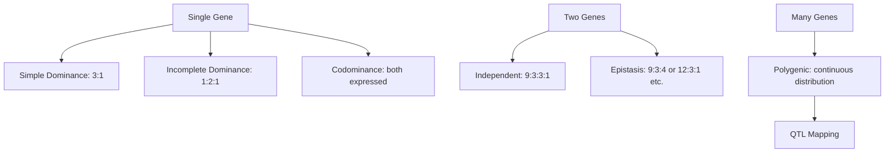
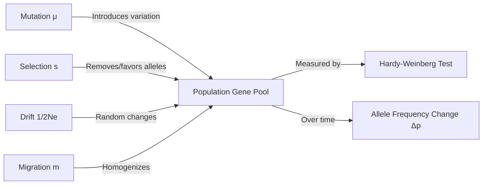
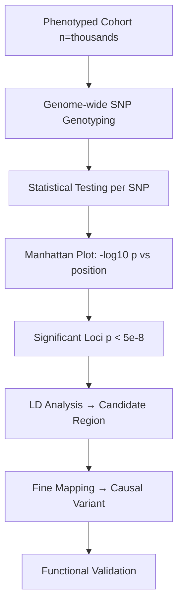

# Genetics

From Mendelian inheritance through population genetics, quantitative genetics, and modern genomics.

## References

- Griffiths, A.J.F. et al. *Introduction to Genetic Analysis*, 12th ed. W.H. Freeman, 2020.
- Hartl, D.L. & Clark, A.G. *Principles of Population Genetics*, 4th ed. Sinauer, 2007.
- Lynch, M. & Walsh, B. *Genetics and Analysis of Quantitative Traits*. Sinauer, 1998.

---

## Part I — Mendelian & Classical Genetics

### Week 1: Mendel's Laws

**Law of Segregation:** Two alleles for a gene separate during gamete formation; each gamete carries one allele.

**Law of Independent Assortment:** Genes on different chromosomes (or far apart on the same chromosome) assort independently during meiosis.

**Law of Dominance:** In a heterozygote, the dominant allele masks the recessive phenotype.

**Monohybrid cross:** $Aa \times Aa$ → genotype ratio $1:2:1$ ($AA:Aa:aa$), phenotype ratio $3:1$.

**Dihybrid cross:** $AaBb \times AaBb$ → $9:3:3:1$ phenotypic ratio (with independent assortment).

**Chi-square test** for goodness of fit:

$$\chi^2 = \sum \frac{(O_i - E_i)^2}{E_i}$$

### Week 2: Extensions to Mendelism

- **Incomplete dominance:** Heterozygote intermediate (e.g., snapdragon flower color).
- **Codominance:** Both alleles expressed (e.g., ABO blood group: $I^A I^B$ → AB).
- **Epistasis:** One gene masks another (e.g., Labrador coat color: $ee$ is yellow regardless of $B$ locus).
- **Pleiotropy:** One gene affects multiple traits (e.g., sickle cell: anemia + malaria resistance).
- **Polygenic inheritance:** Multiple genes contribute to a continuous trait (e.g., skin color, height).
- **Penetrance** (fraction showing phenotype) vs. **expressivity** (degree of phenotype).

### Week 3: Linkage & Mapping

Genes on the same chromosome tend to co-segregate. **Recombination frequency (RF)** measures genetic distance:

$$\text{RF} = \frac{\text{recombinants}}{\text{total}} \times 100 \; \text{cM}$$

1 centiMorgan (cM) $\approx 1\%$ recombination $\approx 1$ Mb in humans (rough average).

**Three-point testcross:** Order genes by identifying double crossover class (rarest). Interference:

$$\text{Coefficient of coincidence} = \frac{\text{observed DCO}}{\text{expected DCO}}, \quad I = 1 - \text{COC}$$

**Mapping functions** correct for multiple crossovers:
- **Haldane:** $d = -\frac{1}{2}\ln(1 - 2r)$ (assumes no interference)
- **Kosambi:** $d = \frac{1}{4}\ln\frac{1+2r}{1-2r}$ (accounts for interference)

---

## Part II — Population Genetics

### Week 4: Hardy-Weinberg Equilibrium

For a biallelic locus with allele frequencies $p$ (dominant) and $q$ (recessive), where $p + q = 1$:

$$p^2 + 2pq + q^2 = 1$$

**Assumptions:** large population, random mating, no mutation, no migration, no selection.

Genotype frequencies reach equilibrium after one generation of random mating (for autosomal loci).

### Week 5: Forces of Evolution

**Selection:** Change in allele frequency under selection against recessive homozygote (fitness $1:1:1-s$):

$$\Delta p = \frac{spq^2}{1 - sq^2} \approx \frac{sp(1-p)^2}{\bar{w}}$$

For selection against a dominant allele:

$$\Delta p = \frac{-sp^2 q}{1 - sp(2q + p)}$$

**Genetic drift:** Random fluctuation in allele frequencies. Variance per generation:

$$\text{Var}(\Delta p) = \frac{p(1-p)}{2N_e}$$

**Effective population size** $N_e$ — the size of an ideal Wright-Fisher population with the same rate of drift. Often $N_e \ll N$ due to unequal sex ratios, variance in offspring number, or population bottlenecks.

**Mutation-selection balance** for a deleterious recessive:

$$\hat{q} \approx \sqrt{\frac{\mu}{s}}$$

For a deleterious dominant:

$$\hat{p} \approx \frac{\mu}{s}$$

**Migration (gene flow):** One-island model with migration rate $m$:

$$p' = (1 - m)p + m \cdot p_m$$

### Week 6: F-statistics & Population Structure

**Wright's F-statistics:**
- $F_{IS}$: inbreeding within subpopulations
- $F_{ST}$: differentiation among subpopulations ($0$ = panmixia, $1$ = fixed differences)
- $F_{IT}$: total inbreeding

$$F_{ST} = \frac{H_T - H_S}{H_T}$$

**Wahlund effect:** Subdivided populations show heterozygote deficit relative to HWE when pooled.

**Coalescent theory:** Looking backward in time, lineages coalesce. Expected time to coalescence of 2 lineages: $E[T_2] = 2N_e$ generations. MRCA of $k$ lineages: sum of coalescent intervals.

---

## Part III — Quantitative & Genomic Genetics

### Week 7: Quantitative Genetics

Continuous traits result from many loci + environment. Phenotypic variance decomposition:

$$V_P = V_G + V_E = (V_A + V_D + V_I) + V_E$$

- $V_A$: additive genetic variance (heritable)
- $V_D$: dominance variance
- $V_I$: epistatic (interaction) variance

**Narrow-sense heritability:**

$$h^2 = \frac{V_A}{V_P}$$

Estimated from parent-offspring regression (slope = $h^2$) or half-sib analysis.

**Breeder's equation** — response to selection:

$$R = h^2 S$$

where $S$ is the selection differential (mean of selected parents – population mean) and $R$ is the response (offspring mean – parental population mean).

**Selection intensity:** $S = i \cdot \sigma_P$, so $R = i \cdot h^2 \cdot \sigma_P$.

### Week 8: Genomics & GWAS

**Genome-Wide Association Studies (GWAS):**
- Genotype hundreds of thousands of SNPs across thousands of individuals.
- Test association between each SNP and trait/disease.
- Significance threshold: $p < 5 \times 10^{-8}$ (Bonferroni for ~$10^6$ independent tests).
- Manhattan plot: $-\log_{10}(p)$ vs. genomic position.
- **Linkage disequilibrium (LD):** associated SNPs tag causal variants within LD blocks.

**QTL mapping:** In experimental crosses (F2, RIL, backcross), use LOD scores:

$$\text{LOD} = \log_{10} \frac{L(\text{QTL at position})}{L(\text{no QTL})}$$

Significance typically LOD $> 3$ (permutation-based threshold).

**Phylogenetics:**
- **Maximum parsimony:** tree requiring fewest character changes.
- **Maximum likelihood (ML):** tree maximizing $P(\text{data} | \text{tree}, \text{model})$.
- **Bayesian:** posterior distribution of trees via MCMC.
- **Coalescent-based methods:** model incomplete lineage sorting for species trees.

---

## Key Equations Summary

| Concept | Equation |
|---------|----------|
| Hardy-Weinberg | $p^2 + 2pq + q^2 = 1$ |
| Selection (recessive) | $\Delta p = spq^2 / (1-sq^2)$ |
| Drift variance | $\text{Var}(\Delta p) = p(1-p)/(2N_e)$ |
| Mutation-selection balance | $\hat{q} = \sqrt{\mu/s}$ |
| Heritability | $h^2 = V_A / V_P$ |
| Breeder's equation | $R = h^2 S$ |
| Recombination frequency | $\text{RF} = \text{recombinants}/\text{total} \times 100$ cM |
| $F_{ST}$ | $(H_T - H_S)/H_T$ |
