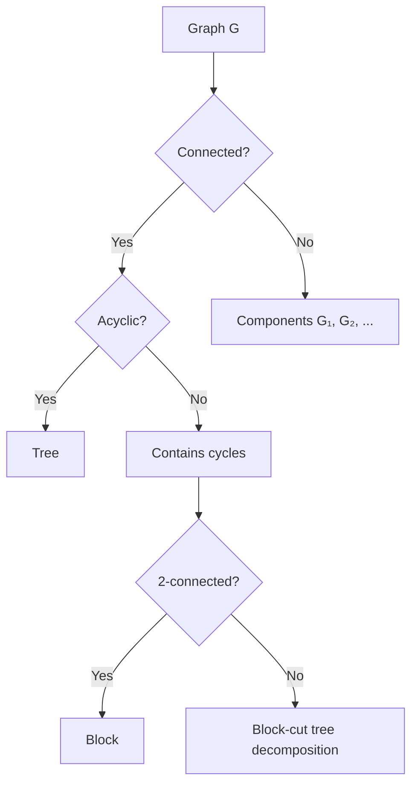
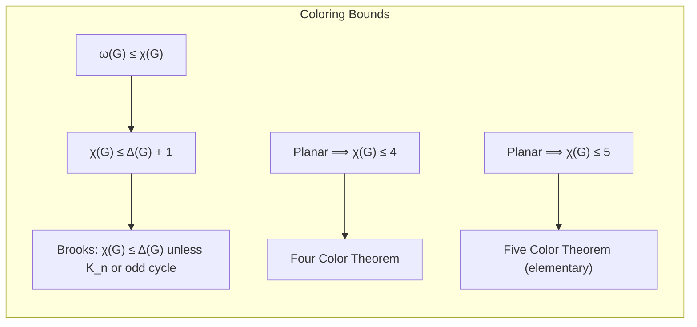
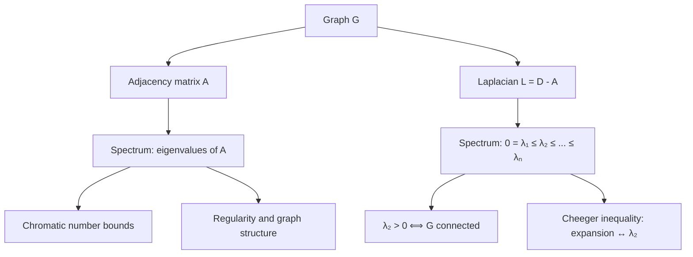

# Graph Theory

## Course Overview

A comprehensive treatment of graph theory: structural properties, planarity, coloring, matching, network flows, Ramsey theory, and spectral methods. Emphasis on both the combinatorial and algebraic perspectives.

## References

- R. Diestel, *Graph Theory*, 5th ed., Springer GTM 173, 2017.
- D.B. West, *Introduction to Graph Theory*, 2nd ed., Prentice Hall, 2001.
- J.A. Bondy & U.S.R. Murty, *Graph Theory*, Springer GTM 244, 2008.

---

# Part I — Fundamentals

## Week 1: Basic Definitions

### Graphs

A **graph** $G = (V, E)$ consists of a vertex set $V$ and edge set $E \subseteq \binom{V}{2}$. Key parameters:

- **Order:** $n = |V|$
- **Size:** $m = |E|$
- **Degree:** $\deg(v) = |\{e \in E : v \in e\}|$

### Handshaking Lemma

$$\sum_{v \in V} \deg(v) = 2|E|$$

Corollary: the number of vertices of odd degree is even.

### Special Graphs

| Graph | Notation | $|V|$ | $|E|$ |
|-------|----------|-------|-------|
| Complete | $K_n$ | $n$ | $\binom{n}{2}$ |
| Complete bipartite | $K_{m,n}$ | $m+n$ | $mn$ |
| Cycle | $C_n$ | $n$ | $n$ |
| Path | $P_n$ | $n$ | $n-1$ |
| Petersen | — | $10$ | $15$ |

## Week 2: Trees and Connectivity

### Trees

A **tree** is a connected acyclic graph. Equivalent characterizations for a graph $T$ on $n$ vertices:
- $T$ is connected and has $n - 1$ edges
- $T$ is acyclic and has $n - 1$ edges
- Any two vertices are connected by a unique path
- $T$ is maximally acyclic (adding any edge creates a cycle)
- $T$ is minimally connected (removing any edge disconnects)

### Cayley's Formula

The number of labeled trees on $n$ vertices is $n^{n-2}$.

### Connectivity

- **$k$-connected:** $G$ remains connected after removing any $k-1$ vertices.
- **Menger's theorem:** The maximum number of internally disjoint $u$-$v$ paths equals the minimum number of vertices separating $u$ from $v$.

### Block-Cut Tree

Every 2-connected graph (block) decomposes uniquely into blocks and cut vertices, forming a tree structure.

---

# Part II — Euler and Hamilton, Planarity

## Week 3: Eulerian and Hamiltonian Graphs

### Euler's Theorem

A connected graph $G$ has an **Eulerian circuit** (traversing every edge exactly once) if and only if every vertex has even degree.

$G$ has an **Eulerian trail** (not necessarily closed) if and only if it has exactly $0$ or $2$ vertices of odd degree.

### Hamiltonian Graphs

A **Hamiltonian cycle** visits every vertex exactly once. No simple characterization exists (the decision problem is NP-complete).

**Dirac's theorem (1952):** If $n \geq 3$ and $\deg(v) \geq n/2$ for all $v$, then $G$ is Hamiltonian.

**Ore's theorem (1960):** If $\deg(u) + \deg(v) \geq n$ for every non-adjacent pair $u, v$, then $G$ is Hamiltonian.

## Week 4: Planarity

### Planar Graphs

A graph is **planar** if it can be drawn in the plane without edge crossings.

### Euler's Formula

For a connected planar graph with $n$ vertices, $m$ edges, and $f$ faces:

$$n - m + f = 2$$

Corollary: $m \leq 3n - 6$ (and $m \leq 2n - 4$ if triangle-free).

### Kuratowski's Theorem (1930)

$G$ is planar if and only if $G$ contains no subdivision of $K_5$ or $K_{3,3}$.

### Wagner's Theorem

$G$ is planar if and only if $G$ has no minor isomorphic to $K_5$ or $K_{3,3}$.

---

# Part III — Coloring

## Week 5: Vertex Coloring

### Chromatic Number

A **proper $k$-coloring** assigns colors $\{1, \ldots, k\}$ to vertices so that adjacent vertices get different colors. The **chromatic number** $\chi(G)$ is the minimum $k$ for which a proper $k$-coloring exists.

### Basic Bounds

$$\omega(G) \leq \chi(G) \leq \Delta(G) + 1$$

where $\omega(G)$ is the clique number and $\Delta(G)$ is the maximum degree.

**Brooks' theorem:** $\chi(G) \leq \Delta(G)$ unless $G$ is a complete graph or an odd cycle.

### The Chromatic Polynomial

$P(G, k)$ counts the number of proper $k$-colorings. For the deletion-contraction relation:

$$P(G, k) = P(G - e, k) - P(G / e, k)$$

Examples:
- $P(K_n, k) = k(k-1)(k-2)\cdots(k-n+1) = k^{\underline{n}}$
- $P(T_n, k) = k(k-1)^{n-1}$ for a tree on $n$ vertices
- $P(C_n, k) = (k-1)^n + (-1)^n (k-1)$

## Week 6: The Four-Color Theorem

### Statement

Every planar graph is 4-colorable: $\chi(G) \leq 4$ for all planar $G$.

Proved by Appel and Haken (1976) via computer-assisted case analysis (1,936 reducible configurations). Simplified by Robertson, Sanders, Seymour, and Thomas (1997) to 633 configurations.

### Five-Color Theorem

Every planar graph is 5-colorable (short proof using Euler's formula and induction: every planar graph has a vertex of degree $\leq 5$).

### Edge Coloring

The **chromatic index** $\chi'(G)$ is the minimum number of colors for a proper edge coloring.

**Vizing's theorem:** $\Delta(G) \leq \chi'(G) \leq \Delta(G) + 1$.

---

# Part IV — Matching and Network Flows

## Week 7: Matching Theory

### Matchings

A **matching** in $G$ is a set of pairwise non-adjacent edges. A **perfect matching** covers all vertices.

### Hall's Marriage Theorem

A bipartite graph $G = (X \cup Y, E)$ has a matching saturating $X$ if and only if:

$$|N(S)| \geq |S| \quad \text{for all } S \subseteq X$$

where $N(S)$ is the set of neighbors of $S$.

### Konig's Theorem

In a bipartite graph, the size of a maximum matching equals the size of a minimum vertex cover:

$$\nu(G) = \tau(G)$$

### Tutte's Theorem

A graph $G$ has a perfect matching if and only if for every $S \subseteq V$:

$$o(G - S) \leq |S|$$

where $o(H)$ denotes the number of odd components of $H$.

## Week 8: Network Flows

### Max-Flow Min-Cut Theorem (Ford-Fulkerson, 1956)

In a network $(G, s, t, c)$ with source $s$, sink $t$, and capacity function $c$:

$$\max_{\text{flow } f} |f| = \min_{\text{cut } (S,T)} c(S, T)$$

where $c(S,T) = \sum_{u \in S, v \in T} c(u,v)$.

### Algorithms

| Algorithm | Time Complexity | Method |
|-----------|----------------|--------|
| Ford-Fulkerson | $O(mF)$ where $F$ = max flow | Augmenting paths |
| Edmonds-Karp | $O(nm^2)$ | BFS augmenting paths |
| Dinic's | $O(n^2 m)$ | Blocking flows |
| Push-relabel | $O(n^2 \sqrt{m})$ | Preflow |

### Menger's Theorem (Flow Version)

The maximum number of edge-disjoint $s$-$t$ paths equals the minimum number of edges in an $s$-$t$ cut.

---

# Part V — Ramsey Theory and Spectral Methods

## Week 9: Ramsey Theory

### Ramsey's Theorem

For any positive integers $r, s$, there exists a minimum $R(r, s)$ such that every 2-coloring of the edges of $K_{R(r,s)}$ contains a monochromatic $K_r$ (red) or $K_s$ (blue).

### Known Values and Bounds

$$R(r, s) \leq \binom{r+s-2}{r-1}$$

| $(r,s)$ | $R(r,s)$ | Status |
|---------|----------|--------|
| $(3,3)$ | $6$ | Exact |
| $(3,4)$ | $9$ | Exact |
| $(3,5)$ | $14$ | Exact |
| $(4,4)$ | $18$ | Exact |
| $(4,5)$ | $25$ | Exact |
| $(5,5)$ | $43$--$48$ | Open |

**Erdos-Szekeres bound:** $R(r,s) \leq \binom{r+s-2}{r-1}$.

**Erdos probabilistic lower bound (1947):** $R(k,k) \geq 2^{k/2}$ (the probabilistic method).

## Week 10: Spectral Graph Theory

### The Adjacency Matrix and Laplacian

For a graph $G$ on $n$ vertices:
- **Adjacency matrix** $A$: $A_{ij} = 1$ if $\{i,j\} \in E$.
- **Degree matrix** $D$: diagonal, $D_{ii} = \deg(i)$.
- **Laplacian** $L = D - A$.

### Eigenvalues of the Laplacian

$L$ is positive semidefinite with eigenvalues $0 = \lambda_1 \leq \lambda_2 \leq \cdots \leq \lambda_n$.

- **$\lambda_2 > 0$** iff $G$ is connected (**algebraic connectivity**, Fiedler).
- The multiplicity of $0$ as an eigenvalue equals the number of connected components.

### Cheeger's Inequality

$$\frac{h(G)^2}{2\Delta} \leq \lambda_2 \leq 2h(G)$$

where $h(G) = \min_{S} \frac{|E(S, \bar{S})|}{\min(|S|, |\bar{S}|)}$ is the **edge expansion** (Cheeger constant).

### Random Graphs: Erdos-Renyi Model

In $G(n, p)$, each edge appears independently with probability $p$. Phase transitions:

| Property | Threshold |
|----------|-----------|
| Giant component appears | $p = 1/n$ |
| Connectivity | $p = \frac{\ln n}{n}$ |
| Hamiltonicity | $p = \frac{\ln n + \ln \ln n}{n}$ |
| Perfect matching (even $n$) | $p = \frac{\ln n}{n}$ |

The expected number of edges is $\binom{n}{2}p$, and the degree distribution is approximately $\text{Poisson}(np)$ for sparse graphs.

---

# Summary of Key Theorems

| Theorem | Statement |
|---------|-----------|
| Euler's formula | $n - m + f = 2$ for connected planar graphs |
| Kuratowski | Planar iff no $K_5$ or $K_{3,3}$ subdivision |
| Four-color theorem | Every planar graph is 4-colorable |
| Hall's theorem | Matching saturating $X$ iff $|N(S)| \geq |S|$ |
| Konig's theorem | $\nu(G) = \tau(G)$ in bipartite graphs |
| Max-flow min-cut | $\max |f| = \min c(S,T)$ |
| Ramsey's theorem | $R(r,s)$ exists for all $r, s$ |
| Brooks' theorem | $\chi(G) \leq \Delta(G)$ unless $K_n$ or odd cycle |
