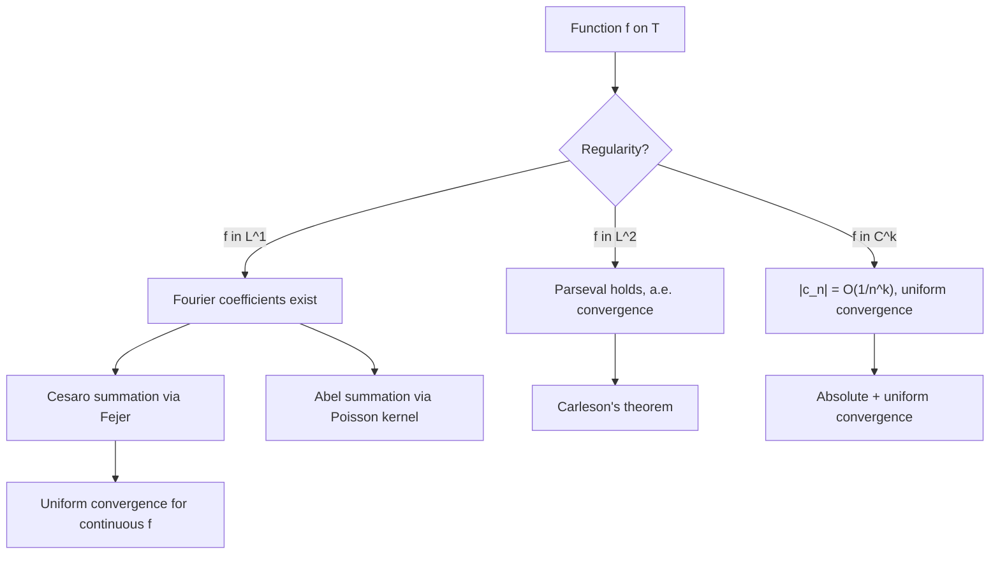
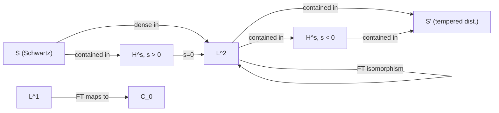
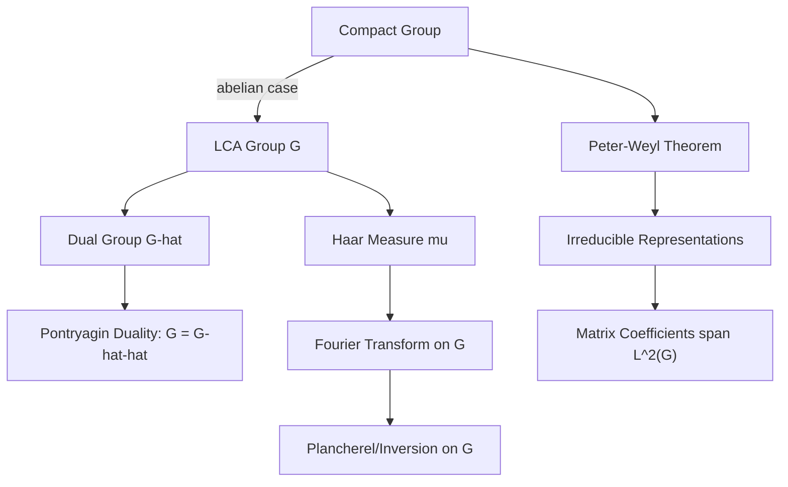

# Harmonic Analysis

> The study of representing functions as superpositions of basic waves, and the structure of the resulting decompositions.

Related: [[stochastic-processes]] | [[numerical-analysis]] | [[time-series]]

---

## Part I: Fourier Series (Weeks 1-3)

### 1.1 Periodic Functions and Trigonometric Series

A function $f: \mathbb{R} \to \mathbb{C}$ with period $2\pi$ can be expanded as a **Fourier series**:

$$f(x) = \sum_{n=-\infty}^{\infty} c_n e^{inx}$$

where the **Fourier coefficients** are given by:

$$c_n = \frac{1}{2\pi} \int_{-\pi}^{\pi} f(x) e^{-inx} \, dx$$

Equivalently, using the real form:

$$f(x) = \frac{a_0}{2} + \sum_{n=1}^{\infty} \left( a_n \cos(nx) + b_n \sin(nx) \right)$$

with $a_n = \frac{1}{\pi}\int_{-\pi}^{\pi} f(x)\cos(nx)\,dx$ and $b_n = \frac{1}{\pi}\int_{-\pi}^{\pi} f(x)\sin(nx)\,dx$.

### 1.2 Convergence of Fourier Series

**Pointwise convergence** is delicate. Key results:

- **Dirichlet's theorem:** If $f$ is piecewise smooth, the Fourier series converges to $\frac{1}{2}[f(x^+) + f(x^-)]$ at every point.
- **Carleson's theorem (1966):** If $f \in L^2(\mathbb{T})$, the Fourier series converges pointwise a.e.
- **Du Bois-Reymond (1876):** There exists $f \in C(\mathbb{T})$ whose Fourier series diverges at a point.

### 1.3 Summability Kernels

The **Dirichlet kernel**:

$$D_N(x) = \sum_{n=-N}^{N} e^{inx} = \frac{\sin\left((N+\frac{1}{2})x\right)}{\sin(x/2)}$$

The partial sum $S_N f(x) = (f * D_N)(x)$. The Dirichlet kernel is *not* a good kernel (its $L^1$ norm grows logarithmically).

The **Fejer kernel** provides Cesaro summability:

$$F_N(x) = \frac{1}{N+1} \sum_{k=0}^{N} D_k(x) = \frac{1}{N+1} \left( \frac{\sin\left(\frac{(N+1)x}{2}\right)}{\sin(x/2)} \right)^2$$

$F_N$ is a **good kernel**: $F_N \geq 0$, $\frac{1}{2\pi}\int F_N = 1$, and mass concentrates at the origin.

**Fejer's theorem:** If $f \in C(\mathbb{T})$, then $\sigma_N f \to f$ uniformly.

---

## Part II: The Fourier Transform (Weeks 4-6)

### 2.1 Definition and Basic Properties

For $f \in L^1(\mathbb{R})$, the **Fourier transform** is:

$$\hat{f}(\xi) = \int_{-\infty}^{\infty} f(x) e^{-2\pi i x \xi} \, dx$$

The **inverse Fourier transform**:

$$f(x) = \int_{-\infty}^{\infty} \hat{f}(\xi) e^{2\pi i x \xi} \, d\xi$$

Key operational properties:

| Operation on $f$ | Effect on $\hat{f}$ |
|---|---|
| Translation $f(x-a)$ | $e^{-2\pi i a \xi} \hat{f}(\xi)$ |
| Modulation $e^{2\pi i bx}f(x)$ | $\hat{f}(\xi - b)$ |
| Dilation $f(ax)$ | $\frac{1}{\|a\|}\hat{f}(\xi/a)$ |
| Differentiation $f'(x)$ | $2\pi i \xi \hat{f}(\xi)$ |
| Convolution $f * g$ | $\hat{f} \cdot \hat{g}$ |

### 2.2 Parseval and Plancherel

**Plancherel's theorem:** The Fourier transform extends to a unitary isomorphism on $L^2(\mathbb{R})$:

$$\|\hat{f}\|_{L^2} = \|f\|_{L^2}$$

More generally, **Parseval's identity**:

$$\int_{-\infty}^{\infty} f(x) \overline{g(x)} \, dx = \int_{-\infty}^{\infty} \hat{f}(\xi) \overline{\hat{g}(\xi)} \, d\xi$$

### 2.3 $L^p$ Theory

- **Riemann-Lebesgue lemma:** If $f \in L^1(\mathbb{R})$, then $\hat{f} \in C_0(\mathbb{R})$ (vanishes at infinity).
- **Hausdorff-Young inequality:** For $1 \leq p \leq 2$, $\|\hat{f}\|_{p'} \leq \|f\|_p$ where $\frac{1}{p} + \frac{1}{p'} = 1$.
- The Fourier transform does *not* map $L^1$ onto $C_0$ (the image is a proper subspace).

### 2.4 Paley-Wiener Theorems

**Paley-Wiener theorem:** An entire function $F$ of exponential type $\sigma$ belongs to $L^2$ on the real line if and only if $F = \hat{f}$ for some $f \in L^2$ supported in $[-\sigma/(2\pi), \sigma/(2\pi)]$.

This establishes a fundamental link between support of a function and analyticity of its transform.

---

## Part III: Distributions and Tempered Distributions (Weeks 7-9)

### 3.1 Schwartz Space and Tempered Distributions

The **Schwartz space** $\mathcal{S}(\mathbb{R}^n)$ consists of smooth functions whose derivatives all decay faster than any polynomial:

$$\mathcal{S} = \{ \varphi \in C^\infty : \sup_x |x^\alpha D^\beta \varphi(x)| < \infty \text{ for all } \alpha, \beta \}$$

A **tempered distribution** $u \in \mathcal{S}'(\mathbb{R}^n)$ is a continuous linear functional on $\mathcal{S}$.

The Fourier transform extends to $\mathcal{S}'$ by duality:

$$\langle \hat{u}, \varphi \rangle = \langle u, \hat{\varphi} \rangle$$

Key example: The Fourier transform of the Dirac delta is $\hat{\delta} = 1$, and $\hat{1} = \delta$.

### 3.2 Sobolev Spaces

The Sobolev space $H^s(\mathbb{R}^n)$ for $s \in \mathbb{R}$:

$$H^s(\mathbb{R}^n) = \{ f \in \mathcal{S}' : (1 + |\xi|^2)^{s/2} \hat{f} \in L^2 \}$$

with norm $\|f\|_{H^s} = \|(1+|\xi|^2)^{s/2}\hat{f}\|_{L^2}$.

**Sobolev embedding:** $H^s(\mathbb{R}^n) \hookrightarrow C^k(\mathbb{R}^n)$ when $s > k + n/2$.

---

## Part IV: Wavelets and Multiresolution Analysis (Weeks 10-12)

### 4.1 Multiresolution Analysis (MRA)

An MRA is a sequence of closed subspaces $\{V_j\}_{j \in \mathbb{Z}}$ of $L^2(\mathbb{R})$ satisfying:

1. $\cdots \subset V_{-1} \subset V_0 \subset V_1 \subset \cdots$
2. $\overline{\bigcup_j V_j} = L^2(\mathbb{R})$ and $\bigcap_j V_j = \{0\}$
3. $f(x) \in V_j \iff f(2x) \in V_{j+1}$
4. There exists a **scaling function** $\varphi \in V_0$ such that $\{\varphi(x-k)\}_{k \in \mathbb{Z}}$ is an orthonormal basis for $V_0$.

The **wavelet** $\psi$ generates the orthogonal complement $W_j = V_{j+1} \ominus V_j$:

$$L^2(\mathbb{R}) = \bigoplus_{j \in \mathbb{Z}} W_j$$

### 4.2 Haar Wavelet

The simplest wavelet:

$$\psi(x) = \begin{cases} 1 & 0 \leq x < 1/2 \\ -1 & 1/2 \leq x < 1 \\ 0 & \text{otherwise} \end{cases}$$

The Haar system $\{\psi_{j,k}(x) = 2^{j/2}\psi(2^j x - k)\}_{j,k \in \mathbb{Z}}$ forms an orthonormal basis for $L^2(\mathbb{R})$.

### 4.3 Daubechies Wavelets

Ingrid Daubechies (1988) constructed compactly supported orthonormal wavelets with prescribed regularity. The **Daubechies-$N$** wavelet $\psi$ has:

- Support of length $2N - 1$
- $N$ vanishing moments: $\int x^k \psi(x)\,dx = 0$ for $k = 0, \ldots, N-1$
- Regularity increasing with $N$

The scaling relation: $\varphi(x) = \sqrt{2} \sum_{k=0}^{2N-1} h_k \varphi(2x - k)$ where the filter coefficients $\{h_k\}$ satisfy the orthogonality and moment conditions.

---

## Part V: Abstract Harmonic Analysis (Weeks 13-15)

### 5.1 Locally Compact Abelian Groups

For a locally compact abelian (LCA) group $G$ with Haar measure $\mu$, the **dual group** $\hat{G}$ consists of continuous homomorphisms $\chi: G \to \mathbb{T}$.

**Pontryagin duality:** The natural map $G \to \hat{\hat{G}}$ is a topological isomorphism.

| Group $G$ | Dual $\hat{G}$ |
|---|---|
| $\mathbb{R}$ | $\mathbb{R}$ |
| $\mathbb{Z}$ | $\mathbb{T}$ |
| $\mathbb{T}$ | $\mathbb{Z}$ |
| $\mathbb{Z}/n\mathbb{Z}$ | $\mathbb{Z}/n\mathbb{Z}$ |
| $\mathbb{Q}_p$ | $\mathbb{Q}_p$ |

The Fourier transform on $G$:

$$\hat{f}(\chi) = \int_G f(x) \overline{\chi(x)} \, d\mu(x), \quad \chi \in \hat{G}$$

### 5.2 Peter-Weyl and Compact Groups

For a compact group $G$, the **Peter-Weyl theorem** states that the matrix coefficients of irreducible unitary representations form a complete orthogonal system in $L^2(G)$.

If $\{\pi_\lambda\}_{\lambda \in \hat{G}}$ are the irreducible representations with dimension $d_\lambda$:

$$L^2(G) \cong \bigoplus_{\lambda \in \hat{G}} \mathbb{C}^{d_\lambda} \otimes \mathbb{C}^{d_\lambda}$$

---

## References

1. Stein, E. M. & Shakarchi, R. *Fourier Analysis: An Introduction*. Princeton University Press, 2003.
2. Katznelson, Y. *An Introduction to Harmonic Analysis*. 3rd ed., Cambridge University Press, 2004.
3. Grafakos, L. *Classical Fourier Analysis*. 3rd ed., Springer, 2014.
4. Grafakos, L. *Modern Fourier Analysis*. 3rd ed., Springer, 2014.
5. Daubechies, I. *Ten Lectures on Wavelets*. SIAM, 1992.
6. Rudin, W. *Fourier Analysis on Groups*. Wiley, 1962.
7. Folland, G. B. *A Course in Abstract Harmonic Analysis*. 2nd ed., CRC Press, 2015.
