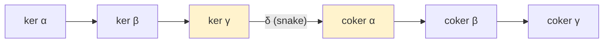
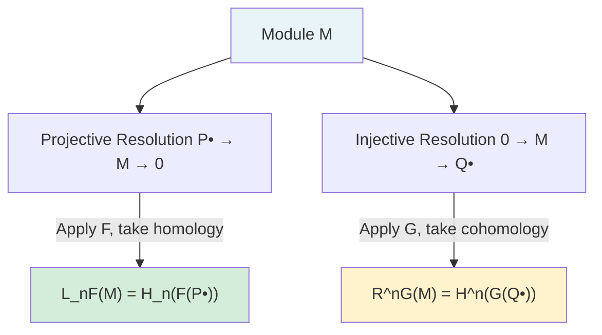
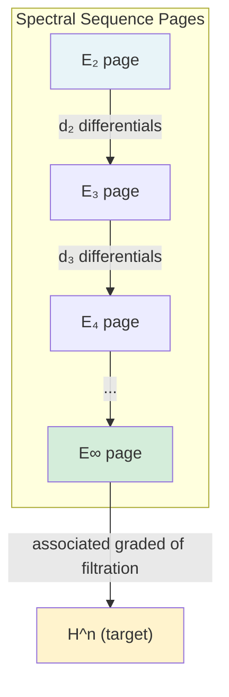

# Homological Algebra

Graduate course on the categorical and computational machinery of homological algebra. Develops the theory of chain complexes, derived functors, and spectral sequences with applications across algebra, topology, and geometry.

---

## Part I: Chain Complexes and Exact Sequences

### Week 1 — Chain Complexes

**Definition.** A *chain complex* $(C_\bullet, d)$ in an abelian category $\mathcal{A}$ is a sequence of objects and morphisms:
$$\cdots \xrightarrow{d_{n+2}} C_{n+1} \xrightarrow{d_{n+1}} C_n \xrightarrow{d_n} C_{n-1} \xrightarrow{d_{n-1}} \cdots$$
satisfying $d_n \circ d_{n+1} = 0$ for all $n$ (equivalently, $\operatorname{im} d_{n+1} \subseteq \ker d_n$).

**Homology.** The $n$-th homology of $C_\bullet$ is:
$$H_n(C_\bullet) = \ker d_n / \operatorname{im} d_{n+1} = Z_n / B_n$$
where $Z_n = \ker d_n$ (*cycles*) and $B_n = \operatorname{im} d_{n+1}$ (*boundaries*).

**Cohomological convention.** A *cochain complex* $(C^\bullet, d)$ has differentials $d^n: C^n \to C^{n+1}$ and cohomology $H^n(C^\bullet) = \ker d^n / \operatorname{im} d^{n-1}$.

**Chain Maps.** A *chain map* $f: C_\bullet \to D_\bullet$ is a collection $\{f_n: C_n \to D_n\}$ with $d_n^D \circ f_n = f_{n-1} \circ d_n^C$. Chain maps induce maps on homology: $H_n(f): H_n(C_\bullet) \to H_n(D_\bullet)$.

### Week 2 — Exact Sequences and Fundamental Lemmas

**Short Exact Sequences.** A sequence $0 \to A \xrightarrow{f} B \xrightarrow{g} C \to 0$ is *short exact* if $f$ is injective, $g$ is surjective, and $\ker g = \operatorname{im} f$.

**Splitting.** A short exact sequence $0 \to A \to B \to C \to 0$ *splits* iff any of the following equivalent conditions hold:
1. There exists $s: C \to B$ with $g \circ s = \operatorname{id}_C$.
2. There exists $r: B \to A$ with $r \circ f = \operatorname{id}_A$.
3. $B \cong A \oplus C$ (compatible with the maps).

**Five Lemma.** In a commutative diagram with exact rows:
$$\begin{array}{ccccccccc}
A_1 & \to & A_2 & \to & A_3 & \to & A_4 & \to & A_5 \\
\downarrow\alpha_1 & & \downarrow\alpha_2 & & \downarrow\alpha_3 & & \downarrow\alpha_4 & & \downarrow\alpha_5 \\
B_1 & \to & B_2 & \to & B_3 & \to & B_4 & \to & B_5
\end{array}$$
If $\alpha_1, \alpha_2, \alpha_4, \alpha_5$ are isomorphisms, then $\alpha_3$ is an isomorphism. (More precisely: $\alpha_1$ surjective and $\alpha_2, \alpha_4$ injective $\Rightarrow$ $\alpha_3$ injective; $\alpha_5$ injective and $\alpha_2, \alpha_4$ surjective $\Rightarrow$ $\alpha_3$ surjective.)

**Snake Lemma.** Given a commutative diagram with exact rows:
$$\begin{array}{ccccccc}
& & A' & \xrightarrow{f} & A & \xrightarrow{g} & A'' & \to 0 \\
& & \downarrow\alpha & & \downarrow\beta & & \downarrow\gamma \\
0 \to & & B' & \xrightarrow{f'} & B & \xrightarrow{g'} & B''
\end{array}$$
there is an exact sequence:
$$\ker\alpha \to \ker\beta \to \ker\gamma \xrightarrow{\delta} \operatorname{coker}\alpha \to \operatorname{coker}\beta \to \operatorname{coker}\gamma$$
where $\delta$ is the *connecting homomorphism* (the "snake map").

*The Snake Lemma: the connecting homomorphism $\delta$ links kernels to cokernels.*

### Week 3 — Homotopy and the Long Exact Sequence

**Chain Homotopy.** Two chain maps $f, g: C_\bullet \to D_\bullet$ are *chain homotopic* ($f \simeq g$) if there exist maps $h_n: C_n \to D_{n+1}$ with:
$$f_n - g_n = d_{n+1}^D \circ h_n + h_{n-1} \circ d_n^C.$$
Chain homotopic maps induce the same map on homology: $H_n(f) = H_n(g)$.

**Long Exact Sequence in Homology.** A short exact sequence of chain complexes:
$$0 \to A_\bullet \xrightarrow{f} B_\bullet \xrightarrow{g} C_\bullet \to 0$$
induces a long exact sequence:
$$\cdots \to H_n(A) \xrightarrow{f_*} H_n(B) \xrightarrow{g_*} H_n(C) \xrightarrow{\delta_n} H_{n-1}(A) \to \cdots$$
The connecting homomorphism $\delta_n$ is constructed by diagram chasing (an application of the snake lemma).

---

## Part II: Projective and Injective Modules

### Week 4 — Projective Modules

**Definition.** An $R$-module $P$ is *projective* if for every surjection $\pi: M \twoheadrightarrow N$ and map $f: P \to N$, there exists a lift $\tilde{f}: P \to M$ with $\pi \circ \tilde{f} = f$.

**Equivalent conditions:**
1. $\operatorname{Hom}_R(P, -)$ is exact.
2. Every short exact sequence $0 \to A \to B \to P \to 0$ splits.
3. $P$ is a direct summand of a free module.

**Examples:**
- Free modules are projective.
- Over a PID, projective $\iff$ free.
- Over a local ring (Kaplansky), projective $\iff$ free.

### Week 5 — Injective Modules

**Definition.** An $R$-module $Q$ is *injective* if for every injection $\iota: A \hookrightarrow B$ and map $f: A \to Q$, there exists an extension $\tilde{f}: B \to Q$ with $\tilde{f} \circ \iota = f$.

**Baer's Criterion.** $Q$ is injective $\iff$ for every ideal $I \subseteq R$ and map $f: I \to Q$, there exists an extension $\tilde{f}: R \to Q$.

**Theorem (Enough Injectives).** Every $R$-module embeds into an injective module.

**Injective Envelope.** Every module $M$ has a unique (up to isomorphism) *injective envelope* $E(M)$, the smallest injective module containing $M$.

**Over $\mathbb{Z}$:** $\mathbb{Q}$ and $\mathbb{Q}/\mathbb{Z}$ are injective. The injective $\mathbb{Z}$-modules are precisely the divisible abelian groups.

### Week 6 — Resolutions

**Projective Resolution.** A *projective resolution* of $M$ is an exact sequence:
$$\cdots \to P_2 \xrightarrow{d_2} P_1 \xrightarrow{d_1} P_0 \xrightarrow{\varepsilon} M \to 0$$
with each $P_i$ projective. Every module has a projective resolution (built by iteratively choosing surjections from free modules).

**Injective Resolution.** An *injective resolution* of $M$ is an exact sequence:
$$0 \to M \xrightarrow{\eta} Q^0 \xrightarrow{d^0} Q^1 \xrightarrow{d^1} Q^2 \to \cdots$$
with each $Q^i$ injective.

**Comparison Theorem.** Any map $f: M \to N$ lifts to a chain map between projective resolutions of $M$ and $N$, unique up to chain homotopy. This ensures that derived functors are well-defined.

---

## Part III: Derived Functors

### Week 7 — Construction of Derived Functors

**Left Derived Functors.** Given a right exact functor $F: \mathcal{A} \to \mathcal{B}$ and a projective resolution $P_\bullet \to M \to 0$:
$$L_n F(M) = H_n(F(P_\bullet)).$$
$L_0 F = F$ (on the nose). $L_n F$ is independent of the choice of resolution (by the comparison theorem).

**Right Derived Functors.** Given a left exact functor $G: \mathcal{A} \to \mathcal{B}$ and an injective resolution $0 \to M \to Q^\bullet$:
$$R^n G(M) = H^n(G(Q^\bullet)).$$
$R^0 G = G$.

### Week 8 — $\operatorname{Tor}$

**Definition.** $\operatorname{Tor}_n^R(M, N)$ is the $n$-th left derived functor of $- \otimes_R N$ (or equivalently, of $M \otimes_R -$):
$$\operatorname{Tor}_n^R(M, N) = H_n(P_\bullet \otimes_R N)$$
where $P_\bullet \to M \to 0$ is a projective resolution of $M$.

**Properties:**
- $\operatorname{Tor}_0^R(M, N) = M \otimes_R N$.
- $\operatorname{Tor}_n^R(M, N) \cong \operatorname{Tor}_n^R(N, M)$ (*balancing*).
- $M$ is flat $\iff$ $\operatorname{Tor}_1^R(M, N) = 0$ for all $N$ $\iff$ $\operatorname{Tor}_n^R(M, N) = 0$ for all $n \geq 1$ and all $N$.

**Example.** $\operatorname{Tor}_1^\mathbb{Z}(\mathbb{Z}/m, \mathbb{Z}/n) \cong \mathbb{Z}/\gcd(m,n)$.

*Computation.* Resolve $\mathbb{Z}/m$:
$$0 \to \mathbb{Z} \xrightarrow{\times m} \mathbb{Z} \to \mathbb{Z}/m \to 0.$$
Tensor with $\mathbb{Z}/n$:
$$0 \to \mathbb{Z}/n \xrightarrow{\times m} \mathbb{Z}/n$$
so $\operatorname{Tor}_1 = \ker(\times m: \mathbb{Z}/n \to \mathbb{Z}/n) = \{a \in \mathbb{Z}/n : ma = 0\} \cong \mathbb{Z}/\gcd(m,n)$.

### Week 9 — $\operatorname{Ext}$

**Definition.** $\operatorname{Ext}^n_R(M, N)$ is the $n$-th right derived functor of $\operatorname{Hom}_R(M, -)$ (equivalently, of $\operatorname{Hom}_R(-, N)$):
$$\operatorname{Ext}^n_R(M, N) = H^n(\operatorname{Hom}_R(P_\bullet, N))$$
where $P_\bullet \to M \to 0$ is a projective resolution.

**Properties:**
- $\operatorname{Ext}^0_R(M, N) = \operatorname{Hom}_R(M, N)$.
- $M$ is projective $\iff$ $\operatorname{Ext}^1_R(M, N) = 0$ for all $N$.
- $N$ is injective $\iff$ $\operatorname{Ext}^1_R(M, N) = 0$ for all $M$.

**Extension Interpretation.** $\operatorname{Ext}^1_R(M, N)$ classifies equivalence classes of extensions:
$$0 \to N \to E \to M \to 0$$
The zero element corresponds to the split extension $E = M \oplus N$.

**Example.** $\operatorname{Ext}^1_\mathbb{Z}(\mathbb{Z}/n, \mathbb{Z}) \cong \mathbb{Z}/n$.

### Week 10 — Long Exact Sequences for Derived Functors

A short exact sequence $0 \to A \to B \to C \to 0$ induces:

**For $\operatorname{Tor}$:**
$$\cdots \to \operatorname{Tor}_2(C, N) \to \operatorname{Tor}_1(A, N) \to \operatorname{Tor}_1(B, N) \to \operatorname{Tor}_1(C, N) \xrightarrow{\delta} A \otimes N \to B \otimes N \to C \otimes N \to 0$$

**For $\operatorname{Ext}$ (in the first variable):**
$$0 \to \operatorname{Hom}(C, N) \to \operatorname{Hom}(B, N) \to \operatorname{Hom}(A, N) \xrightarrow{\delta} \operatorname{Ext}^1(C, N) \to \operatorname{Ext}^1(B, N) \to \cdots$$

**For $\operatorname{Ext}$ (in the second variable), from $0 \to N' \to N \to N'' \to 0$:**
$$0 \to \operatorname{Hom}(M, N') \to \operatorname{Hom}(M, N) \to \operatorname{Hom}(M, N'') \xrightarrow{\delta} \operatorname{Ext}^1(M, N') \to \cdots$$

The connecting homomorphisms $\delta$ are natural transformations.

---

## Part IV: Homological Dimension

### Week 11 — Projective and Global Dimension

**Projective Dimension.** The *projective dimension* of $M$ is:
$$\operatorname{pd}(M) = \min\{n : \exists \text{ projective resolution } 0 \to P_n \to \cdots \to P_0 \to M \to 0\}$$
Equivalently, $\operatorname{pd}(M) = \sup\{n : \operatorname{Ext}^n(M, N) \neq 0 \text{ for some } N\}$.

**Global Dimension.** $\operatorname{gl.dim}(R) = \sup\{\operatorname{pd}(M) : M \text{ an } R\text{-module}\}$.

**Theorem (Auslander-Buchsbaum-Serre).** A Noetherian local ring $(R, \mathfrak{m}, k)$ is regular if and only if $\operatorname{gl.dim}(R) < \infty$, in which case $\operatorname{gl.dim}(R) = \dim R$.

**Auslander-Buchsbaum Formula.** If $(R, \mathfrak{m})$ is a Noetherian local ring and $M$ is finitely generated with $\operatorname{pd}(M) < \infty$, then:
$$\operatorname{pd}(M) + \operatorname{depth}(M) = \operatorname{depth}(R).$$

---

## Part V: Spectral Sequences

### Week 12 — Spectral Sequence Formalism

**Definition.** A *(cohomological) spectral sequence* is a sequence of pages $(E_r^{p,q}, d_r)$ for $r \geq r_0$ where:
- Each $E_r^{p,q}$ is an object in an abelian category,
- $d_r: E_r^{p,q} \to E_r^{p+r, q-r+1}$ satisfies $d_r^2 = 0$,
- $E_{r+1}^{p,q} \cong H^{p,q}(E_r, d_r) = \ker d_r / \operatorname{im} d_r$.

A spectral sequence *converges* to $H^n$, written $E_2^{p,q} \Rightarrow H^{p+q}$, if there is a filtration $\cdots \subseteq F^{p+1} H^n \subseteq F^p H^n \subseteq \cdots \subseteq H^n$ with $E_\infty^{p,q} \cong F^p H^{p+q} / F^{p+1} H^{p+q}$.

### Week 13 — Grothendieck Spectral Sequence

**Theorem (Grothendieck).** Let $\mathcal{A} \xrightarrow{G} \mathcal{B} \xrightarrow{F} \mathcal{C}$ be left exact functors between abelian categories with enough injectives. If $G$ sends injectives to $F$-acyclic objects, then there is a spectral sequence:
$$E_2^{p,q} = (R^p F)(R^q G)(A) \Rightarrow R^{p+q}(F \circ G)(A).$$

**Applications:**
- **Leray spectral sequence** ($f: X \to Y$ continuous, $\mathcal{F}$ a sheaf on $X$): $E_2^{p,q} = H^p(Y, R^q f_* \mathcal{F}) \Rightarrow H^{p+q}(X, \mathcal{F})$.
- **Lyndon-Hochschild-Serre** ($N \trianglelefteq G$, $M$ a $G$-module): $E_2^{p,q} = H^p(G/N, H^q(N, M)) \Rightarrow H^{p+q}(G, M)$.
- **Universal coefficient theorem** as a degenerate spectral sequence.

### Week 14 — Computations and Applications

**Kunneth Formula.** If $R$ is a PID and $C_\bullet, D_\bullet$ are chain complexes of free $R$-modules:
$$0 \to \bigoplus_{p+q=n} H_p(C) \otimes H_q(D) \to H_n(C \otimes D) \to \bigoplus_{p+q=n-1} \operatorname{Tor}_1(H_p(C), H_q(D)) \to 0.$$

**Universal Coefficient Theorem.** For a chain complex $C_\bullet$ of free abelian groups:
$$0 \to \operatorname{Ext}^1_\mathbb{Z}(H_{n-1}(C), G) \to H^n(C; G) \to \operatorname{Hom}(H_n(C), G) \to 0.$$

---

## Exercises

1. Prove the Five Lemma by diagram chasing.
2. Compute $\operatorname{Tor}_n^\mathbb{Z}(\mathbb{Z}/p, \mathbb{Z}/p)$ for all $n \geq 0$.
3. Show that $\operatorname{Ext}^1_\mathbb{Z}(\mathbb{Q}, \mathbb{Z}) \neq 0$. (Hint: it is uncountable.)
4. Prove that $\operatorname{pd}_{\mathbb{Z}}(\mathbb{Q}) = 1$.
5. Use the Grothendieck spectral sequence to derive the Leray spectral sequence.

---

## References

- Weibel, C.A. *An Introduction to Homological Algebra*. Cambridge Studies in Advanced Mathematics 38, 1994.
- Rotman, J.J. *An Introduction to Homological Algebra*. 2nd ed. Springer Universitext, 2009.
- Cartan, H. & Eilenberg, S. *Homological Algebra*. Princeton University Press, 1956.
- Gelfand, S.I. & Manin, Y.I. *Methods of Homological Algebra*. 2nd ed. Springer, 2003.
- Mac Lane, S. *Homology*. Springer Classics in Mathematics, 1995 (reprint of 1963 ed.).
