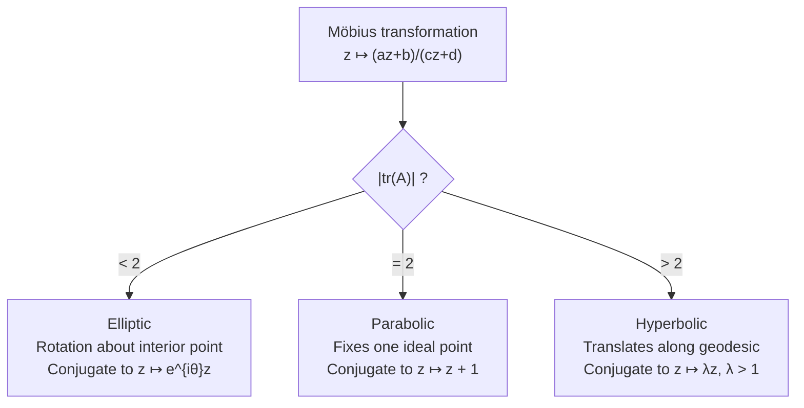
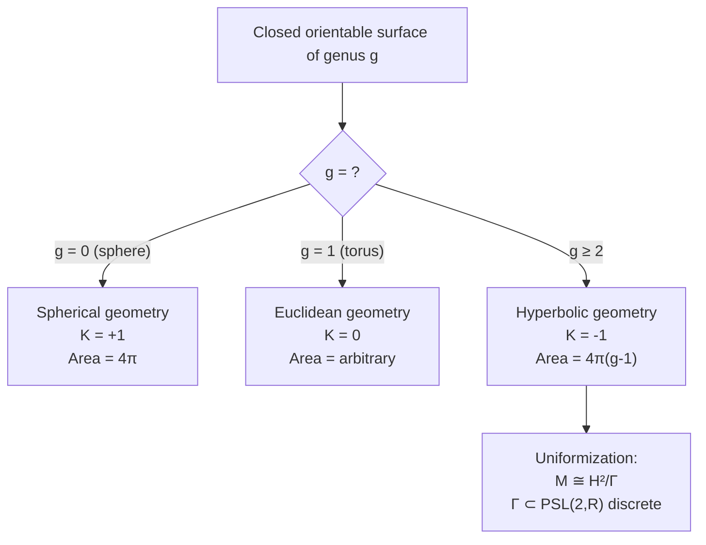
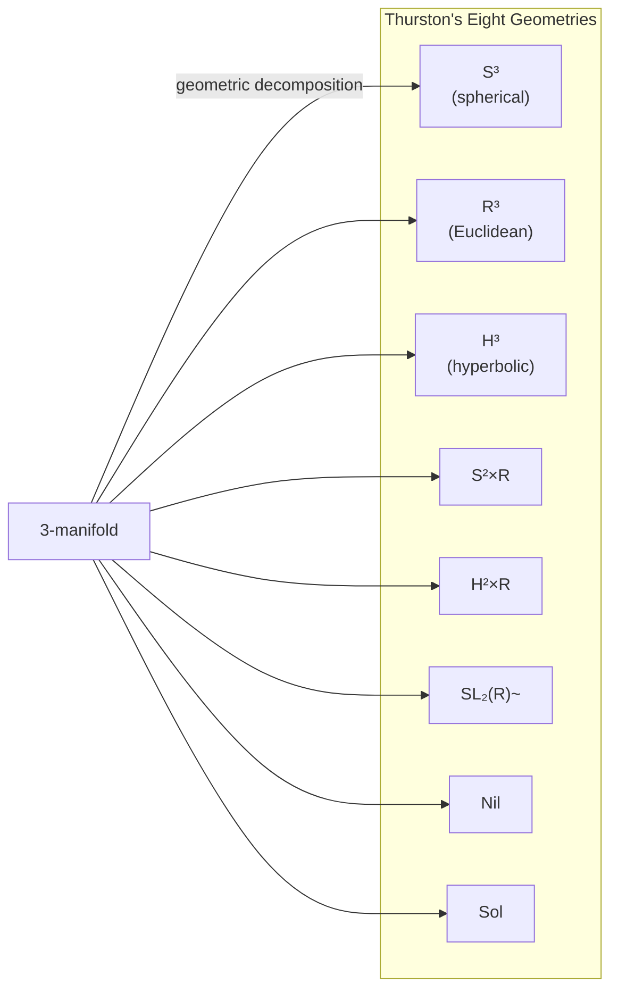

# Hyperbolic Geometry

The geometry of constant negative curvature: models, isometries, area formulas, and connections to topology, group theory, and Thurston's geometrization program.

---

## Part I: Models of the Hyperbolic Plane

### Week 1: The Poincare Disk Model

The **Poincare disk model** $(\mathbb{D}^2, g)$ uses the open unit disk $\mathbb{D}^2 = \{(x,y) : x^2 + y^2 < 1\}$ with the Riemannian metric:

$$ds^2 = \frac{4(dx^2 + dy^2)}{(1 - x^2 - y^2)^2}$$

**Geodesics** are:
- Diameters of the disk
- Circular arcs orthogonal to the boundary circle $\partial\mathbb{D}^2$

The boundary $\partial\mathbb{D}^2 = S^1$ is the **circle at infinity** (or **ideal boundary**) -- points at infinity that are not part of the hyperbolic plane but encode asymptotic behavior.

**Distance formula:** For points $z, w \in \mathbb{D}^2$ (using complex coordinates):

$$d(z, w) = 2 \operatorname{arctanh}\left(\frac{|z - w|}{|1 - \bar{w}z|}\right) = \ln \frac{|1 - \bar{w}z| + |z - w|}{|1 - \bar{w}z| - |z - w|}$$

**Key features:**
- Angles are faithfully represented (conformal model)
- Distances are distorted: objects near $\partial\mathbb{D}^2$ appear compressed but are actually "far away"
- The entire hyperbolic plane fits inside the disk, but has infinite area

### Week 2: The Upper Half-Plane Model

The **upper half-plane model** $(\mathbb{H}^2, g)$ uses $\mathbb{H}^2 = \{(x,y) \in \mathbb{R}^2 : y > 0\}$ with:

$$ds^2 = \frac{dx^2 + dy^2}{y^2}$$

**Geodesics** are:
- Vertical half-lines $\{x = c,\; y > 0\}$
- Semicircles centered on the $x$-axis

The ideal boundary is $\partial\mathbb{H}^2 = \mathbb{R} \cup \{\infty\}$.

**Isometries** are **Mobius transformations**:

$$z \mapsto \frac{az + b}{cz + d}, \quad \begin{pmatrix} a & b \\ c & d \end{pmatrix} \in SL(2, \mathbb{R})$$

Since $A$ and $-A$ give the same transformation, $\operatorname{Isom}^+(\mathbb{H}^2) \cong PSL(2, \mathbb{R}) = SL(2, \mathbb{R})/\{\pm I\}$.

**Classification of isometries** by trace of the matrix $A$:

| $|\operatorname{tr}(A)|$ | Type | Fixed points in $\overline{\mathbb{H}}^2$ | Action |
|---|---|---|---|
| $< 2$ | Elliptic | 1 interior point | Rotation |
| $= 2$ | Parabolic | 1 ideal point | Horocyclic translation |
| $> 2$ | Hyperbolic | 2 ideal points | Translation along axis |

### Week 3: Klein and Hyperboloid Models

#### Klein (Beltrami-Klein) Model

Uses the open disk with the metric that makes geodesics **straight chords**:

$$ds^2 = \frac{dx^2 + dy^2}{1 - x^2 - y^2} + \frac{(x\,dx + y\,dy)^2}{(1 - x^2 - y^2)^2}$$

The Klein model is **not conformal** (angles are distorted) but has straight geodesics, making it ideal for studying incidence properties.

**Ultraparallel lines:** In hyperbolic geometry, given a line $\ell$ and a point $P \notin \ell$, there are infinitely many lines through $P$ not meeting $\ell$. Two lines that do not meet even at infinity are **ultraparallel** (divergent). They admit a unique common perpendicular.

#### Hyperboloid Model

The **hyperboloid model** realizes $\mathbb{H}^n$ as the upper sheet of the hyperboloid in Minkowski space $\mathbb{R}^{n,1}$:

$$\mathbb{H}^n = \{(x_0, x_1, \ldots, x_n) : -x_0^2 + x_1^2 + \cdots + x_n^2 = -1,\; x_0 > 0\}$$

with the induced metric from the Minkowski inner product $\langle \mathbf{x}, \mathbf{y} \rangle = -x_0 y_0 + x_1 y_1 + \cdots + x_n y_n$.

The distance: $\cosh d(\mathbf{x}, \mathbf{y}) = -\langle \mathbf{x}, \mathbf{y} \rangle$.

Isometries are the **orthochronous Lorentz group** $O^+(n,1)$, connecting hyperbolic geometry to special relativity.

**Relations between models:**

| From | To | Map |
|---|---|---|
| Hyperboloid | Poincare disk | Stereographic projection from $(−1,0,\ldots,0)$ |
| Hyperboloid | Klein | Central projection from origin: $(x_0,\mathbf{x}) \mapsto \mathbf{x}/x_0$ |
| Poincare disk | Upper half-plane | Cayley transform: $w = \frac{z - i}{z + i}$ (inverse) |

---

## Part II: Geometry and Measurement

### Week 4: Hyperbolic Trigonometry and Area

#### Hyperbolic Law of Cosines

For a triangle with sides $a, b, c$ and opposite angles $\alpha, \beta, \gamma$:

$$\cosh c = \cosh a \cosh b - \sinh a \sinh b \cos\gamma$$

Compare with the Euclidean law: $c^2 = a^2 + b^2 - 2ab\cos\gamma$.

There is also a **dual law** (for angles):

$$\cos\gamma = -\cos\alpha\cos\beta + \sin\alpha\sin\beta\cosh c$$

Note the remarkable fact: in hyperbolic geometry, **knowing all three angles determines all three sides** (there are no similar triangles of different sizes).

#### Area of Hyperbolic Polygons

The area of a hyperbolic triangle with angles $\alpha, \beta, \gamma$:

$$A = \pi - (\alpha + \beta + \gamma)$$

This is the **angular defect**. Since angles are positive, $A < \pi$. For an $n$-gon with interior angles $\alpha_1, \ldots, \alpha_n$:

$$A = (n - 2)\pi - \sum_{i=1}^{n} \alpha_i$$

**Ideal triangles** (all three vertices at infinity, all angles $= 0$): $A = \pi$. All ideal triangles are congruent -- there is a unique ideal triangle up to isometry.

### Week 5: Horocycles, Equidistant Curves, and Hyperbolic Circles

Three types of "curves of constant curvature" in $\mathbb{H}^2$:
- **Circles:** Locus equidistant from a center point. A hyperbolic circle of radius $r$ has circumference $2\pi\sinh r$ and area $2\pi(\cosh r - 1)$, both growing exponentially.
- **Horocycles:** Limit of circles as center recedes to infinity. "Circles centered at an ideal point." In the upper half-plane: horizontal lines $\{y = c\}$.
- **Equidistant curves (hypercycles):** Locus of points at constant distance from a geodesic. In the Poincare disk: circular arcs that share endpoints with a geodesic but are not orthogonal to $\partial\mathbb{D}$.

---

## Part III: Surfaces, Manifolds, and Topology

### Week 6: Gauss-Bonnet Theorem

The **Gauss-Bonnet theorem** connects curvature to topology. For a compact Riemannian 2-manifold $M$ (possibly with geodesic boundary):

$$\int_M K\, dA + \int_{\partial M} \kappa_g\, ds = 2\pi\chi(M)$$

where $K$ is the Gaussian curvature, $\kappa_g$ is the geodesic curvature of the boundary, and $\chi(M)$ is the Euler characteristic.

For a **closed hyperbolic surface** ($K = -1$, no boundary):

$$\int_M (-1)\, dA = 2\pi\chi(M) \implies \operatorname{Area}(M) = -2\pi\chi(M) = 2\pi(2g - 2)$$

where $g$ is the genus. This gives a remarkable constraint: the total area of a closed hyperbolic surface is completely determined by its topology.

Since area must be positive, we need $g \geq 2$: only surfaces of genus $\geq 2$ admit a hyperbolic metric. The torus ($g=1$) is Euclidean, and the sphere ($g=0$) is spherical.

### Week 7: Hyperbolic Manifolds and Discrete Groups

A **hyperbolic manifold** is a quotient $\mathbb{H}^n / \Gamma$ where $\Gamma \subset \operatorname{Isom}(\mathbb{H}^n)$ is a discrete, torsion-free group acting properly discontinuously.

**Fuchsian groups** ($n=2$): Discrete subgroups of $PSL(2, \mathbb{R})$. A Fuchsian group $\Gamma$ has a **fundamental domain** $\mathcal{F} \subset \mathbb{H}^2$, and the quotient $\mathbb{H}^2/\Gamma$ is a hyperbolic surface if $\Gamma$ is torsion-free.

For a closed surface of genus $g$, the fundamental group has presentation:

$$\pi_1(\Sigma_g) = \langle a_1, b_1, \ldots, a_g, b_g \mid [a_1, b_1]\cdots[a_g, b_g] = 1 \rangle$$

and the fundamental domain is a hyperbolic $4g$-gon.

**Kleinian groups** ($n=3$): Discrete subgroups of $PSL(2, \mathbb{C}) \cong \operatorname{Isom}^+(\mathbb{H}^3)$. These produce hyperbolic 3-manifolds, which are central objects in low-dimensional topology.

### Week 8: Rigidity and Geometrization

#### Mostow Rigidity

> **Theorem (Mostow, 1968).** If $M_1$ and $M_2$ are closed hyperbolic manifolds of dimension $n \geq 3$ with isomorphic fundamental groups, then $M_1$ and $M_2$ are isometric.

This is strikingly different from dimension 2, where the **Teichmuller space** of a genus-$g$ surface is $(6g-6)$-dimensional. In dimension $\geq 3$, the hyperbolic structure is **unique** -- a purely topological invariant.

Consequence: geometric invariants (volume, lengths of closed geodesics) are topological invariants of hyperbolic manifolds in dimension $\geq 3$.

#### Thurston's Geometrization Conjecture

> **Conjecture (Thurston, 1982; proved by Perelman, 2003).** Every closed orientable 3-manifold can be cut along tori into pieces, each of which admits one of eight geometric structures: $S^3$, $\mathbb{R}^3$, $\mathbb{H}^3$, $S^2 \times \mathbb{R}$, $\mathbb{H}^2 \times \mathbb{R}$, $\widetilde{SL(2, \mathbb{R})}$, Nil, Sol.

Hyperbolic geometry dominates: "most" 3-manifolds are hyperbolic (in various precise senses). The Poincare conjecture is a special case: a simply connected closed 3-manifold must be $S^3$.

**Hyperbolization theorem (Thurston):** A Haken 3-manifold with incompressible boundary is hyperbolic if and only if it is atoroidal (contains no essential torus).

---

## Comparison: Euclidean vs. Hyperbolic

| Property | Euclidean ($K=0$) | Hyperbolic ($K=-1$) |
|---|---|---|
| Parallel postulate | Unique parallel | Infinitely many parallels |
| Angle sum of triangle | $\pi$ | $< \pi$ |
| Area of triangle | Independent of angles | $= \pi - (\alpha+\beta+\gamma)$ |
| Similar triangles | Exist in all sizes | Congruent if same angles |
| Circumference of circle | $2\pi r$ | $2\pi\sinh r$ |
| Area of circle | $\pi r^2$ | $2\pi(\cosh r - 1)$ |
| Isometry group | $E(n)$ (semidirect product) | $O^+(n,1)$ / $PSL(2,\mathbb{R})$ |

---

## References

1. Ratcliffe, J. G. *Foundations of Hyperbolic Manifolds*. 2nd ed., Springer GTM 149, 2006.
2. Anderson, J. W. *Hyperbolic Geometry*. 2nd ed., Springer Undergraduate Mathematics, 2005.
3. Thurston, W. P. *Three-Dimensional Geometry and Topology*. Princeton University Press, 1997.
4. Benedetti, R. & Petronio, C. *Lectures on Hyperbolic Geometry*. Springer Universitext, 1992.
5. Cannon, J. W. et al. "Hyperbolic Geometry." In *Flavors of Geometry*, MSRI Publications 31, Cambridge University Press, 1997.
