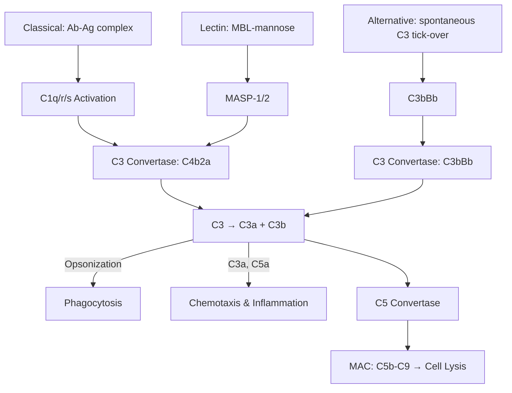
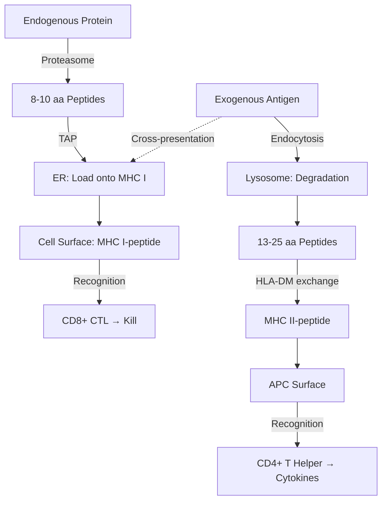

# Immunology

Innate and adaptive immunity, antigen presentation, lymphocyte biology, and applied immunology (vaccines, autoimmunity, immunotherapy).

## References

- Murphy, K. & Weaver, C. *Janeway's Immunobiology*, 10th ed. W.W. Norton, 2022.
- Abbas, A.K., Lichtman, A.H. & Pillai, S. *Cellular and Molecular Immunology*, 10th ed. Elsevier, 2021.
- Janeway, C.A. et al. *Immunobiology* (classic editions for foundational concepts).

---

## Part I — Innate Immunity

### Week 1: Physical Barriers & Pattern Recognition

**First line of defense:**
- Skin (keratinized epithelium, antimicrobial peptides: defensins, cathelicidins).
- Mucosal surfaces (mucus, lysozyme, lactoferrin, secretory IgA).
- Low pH (stomach $\sim 2$, skin $\sim 5.5$).

**Pattern recognition receptors (PRRs):**
| Receptor Family | Location | Ligands (PAMPs) |
|----------------|----------|-----------------|
| TLR1/2/6 | Cell surface | Lipoproteins, lipoteichoic acid |
| TLR3 | Endosomal | dsRNA |
| TLR4 | Cell surface | LPS (Gram-negative) |
| TLR7/8 | Endosomal | ssRNA |
| TLR9 | Endosomal | CpG DNA |
| RIG-I / MDA5 | Cytoplasmic | Viral RNA |
| cGAS-STING | Cytoplasmic | dsDNA |
| NLRs (NOD1/2, NLRP3) | Cytoplasmic | Peptidoglycan, danger signals |

**DAMPs** (damage-associated molecular patterns): HMGB1, ATP, uric acid — released from damaged/dying cells → sterile inflammation.

**NLRP3 inflammasome:** NLRP3 + ASC + pro-caspase-1 → active caspase-1 → cleaves pro-IL-1$\beta$ and pro-IL-18 → mature cytokines + pyroptosis (via gasdermin D).

### Week 2: Complement & Cellular Innate Immunity

**Complement system** — three activation pathways converging on C3 convertase:

1. **Classical:** Antibody (IgM/IgG) → C1q binding → C1r/s → C4b2a (C3 convertase).
2. **Alternative:** Spontaneous C3 hydrolysis → C3bBb (C3 convertase); amplification loop.
3. **Lectin:** MBL binds mannose on pathogens → MASP-1/2 → C4b2a.

**Terminal pathway:** C3b deposition → C5 convertase → C5b → C6-C9 assembly → **membrane attack complex (MAC)** → osmotic lysis.

**Complement functions:** opsonization (C3b), chemotaxis (C3a, C5a), lysis (MAC), immune complex clearance.

**Phagocytes:**
- **Neutrophils:** First responders (6--12h lifespan), NETs (neutrophil extracellular traps), respiratory burst (ROS via NADPH oxidase).
- **Macrophages:** Tissue-resident (Kupffer cells, microglia, alveolar macrophages), antigen presentation, cytokine production (TNF-$\alpha$, IL-1, IL-6, IL-12).
- **Dendritic cells (DCs):** Professional APCs — bridge innate and adaptive immunity.

**NK cells:** Kill virus-infected and tumor cells. "Missing self" recognition: inhibitory receptors (KIR) recognize MHC I; loss of MHC I (common in virus-infected/tumor cells) → NK activation. Kill via perforin/granzyme.

---

## Part II — Adaptive Immunity

### Week 3: B Cell Biology

**V(D)J recombination:** RAG1/RAG2 recombinases rearrange variable (V), diversity (D), and joining (J) gene segments. Combinatorial diversity + junctional diversity (N/P nucleotides) → $> 10^{11}$ possible heavy chain sequences.

**B cell development:** Bone marrow → pro-B → pre-B (heavy chain rearranged) → immature B (IgM surface) → mature naive B (IgM + IgD).

**Activation (T-dependent):**
1. BCR binds antigen → internalization → MHC II presentation.
2. T$_{FH}$ cell provides help: CD40L-CD40 + IL-21.
3. Germinal center reaction: **somatic hypermutation** (AID enzyme, point mutations in V regions) → **affinity maturation** (selection by FDCs).
4. **Class switch recombination (CSR):** IgM → IgG (opsonization, complement), IgA (mucosal), IgE (parasites, allergy). AID-mediated, directed by cytokines.

| Isotype | Function | Location |
|---------|----------|----------|
| IgM | First response, complement activation | Blood |
| IgG | Opsonization, ADCC, placental transfer | Blood, tissues |
| IgA | Mucosal immunity | Gut, respiratory, saliva |
| IgE | Anti-parasitic, allergic reactions | Tissue mast cells |
| IgD | Naive B cell receptor | B cell surface |

### Week 4: T Cell Biology

**T cell development:** Thymus → double-negative (DN) → double-positive (DP: CD4+CD8+) → positive selection (MHC restriction) → negative selection (self-tolerance) → single-positive (SP: CD4+ or CD8+).

**CD4+ T helper subsets:**

| Subset | Master TF | Key Cytokines | Function |
|--------|-----------|---------------|----------|
| Th1 | T-bet | IFN-$\gamma$, TNF | Intracellular pathogens, macrophage activation |
| Th2 | GATA-3 | IL-4, IL-5, IL-13 | Helminths, allergy, IgE class switch |
| Th17 | ROR$\gamma$t | IL-17A, IL-22 | Extracellular bacteria/fungi, barrier defense |
| T$_{reg}$ | FoxP3 | IL-10, TGF-$\beta$ | Immune suppression, self-tolerance |
| T$_{FH}$ | Bcl-6 | IL-21 | Germinal center help for B cells |

**CD8+ cytotoxic T lymphocytes (CTLs):**
- Recognize peptide-MHC I on target cell.
- Kill via **perforin** (pore formation) + **granzyme B** (activates caspases → apoptosis).
- Also Fas-FasL pathway.

### Week 5: Antigen Presentation

**MHC class I** (all nucleated cells):
- Presents endogenous peptides (8--10 aa) from proteasomal degradation.
- TAP transporter → ER loading → surface display.
- Recognized by CD8+ T cells.

**MHC class II** (professional APCs: DCs, macrophages, B cells):
- Presents exogenous peptides (13--25 aa) from lysosomal degradation.
- Invariant chain (Ii) → CLIP → HLA-DM exchanges for antigenic peptide.
- Recognized by CD4+ T cells.

**Cross-presentation:** DCs present exogenous antigens on MHC I → prime CD8+ T cells against tumors/viruses without being infected themselves.

---

## Part III — Applied Immunology

### Week 6: Immunological Memory & Vaccines

**Clonal selection theory** (Burnet): Each lymphocyte bears a unique receptor; antigen selects and expands specific clones.

**Primary vs. secondary response:** Secondary is faster (1--3 days vs. 5--7 days), stronger (10--100x higher Ab titer), higher affinity (affinity-matured IgG), and longer-lasting.

**Vaccine types:**
- **Live attenuated:** Weakened pathogen (MMR, yellow fever). Strong response, risk in immunocompromised.
- **Inactivated:** Killed pathogen (rabies, flu injection). Safer, weaker response, needs boosters.
- **Subunit/conjugate:** Purified antigen (HepB surface Ag, pneumococcal polysaccharide). Requires adjuvant.
- **Toxoid:** Inactivated toxin (tetanus, diphtheria).
- **mRNA:** Lipid nanoparticle-encapsulated mRNA encoding antigen (COVID-19: BNT162b2, mRNA-1273). Rapid development, strong Th1 + CTL responses.
- **Viral vector:** Adenovirus-based (J&J, AstraZeneca COVID-19).

### Week 7: Immunopathology

**Autoimmunity:** Loss of self-tolerance. Examples: type 1 diabetes (anti-$\beta$-cell), rheumatoid arthritis (anti-citrullinated proteins), SLE (anti-dsDNA, anti-Smith), MS (anti-myelin).

**Hypersensitivity reactions:**

| Type | Mechanism | Timing | Example |
|------|-----------|--------|---------|
| I | IgE → mast cell degranulation | Minutes | Anaphylaxis, asthma, hay fever |
| II | IgG/IgM → complement/ADCC | Hours | Hemolytic disease of newborn, Goodpasture's |
| III | Immune complex deposition | Hours-days | Serum sickness, SLE nephritis |
| IV | T cell-mediated (DTH) | 24--72h | Contact dermatitis, TB skin test, graft rejection |

### Week 8: Cancer Immunotherapy

**Immune checkpoint inhibitors:**
- **Anti-PD-1** (pembrolizumab, nivolumab): Block PD-1/PD-L1 interaction → reinvigorate exhausted CD8+ T cells.
- **Anti-CTLA-4** (ipilimumab): Block CTLA-4 inhibitory signal → enhance T cell activation in lymph nodes.

**CAR-T cell therapy:**
- Patient T cells engineered ex vivo with chimeric antigen receptor (scFv targeting tumor antigen + CD3$\zeta$ + costimulatory domains: CD28 and/or 4-1BB).
- Remarkable efficacy in B-cell malignancies (anti-CD19 CAR-T: tisagenlecleucel, axicabtagene ciloleucel).
- Risks: cytokine release syndrome (CRS), neurotoxicity (ICANS).

**Bispecific antibodies:** Bridge T cells to tumor cells (e.g., blinatumomab: anti-CD3 × anti-CD19).

---

## Key Concepts Summary

| Concept | Key Detail |
|---------|-----------|
| PRR signaling | TLR → MyD88/TRIF → NF-$\kappa$B → inflammatory cytokines |
| Complement | 3 pathways → C3 convertase → MAC |
| Ab diversity | V(D)J + junctional diversity + SHM → $>10^{11}$ specificities |
| T cell selection | Positive (MHC restriction) + Negative (self-tolerance) |
| Memory | Faster, stronger, higher affinity secondary response |
| Checkpoint | PD-1/CTLA-4 blockade reactivates anti-tumor immunity |
