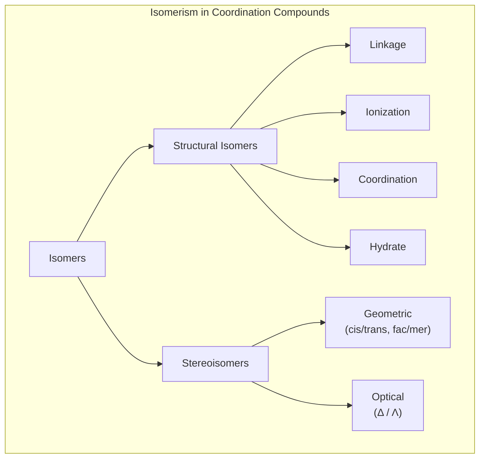
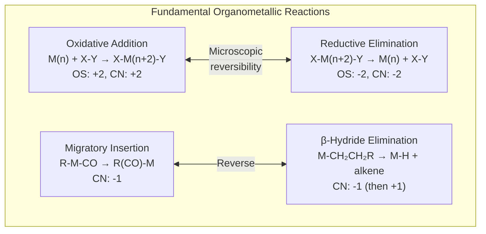
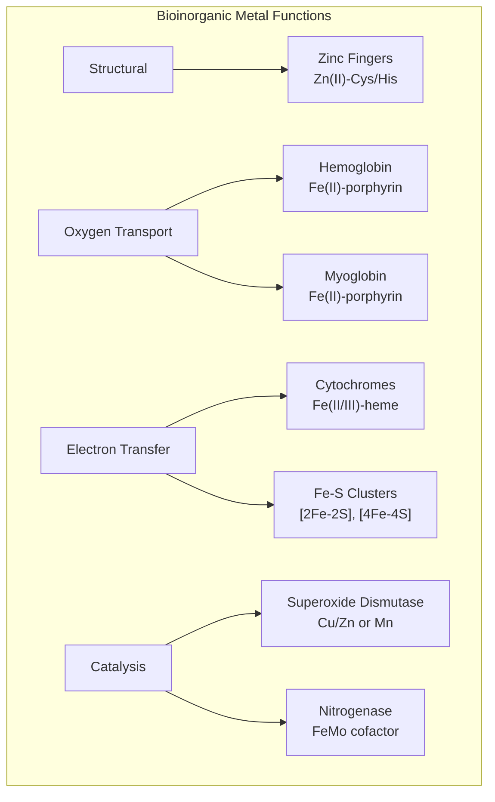

# Inorganic Chemistry

> Comprehensive notes covering coordination chemistry, crystal field theory, MO theory for complexes, magnetic properties, organometallic chemistry, catalytic cycles, bioinorganic chemistry, and solid state.

**Primary Texts:**
- Miessler, G.L., Fischer, P.J. & Tarr, D.A. *Inorganic Chemistry*, 5th ed. Pearson, 2014.
- Shriver, D. & Atkins, P. *Inorganic Chemistry*, 5th ed. Oxford University Press, 2010.
- Cotton, F.A., Wilkinson, G., Murillo, C.A. & Bochmann, M. *Advanced Inorganic Chemistry*, 6th ed. Wiley, 1999.

---

## Part I — Coordination Chemistry Fundamentals

### Week 1: Nomenclature and Structure

**Coordination compound:** central metal ion surrounded by ligands (Lewis bases donating electron pairs).

**Nomenclature rules (IUPAC):**
1. Name cation before anion
2. Ligands in alphabetical order before metal
3. Anionic ligands: -o suffix (chlorido, cyano, hydroxido)
4. Neutral ligands: name as-is except aqua (H$_2$O), ammine (NH$_3$), carbonyl (CO), nitrosyl (NO)
5. Oxidation state of metal in Roman numerals in parentheses

**Coordination numbers and geometries:**

| CN | Geometry | Example |
|---|---|---|
| 2 | Linear | $[\text{Ag(NH}_3)_2]^+$ |
| 4 | Tetrahedral | $[\text{CoCl}_4]^{2-}$ |
| 4 | Square planar | $[\text{PtCl}_4]^{2-}$ |
| 5 | Trigonal bipyramidal | $[\text{Fe(CO)}_5]$ |
| 5 | Square pyramidal | $[\text{VO(acac)}_2]$ |
| 6 | Octahedral | $[\text{Co(NH}_3)_6]^{3+}$ |

### Week 2: Isomerism in Coordination Compounds

**Structural isomerism:**
- **Linkage:** SCN$^-$ vs NCS$^-$ (thiocyanato vs isothiocyanato)
- **Ionization:** $[\text{Co(NH}_3)_5\text{Br}]\text{SO}_4$ vs $[\text{Co(NH}_3)_5\text{SO}_4]\text{Br}$
- **Coordination:** cation-anion ligand exchange

**Stereoisomerism:**
- **Geometric (cis/trans):** in square planar and octahedral complexes
- **Optical (fac/mer):** in octahedral complexes with tris-bidentate ligands ($\Delta$ and $\Lambda$ enantiomers)

---

## Part II — Crystal Field Theory

### Week 3: Octahedral and Tetrahedral Splitting

**Crystal Field Theory (CFT):** electrostatic model of metal-ligand bonding. Ligands are treated as point charges that split the degeneracy of metal d orbitals.

**Octahedral field ($O_h$):**
- d orbitals split into $t_{2g}$ (lower: $d_{xy}, d_{xz}, d_{yz}$) and $e_g$ (higher: $d_{z^2}, d_{x^2-y^2}$)
- Splitting energy: $\Delta_o$ (also written 10Dq)
- $t_{2g}$ stabilized by $-0.4\Delta_o$ each; $e_g$ destabilized by $+0.6\Delta_o$ each

**Tetrahedral field ($T_d$):**
- Splitting is inverted: $e$ (lower) and $t_2$ (higher)
- $\Delta_t \approx \frac{4}{9}\Delta_o$ (smaller splitting, no tetragonal strong-field complexes)

**Crystal Field Stabilization Energy (CFSE):** total stabilization from d-electron occupation.

$$\text{CFSE} = (-0.4 n_{t_{2g}} + 0.6 n_{e_g})\Delta_o + n_p P$$

where $n_p$ is the number of forced pairings and $P$ is the pairing energy.

### Week 4: Spectrochemical Series and Spin States

**Spectrochemical series** (increasing $\Delta_o$):

$$\text{I}^- < \text{Br}^- < \text{Cl}^- < \text{F}^- < \text{OH}^- < \text{H}_2\text{O} < \text{NH}_3 < \text{en} < \text{NO}_2^- < \text{CN}^- < \text{CO}$$

*Weak field* $\longrightarrow$ *Strong field*

**Spin state determination:**
- If $\Delta_o > P$: **low spin** (electrons pair in $t_{2g}$ before occupying $e_g$)
- If $\Delta_o < P$: **high spin** (electrons fill all orbitals singly first, Hund's rule)
- Only relevant for $d^4$-$d^7$ configurations in octahedral geometry

**Colors of complexes:** arise from d-d transitions. The absorbed wavelength corresponds to $\Delta_o$:

$$\Delta_o = h\nu = \frac{hc}{\lambda}$$

---

## Part III — MO Theory for Complexes and Magnetism

### Week 5: MO Theory Applied to Coordination Compounds

CFT limitations: does not account for covalency or $\pi$ bonding.

**Ligand Field Theory (MO approach):**
- Metal d, s, p orbitals combine with ligand group orbitals (LGOs)
- $\sigma$-bonding: ligand lone pairs $\rightarrow$ metal $e_g$ and $a_{1g}$ (octahedral)
- $\pi$-bonding: ligand $\pi$-orbitals interact with metal $t_{2g}$
  - $\pi$-donors (halides, OH$^-$): decrease $\Delta_o$
  - $\pi$-acceptors (CO, CN$^-$, PR$_3$): increase $\Delta_o$ via back-bonding

### Week 6: Magnetic Properties

**Magnetic moment** (spin-only approximation):

$$\mu = \sqrt{n(n+2)} \text{ BM}$$

where $n$ = number of unpaired electrons and BM = Bohr magnetons.

| $n$ | $\mu$ (BM) |
|---|---|
| 1 | 1.73 |
| 2 | 2.83 |
| 3 | 3.87 |
| 4 | 4.90 |
| 5 | 5.92 |

**Types of magnetism:**
- **Diamagnetic:** all electrons paired, slightly repelled by magnetic field
- **Paramagnetic:** unpaired electrons, attracted to magnetic field
- **Ferromagnetic:** cooperative alignment of unpaired spins (Fe, Co, Ni below Curie temperature)

Magnetic measurements (Gouy balance, SQUID) determine $n$, which distinguishes high-spin from low-spin configurations.

---

## Part IV — Organometallic Chemistry

### Week 7: The 18-Electron Rule

**18-electron rule:** stable organometallic complexes tend to have 18 valence electrons (metal d electrons + ligand-donated electrons), analogous to the octet rule.

**Electron counting (ionic model):**

| Ligand | Electrons Donated | Charge |
|---|---|---|
| CO, PR$_3$, alkene | 2 | 0 |
| H$^-$, CH$_3^-$, Cl$^-$ | 2 | -1 |
| $\eta^3$-allyl | 4 | -1 |
| $\eta^5$-Cp ($\text{C}_5\text{H}_5$) | 6 | -1 |
| $\eta^6$-arene | 6 | 0 |
| NO (linear) | 2 | +1 |
| NO (bent) | 2 | -1 |

**Examples:**
- $[\text{Cr(CO)}_6]$: Cr(0) has 6 d-electrons + $6 \times 2 = 12$ from CO = 18
- Ferrocene $[\text{Fe}(\eta^5\text{-Cp})_2]$: Fe(II) has 6 + $2 \times 6 = 12$ = 18
- $[\text{Ni(CO)}_4]$: Ni(0) has 10 + $4 \times 2 = 8$ = 18

### Week 8: Fundamental Organometallic Reactions

**Oxidative addition:** metal inserts into a bond X-Y.
- Oxidation state increases by 2, coordination number increases by 2
- $\text{M}^n + \text{X-Y} \rightarrow \text{X-M}^{n+2}\text{-Y}$
- Requires: low oxidation state, electron-rich metal, 16e complex

**Reductive elimination:** reverse of oxidative addition.
- Oxidation state decreases by 2, CN decreases by 2
- Forms new X-Y bond; drives catalytic cycles to completion

**Migratory insertion:** ligand migrates to adjacent coordinated group.
- 1,1-insertion: CO insertion into M-R bond $\rightarrow$ acyl complex
- 1,2-insertion: alkene insertion into M-H bond $\rightarrow$ alkyl complex

**Beta-hydride elimination:** reverse of 1,2-insertion.
- M-CH$_2$CH$_2$R $\rightarrow$ M-H + CH$_2$=CHR
- Requires: $\beta$-hydrogen, empty coordination site, coplanar M-C-C-H

---

## Part V — Catalytic Cycles

### Week 9: Homogeneous Catalysis

**Wilkinson's catalyst:** $[\text{RhCl(PPh}_3)_3]$ — hydrogenation of alkenes.

Cycle: ligand dissociation $\rightarrow$ oxidative addition of H$_2$ $\rightarrow$ alkene coordination $\rightarrow$ migratory insertion $\rightarrow$ reductive elimination of alkane.

**Grubbs metathesis catalyst:** $[\text{Ru}(\text{=CHPh})(\text{Cl})_2(\text{PCy}_3)_2]$ — olefin metathesis.
- Mechanism: $[2+2]$ cycloaddition with metal carbene $\rightarrow$ metallacyclobutane $\rightarrow$ retro-$[2+2]$
- Applications: ring-closing metathesis (RCM), cross metathesis, ROMP

**Heck reaction:** Pd(0)-catalyzed coupling of aryl halides with alkenes.
- Oxidative addition of Ar-X $\rightarrow$ alkene insertion $\rightarrow$ $\beta$-hydride elimination $\rightarrow$ reductive elimination

### Week 10: Industrial Catalysis

- **Monsanto process:** Rh-catalyzed carbonylation of methanol to acetic acid
- **Ziegler-Natta polymerization:** Ti-based catalysts for stereoregular polyolefins
- **Wacker process:** PdCl$_2$/CuCl$_2$ oxidation of ethylene to acetaldehyde

---

## Part VI — Bioinorganic Chemistry

### Week 11: Metals in Biology

**Hemoglobin and Myoglobin:**
- Iron(II) porphyrin (heme) binds O$_2$ reversibly
- Deoxyhemoglobin: Fe(II) high-spin, out-of-plane
- Oxyhemoglobin: Fe(II) low-spin, moves into porphyrin plane
- Cooperative binding described by Hill equation

**Zinc fingers:**
- Zn(II) tetrahedrally coordinated by Cys and His residues
- Structural role in DNA-binding proteins
- Zn$^{2+}$ is d$^{10}$: no CFSE preference, flexible geometry

**Metalloenzymes:**
- Carbonic anhydrase: Zn$^{2+}$ activates water for CO$_2$ hydration
- Cytochrome P450: Fe-heme catalyzes C-H oxidation
- Nitrogenase: FeMo cofactor reduces N$_2$ to NH$_3$

---

## Part VII — Solid State Chemistry

### Week 12: Crystal Structures and Band Theory

**Common crystal structures:**
- Rock salt (NaCl): FCC anions, all octahedral holes filled
- Fluorite (CaF$_2$): FCC cations, all tetrahedral holes filled
- Zinc blende (ZnS): FCC anions, half tetrahedral holes filled
- Perovskite (ABX$_3$): A at corners, B at body center, X at face centers

**Band theory:** extension of MO theory to infinite lattices.
- **Valence band:** highest occupied band
- **Conduction band:** lowest unoccupied band
- **Band gap** ($E_g$) determines: metal ($E_g = 0$), semiconductor (small $E_g$), insulator (large $E_g$)

**Lattice energy** (Born-Lande equation):

$$U = -\frac{N_A A z^+ z^- e^2}{4\pi\epsilon_0 r_0}\left(1 - \frac{1}{n}\right)$$

where $A$ is the Madelung constant and $n$ is the Born exponent.

---

## Summary and Review Checklist

- [ ] Coordination compound nomenclature and isomerism
- [ ] Crystal field splitting: octahedral vs tetrahedral
- [ ] Spectrochemical series and spin state determination
- [ ] CFSE calculations
- [ ] Magnetic moment: $\mu = \sqrt{n(n+2)}$ BM
- [ ] 18-electron rule and electron counting
- [ ] Oxidative addition, reductive elimination, migratory insertion
- [ ] Catalytic cycles: Wilkinson, Grubbs, Heck
- [ ] Bioinorganic: hemoglobin, zinc fingers, metalloenzymes
- [ ] Crystal structures and band theory
