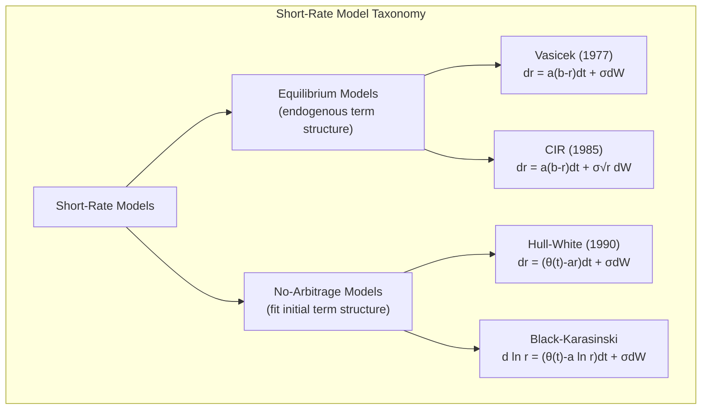
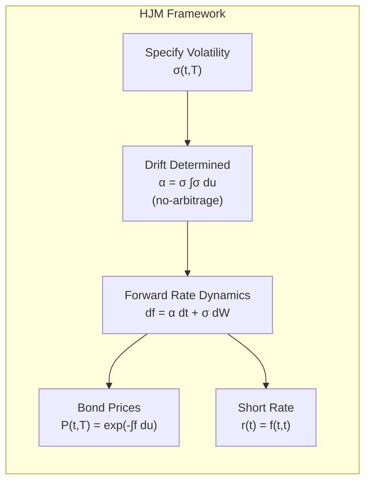
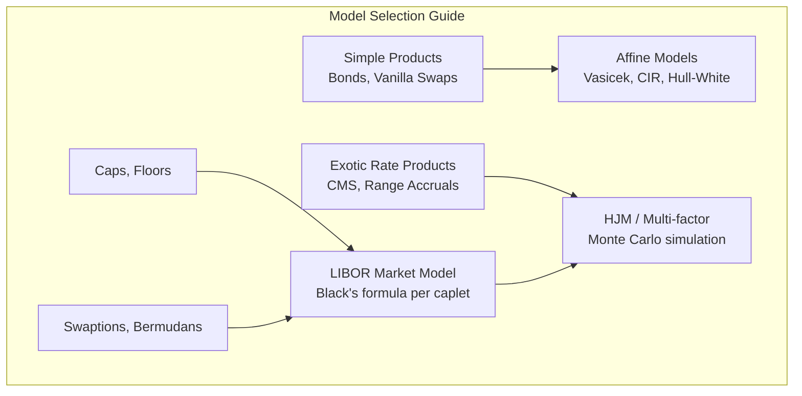

# Interest Rate Models

## Part I: Short-Rate Models — Vasicek

### The Vasicek Model (1977)

$$dr_t = a(b - r_t)\,dt + \sigma\,dW_t$$

This is an **Ornstein-Uhlenbeck** process with:
- $a$ = speed of mean reversion
- $b$ = long-run mean level
- $\sigma$ = volatility of the short rate

### Properties
- Mean reversion: $E[r_t | r_0] = b + (r_0 - b)e^{-at}$
- Stationary variance: $\text{Var}(r_\infty) = \frac{\sigma^2}{2a}$
- **Allows negative rates** (normally distributed increments)
- Affine term structure: analytical bond prices

### Bond Pricing (Affine Form)

The price of a zero-coupon bond:

$$P(t, T) = A(t, T) \cdot e^{-B(t,T) \cdot r(t)}$$

where:

$$B(t, T) = \frac{1 - e^{-a(T-t)}}{a}$$

$$\ln A(t, T) = \left(B(t,T) - (T-t)\right)\left(b - \frac{\sigma^2}{2a^2}\right) - \frac{\sigma^2 B(t,T)^2}{4a}$$

### Yield Curve Shapes

Vasicek can produce:
- Upward sloping (normal)
- Downward sloping (inverted)
- Humped

But cannot fit an arbitrary initial term structure without time-dependent parameters.

## Part II: CIR Model

### Cox-Ingersoll-Ross Model (1985)

$$dr_t = a(b - r_t)\,dt + \sigma\sqrt{r_t}\,dW_t$$

Key difference from Vasicek: volatility proportional to $\sqrt{r}$.

### Feller Condition

Rates remain strictly positive if:

$$2ab > \sigma^2$$

If violated, $r_t$ can hit zero (but is reflected back).

### Properties
- Distribution: non-central chi-squared
- Cannot go negative (when Feller condition holds)
- Higher rates → higher volatility (realistic)
- Affine model: closed-form bond prices similar to Vasicek but with different $A$, $B$ functions

### Bond Price (Affine)

$$P(t, T) = A(t,T) e^{-B(t,T) r(t)}$$

$$B(t,T) = \frac{2(e^{\gamma(T-t)} - 1)}{(\gamma + a)(e^{\gamma(T-t)} - 1) + 2\gamma}$$

$$A(t,T) = \left(\frac{2\gamma e^{(a+\gamma)(T-t)/2}}{(\gamma+a)(e^{\gamma(T-t)}-1)+2\gamma}\right)^{2ab/\sigma^2}$$

where $\gamma = \sqrt{a^2 + 2\sigma^2}$.

## Part III: Hull-White Model

### Extended Vasicek / Hull-White (1990)

$$dr_t = [\theta(t) - a \cdot r_t]\,dt + \sigma\,dW_t$$

The time-dependent function $\theta(t)$ is chosen to **exactly fit the observed initial term structure**:

$$\theta(t) = \frac{\partial f^M(0, t)}{\partial t} + a \cdot f^M(0, t) + \frac{\sigma^2}{2a}(1 - e^{-2at})$$

where $f^M(0, t)$ is the market instantaneous forward rate at time 0 for maturity $t$.

### Advantages
- Matches current yield curve exactly (no-arbitrage)
- Analytical formulas for bond prices, caps, floors, swaptions
- Trinomial tree implementation for American/Bermudean options

### Hull-White Two-Factor

$$dr_t = [\theta(t) + u_t - a \cdot r_t]\,dt + \sigma_1\,dW_t^1$$
$$du_t = -b \cdot u_t\,dt + \sigma_2\,dW_t^2$$

Adds a stochastic mean level; richer dynamics for the yield curve.

## Part IV: HJM Framework

### Heath-Jarrow-Morton (1992)

Model the entire **instantaneous forward rate curve** $f(t, T)$ directly:

$$df(t, T) = \alpha(t, T)\,dt + \sigma(t, T)\,dW_t$$

### No-Arbitrage Drift Condition

Under the risk-neutral measure $Q$, the drift is fully determined by the volatility:

$$\alpha(t, T) = \sigma(t, T) \int_t^T \sigma(t, u)\,du$$

This is the **HJM drift restriction** — the key result. Once you specify the volatility structure $\sigma(t, T)$, the drift is pinned down by no-arbitrage.

### Relationship to Short-Rate Models

The short rate is: $r_t = f(t, t)$

Specific volatility choices recover known models:
- $\sigma(t, T) = \sigma$ (constant) → Ho-Lee
- $\sigma(t, T) = \sigma e^{-a(T-t)}$ → Hull-White / Vasicek

### Practical Challenges
- Infinite-dimensional: need to discretize
- Markovianity: general HJM is non-Markov; only special volatility structures give Markov short rates
- Simulation requires careful discretization

## Part V: LIBOR Market Model (BGM)

### Brace-Gatarek-Musiela Model

Model discrete forward LIBOR rates $L_i(t)$ directly (observable, market-quoted):

$$dL_i(t) = \mu_i(t) L_i(t)\,dt + \sigma_i(t) L_i(t)\,dW_i(t)$$

Under the $T_{i+1}$-forward measure:

$$dL_i(t) = \sigma_i(t) L_i(t)\,dW_i^{T_{i+1}}(t)$$

(drift-free under its own forward measure).

### Drift Under Terminal Measure

Under the terminal measure $Q^{T_N}$:

$$\mu_i(t) = -\sum_{j=i+1}^{N-1} \frac{\delta_j L_j(t) \sigma_i(t) \sigma_j(t) \rho_{ij}}{1 + \delta_j L_j(t)}$$

where $\delta_j$ = accrual fraction for period $j$, $\rho_{ij}$ = correlation between rates.

### Caplet Pricing

Under LMM, each forward rate is lognormal under its own measure. Caplet on $L_i$ uses Black's formula:

$$\text{Caplet}_i = \delta_i P(0, T_{i+1}) [L_i(0) N(d_1) - K N(d_2)]$$

$$d_1 = \frac{\ln(L_i(0)/K) + \frac{1}{2}\sigma_i^2 T_i}{\sigma_i \sqrt{T_i}}, \quad d_2 = d_1 - \sigma_i\sqrt{T_i}$$

### Swaption Pricing

Approximate the swap rate as lognormal (Rebonato's approximation):

$$\sigma_{\text{swap}}^2 T_0 \approx \sum_{i,j} w_i w_j \rho_{ij} \sigma_i \sigma_j \int_0^{T_0} \frac{L_i(0) L_j(0)}{S(0)^2}\,dt$$

Then price the swaption using Black's formula with $\sigma_{\text{swap}}$.

## Part VI: Calibration and Applications

### Calibration Targets

| Instrument | What It Calibrates |
|---|---|
| Yield curve (swaps, bonds) | Initial term structure |
| Caps/floors | Caplet volatilities $\sigma_i$ |
| Swaptions | Correlation structure, swap vol |
| CMS rates | Convexity adjustment parameters |

### Calibration Procedure

1. Fit initial term structure (bootstrap discount factors from swaps/bonds)
2. Calibrate volatility parameters to cap/floor market prices
3. Calibrate correlation parameters to swaption prices
4. Validate on out-of-sample instruments

### SOFR Transition

Post-LIBOR (discontinued June 2023 for USD), models now use:
- **SOFR** (Secured Overnight Financing Rate) — risk-free, backward-looking
- Compounded SOFR in arrears replaces forward-looking LIBOR
- Models adapted: RFR (Risk-Free Rate) market models

## References

- Brigo, D. & Mercurio, F. *Interest Rate Models — Theory and Practice* (2nd ed.). Springer.
- Filipovic, D. *Term-Structure Models: A Graduate Course*. Springer.
- Rebonato, R. *Modern Pricing of Interest-Rate Derivatives*. Princeton University Press.
- Hull, J.C. & White, A. (1990). "Pricing Interest-Rate-Derivative Securities." *RFS*, 3(4).
- Heath, D., Jarrow, R., & Morton, A. (1992). "Bond Pricing and the Term Structure of Interest Rates." *Econometrica*, 60(1).
- Brace, A., Gatarek, D., & Musiela, M. (1997). "The Market Model of Interest Rate Dynamics." *Math Finance*, 7(2).
