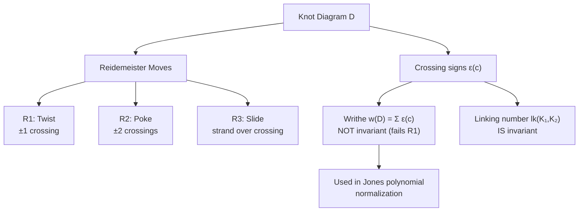
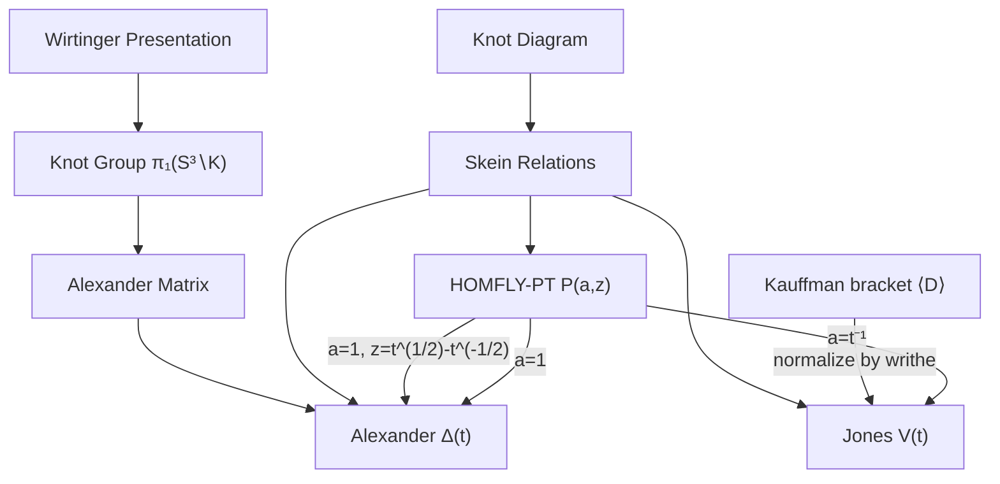
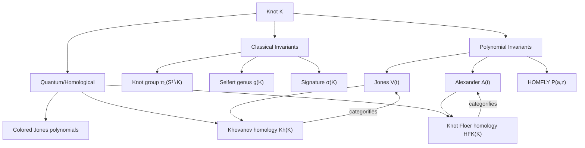

# Knot Theory

> The mathematical study of knots — embeddings of $S^1$ in $S^3$ up to ambient isotopy. A central subject in low-dimensional topology with deep connections to algebra, physics, and biology.

---

## Part I — Knots, Links, and Diagrams

### Week 1: Basic Definitions

**Knot.** A smooth (or PL) embedding $K: S^1 \hookrightarrow S^3$ (equivalently $\mathbb{R}^3$). Two knots are *equivalent* if related by an ambient isotopy of $S^3$.

**Link.** A disjoint union of knots: $L: S^1 \sqcup \cdots \sqcup S^1 \hookrightarrow S^3$.

**Knot diagram.** The image of a generic projection $K \to \mathbb{R}^2$ with over/under crossing information at each double point.

**Fundamental knots:**

| Knot | Crossings | Name | Properties |
|------|-----------|------|------------|
| $0_1$ | 0 | Unknot | Trivial |
| $3_1$ | 3 | Trefoil | Simplest nontrivial; chiral |
| $4_1$ | 4 | Figure-eight | Amphichiral (equivalent to mirror) |
| $5_1$ | 5 | Torus knot $(2,5)$ | |
| $5_2$ | 5 | Solomon's seal variant | |

**Torus knots.** $T(p,q)$ wraps $p$ times around the meridian and $q$ times around the longitude of a torus. Nontrivial when $p, q \geq 2$.

### Week 2: Reidemeister Moves

**Theorem (Reidemeister, 1927).** Two diagrams represent the same knot iff they are related by a finite sequence of three local moves:

- **R1 (twist):** Add or remove a curl (changes crossing count by $\pm 1$)
- **R2 (poke):** Add or remove two crossings between two strands
- **R3 (slide):** Slide a strand over/under a crossing

A function on diagrams is a *knot invariant* iff it is unchanged by all three Reidemeister moves.

**Oriented Reidemeister moves.** For oriented knots, each move has variants. An invariant of oriented links must be preserved by all oriented variants.

### Week 3: Writhe and Linking Number

**Crossing sign.** At each crossing of an oriented diagram, assign $+1$ or $-1$ using the right-hand rule:
$$\varepsilon(c) = \begin{cases} +1 & \text{right-handed crossing} \\ -1 & \text{left-handed crossing} \end{cases}$$

**Writhe.** $w(D) = \sum_{c} \varepsilon(c)$ (sum over all crossings). NOT a knot invariant (changes under R1), but useful in constructing invariants.

**Linking number.** For a 2-component oriented link $L = K_1 \cup K_2$:
$$\text{lk}(K_1, K_2) = \frac{1}{2} \sum_{c \in K_1 \cap K_2} \varepsilon(c)$$

This IS a link invariant. The Hopf link has $\text{lk} = \pm 1$.

**Gauss integral formula:**
$$\text{lk}(K_1, K_2) = \frac{1}{4\pi} \oint_{K_1} \oint_{K_2} \frac{\mathbf{r}_1 - \mathbf{r}_2}{|\mathbf{r}_1 - \mathbf{r}_2|^3} \cdot (d\mathbf{r}_1 \times d\mathbf{r}_2)$$

---

## Part II — Polynomial Invariants

### Week 4: The Alexander Polynomial

**Knot group.** $\pi_1(S^3 \setminus K)$ — the fundamental group of the knot complement. Computed from a diagram via the *Wirtinger presentation*.

**Alexander polynomial** $\Delta_K(t) \in \mathbb{Z}[t^{\pm 1}]$ (defined up to $\pm t^k$):

**Properties:**
- $\Delta_{\text{unknot}}(t) = 1$
- $\Delta_{3_1}(t) = t - 1 + t^{-1}$
- $\Delta_{4_1}(t) = -t + 3 - t^{-1}$
- Satisfies $\Delta_K(t) = \Delta_K(t^{-1})$ (symmetry)
- $\Delta_K(1) = \pm 1$

**Skein relation.** If $D_+, D_-, D_0$ are diagrams differing only at one crossing:
$$\Delta_{D_+}(t) - \Delta_{D_-}(t) = (t^{1/2} - t^{-1/2}) \Delta_{D_0}(t)$$

**Limitation.** Cannot distinguish the unknot from some nontrivial knots (e.g., the Kinoshita-Terasaka knot has $\Delta = 1$).

### Week 5: The Jones Polynomial

**Kauffman bracket.** For an unoriented diagram $D$, define $\langle D \rangle \in \mathbb{Z}[A^{\pm 1}]$ by:
1. $\langle \bigcirc \rangle = 1$
2. $\langle D \sqcup \bigcirc \rangle = (-A^2 - A^{-2}) \langle D \rangle$
3. At each crossing: $\langle D \rangle = A \langle D_0 \rangle + A^{-1} \langle D_\infty \rangle$ (two resolutions)

**Jones polynomial.** For an oriented link $L$ with diagram $D$:
$$V_L(t) = (-A)^{-3w(D)} \langle D \rangle \bigg|_{A = t^{-1/4}}$$

**Key properties:**
- $V_{\text{unknot}}(t) = 1$
- $V_{3_1}(t) = -t^{-4} + t^{-3} + t^{-1}$ (left-handed trefoil)
- $V_{K}(t) \neq V_{\bar{K}}(t)$ in general — detects chirality!
- **Skein relation:** $t^{-1}V_{L_+} - tV_{L_-} = (t^{1/2} - t^{-1/2})V_{L_0}$

**Open problem.** Does $V_K(t) = 1$ imply $K$ is the unknot? (Unknown as of 2026.)

### Week 6: The HOMFLY-PT Polynomial

**HOMFLY-PT polynomial** $P_L(a, z) \in \mathbb{Z}[a^{\pm 1}, z^{\pm 1}]$ generalizes both Alexander and Jones:
$$a P_{L_+} - a^{-1} P_{L_-} = z P_{L_0}$$

**Specializations:**
- $P(1, t^{1/2} - t^{-1/2})$ gives $\Delta_K(t)$ (Alexander)
- $P(t^{-1}, t^{1/2} - t^{-1/2})$ gives $V_K(t)$ (Jones)

**Strictly stronger:** The HOMFLY polynomial distinguishes some knots that Alexander and Jones individually cannot.

---

## Part III — Braid Groups and Seifert Surfaces

### Week 7: Braid Groups

**Braid group** $B_n$ on $n$ strands. Generators $\sigma_1, \ldots, \sigma_{n-1}$ with relations:
- $\sigma_i \sigma_j = \sigma_j \sigma_i$ for $|i-j| \geq 2$
- $\sigma_i \sigma_{i+1} \sigma_i = \sigma_{i+1} \sigma_i \sigma_{i+1}$ (braid relation)

**Alexander's theorem.** Every link is the *closure* $\hat{\beta}$ of some braid $\beta \in B_n$.

**Markov's theorem.** $\hat{\beta}$ and $\hat{\beta'}$ represent the same link iff $\beta$ and $\beta'$ are related by:
1. Conjugation in $B_n$: $\beta \mapsto \gamma \beta \gamma^{-1}$
2. Stabilization: $\beta \in B_n \mapsto \beta \sigma_n^{\pm 1} \in B_{n+1}$

**Braid index.** The minimum $n$ such that $K = \hat{\beta}$ for some $\beta \in B_n$. The Morton-Williams-Franks inequality bounds this using the HOMFLY polynomial.

### Week 8: Seifert Surfaces

**Seifert surface.** An oriented surface $\Sigma$ with $\partial \Sigma = K$ (boundary is the knot).

**Seifert's algorithm.** Given an oriented knot diagram:
1. At each crossing, resolve to preserve orientation (Seifert resolution)
2. This produces disjoint *Seifert circles*
3. Fill circles with disks, connect with twisted bands at former crossings

**Seifert genus.** $g(K) = \min\{g(\Sigma) \mid \Sigma \text{ is a Seifert surface for } K\}$.

**Properties:**
- $g(K) = 0 \iff K$ is the unknot
- $g(K_1 \# K_2) = g(K_1) + g(K_2)$ (genus is additive under connected sum)
- $\deg \Delta_K(t) \leq 2g(K)$ (Alexander polynomial gives lower bound)

**Seifert matrix.** Choose basis $\{a_1, \ldots, a_{2g}\}$ for $H_1(\Sigma)$. The *Seifert matrix* $V$ has entries:
$$V_{ij} = \text{lk}(a_i, a_j^+)$$
where $a_j^+$ is $a_j$ pushed slightly off $\Sigma$ in the positive normal direction.

$$\Delta_K(t) = \det(t^{1/2} V - t^{-1/2} V^T)$$

### Week 9: Knot Complements

**Gordon-Luecke Theorem (1989).** Knots are determined by their complements: if $S^3 \setminus K_1 \cong S^3 \setminus K_2$ (orientation-preserving), then $K_1 = K_2$.

**Thurston's theorem.** Knot complements decompose into pieces that are either:
- Seifert-fibered, or
- Hyperbolic

Most knots are *hyperbolic* — their complements admit a complete hyperbolic metric of finite volume. The hyperbolic volume is a knot invariant.

**Example volumes:**
- Figure-eight: $\text{vol}(S^3 \setminus 4_1) = 2.0298832\ldots$ (the minimum for hyperbolic knots)
- $5_2$: $\text{vol} = 2.8281220\ldots$

---

## Part IV — Advanced Invariants

### Week 10: Knot Concordance and Slice Knots

**Concordance.** Knots $K_0, K_1$ in $S^3$ are *concordant* if there exists a smooth annulus $A \cong S^1 \times [0,1] \hookrightarrow S^3 \times [0,1]$ with $A \cap (S^3 \times \{i\}) = K_i$.

**Slice knot.** $K$ is *slice* if it bounds a smooth disk in $D^4$. Equivalently, concordant to the unknot.

**Knot concordance group.** $\mathcal{C} = \{\text{knots}\} / \text{concordance}$ with connected sum. This is an abelian group; inverse of $K$ is the mirror reverse $\bar{K}^r$.

**Slice obstructions:**
- Alexander polynomial: $\Delta_K(t) = f(t) \cdot f(t^{-1})$ for some $f$ (Fox-Milnor condition)
- Signature $\sigma(K) = 0$
- Rasmussen $s$-invariant = 0

### Week 11: Quantum Invariants and TQFT

**Witten-Reshetikhin-Turaev invariants.** Using representations of quantum groups $U_q(\mathfrak{g})$, one constructs invariants of knots and 3-manifolds.

**Jones polynomial from statistical mechanics.** The Kauffman bracket relates to the partition function of the Potts model. The Jones polynomial arises from the representation theory of $U_q(\mathfrak{sl}_2)$.

**TQFT perspective.** A topological quantum field theory assigns:
- Vector space $Z(\Sigma)$ to a closed surface $\Sigma$
- Linear map $Z(M): Z(\Sigma_1) \to Z(\Sigma_2)$ to a cobordism $M: \Sigma_1 \to \Sigma_2$

Knot invariants arise from the Chern-Simons TQFT with gauge group $SU(2)$.

**Khovanov homology.** A *categorification* of the Jones polynomial: $\text{Kh}(K)$ is a bigraded homology theory with:
$$V_K(t) = \sum_{i,j} (-1)^i t^j \dim \text{Kh}^{i,j}(K)$$

Strictly stronger than Jones: detects the unknot (Kronheimer-Mrowka, via relation to instanton Floer homology).

---

## References

1. **Adams, C.C.** *The Knot Book* (1994, revised 2004). AMS. — Outstanding introduction; accessible and richly illustrated.
2. **Lickorish, W.B.R.** *An Introduction to Knot Theory* (1997). Springer GTM 175. — Rigorous graduate text covering polynomial invariants and 3-manifold connections.
3. **Kauffman, L.H.** *Knots and Physics* (4th ed., 2013). World Scientific. — Emphasizes connections to statistical mechanics and quantum field theory.
