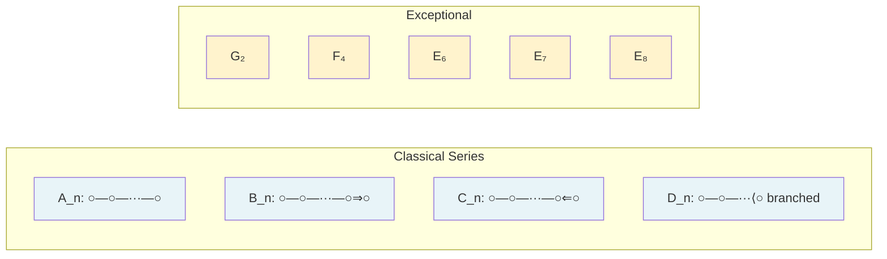
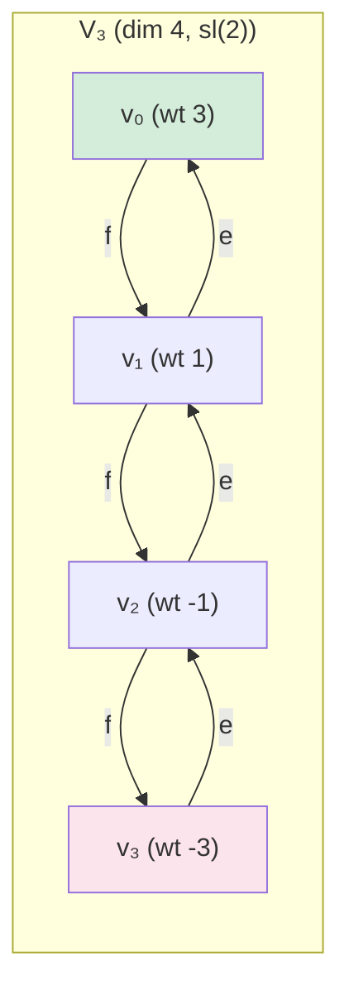

# Lie Algebras and Representation Theory

Graduate course on the structure and classification of semisimple Lie algebras over $\mathbb{C}$, root systems, Dynkin diagrams, and the representation theory of semisimple Lie algebras via highest weight theory.

---

## Part I: Foundations

### Week 1 — Definitions and First Examples

**Definition.** A *Lie algebra* over a field $k$ is a vector space $\mathfrak{g}$ equipped with a bilinear map $[\cdot, \cdot]: \mathfrak{g} \times \mathfrak{g} \to \mathfrak{g}$ (the *Lie bracket*) satisfying:
1. **Skew-symmetry:** $[x, x] = 0$ for all $x \in \mathfrak{g}$ (equivalently, $[x, y] = -[y, x]$).
2. **Jacobi identity:** $[x, [y, z]] + [y, [z, x]] + [z, [x, y]] = 0$ for all $x, y, z \in \mathfrak{g}$.

**Examples:**
- $\mathfrak{gl}(n, k) = \operatorname{Mat}_{n \times n}(k)$ with $[A, B] = AB - BA$.
- $\mathfrak{sl}(n, k) = \{A \in \mathfrak{gl}(n) : \operatorname{tr}(A) = 0\}$, dimension $n^2 - 1$.
- $\mathfrak{so}(n, k) = \{A \in \mathfrak{gl}(n) : A + A^T = 0\}$.
- $\mathfrak{sp}(2n, k) = \{A \in \mathfrak{gl}(2n) : A^T J + JA = 0\}$ where $J = \begin{pmatrix} 0 & I_n \\ -I_n & 0 \end{pmatrix}$.
- Any associative algebra $A$ becomes a Lie algebra via $[a, b] = ab - ba$.

**Definition.** A *Lie algebra homomorphism* is a linear map $\varphi: \mathfrak{g} \to \mathfrak{h}$ with $\varphi([x,y]) = [\varphi(x), \varphi(y)]$.

An *ideal* $\mathfrak{a} \subseteq \mathfrak{g}$ is a subspace with $[\mathfrak{g}, \mathfrak{a}] \subseteq \mathfrak{a}$. The quotient $\mathfrak{g}/\mathfrak{a}$ inherits a Lie algebra structure.

### Week 2 — Solvable and Nilpotent Lie Algebras

**Derived Series.** Define $\mathfrak{g}^{(0)} = \mathfrak{g}$, $\mathfrak{g}^{(k+1)} = [\mathfrak{g}^{(k)}, \mathfrak{g}^{(k)}]$. The Lie algebra $\mathfrak{g}$ is *solvable* if $\mathfrak{g}^{(n)} = 0$ for some $n$.

**Lower Central Series.** Define $\mathfrak{g}^0 = \mathfrak{g}$, $\mathfrak{g}^{k+1} = [\mathfrak{g}, \mathfrak{g}^k]$. The Lie algebra $\mathfrak{g}$ is *nilpotent* if $\mathfrak{g}^n = 0$ for some $n$.

**Relation:** nilpotent $\Rightarrow$ solvable (since $\mathfrak{g}^{(k)} \subseteq \mathfrak{g}^k$).

**Lie's Theorem.** Let $\mathfrak{g}$ be a solvable Lie algebra over an algebraically closed field of characteristic zero, and let $V$ be a finite-dimensional $\mathfrak{g}$-module. Then there exists a common eigenvector for all of $\mathfrak{g}$: i.e., $v \in V$ with $x \cdot v = \lambda(x) v$ for all $x \in \mathfrak{g}$, where $\lambda \in \mathfrak{g}^*$.

**Engel's Theorem.** If every element $x \in \mathfrak{g}$ acts nilpotently on a finite-dimensional module $V$ (i.e., $x^n = 0$ for some $n$ depending on $x$), then there exists $v \neq 0$ with $x \cdot v = 0$ for all $x \in \mathfrak{g}$.

**Corollary.** $\mathfrak{g}$ is nilpotent $\iff$ $\operatorname{ad}(x)$ is nilpotent for all $x \in \mathfrak{g}$.

### Week 3 — Semisimple Lie Algebras and the Killing Form

**Definition.** $\mathfrak{g}$ is *simple* if it is non-abelian and has no proper nonzero ideals. $\mathfrak{g}$ is *semisimple* if it has no nonzero solvable ideals.

**Theorem.** $\mathfrak{g}$ is semisimple $\iff$ $\mathfrak{g} = \mathfrak{g}_1 \oplus \cdots \oplus \mathfrak{g}_k$ where each $\mathfrak{g}_i$ is a simple ideal.

**Killing Form.** The *Killing form* is the symmetric bilinear form:
$$\kappa(x, y) = \operatorname{tr}(\operatorname{ad}(x) \circ \operatorname{ad}(y))$$
where $\operatorname{ad}(x)(z) = [x, z]$.

**Properties:**
- $\kappa$ is invariant: $\kappa([x,y], z) = \kappa(x, [y,z])$.
- **Cartan's Criterion (solvability):** $\mathfrak{g}$ is solvable $\iff$ $\kappa(x, y) = 0$ for all $x \in \mathfrak{g}$, $y \in [\mathfrak{g}, \mathfrak{g}]$.
- **Cartan's Criterion (semisimplicity):** $\mathfrak{g}$ is semisimple $\iff$ $\kappa$ is non-degenerate.

**Example.** For $\mathfrak{sl}(n, \mathbb{C})$: $\kappa(X, Y) = 2n \cdot \operatorname{tr}(XY)$, which is non-degenerate, confirming semisimplicity.

---

## Part II: Structure Theory

### Week 4 — Cartan Subalgebras and Root Space Decomposition

**Definition.** A *Cartan subalgebra* $\mathfrak{h} \subseteq \mathfrak{g}$ is a maximal abelian subalgebra consisting of semisimple (diagonalizable) elements. For $\mathfrak{g}$ semisimple over $\mathbb{C}$, Cartan subalgebras exist and are conjugate under $\operatorname{Aut}(\mathfrak{g})$.

**Root Space Decomposition.** For a semisimple $\mathfrak{g}$ with Cartan subalgebra $\mathfrak{h}$:
$$\mathfrak{g} = \mathfrak{h} \oplus \bigoplus_{\alpha \in \Phi} \mathfrak{g}_\alpha$$
where $\Phi \subset \mathfrak{h}^* \setminus \{0\}$ is the *root system* and:
$$\mathfrak{g}_\alpha = \{x \in \mathfrak{g} : [h, x] = \alpha(h) x \text{ for all } h \in \mathfrak{h}\}.$$

**Properties of root spaces:**
- $\dim \mathfrak{g}_\alpha = 1$ for each $\alpha \in \Phi$.
- $[\mathfrak{g}_\alpha, \mathfrak{g}_\beta] \subseteq \mathfrak{g}_{\alpha+\beta}$ (with $\mathfrak{g}_{\alpha+\beta} = 0$ if $\alpha + \beta \notin \Phi \cup \{0\}$).
- $\alpha \in \Phi \Rightarrow -\alpha \in \Phi$.
- $\kappa|_\mathfrak{h}$ is non-degenerate, inducing an isomorphism $\mathfrak{h} \cong \mathfrak{h}^*$.

**Example.** $\mathfrak{sl}(n, \mathbb{C})$: $\mathfrak{h}$ = diagonal traceless matrices, $\operatorname{rank} = n-1$, roots $\Phi = \{e_i - e_j : i \neq j\}$ (type $A_{n-1}$).

### Week 5 — Root Systems

**Abstract Root System.** A *root system* in a real inner product space $(E, (\cdot, \cdot))$ is a finite set $\Phi \subset E \setminus \{0\}$ satisfying:
1. $\Phi$ spans $E$.
2. If $\alpha \in \Phi$, then $c\alpha \in \Phi \iff c = \pm 1$.
3. For each $\alpha \in \Phi$, the reflection $s_\alpha: E \to E$, $s_\alpha(\beta) = \beta - \langle \beta, \alpha \rangle \alpha$ maps $\Phi$ to $\Phi$, where $\langle \beta, \alpha \rangle = \frac{2(\beta, \alpha)}{(\alpha, \alpha)}$.
4. $\langle \beta, \alpha \rangle \in \mathbb{Z}$ for all $\alpha, \beta \in \Phi$.

**Simple Roots.** A *base* (or set of *simple roots*) $\Delta = \{\alpha_1, \ldots, \alpha_\ell\} \subset \Phi$ is a basis of $E$ such that every root $\beta \in \Phi$ is a $\mathbb{Z}_{\geq 0}$-linear or $\mathbb{Z}_{\leq 0}$-linear combination of $\Delta$. This gives $\Phi = \Phi^+ \sqcup \Phi^-$.

**Cartan Matrix.** $A_{ij} = \langle \alpha_i, \alpha_j \rangle$. Properties: $A_{ii} = 2$, $A_{ij} \leq 0$ for $i \neq j$, $A_{ij} = 0 \iff A_{ji} = 0$.

**Weyl Group.** $W = \langle s_{\alpha_1}, \ldots, s_{\alpha_\ell} \rangle$ is a finite reflection group that acts simply transitively on the set of bases.

### Week 6 — Dynkin Diagrams and Classification

**Dynkin Diagram.** Nodes represent simple roots $\alpha_i$. Nodes $i$ and $j$ are connected by $A_{ij} \cdot A_{ji} \in \{0, 1, 2, 3\}$ edges, with an arrow pointing from the longer to the shorter root when edges $> 1$.

**Classification Theorem.** The connected Dynkin diagrams (equivalently, the simple Lie algebras over $\mathbb{C}$) are:

| Type | Diagram | Lie Algebra | Rank | $\dim$ |
|------|---------|-------------|------|--------|
| $A_n$ ($n \geq 1$) | $\circ - \circ - \cdots - \circ$ | $\mathfrak{sl}(n+1)$ | $n$ | $n^2 + 2n$ |
| $B_n$ ($n \geq 2$) | $\circ - \circ - \cdots - \circ \Rightarrow \circ$ | $\mathfrak{so}(2n+1)$ | $n$ | $2n^2 + n$ |
| $C_n$ ($n \geq 3$) | $\circ - \circ - \cdots - \circ \Leftarrow \circ$ | $\mathfrak{sp}(2n)$ | $n$ | $2n^2 + n$ |
| $D_n$ ($n \geq 4$) | forked at end | $\mathfrak{so}(2n)$ | $n$ | $2n^2 - n$ |
| $G_2$ | $\circ \Rrightarrow \circ$ | exceptional | $2$ | $14$ |
| $F_4$ | $\circ - \circ \Rightarrow \circ - \circ$ | exceptional | $4$ | $52$ |
| $E_6$ | branched | exceptional | $6$ | $78$ |
| $E_7$ | branched | exceptional | $7$ | $133$ |
| $E_8$ | branched | exceptional | $8$ | $248$ |

**Dimension Formula.** $\dim \mathfrak{g} = \ell + |\Phi|$ where $\ell = \operatorname{rank} = \dim \mathfrak{h}$ and $|\Phi| = |\Phi^+| + |\Phi^-| = 2|\Phi^+|$.

---

## Part III: Representation Theory

### Week 7 — Representations and Complete Reducibility

**Definition.** A *representation* of $\mathfrak{g}$ is a Lie algebra homomorphism $\rho: \mathfrak{g} \to \mathfrak{gl}(V)$ for a vector space $V$. Equivalently, $V$ is a $\mathfrak{g}$-module.

**Weyl's Theorem (Complete Reducibility).** Every finite-dimensional representation of a semisimple Lie algebra over $\mathbb{C}$ is completely reducible (a direct sum of irreducible representations).

*Proof uses:* Casimir element $c = \sum_i x_i y_i \in U(\mathfrak{g})$ (where $\{x_i\}, \{y_i\}$ are dual bases w.r.t. $\kappa$), which acts as a scalar on irreducibles by Schur's lemma.

### Week 8 — Weight Spaces and Highest Weight Theory

**Weight Decomposition.** For a $\mathfrak{g}$-module $V$:
$$V = \bigoplus_{\mu \in \mathfrak{h}^*} V_\mu, \quad V_\mu = \{v \in V : h \cdot v = \mu(h) v \; \forall h \in \mathfrak{h}\}.$$
The nonzero $V_\mu$ are *weight spaces* and $\mu$ is a *weight*.

**Highest Weight.** A weight $\lambda$ is *highest* if $\mathfrak{g}_\alpha \cdot v_\lambda = 0$ for all $\alpha \in \Phi^+$ (equivalently, $\mathfrak{n}^+ \cdot v_\lambda = 0$ where $\mathfrak{n}^+ = \bigoplus_{\alpha > 0} \mathfrak{g}_\alpha$).

**Theorem (Classification of Irreducibles).** There is a bijection:
$$\{\text{irreducible finite-dim } \mathfrak{g}\text{-modules}\} \longleftrightarrow \{\text{dominant integral weights}\}$$
$$V(\lambda) \longleftrightarrow \lambda$$
A weight $\lambda \in \mathfrak{h}^*$ is *dominant integral* if $\langle \lambda, \alpha_i \rangle \in \mathbb{Z}_{\geq 0}$ for all simple roots $\alpha_i$.

**Fundamental Weights.** $\omega_1, \ldots, \omega_\ell$ defined by $\langle \omega_i, \alpha_j \rangle = \delta_{ij}$. Every dominant integral weight is $\lambda = \sum m_i \omega_i$ with $m_i \in \mathbb{Z}_{\geq 0}$.

### Week 9 — Verma Modules

**Universal Enveloping Algebra.** $U(\mathfrak{g}) = T(\mathfrak{g}) / (x \otimes y - y \otimes x - [x,y])$. The PBW theorem gives: $U(\mathfrak{g}) \cong U(\mathfrak{n}^-) \otimes U(\mathfrak{h}) \otimes U(\mathfrak{n}^+)$ as vector spaces.

**Verma Module.** For $\lambda \in \mathfrak{h}^*$, define:
$$M(\lambda) = U(\mathfrak{g}) \otimes_{U(\mathfrak{b})} \mathbb{C}_\lambda$$
where $\mathfrak{b} = \mathfrak{h} \oplus \mathfrak{n}^+$ acts on $\mathbb{C}_\lambda$ via $\lambda$ on $\mathfrak{h}$ and trivially on $\mathfrak{n}^+$.

**Properties:**
- $M(\lambda)$ has a unique maximal proper submodule $N(\lambda)$.
- $L(\lambda) = M(\lambda)/N(\lambda)$ is the unique irreducible module with highest weight $\lambda$.
- $\dim M(\lambda)_\mu = p(\lambda - \mu)$ (Kostant's partition function).
- $L(\lambda)$ is finite-dimensional $\iff$ $\lambda$ is dominant integral.

### Week 10 — Weyl Character Formula

**Character.** For a finite-dimensional $\mathfrak{g}$-module $V$:
$$\operatorname{ch}(V) = \sum_{\mu} (\dim V_\mu) \, e^\mu \in \mathbb{Z}[\mathfrak{h}^*].$$

**Weyl Character Formula.** For the irreducible module $L(\lambda)$ with highest weight $\lambda$:
$$\operatorname{ch}(L(\lambda)) = \frac{\displaystyle\sum_{w \in W} (-1)^{\ell(w)} e^{w(\lambda + \rho)}}{\displaystyle\sum_{w \in W} (-1)^{\ell(w)} e^{w(\rho)}}$$
where $\rho = \frac{1}{2}\sum_{\alpha \in \Phi^+} \alpha = \sum_i \omega_i$ is the *Weyl vector* and $\ell(w)$ is the length of $w \in W$.

**Weyl Dimension Formula.** Setting all $e^\mu = 1$:
$$\dim L(\lambda) = \prod_{\alpha \in \Phi^+} \frac{(\lambda + \rho, \alpha)}{(\rho, \alpha)}.$$

**Example ($\mathfrak{sl}(2)$).** $\Phi^+ = \{\alpha\}$, $\rho = \alpha/2$, $\lambda = m\omega_1 = m\alpha/2$:
$$\dim L(m\omega_1) = \frac{(m\alpha/2 + \alpha/2, \alpha)}{(\alpha/2, \alpha)} = m + 1.$$
This is the $(m+1)$-dimensional irreducible representation (the symmetric power $\operatorname{Sym}^m(\mathbb{C}^2)$).

### Week 11 — $\mathfrak{sl}(2)$-Theory and Representation Ring

**$\mathfrak{sl}(2, \mathbb{C})$ Representations.** Basis: $e = \begin{pmatrix} 0 & 1 \\ 0 & 0 \end{pmatrix}$, $f = \begin{pmatrix} 0 & 0 \\ 1 & 0 \end{pmatrix}$, $h = \begin{pmatrix} 1 & 0 \\ 0 & -1 \end{pmatrix}$ with $[h,e] = 2e$, $[h,f] = -2f$, $[e,f] = h$.

The irreducible module $V_m$ ($m \geq 0$) has:
- Basis $v_0, v_1, \ldots, v_m$ with $h \cdot v_k = (m - 2k) v_k$.
- $e \cdot v_k = (m - k + 1) v_{k-1}$, $f \cdot v_k = (k + 1) v_{k+1}$.
- Weights: $m, m-2, \ldots, -m+2, -m$.

**Clebsch-Gordan.** $V_m \otimes V_n \cong V_{m+n} \oplus V_{m+n-2} \oplus \cdots \oplus V_{|m-n|}$.

*The 4-dimensional irreducible $\mathfrak{sl}(2)$-module: $e$ raises weight, $f$ lowers it.*

---

## Part IV: Advanced Topics

### Week 12 — Weyl Group Combinatorics

**Length Function.** $\ell(w) = |\{$positive roots sent to negative by $w\}| = $ minimal number of simple reflections in a reduced expression for $w$.

**Bruhat Order.** $u \leq w$ if some (equivalently, every) reduced expression for $w$ contains a subword that is a reduced expression for $u$.

**Chevalley Formula.** Describes the multiplication of Schubert classes in the cohomology ring of the flag variety $G/B$.

### Week 13 — Tensor Products and Branching Rules

**Tensor Product Multiplicities.** For dominant integral $\lambda, \mu$:
$$L(\lambda) \otimes L(\mu) \cong \bigoplus_\nu L(\nu)^{\oplus c_{\lambda\mu}^\nu}$$
where $c_{\lambda\mu}^\nu$ are the *Littlewood-Richardson coefficients* (for type $A$) or more generally the *tensor product multiplicities*.

**Steinberg's Formula:**
$$c_{\lambda\mu}^\nu = \sum_{w_1, w_2 \in W} (-1)^{\ell(w_1) + \ell(w_2)} p(w_1(\lambda + \rho) + w_2(\mu + \rho) - (\nu + 2\rho))$$
where $p$ is Kostant's partition function.

### Week 14 — Connections to Lie Groups

**Lie Group–Lie Algebra Correspondence.** For a connected, simply connected Lie group $G$:
- $\operatorname{Lie}(G) = T_e G \cong \mathfrak{g}$ with bracket from the group commutator.
- $\exp: \mathfrak{g} \to G$ is a local diffeomorphism near $0$.
- Representations of $G$ $\leftrightarrow$ representations of $\mathfrak{g}$ (for simply connected $G$).
- Connected Lie subgroups of $G$ $\leftrightarrow$ Lie subalgebras of $\mathfrak{g}$.

**Peter-Weyl Theorem.** For a compact Lie group $G$:
$$L^2(G) \cong \widehat{\bigoplus}_{\lambda \in \hat{G}} V_\lambda \otimes V_\lambda^*$$
as a $G \times G$-representation. The matrix coefficients of irreducible representations form a complete orthogonal system.

---

## Exercises

1. Compute the Killing form of $\mathfrak{sl}(3, \mathbb{C})$ and verify it is non-degenerate.
2. Find the root system, Cartan matrix, and Weyl group for $\mathfrak{sp}(4, \mathbb{C})$ ($= C_2$).
3. Use the Weyl dimension formula to compute $\dim L(\omega_1 + \omega_2)$ for $\mathfrak{sl}(3)$.
4. Decompose $V_2 \otimes V_3$ as a direct sum of irreducible $\mathfrak{sl}(2)$-modules.
5. Verify that the Verma module $M(\lambda)$ for $\mathfrak{sl}(2)$ with $\lambda = -3$ is reducible by finding a singular vector.

---

## References

- Humphreys, J.E. *Introduction to Lie Algebras and Representation Theory*. Springer GTM 9, 1972.
- Fulton, W. & Harris, J. *Representation Theory: A First Course*. Springer GTM 129, 1991.
- Knapp, A.W. *Lie Groups Beyond an Introduction*. 2nd ed. Birkhauser, 2002.
- Serre, J.-P. *Complex Semisimple Lie Algebras*. Springer, 2001.
- Hall, B.C. *Lie Groups, Lie Algebras, and Representations*. 2nd ed. Springer GTM 222, 2015.
- Bourbaki, N. *Lie Groups and Lie Algebras*, Chapters 4-6. Springer, 2002.
