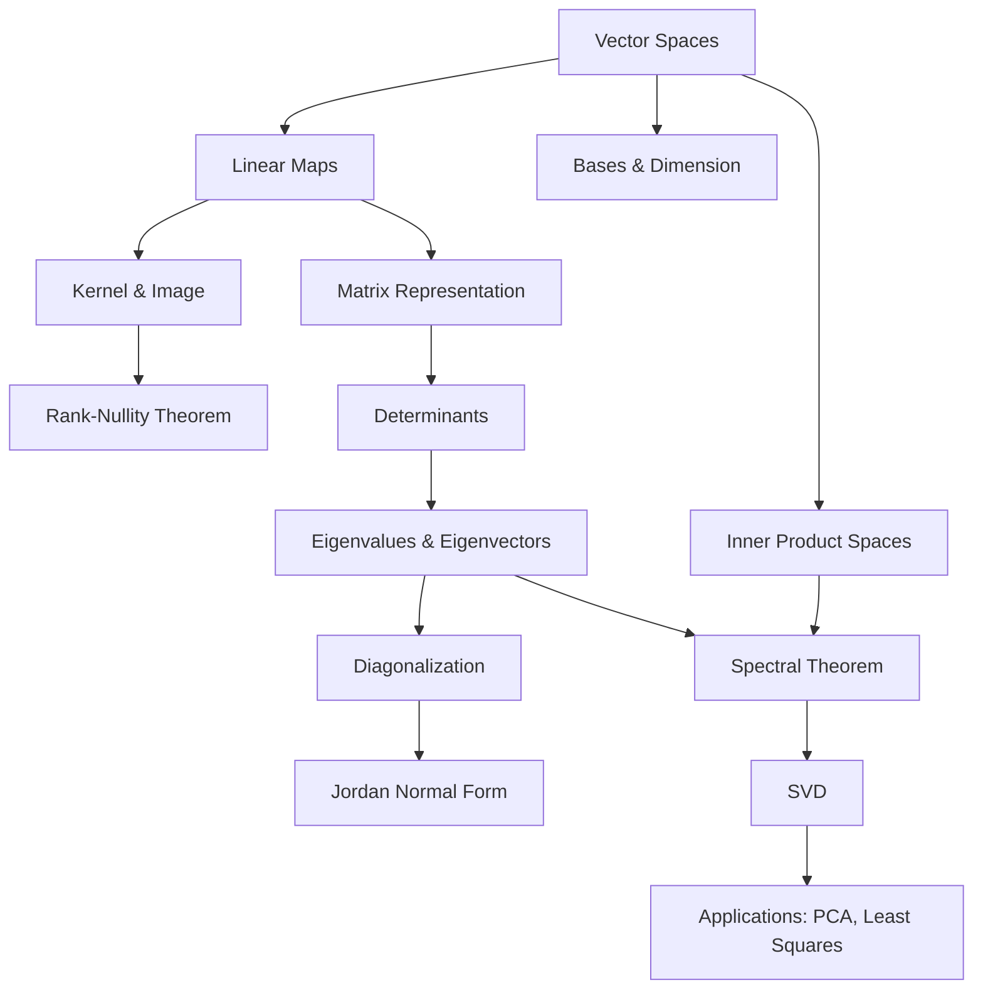
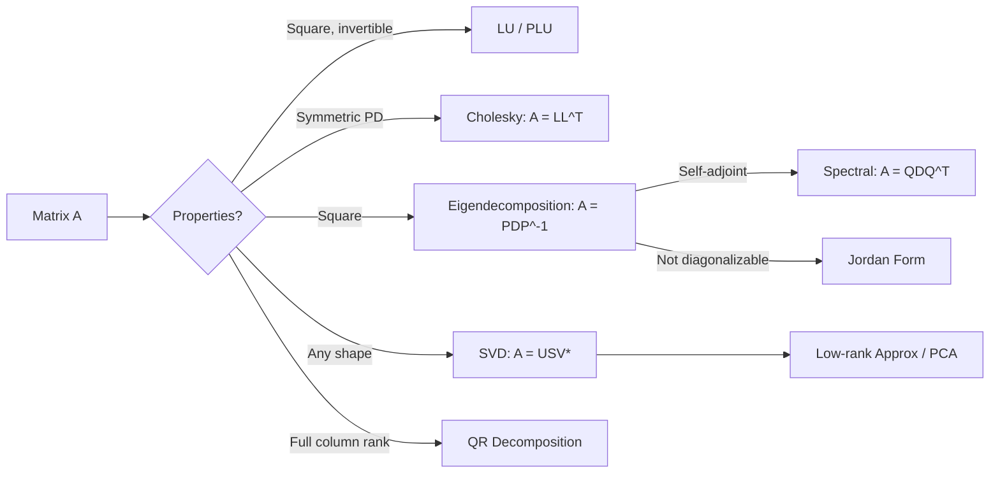

# Linear Algebra

> *"Linear algebra is the branch of mathematics concerning linear equations, linear maps, and their representations in vector spaces and through matrices."*

Back to [[../math-syllabus|Mathematics Syllabus]] | Related: [[real-analysis]], [[optimization]], [[probability-statistics]]

---

## Concept Map

---

## Motivation

Linear algebra is the single most applicable branch of pure mathematics. It is the language of quantum mechanics, the engine behind machine learning, the backbone of signal processing, and the foundation for nearly every area of applied mathematics. Mastery of linear algebra — not merely matrix computation, but the abstract theory of vector spaces and linear maps — unlocks the ability to think structurally about problems across science and engineering.

## Prerequisites

- Comfort with mathematical proof (induction, contradiction, contrapositive)
- Basic set theory and functions
- Familiarity with systems of linear equations from a first course

## Recommended References

- **Axler**, *Linear Algebra Done Right* (3rd ed.) — the gold standard for abstract treatment
- **Hoffman & Kunze**, *Linear Algebra* — rigorous, classical
- **Strang**, *Introduction to Linear Algebra* — computational and intuitive
- **Roman**, *Advanced Linear Algebra* — for the later, more advanced topics
- **Horn & Johnson**, *Matrix Analysis* — the definitive reference for matrix theory

---

## Part I: Foundations (Weeks 1--4)

### Week 1: Vector Spaces

**Topics:**
- Fields ($\mathbb{R}$, $\mathbb{C}$, $\mathbb{Q}$, finite fields $\mathbb{F}_p$) as scalar domains
- Definition of a vector space over a field $F$
- Subspaces: definition, intersection, sum, direct sum
- Span and linear independence
- Bases and dimension; every vector space has a basis (requires Zorn's lemma in infinite dimensions)

**Key Results:**
- **Replacement Theorem (Steinitz Exchange Lemma):** Any linearly independent set can be extended to a basis; any spanning set contains a basis. Consequently, all bases of a finite-dimensional vector space have the same cardinality.
  - *Proof sketch:* Given a basis $\{e_1,\ldots,e_n\}$ and a linearly independent set $\{v_1,\ldots,v_k\}$, iteratively replace $e_i$'s with $v_j$'s. At each step, the $v_j$ being added cannot be in the span of the current partial set (by independence), so some $e_i$ can be swapped out while maintaining a spanning set.
- **Dimension formula for sums:** $\dim(U + W) = \dim(U) + \dim(W) - \dim(U \cap W)$.

### Week 2: Linear Maps

**Topics:**
- Definition of linear maps (homomorphisms of vector spaces)
- Kernel (null space) and image (range)
- Injective $\iff$ $\ker T = \{0\}$; surjective $\iff$ $\operatorname{im} T = W$
- The vector space $\operatorname{Hom}(V, W) = \mathcal{L}(V, W)$
- Isomorphism: $V \cong W$ iff $\dim(V) = \dim(W)$ (finite-dimensional case)

**Key Results:**
- **Rank-Nullity Theorem (Fundamental Theorem of Linear Algebra):** For $T: V \to W$ with $V$ finite-dimensional, $\dim(V) = \dim(\ker T) + \dim(\operatorname{im} T)$.
  - *Proof sketch:* Let $\{u_1,\ldots,u_k\}$ be a basis of $\ker T$. Extend to a basis $\{u_1,\ldots,u_k,v_1,\ldots,v_r\}$ of $V$. Show $\{T(v_1),\ldots,T(v_r)\}$ is a basis of $\operatorname{im} T$. The result follows: $n = k + r$.
  - *Intuition:* The dimensions "consumed" by the kernel plus those "surviving" in the image account for all of $V$.

### Week 3: Matrices and Change of Basis

**Topics:**
- Matrix representation of a linear map with respect to ordered bases
- Matrix multiplication as composition of linear maps
- Change of basis: if $P$ is the change-of-basis matrix, then $[T]_{B'} = P^{-1} [T]_B P$
- Row reduction, echelon form, rank of a matrix
- Elementary matrices and invertibility

**Key Observation:** A matrix is not a linear map; it is the *representation* of a linear map relative to a choice of bases. This distinction becomes critical when studying canonical forms.

### Week 4: Systems of Linear Equations

**Topics:**
- $A\mathbf{x} = \mathbf{b}$: existence and uniqueness via rank conditions
- Fredholm alternative (finite-dimensional version): $A\mathbf{x} = \mathbf{b}$ is solvable iff $\mathbf{b}$ is orthogonal to the null space of $A^T$
- LU and PLU factorization
- Computational complexity: Gaussian elimination is $O(n^3)$

---

## Part II: Structure Theory (Weeks 5--8)

### Week 5: Determinants

**Topics:**
- Multilinear alternating forms; the determinant as the unique such form with $\det(I) = 1$
- Cofactor expansion, Leibniz formula
- Properties: $\det(AB) = \det(A)\det(B)$, $\det(A^T) = \det(A)$
- Geometric interpretation: signed volume of the parallelepiped spanned by column vectors
- Cramer's rule (theoretically important, computationally impractical)

**Key Result:**
- **$A$ is invertible iff $\det(A) \neq 0$.** Equivalently, the columns of $A$ are linearly independent, the rows are linearly independent, $\operatorname{rank}(A) = n$, the only solution to $A\mathbf{x} = \mathbf{0}$ is $\mathbf{x} = \mathbf{0}$.

### Week 6: Eigenvalues and Eigenvectors

**Topics:**
- Eigenvalue equation: $Tv = \lambda v$ (equivalently, $(T - \lambda I)v = 0$)
- Characteristic polynomial: $p(\lambda) = \det(T - \lambda I)$
- Eigenspaces $E_\lambda = \ker(T - \lambda I)$
- Algebraic vs geometric multiplicity
- Diagonalizability: $T$ is diagonalizable iff the sum of geometric multiplicities equals $\dim(V)$, equivalently iff $V$ has a basis of eigenvectors
- The Cayley-Hamilton theorem: every matrix satisfies its own characteristic polynomial

**Key Results:**
- **Eigenvectors corresponding to distinct eigenvalues are linearly independent.**
  - *Proof sketch:* Induction. If $c_1 v_1 + \cdots + c_k v_k = 0$, apply $(T - \lambda_k I)$ to reduce to $k-1$ eigenvectors.
- **Cayley-Hamilton Theorem:** $p(A) = 0$ where $p$ is the characteristic polynomial of $A$.
  - *Proof sketch (via adjugate):* Write $\operatorname{adj}(A - \lambda I)$ as a matrix polynomial in $\lambda$. Then $(A - \lambda I) \operatorname{adj}(A - \lambda I) = \det(A - \lambda I) I = p(\lambda) I$. Substitute $A$ for $\lambda$, using the fact that the matrix polynomial relation is an identity in the polynomial ring $M_n(F[\lambda])$.

### Week 7: Jordan Normal Form

**Topics:**
- Generalized eigenspaces: $G_\lambda = \ker(T - \lambda I)^n$
- The direct sum decomposition $V = G_{\lambda_1} \oplus \cdots \oplus G_{\lambda_k}$
- Nilpotent operators and their structure
- Jordan blocks and Jordan canonical form
- Computing Jordan form: chains of generalized eigenvectors
- Minimal polynomial and its relationship to Jordan structure

**Key Results:**
- **Jordan Canonical Form Theorem:** Over an algebraically closed field, every linear operator has a Jordan canonical form, unique up to permutation of blocks.
  - *Intuition:* Diagonalizable is the "generic" case; Jordan form captures the precise failure of diagonalizability via the nilpotent parts.
- **Minimal polynomial:** The minimal polynomial of $T$ divides the characteristic polynomial, has the same roots, and the exponent of each factor $(\lambda - \lambda_i)^{m_i}$ equals the size of the largest Jordan block for $\lambda_i$.

### Week 8: Rational and Smith Normal Forms

**Topics:**
- Rational canonical form (over any field, not just algebraically closed)
- Invariant factors and elementary divisors
- Smith normal form for matrices over PIDs
- Structure theorem for finitely generated modules over a PID (preview of [[abstract-algebra]])
- Relationship between Jordan form (over algebraically closed field) and rational form (over arbitrary field)

---

## Part III: Inner Product Spaces and Spectral Theory (Weeks 9--12)

### Week 9: Inner Product Spaces

**Topics:**
- Inner products: definition (positive-definite, conjugate-symmetric, linear in first argument)
- Real inner product spaces vs complex (Hermitian) inner product spaces
- Norm, distance, angle, orthogonality
- Cauchy-Schwarz inequality: $|\langle u, v \rangle| \leq \|u\| \|v\|$
  - *Proof:* Consider $\|u - tv\|^2 \geq 0$ for optimal $t = \langle u, v \rangle / \langle v, v \rangle$.
- Orthonormal bases; Gram-Schmidt process
- Orthogonal complements: $V = U \oplus U^\perp$

### Week 10: Adjoint Operators and the Spectral Theorem

**Topics:**
- The adjoint $T^*$ defined by $\langle Tv, w \rangle = \langle v, T^*w \rangle$
- Self-adjoint (Hermitian) operators: $T = T^*$
- Normal operators: $TT^* = T^*T$
- Unitary/orthogonal operators: $T^*T = I$

**Key Results:**
- **Spectral Theorem (finite-dimensional):**
  - *Real case:* $T$ is self-adjoint iff $T$ is orthogonally diagonalizable (i.e., there exists an orthonormal basis of eigenvectors).
  - *Complex case:* $T$ is normal iff $T$ is unitarily diagonalizable.
  - *Proof sketch (real self-adjoint):* (1) Show all eigenvalues are real. (2) Show eigenvectors for distinct eigenvalues are orthogonal. (3) Use induction on dimension: $T$ has at least one real eigenvalue (since $p(\lambda)$ has odd degree or argue via extrema of the Rayleigh quotient); the orthogonal complement of the eigenspace is $T$-invariant (because $T$ is self-adjoint); apply induction.

### Week 11: Singular Value Decomposition (SVD)

**Topics:**
- Singular values: the square roots of eigenvalues of $T^*T$
- SVD: any linear map $T: V \to W$ between inner product spaces has a decomposition $T = U\Sigma V^*$, where $U$, $V$ are unitary/orthogonal and $\Sigma$ is diagonal with non-negative entries
- Geometric interpretation: every linear map is a rotation, followed by a scaling along coordinate axes, followed by another rotation
- Compact SVD and rank-$k$ approximations
- Eckart-Young theorem: best rank-$k$ approximation in Frobenius and operator norm

**Key Result:**
- **Eckart-Young Theorem:** The closest rank-$k$ matrix to $A$ (in Frobenius or operator norm) is obtained by truncating the SVD to the top $k$ singular values.
  - *Intuition:* Singular values capture the "importance" of each dimension; truncation optimally discards the least important directions.

### Week 12: Positive Operators and Matrix Decompositions

**Topics:**
- Positive semidefinite and positive definite operators
- Square roots of positive operators
- Polar decomposition: $T = U|T|$ where $|T| = (T^*T)^{1/2}$
- Cholesky factorization for positive definite matrices
- QR decomposition via Gram-Schmidt
- Simultaneous diagonalization; commuting normal operators

---

## Part IV: Advanced Topics (Weeks 13--15)

### Week 13: Dual Spaces and Multilinear Algebra

**Topics:**
- Dual space $V^* = \operatorname{Hom}(V, F)$; dual basis
- Double dual $V^{**}$ and the canonical isomorphism $V \to V^{**}$ (natural/functorial)
- Annihilators
- Bilinear forms; symmetric and skew-symmetric forms
- Multilinear maps and the tensor product $V \otimes W$
  - *Construction:* Free vector space on $V \times W$ modulo bilinearity relations
  - $\dim(V \otimes W) = \dim(V) \cdot \dim(W)$

### Week 14: Tensor Products and Exterior Algebra

**Topics:**
- Tensor product of linear maps: $S \otimes T$
- Symmetric and alternating tensors
- Exterior algebra $\Lambda V$; wedge product
- Determinant as a top exterior power: $\det(T)$ is the scalar by which $T$ acts on $\Lambda^n(V)$
- Connection to differential forms (preview of differential geometry)

### Week 15: Norms, Matrix Functions, and Numerical Considerations

**Topics:**
- Matrix norms: operator norm, Frobenius norm, nuclear norm
- Condition number and numerical stability
- Matrix exponential: $e^A = \sum_{k=0}^{\infty} \frac{A^k}{k!}$
- Functions of matrices via spectral decomposition or Jordan form
- Perturbation theory for eigenvalues (Weyl's inequalities, Bauer-Fike)
- Introduction to iterative methods: power method, QR algorithm

---

## Matrix Decompositions Roadmap

---

## Applications

### Machine Learning
- **PCA (Principal Component Analysis):** Find directions of maximum variance = top eigenvectors of covariance matrix = top singular vectors of data matrix. Dimensionality reduction via Eckart-Young.
- **Least Squares:** The normal equations $A^T A \mathbf{x} = A^T \mathbf{b}$ arise from projecting $\mathbf{b}$ onto the column space of $A$. The pseudoinverse $A^+ = V\Sigma^+ U^T$ from SVD gives the minimum-norm least-squares solution.
- **Neural networks:** Weight matrices are linear maps; backpropagation is the chain rule applied to compositions of (affine + nonlinear) maps.

### Signal Processing
- **Fourier transform** as a unitary change of basis to the eigenbasis of the shift operator
- **Filtering** as multiplication in the frequency domain (diagonalization of convolution)
- **Compressed sensing:** recovery of sparse signals from underdetermined systems via $\ell_1$ minimization

### Quantum Mechanics
- States are vectors in a complex inner product space (Hilbert space)
- Observables are self-adjoint operators; measurement outcomes are eigenvalues
- The spectral theorem guarantees real measurement outcomes
- Tensor products model composite quantum systems

---

## Summary of Key Theorems

| Theorem | Statement (abbreviated) | Significance |
|---------|------------------------|--------------|
| Rank-Nullity | $\dim V = \dim \ker T + \dim \operatorname{im} T$ | Fundamental constraint on linear maps |
| Spectral Theorem | Normal $\iff$ unitarily diagonalizable | Structure of self-adjoint/normal operators |
| SVD | Any $T = U\Sigma V^*$ | Universal decomposition; best approximations |
| Jordan Form | Unique canonical form over alg. closed field | Complete invariant for similarity |
| Cayley-Hamilton | $p(A) = 0$ | Every matrix satisfies its characteristic polynomial |
| Eckart-Young | Truncated SVD = best rank-$k$ approx | Optimal low-rank approximation |

---

*Last updated: 2026-03-22*
