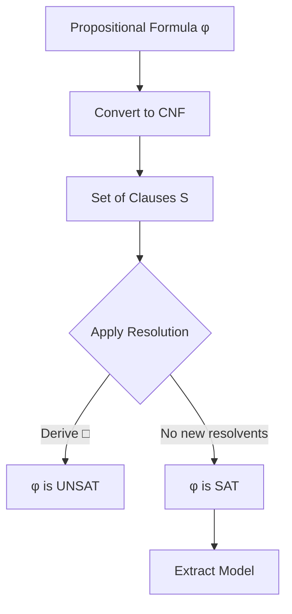
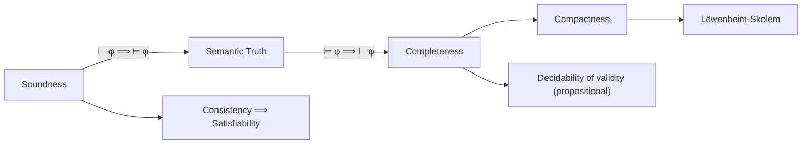
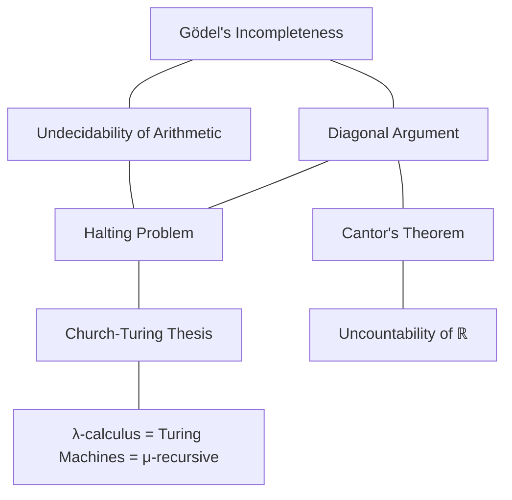

# Logic & Proof Theory

A graduate-level course covering propositional and predicate logic, proof systems, completeness and compactness, and Godel's incompleteness theorems.

**Prerequisites:** Mathematical maturity, basic familiarity with sets and functions.
**Related courses:** [[set-theory]], [[category-theory]]

---

## Part I: Propositional Logic

### Week 1: Syntax and Semantics of Propositional Logic

**Propositional variables:** $p, q, r, \ldots$ are atomic propositions.

**Connectives:** $\neg$ (negation), $\land$ (conjunction), $\lor$ (disjunction), $\implies$ (implication), $\iff$ (biconditional).

**Well-formed formulas (WFFs):** Built inductively:
1. Every propositional variable is a WFF.
2. If $\varphi$ is a WFF, then $\neg \varphi$ is a WFF.
3. If $\varphi, \psi$ are WFFs, then $(\varphi \land \psi)$, $(\varphi \lor \psi)$, $(\varphi \implies \psi)$, $(\varphi \iff \psi)$ are WFFs.

**Truth assignments:** A function $v : \text{Prop} \to \{T, F\}$ extended to all WFFs by the standard truth tables.

| $\varphi$ | $\psi$ | $\varphi \implies \psi$ |
|-----------|---------|------------------------|
| T | T | T |
| T | F | F |
| F | T | T |
| F | F | T |

**Key definitions:**
- $\varphi$ is a **tautology** if $v(\varphi) = T$ for all assignments $v$. Write $\models \varphi$.
- $\varphi$ is **satisfiable** if $v(\varphi) = T$ for some $v$.
- $\Gamma \models \varphi$ means every assignment satisfying all of $\Gamma$ also satisfies $\varphi$.

### Week 2: Normal Forms and Resolution

**Conjunctive Normal Form (CNF):** A conjunction of clauses, where each clause is a disjunction of literals.

$$\varphi_{\text{CNF}} = \bigwedge_{i=1}^{m} \bigvee_{j=1}^{n_i} \ell_{ij}$$

**Disjunctive Normal Form (DNF):** A disjunction of conjunctions of literals.

**Theorem (Normal Form):** Every propositional formula is logically equivalent to a formula in CNF and to a formula in DNF.

**Resolution rule:** From clauses $C_1 = \{p\} \cup D_1$ and $C_2 = \{\neg p\} \cup D_2$, derive the **resolvent** $D_1 \cup D_2$.

**Theorem (Soundness and Completeness of Resolution):** A set of clauses $S$ is unsatisfiable if and only if the empty clause $\square$ can be derived from $S$ by repeated resolution.

---

## Part II: Predicate Logic (First-Order Logic)

### Week 3: Syntax and Semantics of FOL

**Language $\mathcal{L}$:** Consists of:
- Variables: $x, y, z, \ldots$
- Constants: $c_1, c_2, \ldots$
- Function symbols: $f, g, \ldots$ with arities
- Relation symbols: $R, P, \ldots$ with arities
- Quantifiers: $\forall$ (universal), $\exists$ (existential)

**Terms:** Built from variables, constants, and function applications.

**Formulas:** Atomic formulas $R(t_1, \ldots, t_n)$ and $t_1 = t_2$, closed under $\neg, \land, \lor, \implies, \iff, \forall x, \exists x$.

**Structures:** A structure $\mathfrak{A} = (A, \mathcal{I})$ consists of a non-empty domain $A$ and an interpretation $\mathcal{I}$ mapping each constant to an element of $A$, each $n$-ary function symbol to a function $A^n \to A$, each $n$-ary relation symbol to a subset of $A^n$.

**Satisfaction:** $\mathfrak{A} \models \varphi[s]$ means structure $\mathfrak{A}$ satisfies $\varphi$ under variable assignment $s$.

- $\mathfrak{A} \models \forall x\, \varphi[s]$ iff for every $a \in A$, $\mathfrak{A} \models \varphi[s(x|a)]$
- $\mathfrak{A} \models \exists x\, \varphi[s]$ iff for some $a \in A$, $\mathfrak{A} \models \varphi[s(x|a)]$

### Week 4: Key Metatheorems of FOL

**Theorem (Logical Equivalences):**
- $\neg \forall x\, \varphi \equiv \exists x\, \neg \varphi$
- $\neg \exists x\, \varphi \equiv \forall x\, \neg \varphi$
- $\forall x\, (\varphi \land \psi) \equiv (\forall x\, \varphi) \land (\forall x\, \psi)$
- $\exists x\, (\varphi \lor \psi) \equiv (\exists x\, \varphi) \lor (\exists x\, \psi)$

**Prenex Normal Form:** Every FOL formula is equivalent to one of the form $Q_1 x_1 \cdots Q_n x_n\, \varphi$ where each $Q_i \in \{\forall, \exists\}$ and $\varphi$ is quantifier-free.

---

## Part III: Proof Systems

### Week 5: Natural Deduction

**Natural deduction (NK for classical, NJ for intuitionistic):** A proof system using introduction and elimination rules for each connective.

Selected rules:

$$\frac{\Gamma \vdash \varphi \quad \Gamma \vdash \psi}{\Gamma \vdash \varphi \land \psi}\;(\land I) \qquad \frac{\Gamma \vdash \varphi \land \psi}{\Gamma \vdash \varphi}\;(\land E_1)$$

$$\frac{\Gamma, \varphi \vdash \psi}{\Gamma \vdash \varphi \implies \psi}\;(\implies I) \qquad \frac{\Gamma \vdash \varphi \implies \psi \quad \Gamma \vdash \varphi}{\Gamma \vdash \psi}\;(\implies E)$$

$$\frac{\Gamma \vdash \varphi[t/x]}{\Gamma \vdash \exists x\, \varphi}\;(\exists I) \qquad \frac{\Gamma \vdash \forall x\, \varphi}{\Gamma \vdash \varphi[t/x]}\;(\forall E)$$

### Week 6: Sequent Calculus (Gentzen's LK)

**Sequents:** $\Gamma \Rightarrow \Delta$ where $\Gamma, \Delta$ are finite multisets of formulas. Intuitive reading: the conjunction of $\Gamma$ entails the disjunction of $\Delta$.

**Structural rules:** Weakening, contraction, exchange, cut.

**Cut-elimination theorem (Gentzen's Hauptsatz):** Every proof in LK can be transformed into a cut-free proof.

*Proof sketch:* By double induction on the complexity of the cut formula and the structure of the proof. The key cases involve permuting the cut rule upward through other inference rules until it can be eliminated.

**Significance:** Cut-free proofs have the **subformula property** — every formula in the proof is a subformula of the conclusion. This yields decidability of propositional logic and consistency of arithmetic fragments.

### Week 7: Proof Techniques in Practice

| Technique | Schema | When to Use |
|-----------|--------|-------------|
| Direct proof | Assume $P$, derive $Q$ | Default approach |
| Contradiction | Assume $\neg Q$, derive $\bot$ | Existence, irrationality |
| Contrapositive | Prove $\neg Q \implies \neg P$ | When converse structure is simpler |
| Induction | Base + step ($n \implies n+1$) | Statements over $\mathbb{N}$ |
| Strong induction | $(\forall k < n,\, P(k)) \implies P(n)$ | When step needs all predecessors |
| Well-ordering | Take minimal counterexample, derive contradiction | Equivalent to induction |

**Theorem (Equivalence):** Over $\mathbb{N}$, mathematical induction, strong induction, and the well-ordering principle are equivalent.

---

## Part IV: Completeness and Compactness

### Week 8: The Completeness Theorem

**Theorem (Godel's Completeness Theorem, 1930):** For any first-order theory $T$ and sentence $\varphi$:

$$T \models \varphi \iff T \vdash \varphi$$

*Proof sketch (Henkin construction):*
1. If $T \nvdash \varphi$, then $T \cup \{\neg \varphi\}$ is consistent.
2. Extend to a maximally consistent set $T^* \supseteq T \cup \{\neg \varphi\}$ (by Zorn's lemma or Lindenbaum's lemma).
3. Add **Henkin witnesses**: for each $\exists x\, \psi(x)$ in $T^*$, add a constant $c$ and the axiom $\psi(c)$.
4. Construct a **term model** $\mathfrak{A}$ from equivalence classes of terms under $T^*$.
5. Show $\mathfrak{A} \models T^*$ by induction on formula complexity.
6. Hence $\mathfrak{A} \models \neg \varphi$, so $T \not\models \varphi$.

### Week 9: The Compactness Theorem

**Theorem (Compactness):** A set of first-order sentences $\Gamma$ has a model if and only if every finite subset of $\Gamma$ has a model.

*Proof:* Immediate from completeness. If $\Gamma$ has no model, then $\Gamma \models \bot$, so $\Gamma \vdash \bot$. But proofs are finite, so only finitely many sentences of $\Gamma$ are used.

**Applications:**
- **Non-standard models of arithmetic:** Add constants $c_n$ and axioms $c > \bar{n}$ for each $n \in \mathbb{N}$. Every finite subset is satisfiable, so by compactness the whole set has a model containing an "infinite" natural number.
- **Upward Lowenheim-Skolem:** If $T$ has arbitrarily large finite models, it has an infinite model.

---

## Part V: Godel's Incompleteness Theorems

### Week 10: Representability and Godel Numbering

**Recursive functions** are representable in first-order arithmetic. Assign a **Godel number** $\ulcorner \varphi \urcorner \in \mathbb{N}$ to each formula $\varphi$ via a primitive recursive encoding.

**Key construction:** The provability predicate $\text{Prov}(x)$, which is a $\Sigma_1^0$ formula expressing "$x$ is the Godel number of a provable sentence," is representable in Peano Arithmetic (PA).

### Week 11: The First Incompleteness Theorem

**Theorem (Godel, 1931):** Let $T$ be a consistent, recursively axiomatizable extension of Robinson arithmetic $Q$. Then there exists a sentence $G$ such that $T \nvdash G$ and $T \nvdash \neg G$.

*Proof sketch:*
1. By the diagonal lemma (fixed-point lemma), construct $G$ such that $T \vdash G \iff \neg \text{Prov}(\ulcorner G \urcorner)$. Intuitively, $G$ says "I am not provable."
2. If $T \vdash G$, then $\text{Prov}(\ulcorner G \urcorner)$ holds in $\mathbb{N}$, so $T \vdash \text{Prov}(\ulcorner G \urcorner)$, hence $T \vdash \neg G$, contradicting consistency.
3. If $T \vdash \neg G$, then $T \vdash \text{Prov}(\ulcorner G \urcorner)$. But $G$ is in fact not provable (from step 2), so $\mathbb{N} \models \neg \text{Prov}(\ulcorner G \urcorner)$, meaning $T$ proves a false $\Sigma_1^0$ sentence. This contradicts $\omega$-consistency (or $\Sigma_1$-soundness in Rosser's strengthening).

**Rosser's improvement:** Replace $\omega$-consistency with plain consistency by using a Rosser sentence: "For every proof of me, there is a shorter proof of my negation."

### Week 12: The Second Incompleteness Theorem

**Theorem (Godel):** If $T$ is a consistent, recursively axiomatizable extension of PA, then $T \nvdash \text{Con}(T)$, where $\text{Con}(T)$ is the sentence $\neg \text{Prov}(\ulcorner 0 = 1 \urcorner)$.

*Proof sketch:*
1. The first incompleteness theorem shows $T \nvdash G$ where $G \iff \neg \text{Prov}(\ulcorner G \urcorner)$.
2. The argument "$\text{Con}(T) \implies G$" can be **formalized within $T$**: if $T$ is consistent, then $G$ is not provable, which is what $G$ asserts.
3. So $T \vdash \text{Con}(T) \implies G$.
4. If $T \vdash \text{Con}(T)$, then $T \vdash G$, contradicting the first theorem.

**Formalization conditions (Hilbert-Bernays-Lob):**
1. If $T \vdash \varphi$, then $T \vdash \text{Prov}(\ulcorner \varphi \urcorner)$
2. $T \vdash \text{Prov}(\ulcorner \varphi \implies \psi \urcorner) \implies (\text{Prov}(\ulcorner \varphi \urcorner) \implies \text{Prov}(\ulcorner \psi \urcorner))$
3. $T \vdash \text{Prov}(\ulcorner \varphi \urcorner) \implies \text{Prov}(\ulcorner \text{Prov}(\ulcorner \varphi \urcorner) \urcorner)$

**Lob's Theorem:** $T \vdash \text{Prov}(\ulcorner \varphi \urcorner) \implies \varphi$ only if $T \vdash \varphi$.

---

## Part VI: Computability Connections

### Week 13: Church-Turing Thesis

**Church-Turing thesis:** The informal notion of "effectively computable function" is captured exactly by:
- Turing machines
- $\lambda$-calculus (Church)
- $\mu$-recursive functions (Kleene)
- Post systems

All are provably equivalent in computational power.

**Undecidability of the Halting Problem:** There is no Turing machine $H$ that decides, given $(M, w)$, whether $M$ halts on $w$.

*Proof:* Suppose $H$ exists. Define $D(M) = $ "run $H(M, M)$; if it says halt, loop; if it says loop, halt." Then $D(D)$ halts iff it doesn't — contradiction.

**Connection to incompleteness:** The set of theorems of PA is recursively enumerable but not recursive — we can list all provable statements but cannot decide membership. This is intimately connected to the undecidability of the Entscheidungsproblem (Church, Turing, 1936).

---

## References

1. Enderton, H. B. *A Mathematical Introduction to Logic*. 2nd ed. Academic Press, 2001.
2. Mendelson, E. *Introduction to Mathematical Logic*. 6th ed. CRC Press, 2015.
3. Smullyan, R. M. *Godel's Incompleteness Theorems*. Oxford University Press, 1992.
4. Gentzen, G. "Investigations into Logical Deduction." *Mathematische Zeitschrift*, 39, 1935.
5. Godel, K. "On Formally Undecidable Propositions of Principia Mathematica and Related Systems I." 1931.
6. Turing, A. "On Computable Numbers, with an Application to the Entscheidungsproblem." 1936.
7. Boolos, G. S., Burgess, J. P., and Jeffrey, R. C. *Computability and Logic*. 5th ed. Cambridge University Press, 2007.
